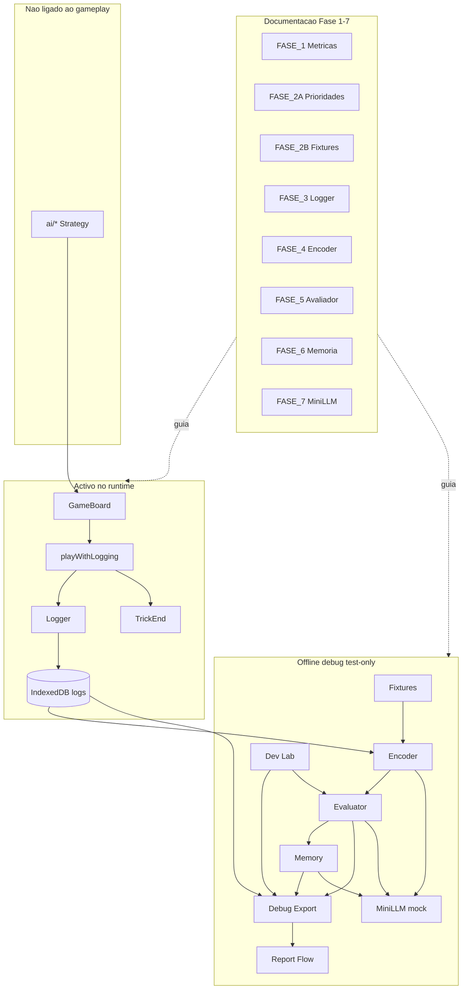

# CARD_INTELLIGENCE_STATUS_REPORT

**Data:** 2026-06-06  
**Versão:** 1.6 — snapshot pós-Impl 11 + hotfix 11.1 + **H11 OK**  
**Scope:** documentação consolidada pós-fecho Impl 11  
**Revisões:** [ROADMAP_COMPLIANCE_REVIEW.md](reviews/ROADMAP_COMPLIANCE_REVIEW.md) · [TECHNICAL_INTEGRITY_REVIEW.md](reviews/TECHNICAL_INTEGRITY_REVIEW.md)

---

# 1. Resumo executivo

## O que é Card Intelligence

**Card Intelligence** é a camada de inteligência estratégica do Suecão: regista decisões de jogo, traduz o estado para métricas explícitas, avalia jogadas, agrega padrões ao longo do tempo e (no futuro) pode sugerir cartas — **sem substituir** o motor de regras nem os bots existentes.

Metáforas acordadas no desenho ([FASE_7_MINI_LLM_DESIGN.md](FASE_7_MINI_LLM_DESIGN.md)):

| Camada | Papel |
|--------|-------|
| **Logger** | Gravador — regista cada jogada e o fim de vaza |
| **Encoder** | Tradutor — converte eventos em estado codificado honesto (Player View) |
| **Evaluator** | Juiz — classifica good / medium / bad / partial / unknown |
| **Memory** | Histórico — agrega padrões por métrica e contexto |
| **Debug/Export** | Inspecção — lê logs, avalia offline, exporta JSONL |
| **Mini-LLM** | Conselheiro — sugere carta entre legais; **nunca** joga sozinha |

A AI de gameplay actual (`frontend/src/ai/*`, `aiClient`, estratégias por jogo) permanece **intacta**. Card Intelligence vive em `frontend/src/cardIntelligence/` — módulo separado, local-first (IndexedDB), sem sync backend.

## O que já existe

Documentação de desenho completa (Fases 1–7 do [ROADMAP_AI.md](ROADMAP_AI.md)) e **implementações 1–11** (+ hotfix 11.1 Dev Lab Tier B) executadas com prompt → código → relatório ([IMPLEMENTATION_PLAN_AI.md](IMPLEMENTATION_PLAN_AI.md)):

- Catálogo de métricas por jogo ([FASE_1_METRICAS.md](FASE_1_METRICAS.md))
- Prioridades encoder P0 ([FASE_2A_PRIORIDADES_METRICAS.md](FASE_2A_PRIORIDADES_METRICAS.md))
- 23 fixtures golden ([FASE_2B_FIXTURES_METRICAS.md](FASE_2B_FIXTURES_METRICAS.md))
- Desenhos logger, encoder, avaliador, memória, mini-LLM (Fases 3–7)
- Módulo `cardIntelligence/` com ~139 ficheiros TypeScript
- **229 testes** cardIntelligence + **423 testes** frontend totais (pós-Impl 11 + hotfix 11.1)
- Build de produção verde (`CI=true npm run build`)

## O que ainda não está ligado ao gameplay

| Componente | Estado |
|------------|--------|
| Evaluator | Implementado; só testes e debug offline |
| Memory | Implementado; ingest **offline** via `__ciIngestEvaluations` |
| Mini-LLM | Mock advisory; flags default **off**; sem hook em `GameBoard` |
| Fixtures | Só regressão CI (Jest golden) |
| Encoder | Export público + helpers debug; **não** no hot path de jogada |

## Estado real do sistema

O pipeline **Logger → History → Encoder → Fixtures → Evaluator → Memory → Debug/Export → Mini-LLM (mock) → Dev Lab → Debug Report Flow** está **completo em código e testes CI**.

Em runtime de jogo, **apenas** o logger (+ trick_end via `playWithLogging`) grava eventos quando a flag `CARD_INTELLIGENCE_LOGGER_ENABLED` está activa (default **on**). Tudo o resto é observação offline, debug ou testes.

**Validação:** CI e testes automáticos **OK** em Impl 1–11. **H9**, **H10** e **H11 OK** (2026-06-06). Checkpoints H1–H8: CI OK; validação manual **pendente** ou **parcial** (§6).

**Próximo passo planeado:** **Provider LLM real** → melhoria bots.

**Excepções processuais (sem prompt dedicada):** Impl **1.1** Logger Hardening, hotfix **H2** (clone snapshot Sueca), patch encoder **3.1** King, hotfix **11.1** Dev Lab Tier B presets — documentadas nos relatórios respectivos; aceites como hotfixes ([ROADMAP_COMPLIANCE_REVIEW.md](reviews/ROADMAP_COMPLIANCE_REVIEW.md) §D1).

**Audit técnica (2026-05-31):** quatro hardenings P2 aplicados (promises + sorts imutáveis); zero impacto gameplay. Ver [TECH_DEBT_AUDIT_REPORT.md](../audits/TECH_DEBT_AUDIT_REPORT.md).

---

# 2. Estado por implementação

| Implementação | Estado | O que entrega | Gameplay | Testes / build | Relatório | Gaps relevantes |
|---------------|--------|---------------|----------|----------------|-----------|-----------------|
| **Impl 1 — Logger v0** | Parcial | `CardDecisionLogEvent` schema 3.0.0; IndexedDB `cardIntelligenceLogs`; hook pós-jogada; `classification: unknown` | Não | CI OK (7 tests); build OK | [IMPLEMENTATION_1_LOGGER_V0_REPORT.md](implementation-reports/IMPLEMENTATION_1_LOGGER_V0_REPORT.md) | TrickEnd só tipos na Impl 1; joiner skip; H1 manual pendente |
| **Impl 1.1 — Logger hardening** | OK | `playWithLogging.ts` choke point; `legalMoves` obrigatório; `logFailureTelemetry`; paths GameBoard unificados | Não | CI OK (15 tests); build OK | [IMPLEMENTATION_1_1_LOGGER_HARDENING_REPORT.md](implementation-reports/IMPLEMENTATION_1_1_LOGGER_HARDENING_REPORT.md) | H1 manual pendente; H1-D1 GameActions warning |
| **Impl 2 — Round History / TrickEnd** | Parcial | `RoundHistoryEngine`; `TrickEndEvent` persistido; `roundPlayHistory` transversal (4 jogos) | Não | CI OK (28 tests pós-hotfix); build OK | [IMPLEMENTATION_2_ROUND_HISTORY_REPORT.md](implementation-reports/IMPLEMENTATION_2_ROUND_HISTORY_REPORT.md) + [IMPLEMENTATION_2_H2_HOTFIX_REPORT.md](implementation-reports/IMPLEMENTATION_2_H2_HOTFIX_REPORT.md) | H2 manual pendente; MP-v0 joiner; voids avançados |
| **Impl 3 — Encoder v0** | Parcial | `EncodedDecisionState` 4.0.0; encoders Sueca/Spades/Hearts/King P0; Player View default | Não | CI OK (46+ tests); build OK | [IMPLEMENTATION_3_ENCODER_V0_REPORT.md](implementation-reports/IMPLEMENTATION_3_ENCODER_V0_REPORT.md) | H3 manual pendente; Engine View stub; `memoryContext` stub |
| **Impl 3.1 — King Encoder Fix** | OK | Patch encoder-only: `contractId` fallback; K♥ obligation history-before-current | Não | CI OK (52 tests cardIntelligence) | §8.1 do relatório Impl 3 | Logger ainda não preenche `contract` no log raw |
| **Impl 4 — Fixtures 2B** | Parcial | 23 fixtures `ALL_FIXTURES`; golden encode tests; 5 MetricDef novos | Não | CI OK (87 tests cardIntelligence); build OK | [IMPLEMENTATION_4_FIXTURES_2B_REPORT.md](implementation-reports/IMPLEMENTATION_4_FIXTURES_2B_REPORT.md) | H4 manual pendente; Tier B gaps (SP01, H10, S25) |
| **Impl 5 — Evaluator v0** | Parcial | `evaluateDecision`; métricas P0; agregação worst-wins; schema 5.0.0 | Não | CI OK (124 tests cardIntelligence); build OK | [IMPLEMENTATION_5_EVALUATOR_V0_REPORT.md](implementation-reports/IMPLEMENTATION_5_EVALUATOR_V0_REPORT.md) | H5 manual pendente; Tier B → partial; sem hook live |
| **Impl 6 — Memory v0** | Parcial | Ingest offline; aggregates; trend FIFO 40; IDB `cardIntelligenceMemory`; schema 6.0.0 | Não | CI OK (138 tests cardIntelligence); build OK | [IMPLEMENTATION_6_MEMORY_V0_REPORT.md](implementation-reports/IMPLEMENTATION_6_MEMORY_V0_REPORT.md) | H6 manual pendente; sem ingest live |
| **Impl 7 — Debug/Export** | Parcial | JSONL export 7.0.0; evaluate offline; memory helpers; `postGameReport`; `window.__ci*` | Não | CI OK (151 tests cardIntelligence); build OK | [IMPLEMENTATION_7_DEBUG_EXPORT_REPORT.md](implementation-reports/IMPLEMENTATION_7_DEBUG_EXPORT_REPORT.md) | H7 manual pendente; sem UI visual |
| **Impl 8 — Mini-LLM Advisory** | Parcial | `getMiniLLMAdvice`; `MockMiniLLMProvider`; validate V1–V9; flags duplas debug+LLM | Não | CI OK (165 tests cardIntelligence); build OK | [IMPLEMENTATION_8_MINI_LLM_ADVISORY_REPORT.md](implementation-reports/IMPLEMENTATION_8_MINI_LLM_ADVISORY_REPORT.md) | H8 manual pendente; mock only; sem decision assist |
| **Impl 9 — Dev Seeded Game Lab** | Parcial | Lab dev: presets LAB_*, seeded deal, pipeline offline encode/eval/report | Não | CI OK (183 tests cardIntelligence); build OK | [IMPLEMENTATION_9_DEV_SEEDED_GAME_LAB_REPORT.md](implementation-reports/IMPLEMENTATION_9_DEV_SEEDED_GAME_LAB_REPORT.md) | **H9 OK** 2026-06-06; trick_end warnings v0 aceites |
| **Impl 10 — Debug Report Flow** | Parcial | Relatórios legíveis texto/JSON/JSONL; `__ciEventReport`, `__ciGameReport`, `__ciScenarioReport`, `__ciExportReport` | Não | CI OK (196 tests cardIntelligence); build OK | [IMPLEMENTATION_10_DEBUG_REPORT_FLOW_REPORT.md](implementation-reports/IMPLEMENTATION_10_DEBUG_REPORT_FLOW_REPORT.md) | **H10 OK** 2026-06-06; highlights game report cosmético (P1) |
| **Impl 11 — Evaluator v1 Tier B** | Parcial | Heurísticas S25/SP14/H10/K10; `moonThreatLevel`; agregador sem `tierBPartial`; hotfix 11.1 Dev Lab 8 presets | Não | CI OK (229 tests cardIntelligence); build OK | [IMPLEMENTATION_11_EVALUATOR_V1_TIER_B_REPORT.md](implementation-reports/IMPLEMENTATION_11_EVALUATOR_V1_TIER_B_REPORT.md) | **H11 OK** 2026-06-06; S25/H10 golden partial intencional; Q7 memory deferido |
| **Audit técnica P2** | OK | A01–A04: catch promises + sorts imutáveis | Não | tsc OK; build OK | [TECH_DEBT_AUDIT_REPORT.md](../audits/TECH_DEBT_AUDIT_REPORT.md) | P3/WONTFIX documentados (A05–A13) |

**Nota sobre «Parcial»:** indica gaps funcionais documentados (Tier B, MP-v0, manual smoke pendente) — **não** indica falha de CI.

### Contagem cumulativa de testes cardIntelligence

| Após | Total |
|------|-------|
| Impl 1 | 7 |
| Impl 1.1 | 15 |
| Impl 2 (+ hotfix) | 28 |
| Impl 3 (+ 3.1) | 52 |
| Impl 4 | 87 |
| Impl 5 | 124 |
| Impl 6 | 138 |
| Impl 7 | 151 |
| Impl 8 | **165** |
| Impl 9 | **183** |
| Impl 10 | **196** |
| Impl 11 | **217** |
| Impl 11.1 | **229** |

---

# 3. Arquitectura actual

## Cadeia Card Intelligence

```
Logger → Round History / TrickEnd → Encoder → Fixtures → Evaluator → Memory → Debug/Export → Mini-LLM advisory → Dev Seeded Game Lab → Debug Report Flow
```



## Papéis de cada camada

### Logger (`logger/`)

- Grava `CardDecisionLogEvent` após cada jogada aplicada com sucesso.
- Persiste em IndexedDB (`cardIntelligenceLogs`); fallback localStorage mínimo se IDB indisponível.
- `classification: "unknown"` e `reason: null` em v0 — avaliador decide depois, offline.
- Flag: `CARD_INTELLIGENCE_LOGGER_ENABLED` (default **on**).

### Round History / TrickEnd (`history/` + `logger/roundHistorySession.ts`)

- Acumula `roundPlayHistory` transversal para Sueca, Spades, Hearts e King.
- **Não** depende de `GameState.playedCards` (Sueca-only no motor legacy).
- Emite e persiste `TrickEndEvent` quando vaza fecha (4 cartas).
- Hotfix H2: deep snapshot antes de `playCard` evita mutação shallow-clone Sueca.

### Encoder (`encoder/`)

- Traduz snapshot do **log** (nunca `Game.getState()` live) para `EncodedDecisionState` schema **4.0.0**.
- Modos `pre_decision` (sugestão/advisory) e `post_decision` (juiz).
- Player View default — informação oculta honesta; Engine View stub (só testes com flag).
- `metricContext` liga métricas Fase 1/2A aos campos codificados.

### Fixtures (`fixtures/`)

- 23 casos golden de [FASE_2B_FIXTURES_METRICAS.md](FASE_2B_FIXTURES_METRICAS.md).
- Regressão CI automática — **não** executam em partida real.

### Evaluator (`evaluator/`)

- Julga decisões offline via `evaluateDecision` → `DecisionEvaluationResult` schema **5.0.0**.
- Métricas P0 por jogo + transversais (T01, T04, T06).
- Agregação «worst wins»; Tier B fixtures → `partial` fixo.
- **Não** corre no hot path de jogada.

### Memory (`memory/`)

- Agrega padrões de avaliações offline → `MetricMemoryAggregate` schema **6.0.0**.
- `ingestEvaluationResult` só via debug (`__ciIngestEvaluations`) — **não** live.
- Trend FIFO 40; `badRate` / `partialRate` por contexto.

### Debug/Export (`debug/` + `debug/reportFlow/`)

- Inspecciona logs IDB; avalia eventos armazenados; exporta JSONL envelope **7.0.0**.
- **Debug Report Flow (Impl 10):** relatórios legíveis schema **10.0.0** — scenario / event / game / export.
- `postGameReport` — alias de game report (delega report flow).
- Helpers `window.__ci*` instalados com lazy chunk se `CARD_INTELLIGENCE_DEBUG`.
- Sem painel UI visual — console/dev only.

### Dev Seeded Game Lab (`devLab/`)

- Presets `LAB_*`, seed fixa, pipeline offline encode/eval/report.
- Flag `CARD_INTELLIGENCE_DEV_LAB` (+ DEBUG); prod default off.
- trick_end missing nos presets → warning `[info]` (aceite v0).

### Mini-LLM advisory (`llm/`)

- `getMiniLLMAdvice` — mock provider; valida output contra `legalMoves`.
- Advisory only: **sugere**, nunca chama `playCard`.
- Requer flags duplas: `CARD_INTELLIGENCE_DEBUG && CARD_INTELLIGENCE_LLM_ADVISORY`.
- Provider real (Ollama, WebLLM) **não existe** — v1 futuro; **após Impl 9/10**

## Estrutura de pastas

```
frontend/src/cardIntelligence/
├── logger/       # log + playWithLogging
├── history/      # roundPlayHistory, trickEvents
├── encoder/      # encodeDecisionState, encoders por jogo
├── fixtures/     # 23 golden cases
├── evaluator/    # evaluateDecision, metricEvaluators
├── memory/       # ingest, aggregates, queries
├── debug/        # export, evaluate offline, __ci*, reportFlow/
├── llm/          # mock advisory
├── devLab/       # seeded scenarios, presets LAB_*
└── shared/       # types, storage, clone, ids
```

---

## Excepções processuais (hotfixes sem prompt dedicada)

| Sub-entrega | Relatório | Notas |
|-------------|-----------|-------|
| Impl 1.1 Logger Hardening | [IMPLEMENTATION_1_1_LOGGER_HARDENING_REPORT.md](implementation-reports/IMPLEMENTATION_1_1_LOGGER_HARDENING_REPORT.md) | `playWithLogging` choke point; sem prompt própria |
| Impl 2 H2 Hotfix | [IMPLEMENTATION_2_H2_HOTFIX_REPORT.md](implementation-reports/IMPLEMENTATION_2_H2_HOTFIX_REPORT.md) | Deep snapshot Sueca trick_end; sem prompt própria |
| Impl 3.1 King Encoder Fix | [IMPLEMENTATION_3_ENCODER_V0_REPORT.md](implementation-reports/IMPLEMENTATION_3_ENCODER_V0_REPORT.md) §8.1 | Patch encoder-only K♥; sem prompt própria |

Ver [ROADMAP_COMPLIANCE_REVIEW.md](reviews/ROADMAP_COMPLIANCE_REVIEW.md) §D1 — aceites como excepção documentada; futuras sub-entregas devem ter prompt mínima.

---

## Impl 9 — Dev Seeded Game Lab — concluído

| Aspecto | Estado |
|---------|--------|
| **Implementação** | ✅ Impl 9 + **H9 OK** (2026-06-06) |
| **Relatório** | [IMPLEMENTATION_9_DEV_SEEDED_GAME_LAB_REPORT.md](implementation-reports/IMPLEMENTATION_9_DEV_SEEDED_GAME_LAB_REPORT.md) |

---

## Impl 10 — Debug Report Flow — concluído

| Aspecto | Estado |
|---------|--------|
| **Implementação** | ✅ Impl 10 + **H10 OK** (2026-06-06) |
| **Relatório** | [IMPLEMENTATION_10_DEBUG_REPORT_FLOW_REPORT.md](implementation-reports/IMPLEMENTATION_10_DEBUG_REPORT_FLOW_REPORT.md) |
| **Helpers** | `__ciEventReport`, `__ciGameReport`, `__ciPostGameReport` (alias), `__ciScenarioReport`, `__ciExportReport` |

---

# 4. O que está activo no jogo

Três categorias distintas:

## 4.1 Activo no runtime

Componentes que correm durante uma partida normal (sem acção manual de debug):

| Componente | Condição | Comportamento |
|------------|----------|---------------|
| **Logger** | `CARD_INTELLIGENCE_LOGGER_ENABLED` (default on) | `playCardAndLogDecision` / `playFirstLegalAndLogDecision` após jogada aplicada |
| **Round history** | Com logger activo | Sessão in-memory; `roundPlayHistory` em cada evento |
| **TrickEnd** | Com logger activo | `logTrickEndDecision` após jogada que fecha vaza |
| **IndexedDB logs** | Com logger activo | Persistência assíncrona fail-silent (`recordLogFailure`) |

**Quem loga:** host/solo e paths AI via `playWithLogging` em [`GameBoard.tsx`](../../frontend/src/components/GameBoard.tsx).

**Gap documentado:** joiner multiplayer envia `submitAction` remota sem passar por `playCardAndLogDecision` — sem log local no cliente joiner.

## 4.2 Offline / debug / test-only

Implementado e testado em CI; **não** participa no fluxo de jogada normal:

| Componente | Activado por | Uso |
|------------|--------------|-----|
| **Debug helpers** | `CARD_INTELLIGENCE_DEBUG` (npm start ou env) | `window.__ci*`, export JSONL, evaluate offline |
| **Encoder** | Debug / export / Jest | `__ciEncode`, `encodeDecisionState` em testes |
| **Evaluator** | Debug / export / Jest | `evaluateStoredEvents`, `evaluateDecision` em testes |
| **Memory ingest** | Debug console | `__ciIngestEvaluations` — offline only |
| **Fixtures** | Jest CI | 23 golden cases — regressão automática |
| **Mini-LLM mock** | `CARD_INTELLIGENCE_DEBUG` + `CARD_INTELLIGENCE_LLM_ADVISORY` | `__ciGetMiniLLMAdvice` — advisory smoke, zero rede |
| **JSONL export** | Debug console | `exportCardIntelligenceJsonl` |
| **postGameReport** | Debug / export | Alias game report (Impl 10); texto legível offline |
| **Report Flow** | Debug console | `__ciEventReport`, `__ciGameReport`, `__ciExportReport` |
| **Dev Lab** | `CARD_INTELLIGENCE_DEBUG` + `DEV_LAB` | `__ciRunScenario`, `__ciScenarioReport`, presets LAB_* |

## 4.3 Não ligado ao gameplay

Componentes ou caminhos que **não afectam** decisões de jogo, regras ou bots:

| Item | Estado |
|------|--------|
| **Bots** (`frontend/src/ai/*`) | Intocados — continuam a escolher cartas |
| **Evaluator live** | Ausente de `playWithLogging` / `GameBoard` |
| **Memory live** | Ingest não corre em jogadas; encoder `memoryContext` stub |
| **Mini-LLM → playCard** | Nunca ligado; decision assist fora de scope v0 |
| **Fixtures em partida** | Só CI — nunca invocados em runtime |
| **Provider LLM real** | Inexistente — mock only |
| **Backend sync CI** | Local-first — sem sync Card Intelligence |

---

# 5. Segurança / garantias

Confirmações com evidência nos relatórios Impl 1–8 e audit P2:

| Garantia | Estado | Evidência |
|----------|--------|-----------|
| Bots não substituídos | Confirmado | `frontend/src/ai/*` intocado; grep nos relatórios |
| Regras de jogo não alteradas | Confirmado | Motores `*Game.ts` intocados salvo hotfix clone snapshot (não regra) |
| Gameplay intencionalmente inalterado | Confirmado | Logger fire-and-forget pós-jogada; audit P2 defensivo only |
| Mini-LLM não decide cartas | Confirmado | `validateLLMOutput` + legalMoves gate; nunca `playCard` |
| Evaluator não corre live | Confirmado | Ausente de `playWithLogging` / `GameBoard` hot path |
| Memory não influencia decisões | Confirmado | Ingest offline; encoder `memoryContext.aggregates` stub |
| Provider LLM real inexistente | Confirmado | `MockMiniLLMProvider` only |
| Local-first | Confirmado | IndexedDB; sem backend sync Card Intelligence |
| Debug/LLM gated em produção | Confirmado | Flags default off (logger on; debug/LLM off) |
| Fail-silent logging | Confirmado | `.catch(recordLogFailure)`; warn só dev |

---

# 6. Validações feitas

## Checkpoints humanos (H1–H11)

Definidos em [IMPLEMENTATION_PLAN_AI.md](IMPLEMENTATION_PLAN_AI.md) §8 e prompts Impl 8–10. Cada checkpoint separa **validação automática (CI)** de **validação manual/smoke**. **Não** marcar manual OK sem smoke real.

| # | Após | CI / testes | Validação manual / smoke |
|---|------|-------------|--------------------------|
| **H1** | Logger v0 (+ 1.1) | **OK** — 15 unit tests `playWithLogging`; build OK | **Pendente** — re-test IDB pós-1.1; eventos numa partida real |
| **H2** | Round history / TrickEnd | **OK** — 28 history tests + hotfix clone; build OK | **Pendente** — IDB manual multi-variante (Spades/Hearts/King) |
| **H3** | Encoder v0 (+ 3.1) | **OK** — 46+ encoder tests; build OK | **Pendente** — sanity Player View via `__ciEncode`; King K♥ pós-3.1 |
| **H4** | Fixtures 2B | **OK** — 34 fixture golden tests; build OK | **Pendente** — humanNote vs fixtures S08/K02/SP09 |
| **H5** | Evaluator v0 | **OK** — 37 evaluator + synthetic tests; build OK | **Pendente** — ler 10 exemplos no relatório Impl 5; veredictos intuitivos |
| **H6** | Memory v0 | **OK** — 14 memory tests; build OK | **Pendente** — review 5 aggregates exemplos; confirmar sem ingest live |
| **H7** | Debug/Export | **OK** — 13+ debug tests; build OK | **Parcial** — pipeline unit-tested; smoke console end-to-end **pendente** |
| **H8** | Mini-LLM advisory | **OK** — 14 llm tests; build OK | **Pendente** — smoke dual flags + `__ciGetMiniLLMAdvice`; prod sem helper |
| **H9** | Dev Seeded Game Lab | **OK** — 18 devLab tests; build OK | **OK** — 4 presets + seed 42 + prod helpers off (2026-06-06) |
| **H10** | Debug Report Flow | **OK** — 12+ reportFlow tests; build OK | **OK** — LAB_K02/H13 + event/game IDB (2026-06-06) |
| **H11** | Evaluator v1 Tier B (+ 11.1 Dev Lab) | **OK** — 229 cardIntelligence tests; golden + tierBv1 | **OK** — Jest Tier B + browser LAB_K02/S25/H10 (2026-06-06) |

**Resumo H1–H11:** CI/testes **OK** em todos. **H9, H10 e H11 fechados.** Validação manual: **pendente** em H1–H6 e H8; **parcial** em H7.

## Audit técnica (2026-05-31)

| Item | CI / testes | Notas |
|------|-------------|-------|
| Typecheck | **OK** | `npx tsc --noEmit` |
| Testes frontend | **OK** | 76 suites, 390 tests (pós-Impl 10) |
| Backend | **OK** | `node --check` + 1 test |
| Build | **OK** | `npm run build` |
| Correções P2 | **OK** | A01–A04 aplicadas |
| P3 / WONTFIX | Documentados | Não corrigidos — ver §7 Audit |

Baseline: [TECH_DEBT_AUDIT_REPORT.md](../audits/TECH_DEBT_AUDIT_REPORT.md).

---

# 7. Gaps conhecidos

## Logger / history

- **Multiplayer joiner** — joiner envia acção remota sem logger local; MP-v0 sem hook em `applyHostAction`.
- **`aiSource` incompleto** — frequentemente `null` nos eventos; external AI path parcialmente reflectido.
- **Schema futuro** — event types P2 (bid, pass, leilão King) não implementados.
- **H1-D1** — React warning `GameActions` setState (P2, deferido desde Impl 1).
- **Telemetria prod** — `recordLogFailure` warn só em dev (audit A07 — decisão produto).

## Encoder

- **Voids avançados** — inferência Hard parcial; player view simplificada.
- **Moon tracking** — H10 Tier B: `moonThreatLevel` Player View; golden **partial** quando ameaça indisponível (Impl 11); `good` só com história moon sintética.
- **Spades tricks nullable** — tricks won/bags null at play time em alguns momentos.
- **King edge cases** — `contract` / `variantFields.contractId` null no log raw (3.1 corrige encoder fallback, não logger).
- **Engine View** — stub throws salvo testes; P2 deferido.
- **`memoryContext.aggregates`** — stub; memory não wired ao encode live.

## Evaluator

- **Tier B v1 (Impl 11)** — K10/SP14 heurísticas `good` quando dados suficientes; S25/H10 golden **partial** intencional (Player View); agregador worst-wins real (sem `tierBPartial`).
- **SP01 / H05 proxies** — métricas simplificadas vs desenho Fase 1 completo.
- **Leilão King fora** — bid/auction/pass não avaliados em v0.
- **Métricas Hard parciais** — catálogo Fase 1 Hard > cobertura evaluator v0.
- **Sem persistência eval** — evaluations não guardadas IDB (Impl 5/7 alinhados).

## Memory

- **Contagem metricResult vs decisão** — ingest conta por resultado de métrica, não só decisão global.
- **v1 countMode** — modos de contagem futuros não implementados.
- **Sem uso live** — ingest só offline/debug; zero impacto bots.
- **Encoder não wired** — `memoryContext` no encode continua stub.

## Debug/Export

- **Sem UI visual** — DebugPanel não existe; só console `__ci*`.
- **Eval não persistido** — evaluate offline não grava resultados IDB.
- **D15 duplicate ingest** — risco ingest duplicado em flows manuais (documentado Impl 7).
- **trickEnd pairing warnings** — edge cases; classificados `[info]` no report flow (H9/H10).
- **Game report highlights** — formato `medium medium` quando `failedMetricIds` vazio (P1).

## Dev Lab / Report Flow

- **trick_end missing nos presets** — aceite v0; warning informational.
- **Seeded game** — deal only; não simula partida completa.
- **Report Flow Q4–Q8** — LLM section, persist report IDB, i18n EN — deferidos v1.

## Mini-LLM

- **Provider mock/stub** — `MockMiniLLMProvider`; zero rede.
- **Advisory only** — sem decision assist; sem hook GameBoard.
- **Sem Ollama/WebLLM real** — provider v1 futuro.
- **Flags duplas** — prod default: helper `__ciGetMiniLLMAdvice` undefined.
- **Fallback trivial** — debug usa `legalMoves[0]` em alguns cenários mock.

## Audit

P3 não corrigidos (opcionais):

| ID | Área |
|----|------|
| A05 | `any` em `useLanguage.ts` |
| A06 | Testes excluídos do `tsc` CI |
| A07 | Log failures invisíveis em prod |
| A08 | Export `capturePlayDecision` sem consumidores app |
| A09 | Empates stats UI (`indexOf min/max`) |
| A13 | Sem `npm run lint` dedicado |

WONTFIX:

| ID | Área |
|----|------|
| A10 | JWT_SECRET default dev (backend ops) |
| A11 | `eslint-disable exhaustive-deps` intencional GameBoard |

Ver [TECH_DEBT_ATTACK_PLAN.md](../audits/TECH_DEBT_ATTACK_PLAN.md) e [TECH_DEBT_AUDIT_REPORT.md](../audits/TECH_DEBT_AUDIT_REPORT.md).

---

# 8. Próximas opções

## Ordem recomendada (actualizada 2026-06-06)

| # | Intervenção | Notas |
|---|-------------|-------|
| 1–8 | Impl 1–8 | ✅ feito |
| 9 | Impl 9 Dev Seeded Game Lab | ✅ feito (H9 OK) |
| 10 | Impl 10 Debug Report Flow | ✅ feito (H10 OK) |
| 11 | Impl 11 Evaluator v1 Tier B + 11.1 Dev Lab | ✅ feito (H11 OK) |
| **12+** | **Provider LLM real** · UI debug · melhoria bots | próximo foco |

---

## G. Provider LLM real (prioridade recomendada)

| | |
|--|--|
| **Valor** | Conselheiro real offline/edge; substituir mock |
| **Risco** | Médio — latência, scope creep decision assist |
| **Pré-requisitos** | Impl 1–11 ✅; H11 OK |
| **Recomendação** | **Próximo passo técnico** — ver [ROADMAP_COMPLIANCE_REVIEW.md](reviews/ROADMAP_COMPLIANCE_REVIEW.md) |

---

## H. Evaluator v1 Tier B — concluído (Impl 11 + 11.1)

Impl 11 descongelou métricas Tier B (heurísticas + `moonThreatLevel`). Hotfix 11.1 acrescentou presets Dev Lab (`LAB_SP14`, `LAB_K10`, `LAB_H10`, `LAB_S25`) e `fixtureId` em `runScenario`. **H11 OK** 2026-06-06.

---

## I. Impl 9 + Impl 10 — concluídos

Impl 9 (Dev Lab) e Impl 10 (Debug Report Flow) estão **fechados** com H9/H10 OK. Opções D abaixo foram **substituídas** por Impl 10.

---

## A. Melhorar debug/export com UI simples

| | |
|--|--|
| **Valor** | Observabilidade sem DevTools; fluxo H7 mais acessível |
| **Risco** | Baixo se dev-only e gated por flag |
| **Pré-requisitos** | H7 OK parcial; `CARD_INTELLIGENCE_DEBUG` |
| **Recomendação** | Favorável como complemento à opção D |

## B. Evaluator v1 Tier B — concluído (Impl 11)

| | |
|--|--|
| **Estado** | ✅ **Impl 11 + hotfix 11.1** — [IMPLEMENTATION_11_EVALUATOR_V1_TIER_B_REPORT.md](implementation-reports/IMPLEMENTATION_11_EVALUATOR_V1_TIER_B_REPORT.md); **H11 OK** |
| **Gaps restantes** | S25/H10 golden partial intencional; Q7 memory; métricas Medium alargadas — futuro |

## C. Mini-LLM provider local real em advisory mode

| | |
|--|--|
| **Valor** | Testar advisory com modelo real (Ollama/WebLLM) |
| **Risco** | Alto — complexidade provider, perf, sanitização prompt |
| **Pré-requisitos** | **Impl 9 Game Lab**; H7/H8 smoke OK |
| **Recomendação** | Adiar — criar Game Lab primeiro |

## D. Debug Report Flow

| | |
|--|--|
| **Estado** | ✅ **Impl 10 concluída** — [IMPLEMENTATION_10_DEBUG_REPORT_FLOW_REPORT.md](implementation-reports/IMPLEMENTATION_10_DEBUG_REPORT_FLOW_REPORT.md) |
| **Recomendação** | Manutenção apenas; gaps Q4–Q8 em v1 |

## E. Segunda ronda de audit/refactor técnico

| | |
|--|--|
| **Valor** | Hardening contínuo (P3 opcionais, lint script, typecheck testes) |
| **Risco** | Baixo se scope P2-like |
| **Pré-requisitos** | Baseline verde (já existe pós-audit) |
| **Recomendação** | Oportunista — não bloqueia Card Intelligence |

## F. Começar a melhorar bots com base nas métricas

| | |
|--|--|
| **Valor** | Gameplay real melhora |
| **Risco** | Alto — fora escopo Card Intelligence; altera `ai/*` |
| **Pré-requisitos** | **Impl 9 Game Lab**; H5–H6; decisão produto |
| **Recomendação** | Não agora — lab antes de bots |

---

# 9. Recomendação

## Próximo passo técnico (sem implementar)

1. **Provider LLM real (advisory)** — próximo bloco roadmap; smoke H7/H8 recomendado.

2. **Fechar smoke manual H1–H8** quando conveniente — CI já OK; usar scripts H9–H11 como modelo.

3. **UI debug mínima (opção A)** — complemento opcional; não bloqueia pipeline.

4. **Melhoria de bots (F)** — requer prompt própria + H5–H6 manual; **não agora**.

**Resumo:** **Provider LLM real** → bots. Impl 9–11 **fechados** (H9/H10/H11 OK).

---

## Revisões de conformidade (2026-06-06)

- [ROADMAP_COMPLIANCE_REVIEW.md](reviews/ROADMAP_COMPLIANCE_REVIEW.md) — conformidade processual e roadmap
- [TECHNICAL_INTEGRITY_REVIEW.md](reviews/TECHNICAL_INTEGRITY_REVIEW.md) — integridade arquitectural; recomendação **avançar**

---

# 10. Referências

## Documentos de desenho

- [ROADMAP_AI.md](ROADMAP_AI.md)
- [IMPLEMENTATION_PLAN_AI.md](IMPLEMENTATION_PLAN_AI.md)
- [PHASE0_INVENTORY.md](PHASE0_INVENTORY.md)
- [FASE_1_METRICAS.md](FASE_1_METRICAS.md)
- [FASE_2A_PRIORIDADES_METRICAS.md](FASE_2A_PRIORIDADES_METRICAS.md)
- [FASE_2B_FIXTURES_METRICAS.md](FASE_2B_FIXTURES_METRICAS.md)
- [FASE_3_LOGGER_DESIGN.md](FASE_3_LOGGER_DESIGN.md)
- [FASE_4_ENCODER_DESIGN.md](FASE_4_ENCODER_DESIGN.md)
- [FASE_5_AVALIADOR_DESIGN.md](FASE_5_AVALIADOR_DESIGN.md)
- [FASE_6_MEMORIA_APRENDIZAGEM_DESIGN.md](FASE_6_MEMORIA_APRENDIZAGEM_DESIGN.md)
- [FASE_7_MINI_LLM_DESIGN.md](FASE_7_MINI_LLM_DESIGN.md)

## Relatórios de implementação

- [IMPLEMENTATION_1_LOGGER_V0_REPORT.md](implementation-reports/IMPLEMENTATION_1_LOGGER_V0_REPORT.md)
- [IMPLEMENTATION_1_1_LOGGER_HARDENING_REPORT.md](implementation-reports/IMPLEMENTATION_1_1_LOGGER_HARDENING_REPORT.md)
- [IMPLEMENTATION_2_ROUND_HISTORY_REPORT.md](implementation-reports/IMPLEMENTATION_2_ROUND_HISTORY_REPORT.md)
- [IMPLEMENTATION_2_H2_HOTFIX_REPORT.md](implementation-reports/IMPLEMENTATION_2_H2_HOTFIX_REPORT.md)
- [IMPLEMENTATION_3_ENCODER_V0_REPORT.md](implementation-reports/IMPLEMENTATION_3_ENCODER_V0_REPORT.md)
- [IMPLEMENTATION_4_FIXTURES_2B_REPORT.md](implementation-reports/IMPLEMENTATION_4_FIXTURES_2B_REPORT.md)
- [IMPLEMENTATION_5_EVALUATOR_V0_REPORT.md](implementation-reports/IMPLEMENTATION_5_EVALUATOR_V0_REPORT.md)
- [IMPLEMENTATION_6_MEMORY_V0_REPORT.md](implementation-reports/IMPLEMENTATION_6_MEMORY_V0_REPORT.md)
- [IMPLEMENTATION_7_DEBUG_EXPORT_REPORT.md](implementation-reports/IMPLEMENTATION_7_DEBUG_EXPORT_REPORT.md)
- [IMPLEMENTATION_8_MINI_LLM_ADVISORY_REPORT.md](implementation-reports/IMPLEMENTATION_8_MINI_LLM_ADVISORY_REPORT.md)
- [IMPLEMENTATION_9_DEV_SEEDED_GAME_LAB_REPORT.md](implementation-reports/IMPLEMENTATION_9_DEV_SEEDED_GAME_LAB_REPORT.md)
- [IMPLEMENTATION_10_DEBUG_REPORT_FLOW_REPORT.md](implementation-reports/IMPLEMENTATION_10_DEBUG_REPORT_FLOW_REPORT.md)

## Revisões

- [ROADMAP_COMPLIANCE_REVIEW.md](reviews/ROADMAP_COMPLIANCE_REVIEW.md)
- [TECHNICAL_INTEGRITY_REVIEW.md](reviews/TECHNICAL_INTEGRITY_REVIEW.md)

## Audit

- [TECH_DEBT_ATTACK_PLAN.md](../audits/TECH_DEBT_ATTACK_PLAN.md)
- [TECH_DEBT_AUDIT_REPORT.md](../audits/TECH_DEBT_AUDIT_REPORT.md)

## Código (referência runtime)

- [frontend/src/config/features.ts](../../frontend/src/config/features.ts)
- [frontend/src/cardIntelligence/logger/playWithLogging.ts](../../frontend/src/cardIntelligence/logger/playWithLogging.ts)
- [frontend/src/components/GameBoard.tsx](../../frontend/src/components/GameBoard.tsx)

---

**Nota:** documento vivo — actualizar após cada implementação, checkpoint humano concluído, ou audit.
