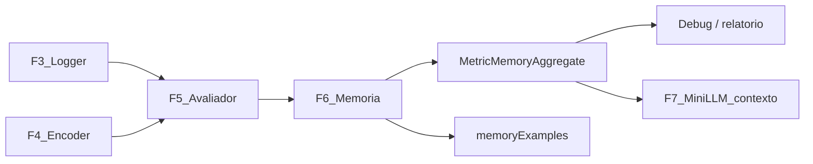
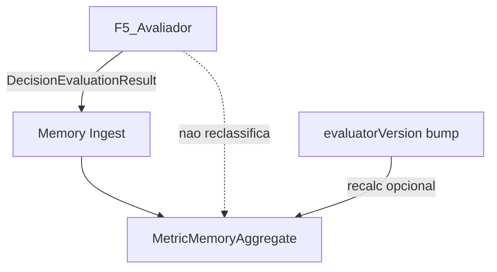

# Fase 6 — Memória / Aprendizagem (desenho)

Documento de saída da **Fase 6** do [ROADMAP_AI](ROADMAP_AI.md).

**Base:** [PHASE0_INVENTORY.md](PHASE0_INVENTORY.md) · [FASE_1_METRICAS.md](FASE_1_METRICAS.md) · [FASE_2A_PRIORIDADES_METRICAS.md](FASE_2A_PRIORIDADES_METRICAS.md) · [FASE_2B_FIXTURES_METRICAS.md](FASE_2B_FIXTURES_METRICAS.md) · [FASE_3_LOGGER_DESIGN.md](FASE_3_LOGGER_DESIGN.md) · [FASE_4_ENCODER_DESIGN.md](FASE_4_ENCODER_DESIGN.md) · [FASE_5_AVALIADOR_DESIGN.md](FASE_5_AVALIADOR_DESIGN.md)  
**Data:** 2026-05-31  
**Scope:** desenho documental — **sem implementação**, **sem código**, **sem ML**, **sem LLM**, **sem backend**.

---

## Frase-guia

| Papel | Metáfora | Responsabilidade |
|-------|----------|------------------|
| **Logger (Fase 3)** | Gravador | Regista eventos brutos |
| **Encoder (Fase 4)** | Tradutor | Estado codificado |
| **Avaliador (Fase 5)** | Juiz | Classifica good / medium / bad / unknown |
| **Memória (Fase 6)** | Histórico / padrões | Agrega decisões **já julgadas** |

A memória **não decide cartas**. **Não substitui** o juiz. **Não é** LLM.

---

# 1. Resumo

Sequência Card Intelligence:

```
Fase 2A — prioridades · Fase 2B — fixtures
    ↓
Fase 3 — logger (eventos; classification sempre unknown)
    ↓
Fase 4 — encoder (EncodedDecisionState)
    ↓
Fase 5 — avaliador (DecisionEvaluationResult)
    ↓
Fase 6 — memória / aprendizagem          ← este documento
    ↓
Fase 7 — mini-LLM local / fallback
```

**Objectivo memória v0:** a partir de decisões **avaliadas**, guardar **agregados simples** — frequências, taxas de erro, tendências, exemplos recentes — sem machine learning pesado.

Exemplos de padrões úteis:

- Jogador X costuma desperdiçar manilhas na Sueca (S16 `bad` recorrente)
- Bot Medium dá bags no Spades depois do bid cumprido (SP09)
- AI falha Q♠ no Hearts (H11 / H05)
- Jogador fica preso com cartas perigosas no King (K01)
- Hard melhora ou piora em certas métricas vs Medium

**Persistência v0:** local (IndexedDB), export JSONL futuro — **sem sincronizar backend** nesta fase.



---

# 2. O que a memória NÃO faz

| Não faz | Porquê |
|---------|--------|
| Escolher cartas | Papel dos bots / humano / Fase 7 sugere, regras validam |
| Classificar jogadas | Papel do avaliador (Fase 5) — memória **não reclassifica** |
| Alterar gameplay | Camada analítica read-mostly |
| Corrigir bots automaticamente | v0 só **informa**; mudança de bot é decisão humana / fase futura |
| Chamar LLM | Fase 7 |
| Treinar modelo ML | Fora do v0; Learning futuro (§11) |
| Usar informação hidden sem metadata | Player View default; Engine View marcada |
| Substituir regras do jogo | Catálogo F1 + motor de regras permanecem autoridade |
| Substituir avaliador | Agrega output do juiz; recalc em bump major = futuro (§9.1) |

---

# 3. Inputs da memória

A memória **v0** ingere principalmente **`DecisionEvaluationResult`** (Fase 5), enriquecido com metadados do logger/encoder.

## 3.1 Schema documental: `MemoryIngestRecord`

```typescript
/** Pacote mínimo para incrementar agregados — v6.0.0 */
interface MemoryIngestRecord {
  schemaVersion: '6.0.0';

  // --- Identidade decisão ---
  sourceEventId: string;
  gameId: string;
  sessionId: string;
  timestamp: string;

  // --- Jogo e actores ---
  variant: 'sueca' | 'spades' | 'hearts' | 'king';
  playerIndex: number;
  subjectId: string;              // ex.: player_0, bot-medium-seat-2
  playerType: 'human' | 'ai' | 'remote';
  difficulty: 'easy' | 'medium' | 'hard' | null;

  // --- Avaliação (Fase 5) ---
  classification: 'good' | 'medium' | 'bad' | 'unknown';
  partialEvaluation: boolean;     // true = avaliou parte; ≠ unknown (F5 §4.2)
  confidence: 'high' | 'medium' | 'low';
  reasonShort: string;
  activatedMetricIds: string[];
  failedMetricIds: string[];
  metricResults?: MetricEvaluationResult[];

  // --- Contexto resumido (opcional v0) ---
  roundIndex?: number;
  trickIndex?: number;
  contractId?: string | null;
  viewTypeUsed: 'engine' | 'player';

  // --- Versões (§9) ---
  loggerVersion: '3.0.0';
  encoderVersion: '4.0.0';
  evaluatorVersion: '5.0.0';
  metricCatalogVersion: '1.1';    // FASE_1_METRICAS

  /** Referência opcional ao log bruto — não duplicar payload completo */
  rawLogEventId?: string;
}
```

## 3.2 O que entra vs o que fica de fora

| Entra no v0 | Fica de fora (ou só referência) |
|-------------|----------------------------------|
| Classificação + metricIds | Payload completo `GameState` |
| subjectId, variant, difficulty | Mãos adversárias (salvo em `memoryExamples` truncado) |
| partialEvaluation, unknown | Re-avaliação heurística na memória |
| Versões pipeline | Logs brutos inteiros (store separado F3) |

**Regra v0:** memória consome **apenas** decisões **já avaliadas** pela Fase 5 (`DecisionEvaluationResult`). Eventos logger **sem** avaliação F5 **não** entram na memória — são **ignorados** ou mantidos **fora** da memória até existir avaliador.

**Conceito futuro (`ingestQueue`):** fila de eventos pendentes de avaliação — **não faz parte do v0**; documentada em §13.2 para evolução posterior.

---

# 4. Memory v0 — agregados simples

Estatística simples — **contagens e taxas**, não ML.

## 4.1 Schema: `MetricMemoryAggregate`

```typescript
interface MetricMemoryAggregate {
  schemaVersion: '6.0.0';
  memoryId: string;               // hash estável: subjectType + subjectId + variant + metricId

  subjectType: 'human' | 'ai' | 'bot' | 'remote' | 'table' | 'global';
  subjectId: string;              // ex.: "human:local", "bot:medium", "global", "session:abc"
  variant: 'sueca' | 'spades' | 'hearts' | 'king' | 'all';
  metricId: string;
  metricNameHuman: string;
  difficulty: 'easy' | 'medium' | 'hard' | 'all' | null;

  totalCount: number;
  evaluatedCount: number;         // totalCount - unknownCount (decisões com veredicto)
  goodCount: number;
  mediumCount: number;
  badCount: number;
  unknownCount: number;
  partialCount: number;           // avaliação parcial possível (≠ unknownCount)

  lastSeenAt: string;
  firstSeenAt: string;

  trend: 'improving' | 'worsening' | 'stable' | 'unknown';

  commonMistakes: string[];       // reasonShort frequentes em badCount
  commonGoodPatterns: string[];   // reasonShort frequentes em goodCount
  exampleEventIds: string[];      // cap N (§13)

  confidence: 'high' | 'medium' | 'low';  // função de evaluatedCount

  /** Versões do pipeline que alimentaram este agregado */
  evaluatorVersion: string;
  encoderVersion: string;
  loggerVersion: string;
  metricCatalogVersion: string;
  viewTypeUsed: 'player' | 'engine' | 'mixed';  // mixed = warning
}
```

## 4.2 Métricas derivadas (Learning v0)

Documentação apenas — implementação futura:

| Métrica | Fórmula |
|---------|---------|
| `badRate` | `badCount / evaluatedCount` |
| `goodRate` | `goodCount / evaluatedCount` |
| `partialRate` | `partialCount / totalCount` |
| `unknownRate` | `unknownCount / totalCount` |

**Confiança do agregado:**

| `evaluatedCount` | `confidence` |
|------------------|--------------|
| &lt; 10 | `low` |
| 10–49 | `medium` |
| ≥ 50 | `high` |

**Trend v0 (heurística simples):** comparar `badRate` últimos 20 eventos vs 20 anteriores → improving / worsening / stable; se &lt; 40 total → `unknown`.

---

# 5. Memory v0 — padrões por jogo

Mapeamento **padrão humano → metricId F1** — alimenta `commonMistakes` / dashboards.

## 5.1 Sueca

| Padrão útil | metricId(s) |
|-------------|-------------|
| Abre com manilha antes do Ás | S16 |
| Não cria cortes com carta seca | S04 |
| Corta alto sem necessidade | S12, S13 |
| Dá pontos ao parceiro sem vaza segura | S19, T05 |
| Desperdiça trunfos | S12, S05 |
| Guarda manilha demasiado tempo | S16, S10 |
| Falha leitura de parceiro | S19, S25 (v1) |

## 5.2 Spades

| Padrão útil | metricId(s) |
|-------------|-------------|
| Bid demasiado alto / baixo | SP01, SP02 |
| Falha contrato | SP02, SP05 |
| Bags depois de bid cumprido | SP09, T06 |
| Não protege parceiro | SP06 |
| Corta com espada alta demais | SP08 |
| Não quebra bid adversária alta | SP14 (v1) |
| Nil mal escolhido | SP03 (Hard, v1) |

## 5.3 Hearts

| Padrão útil | metricId(s) |
|-------------|-------------|
| Fica com Q♠ | H11 |
| Passa mal cartas perigosas | H05 |
| Fica com «meninos» | H12 |
| Ganha vazas com pontos evitáveis | H01 |
| Não limpa carta perigosa quando podia | H13, T07 |
| Não detecta shoot the moon | H09 (v1) |
| Não bloqueia moon | H10 (v1) |

## 5.4 King

| Padrão útil | metricId(s) |
|-------------|-------------|
| Ignora contrato activo | K00 |
| Não respeita regra obrigatória | K02, K03 |
| Puxa copas quando não pode | K03 |
| Fica com Rei de Copas (estratégia pós-obrigação) | K02 |
| Fica com Damas/Homens perigosos | K01, K08 |
| Gere mal duas últimas | K10 (v1) |
| Escolhe mal nulos/festa/leilão | K12, K06 (v1) |
| Não adapta ao contrato | K00, K01 |

---

# 6. Memory scopes

| Scope | `subjectType` | `subjectId` exemplo | Uso |
|-------|---------------|---------------------|-----|
| **Player Memory** | `human` / `remote` | `human:frank`, `remote:seat-2` | Padrões jogador humano/remoto |
| **Bot Memory** | `bot` / `ai` | `bot:medium:sueca`, `ai:hard` | Por dificuldade + variant |
| **Variant Memory** | `global` | `global:hearts` | Estatísticas globais por jogo |
| **Metric Memory** | qualquer + chave metricId | agregado por métrica | Ranking métricas problemáticas |
| **Table Memory** | `table` | `session:{sessionId}` | **Opcional v0** — ver §6.1 |

**v0 prioridade:** Bot Memory (Medium) + Variant Memory + Metric Memory para métricas P0 F2B.

## 6.1 Esclarecimentos de scope (v0)

### `subjectType`: `ai` vs `bot`

Ambos podem existir no schema; no **v0 recomenda-se normalizar** assim:

| Valor | Significado | Quando usar |
|-------|-------------|-------------|
| **`bot`** | Implementação **local concreta** do jogo (Easy / Medium / Hard no Suecão) | Bots internos, agregados por dificuldade + variant |
| **`ai`** | Actor / origem **genérica ou externa** de decisão automatizada | Path externo (ex.: Sueca T02), origem não mapeada a bot local |

**Regra prática v0:** preferir `bot` para slots AI do app; reservar `ai` para origens externas ou genéricas.

### Table Memory vs `sessionMemory`

| Conceito | v0 | Futuro |
|----------|-----|--------|
| **`sessionMemory`** | **Sim — MVP** | Rolling state por partida; cobre «nesta sessão já deu 3 bags» |
| **Table Memory persistente** (`subjectType: table`) | **Não** | Padrões de mesa entre partidas; útil para Hard / F7 |

Para o MVP, **`sessionMemory` cobre o necessário**; Table Memory persistente fica para fase futura.

---

# 7. Curto prazo vs longo prazo

## 7.1 Memória de sessão (`sessionMemory`)

| Aspecto | Decisão |
|---------|---------|
| Vida | Uma partida / `sessionId` |
| Conteúdo | Contagens rolling, últimos N `MemoryIngestRecord`, estilo mesa |
| Uso | Inferir «nesta partida já deu 3 bags»; contexto Hard futuro |
| Persistência | Apaga ao fim da sessão ou merge para persistente |

## 7.2 Memória persistente local

| Aspecto | Decisão |
|---------|---------|
| Vida | Entre partidas no dispositivo |
| API | IndexedDB (`cardIntelligenceMemory` — §13) |
| Sync backend | **Não** nesta fase |
| Privacidade | Dados locais; export manual pelo utilizador |

## 7.3 Export futura (JSONL)

| Export | Filtro |
|--------|--------|
| Por jogador | `subjectId` human/remote |
| Por métrica | `metricId` |
| Por jogo | `variant` |
| Por dificuldade | `difficulty` |
| Agregados snapshot | `MetricMemoryAggregate[]` |
| Exemplos | `memoryExamples[]` |

---

# 8. Perspectiva e justiça

| Regra | Detalhe |
|-------|---------|
| Default | Agregados de decisões avaliadas com **`viewTypeUsed: player`** |
| Engine View | Só debug / treino offline **marcado** — `viewTypeUsed: engine` no ingest |
| Mixed | Se misturar engine + player no mesmo agregado → `viewTypeUsed: mixed` + warning |
| Nunca | Usar memória engine para comparar humano «justo» sem aviso |
| Exemplos | `memoryExamples` guardam contexto **Player View** truncado |

Alinhado com [FASE_4_ENCODER_DESIGN.md](FASE_4_ENCODER_DESIGN.md) e [FASE_5_AVALIADOR_DESIGN.md](FASE_5_AVALIADOR_DESIGN.md) §10.

---

# 9. Relação com avaliador



| Princípio | Detalhe |
|-----------|---------|
| Avaliador produz | `classification`, `reasonShort`, `metricResults` |
| Memória agrega | Contagens + trends + exemplos |
| Memória **não** reclassifica | Nunca sobrescrever veredicto F5 |
| Versão muda | Guardar `evaluatorVersion` por agregado; **não misturar** contagens de versões diferentes |

## 9.1 Campos de versão

| Campo | Fonte |
|-------|-------|
| `loggerVersion` | F3 `schemaVersion` (3.0.0) |
| `encoderVersion` | F4 (4.0.0) |
| `evaluatorVersion` | F5 (5.0.0) |
| `metricCatalogVersion` | F1 histórico (1.1) |

**Política v0:** se `evaluatorVersion` muda major, **não** misturar contagens — novo `memoryId` suffix ou agregado separado.

**Recalcular agregados (futuro, não v0):** mudança **major** de `evaluatorVersion` pode exigir **recalcular** agregados antigos a partir dos logs + re-avaliação F5. Isto fica documentado como **risco / evolução futura** (§16 R4) — **sem job de recalc na implementação v0**.

## 9.2 Partial vs unknown na memória

**Confirmado:** `partialCount` e `unknownCount` são **contadores separados** — não colapsar num só.

| Campo F5 | Significado | Contagem memória |
|----------|-------------|------------------|
| `classification: unknown` | Sem dados suficientes para avaliar | `unknownCount++` apenas; **não** entra em `evaluatedCount` |
| `partialEvaluation: true` | Avaliação **parcial possível** (≠ unknown) | `partialCount++` **e** incrementar good/medium/bad conforme classificação global |
| Ambos falsos + veredicto | Avaliação completa | good/medium/bad conforme classificação |
| «Pior vence» | — | `failedMetricIds` alimentam `commonMistakes` por metricId |

**Nota:** uma decisão pode ser `partialEvaluation: true` **e** ter classificação global `good` / `medium` / `bad` — `partialCount` regista a limitação; `unknownCount` regista ausência total de veredicto.

---

# 10. Learning v0

Aprendizagem **simples** — documentação de capacidades, não algoritmos complexos.

| Capacidade | Descrição |
|------------|-----------|
| Contagem de frequência | Por metricId × subject × variant |
| Taxa de erro | `badRate`, `goodRate` (§4.2) |
| Tendência temporal | `trend` rolling window |
| Exemplos recentes | Últimos N `sourceEventId` por métrica `bad` |
| Medium vs Hard | Dois agregados `bot:medium` vs `bot:hard` — diff badRate |
| Humano vs bot | `human:*` vs `bot:medium` mesma métrica |
| Ranking problemático | Ordenar métricas por `badRate` × `evaluatedCount` |

**Exemplo interpretação:**

> `bot:medium:spades` · SP09 · `badRate = 0.35` · `evaluatedCount = 40` · trend `worsening`  
> → «Bot Medium dá bags frequentemente após bid cumprido.»

**Não v0:** regressão, clustering, embeddings, redes neurais.

---

# 11. Learning futuro

Evolução documentada — **sem implementar** nesta fase.

| Área | Ideia |
|------|-------|
| Clustering | Agrupar `memoryExamples` por fingerprint encoder |
| Recomendações bot | Sugerir ajuste heurística **humana** (não auto-apply) |
| Replay similarity | «Jogada parecida no passado» → link eventIds |
| Perfil agressivo/passivo | Spades SP14 / bags rate |
| Estilo por jogador | Player Memory longitudinal |
| Prep mini-LLM | Top-K agregados + exemplos como contexto RAG leve |

---

# 12. Integração futura

| Consumidor | Uso memória |
|------------|-------------|
| Dashboard / debug | Top métricas `bad`, trends, exemplos |
| Relatório pós-jogo | «Nesta partida: 2× S16 bad» |
| Treino local | Export JSONL agregados |
| Melhoria bots | Insight para **humano** priorizar fixes (PHASE0 gaps) |
| Mini-LLM (F7) | Contexto agregado + exemplos — **não** autoridade |
| Comparação humano vs AI | Mesmo metricId, scopes diferentes |
| Análise Medium/Hard | Bot Memory diff |

**Gatilho v0:** batch **pós-partida** ou pós-export avaliação — não hot path.

---

# 13. Storage design documental

Sem implementação — desenho alinhado com F3 IndexedDB.

## 13.1 Base de dados

| Aspecto | Decisão |
|---------|---------|
| Nome | `cardIntelligenceMemory` (separada de `cardIntelligenceLogs` F3) |
| API | IndexedDB |
| Fallback | Metadados em `localStorage` |

## 13.2 Object stores

| Store | Conteúdo | Chave | v0 |
|-------|----------|-------|-----|
| `memoryAggregates` | `MetricMemoryAggregate` | `memoryId` | **Sim** |
| `memoryExamples` | `{ exampleId, sourceEventId, metricId, classification, reasonShort, snapshotTruncated, viewTypeUsed, timestamp }` | `exampleId` | **Sim** |
| `sessionMemory` | Rolling state por `sessionId` | `sessionId` | **Sim** (MVP) |
| `exportJobs` | Metadata exports JSONL | `exportId` | Futuro |
| `ingestQueue` | Pendentes sem avaliação F5 | `sourceEventId` | **Futuro** — conceito apenas; v0 não persiste fila |

**Nota `ingestQueue`:** reservada para quando existir pipeline assíncrono logger → avaliador → memória. No **v0**, eventos sem avaliação F5 **não** entram na memória (§3.2).

## 13.3 Rotação e retenção

| Política | Valor sugerido |
|----------|----------------|
| `exampleEventIds` por agregado | Máx. **10** |
| `memoryExamples` total | Máx. **500** ou 30 dias |
| Agregados | Manter; separar por `evaluatorVersion` major (recalc job = futuro) |
| Sessão | Purge 7 dias após fim |
| Alerta quota | ~30 MB (mobile) |

---

# 14. Relação com Fase 7 (mini-LLM)

A mini-LLM **pode receber** (contexto, não ordens):

| Input LLM | Origem |
|-----------|--------|
| Estado codificado pré-decisão | F4 |
| Métricas aplicáveis | F4 `metricContext` |
| Avaliação heurística pós-decisão | F5 (treino/análise) |
| Memória agregada relevante | F6 top-K por variant + metricId |
| Exemplos semelhantes | F6 `memoryExamples` |

**Limites obrigatórios:**

- LLM **nunca** escolhe carta ilegal — motor de regras valida
- LLM **não** substitui regras F1 nem catálogo King
- Memória é **contexto**, não autoridade absoluta — conflito memória vs avaliador → **avaliador + regras** ganham
- Player View para sugestões honestas

---

# 15. Regra obrigatória para implementação futura

**Antes de qualquer implementação de código desta fase:**

1. Criar **primeiro** uma prompt/plano de implementação dedicado.
2. Essa prompt **deve** listar:
   - **Escopo** (v0 agregados P0; quais scopes)
   - **Ficheiros a alterar**
   - **Novos ficheiros** (`cardIntelligence/memory/*`, stores IDB)
   - **Riscos** (§16)
   - **Testes** (ingest sintético; badRate; version bump)
   - **Critérios de sucesso** (ex.: agregado SP09 incrementa após 3 bad)
3. **Só depois** implementar com base nessa prompt.
4. No fim, entregar **relatório final de implementação**.

**Não saltar directamente para código.**

---

# 16. Riscos

| # | Risco | Impacto | Mitigação v0 |
|---|-------|---------|--------------|
| R1 | Poucos jogos → agregado enviesado | Conclusões falsas | `confidence: low`; mínimo N para trend |
| R2 | Jogador fraco vs estratégia válida | Rotular humano injustamente | Player View; não punir no gameplay |
| R3 | Engine View indevida | Memória «batota» | Marcar `viewTypeUsed`; não mix |
| R4 | Misturar versões avaliador | badRate incoerente | `evaluatorVersion` no agregado; recalc major bump = **futuro**, não v0 |
| R5 | Guardar dados demais | IDB quota | Caps exemplos; retenção |
| R6 | Performance mobile | Lag | Batch pós-partida |
| R7 | Privacidade local | Dados sensíveis no device | Local only; export opt-in |
| R8 | Bots «aprendem» padrões errados | Reforço erro catálogo | Memória informa; **não** auto-corrige bots |
| R9 | King/leilão | Métricas raras ruidosas | v0 exclui K06; confidence low |
| R10 | Memória influencia demais decisão | Overfit a histórico | F7: memória como contexto, não veto |

---

# 17. Próxima fase — Mini-LLM (Fase 7)

Fase 7 compõe **todas** as camadas:

```
Regras jogo + Catálogo F1
    +
Encoder F4 (pré-decisão, Player View)
    +
Avaliador F5 (pós-decisão, referência)
    +
Memória F6 (agregados + exemplos)
    +
Fallback heurístico actual (PHASE0)
    →
Mini-LLM sugere carta legal
    →
Motor valida legalidade
```

| Componente | Papel F7 |
|------------|----------|
| Encoder | Input estado |
| Avaliador | Ground truth heurístico / explicação |
| Memória | «Costumas falhar aqui» — contexto |
| Métricas F1 | Restrições conceptuais |
| Heurísticas bots | Fallback se LLM indisponível |
| LLM | Sugestão — **nunca** juiz final |

---

# Dúvidas documentadas — resolvidas (v1.1)

| # | Tema | Decisão fechada |
|---|------|-----------------|
| 1 | `subjectType` ai vs bot | `ai` = actor/origem genérica automatizada; `bot` = implementação local concreta; v0 normaliza `bot` para bots internos, `ai` para externo/genérico (§6.1) |
| 2 | `ingestQueue` | Conceito **futuro**; v0 consome só F5 avaliado; eventos sem avaliação ignorados/fora da memória (§3.2, §13.2) |
| 3 | Recalcular agregados | Major `evaluatorVersion` pode exigir recalc — **risco/futuro**, não implementação v0 (§9.1, R4) |
| 4 | `partialCount` vs `unknownCount` | Separados: partial = avaliação parcial possível; unknown = sem dados para avaliar (§9.2) |
| 5 | Table Memory | Opcional v0; `sessionMemory` cobre MVP; Table Memory persistente = futuro (§6.1) |

---

## Referências

- [ROADMAP_AI.md](ROADMAP_AI.md)
- [FASE_5_AVALIADOR_DESIGN.md](FASE_5_AVALIADOR_DESIGN.md) — partial vs unknown, pior vence
- [FASE_4_ENCODER_DESIGN.md](FASE_4_ENCODER_DESIGN.md) — Player View
- [FASE_3_LOGGER_DESIGN.md](FASE_3_LOGGER_DESIGN.md) — IndexedDB logs
- [FASE_2A_PRIORIDADES_METRICAS.md](FASE_2A_PRIORIDADES_METRICAS.md) — métricas P0
- [FASE_1_METRICAS.md](FASE_1_METRICAS.md) — catálogo

---

## Histórico

| Versão | Data | Nota |
|--------|------|------|
| 1.0 | 2026-05-31 | Desenho inicial Fase 6 — schema 6.0.0, agregados simples |
| 1.1 | 2026-05-31 | Esclarecimentos: ai/bot, ingestQueue futuro, recalc futuro, partial/unknown, sessionMemory MVP |
