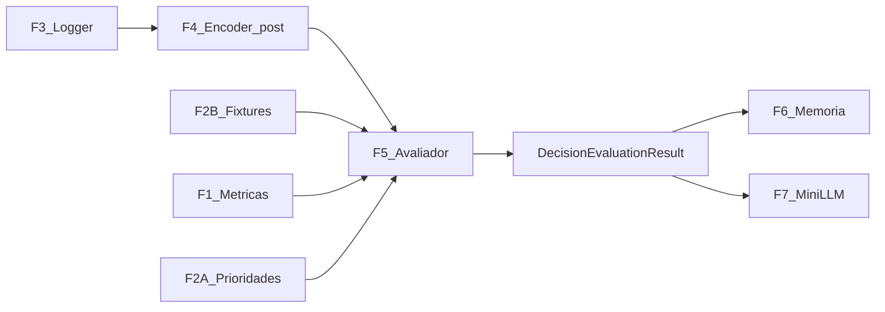
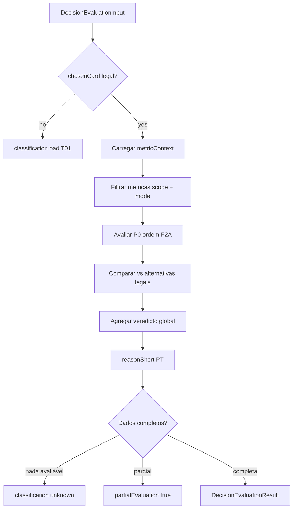

# Fase 5 — Avaliador de Decisões (desenho)

Documento de saída da **Fase 5** do [ROADMAP_AI](../ROADMAP_AI.md).

**Base:** [PHASE0_INVENTORY.md](PHASE0_INVENTORY.md) · [FASE_1_METRICAS.md](../specs/FASE_1_METRICAS.md) · [FASE_2A_PRIORIDADES_METRICAS.md](../specs/FASE_2A_PRIORIDADES_METRICAS.md) · [FASE_2B_FIXTURES_METRICAS.md](../specs/FASE_2B_FIXTURES_METRICAS.md) · [FASE_3_LOGGER_DESIGN.md](FASE_3_LOGGER_DESIGN.md) · [FASE_4_ENCODER_DESIGN.md](FASE_4_ENCODER_DESIGN.md)  
**Data:** 2026-05-31  
**Scope:** desenho documental — **sem implementação**, **sem código**, **sem backend**.

---

## Frase-guia

| Papel | Metáfora | Responsabilidade |
|-------|----------|------------------|
| **Logger (Fase 3)** | Gravador | Regista eventos; `classification: "unknown"`, `reason: null` |
| **Encoder (Fase 4)** | Tradutor | `EncodedDecisionState`; `encodeMode: post_decision` para o juiz |
| **Avaliador (Fase 5)** | Juiz | Classifica **boa / média / má** — **primeira** escrita de veredicto |

O avaliador **não escolhe cartas**. **Julga** decisões já tomadas.

---

## Convenção de classificação

| Schema técnico (`DecisionEvaluationResult`) | Linguagem humana (Fase 1 / 2B) |
|---------------------------------------------|--------------------------------|
| `good` | **Boa** |
| `medium` | **Média** |
| `bad` | **Má** |
| `unknown` | **Não avaliável** (dados insuficientes) |

**Nota:** o rascunho em [FASE_4_ENCODER_DESIGN.md](FASE_4_ENCODER_DESIGN.md) §12.2 usava `ok` — em Fase 5 o valor canónico é **`medium`**. `ok` fica como alias deprecated em migrações futuras.

---

# 1. Resumo

Sequência Card Intelligence:

```
Fase 2A — prioridades de métricas (P0–P3)
    ↓
Fase 2B — 23 fixtures activos (boa / média / má)
    ↓
Fase 3 — logger (eventos brutos; classification sempre unknown)
    ↓
Fase 4 — encoder (EncodedDecisionState; post_decision para avaliação)
    ↓
Fase 5 — avaliador (DecisionEvaluationResult)     ← este documento
    ↓
Fase 6 — memória / aprendizagem
    ↓
Fase 7 — mini-LLM local / fallback
```

**Objectivo do avaliador:** receber log + estado codificado + métricas aplicáveis + referência a fixtures 2B, e devolver classificação com razão curta, métricas activadas, alternativas melhores e campos em falta.



**Pré-condição:** encoder em **`encodeMode: post_decision`** com **`chosenCard` preenchido**. Pré-decisão (Fase 7 / sugestão de jogada) **não** entra no juiz.

**Persistência:** resultados num **store analítico separado** do log bruto — o logger v0 **não** é mutado com veredictos.

---

# 2. O que o avaliador NÃO faz

| Não faz | Porquê |
|---------|--------|
| Alterar gameplay | Camada read-only |
| Escolher cartas | Papel dos bots / humano / Fase 7 |
| Substituir bots ou heurísticas | Card Intelligence acima dos bots |
| Chamar LLM | Fase 7 |
| Aprender ou agregar padrões | Fase 6 |
| Gravar eventos brutos | Papel do logger (Fase 3) |
| Usar informação **hidden** na Player View | Avaliação injusta / treino contaminado |
| Avaliar fora das regras legais | T01 é gate; ilegal = `bad`, não opinião estratégica |
| Preencher log bruto com classificação | Logger mantém `unknown` / `null` |
| Parsear texto markdown de fixtures | Fixtures são golden cases; regras vêm de métricas + encoder |

---

# 3. Input do avaliador: `DecisionEvaluationInput`

Schema documental **v5.0.0** — notação TypeScript, não código.

```typescript
interface DecisionEvaluationInput {
  schemaVersion: '5.0.0';

  sourceEventId: string;           // CardDecisionLogEvent.eventId ou BidEvent etc.
  sourceEventType: 'card_decision' | 'bid' | 'pass_cards' | 'other';

  /** Estado codificado — DEVE ser post_decision para card_decision */
  encodedState: EncodedDecisionState;

  /** Redundância explícita para validação rápida */
  chosenCard: Card | null;
  legalMoves: Card[];

  /** Métricas candidatas — filtradas de encodedState.metricContext + F2A scope */
  applicableMetrics: ApplicableMetricRef[];

  /** IDs de fixtures 2B comparáveis (ex.: métrica S08, não path de ficheiro) */
  fixtureReferences: string[];

  evaluatorMode: 'strict' | 'advisory' | 'debug';
  viewType: 'engine' | 'player';   // pedido; default player para avaliação justa
  evaluationScope: 'p0' | 'p1' | 'p2' | 'all';

  /** Opcional: evento logger bruto para recálculo / auditoria */
  rawLogEvent?: CardDecisionLogEvent | BidEvent;
}

interface ApplicableMetricRef {
  metricId: string;                // ex.: "S08", "K02"
  priority: 'p0' | 'p1' | 'p2' | 'p3';
  applicable: boolean;             // do encoder — NÃO é classificação
  missingFields: string[];
  confidence: number;              // 0–1 relevança contextual
}
```

## 3.1 Modos do avaliador

| Modo | Comportamento |
|------|---------------|
| **`strict`** | Avalia **só** métricas com `applicable && missingFields.length === 0`; sem hipóteses; default v0 |
| **`advisory`** | Pode incluir métricas parciais com `confidence` baixa e `evaluatorWarnings`; não usar para treino automático |
| **`debug`** | Permite `viewType: engine`; marca `viewTypeUsed: engine` no output |

## 3.2 Escopo de avaliação

| `evaluationScope` | Métricas consideradas |
|-------------------|------------------------|
| `p0` | Só P0 Fase 2A — **v0 default** |
| `p1` | P0 + P1 |
| `p2` | P0 + P1 + P2 |
| `all` | Catálogo completo Fase 1 (não recomendado v0) |

## 3.3 Validação de entrada

| Condição | Acção |
|----------|-------|
| `encodedState.encodeMode !== 'post_decision'` (card play) | Rejeitar — não há jogada a julgar |
| `chosenCard === null` (card play) | Rejeitar |
| `chosenCard ∉ legalMoves` | Avaliar T01 → `bad` imediato |
| `viewType: player` + campos hidden presentes | Rejeitar input (erro encoder) |

---

# 4. Output do avaliador: `DecisionEvaluationResult`

```typescript
interface DecisionEvaluationResult {
  schemaVersion: '5.0.0';
  sourceEventId: string;

  /** Veredicto global */
  classification: 'good' | 'medium' | 'bad' | 'unknown';
  confidence: 'high' | 'medium' | 'low';

  reasonShort: string;             // PT, linguagem de mesa, 1–2 frases

  activatedMetricIds: string[];    // métricas que influenciaram o veredicto
  failedMetricIds: string[];       // métricas aplicáveis onde chosenCard falhou

  betterAlternatives: Card[];      // alternativas legais estritamente melhores
  equivalentAlternatives: Card[];  // mesma classe estratégica

  missingFields: string[];         // impede avaliação de métricas concretas
  partialEvaluation: boolean;      // true = avaliou parte; contexto estratégico incompleto (≠ unknown)

  evaluatorWarnings: string[];   // ex.: "Engine View usada", "SP01 pós-mão only"

  viewTypeUsed: 'engine' | 'player';
  evaluatedAt: string;             // ISO 8601

  /** Detalhe por métrica (opcional v0, recomendado v1) */
  metricResults?: MetricEvaluationResult[];
}

interface MetricEvaluationResult {
  metricId: string;
  classification: 'good' | 'medium' | 'bad' | 'unknown' | 'not_applicable';
  reasonShort: string;
  betterAlternatives: Card[];
}
```

## 4.1 Responsabilidade vs logger

| Campo | Logger (F3) | Avaliador (F5) |
|-------|-------------|----------------|
| `classification` | Sempre `"unknown"` | **`good` / `medium` / `bad` / `unknown`** |
| `reason` | Sempre `null` | **`reasonShort`** (e por métrica) |

O avaliador **não reescreve** o JSONL bruto v0; persiste `DecisionEvaluationResult` em store derivado ou export analítico.

## 4.2 `unknown` vs `partialEvaluation` — não confundir

São **eixos independentes**. `partialEvaluation` **não** é sinónimo de `unknown`.

| Conceito | Campo | Significado |
|----------|-------|-------------|
| **Unknown** | `classification: 'unknown'` | **Não há dados suficientes para avaliar** — nenhuma métrica P0 relevante pode ser julgada com confiança (strict mode + `missingFields` bloqueiam tudo) |
| **Partial** | `partialEvaluation: true` | **Há dados suficientes para avaliar parte da jogada**, mas **não todo o contexto estratégico** — algumas métricas P0 têm veredicto; outras ficam `unknown` ou fora de scope por falta de inferência (ex.: S08 sem `cutRisk`) |
| **Completa** | `partialEvaluation: false` + `classification` ≠ `unknown` | Métricas P0 aplicáveis do scope avaliadas; veredicto global coerente |

### Regras

1. **`unknown`** — zero avaliação útil: devolver `classification: 'unknown'`, `partialEvaluation: false`, listar `missingFields`.
2. **`partial`** — avaliação **parcial mas válida**: `partialEvaluation: true`; `classification` reflecte métricas **já avaliadas** (via regra «pior vence» §4.3); `missingFields` / `evaluatorWarnings` indicam o que faltou.
3. **Nunca** usar `classification: 'unknown'` só porque o contexto estratégico está incompleto **se** pelo menos uma métrica crítica P0 foi avaliada (ex.: K02 `bad` + S08 por avaliar → `bad`, `partialEvaluation: true`).

## 4.3 Agregação v0 — «pior vence»

Quando várias métricas P0 aplicáveis têm veredicto:

```
bad  >  medium  >  good
```

**Regra:** se uma **métrica crítica** diz **má**, a jogada **não pode** ser **boa** só porque outra métrica menor diz boa.

Exemplos:

| Métrica A | Métrica B | Global v0 |
|-----------|-----------|-----------|
| K02 `bad` (K♥ escondido) | S19 `good` (parceiro ok) | **`bad`** — obrigação vence |
| SP09 `bad` (bag) | SP06 `good` | **`bad`** |
| S08 `medium` | S19 `good` | **`medium`** |
| S08 `unknown` (falta cutRisk) | K02 `good` | **`good`**, `partialEvaluation: true` |

King: métricas de **obrigação** (K02, K03) e **contrato** (K00, K01) tratam-se como **críticas** na agregação.

**v1:** ponderação ou métrica dominante por fase — fora do v0.

---

# 5. Pipeline v0



## Passos

1. **Validar legalidade (T01)** — se `chosenCard ∉ legalMoves` → `bad`, `confidence: high`, `activatedMetricIds: ['T01']`, fim.
2. **Carregar `metricContext`** do `encodedState` + `applicableMetrics` do input.
3. **Filtrar métricas** por `evaluationScope` e `evaluatorMode` (strict: exigir `missingFields.length === 0`).
4. **Avaliar P0** na ordem Fase 2A: **T01 → K02 → K03 → SP09 → H13 → S08 → SP06 → K01** (King obrigações antes de estratégia).
5. **Comparar `chosenCard`** com alternativas legais: winner mínimo, slough perigo, descarte baixo, K♥ obrigatório, etc.
6. **Agregar classificação global** — regra **«pior vence»** (§4.3): `bad` > `medium` > `good`; métrica crítica `bad` impede global `good`; King contrato-first antes de T04.
7. **Gerar `reasonShort`** em português claro (ex.: «Bid cumprido; A♠ desnecessário — bag»).
8. **Dados em falta** — `missingFields` sempre que aplicável; **sem dados para avaliar nada** → `classification: unknown`, `partialEvaluation: false`; **avaliação parcial** (parte da jogada sim, contexto estratégico incompleto) → `partialEvaluation: true` com veredicto das métricas já julgadas.

---

# 6. Avaliador v0 — escopo limitado

v0 cobre métricas **P0** alinhadas com [FASE_2B_FIXTURES_METRICAS.md](../specs/FASE_2B_FIXTURES_METRICAS.md) (23 fixtures).

## 6.1 Transversal

| Descrição humana | ID | Fixture 2B | Tipo avaliação v0 |
|------------------|-----|------------|-------------------|
| Jogada legal | T01 | T01 | automática |
| Ganhar barato só quando desejável | T04 | T04 | parcial |
| Jogar baixo para perder / evitar penalização | T06 | T06 | parcial |

## 6.2 Sueca

| Descrição humana | ID | Fixture | Campos encoder chave |
|-------------------|-----|---------|----------------------|
| Ganhar com carta mínima (com risco corte) | S08 · T04 | S08 | `canWinCheaply`, `cutRisk`, `legalMoves` |
| Não abrir manilha antes do Ás | S16 | S16 | `isLeading`, `acesSeenBySuit`, `sevensSeenBySuit` |
| Cortar com trunfo mínimo | S12 | S12 | `trumpSuit`, winners legais |
| Parceiro a ganhar — não roubar | S19 · T05 | S19 | `partnerWinning`, `safeToFeedPartner` |

## 6.3 Spades

| Descrição humana | ID | Fixture | Notas v0 |
|-------------------|-----|---------|----------|
| Proteger parceiro | SP06 · T05 | SP06 | `partnerWinning` |
| Evitar bags pós-bid | SP09 · T06 | SP09 | `bidMet`, `avoidBagMode` |
| Cortar espada mínima | SP08 | SP08 | `needTricks`, `legalMoves` |
| Bid conservador | SP01 | SP01 | **`BidEvent` pós-mão**, não card play |

## 6.4 Hearts

| Descrição humana | ID | Fixture | Notas v0 |
|-------------------|-----|---------|----------|
| Evitar pontos | H01 | H01 | `pointsInTrick`, `pointsTakenByPlayer` |
| Q♠ perigo máximo | H11 | H11 | `dangerousCardsInHand`, `queenSpadesPlayed` |
| Pass cartas perigosas | H05 | H05 | **`PassCardsEvent`** |
| Limpar perigo vaza nossa | H13 · T07 | H13 | `trickIsSafeAndPointless`, `canCleanDangerousCard` — **não** T04 genérico |

## 6.5 King (contrato-first)

**Ordem de avaliação v0:**

1. `contractId` / `currentContractTarget` (K00)
2. Obrigações legais: `mustPlayKingHeartsNow` (K02), `cannotLeadHearts` (K03)
3. Penalização: slough consciente (K01), `contractPenaltiesInTrick`
4. Nulos: evitar vazas (K12 · T06)
5. Positivo: ganhar mínimo se desejável (K09 · T04)

| Descrição humana | ID | Fixture |
|-------------------|-----|---------|
| Contrato activo primeiro | K00 | K00 |
| K♥ 1.ª oportunidade legal | K02 | K02 |
| Não puxar copas | K03 | K03 |
| Slough consciente negativo | K01 | K01 |
| Nulos — evitar vazas | K12 | — |
| Positivo — carta mínima | K09 | — |

**Campo P0 obrigatório:** `mustPlayKingHeartsNow` ([FASE_4_ENCODER_DESIGN.md](FASE_4_ENCODER_DESIGN.md) §6.4) — avaliador K02 depende dele.

---

# 7. Fora do v0

Ficam para **v1 / v2 / Fase 6 / Fase 7**:

| Tema | IDs / notas |
|------|-------------|
| «Mandar putos à escola» | S23 |
| Destrunfar com previsão completa | S25 |
| Leitura profunda de parceiro / sinais | S17–S18 |
| Shoot the moon avançado | H10 (fixture 2B Hard — v1) |
| Moon sacrifice for score | H15 |
| Leilão / festa King | K06, K07, K10 trick 11 |
| Inferência complexa de voids | T09, S21, T11 |
| Quebrar bid adversária 8+ | SP14 |
| Memória / aprendizagem | Fase 6 |
| LLM como juiz | Proibido — LLM sugere (F7), juiz heurístico decide |
| Nil Spades | SP03 (Hard only) |
| AI externa Sueca path | T02 |

---

# 8. Classificação boa / média / má / unknown

## 8.1 Boa (`good`)

- Jogada **legal**
- Cumpre **objectivo** do jogo/contrato activo
- Aplica métrica P0 prioritária quando aplicável
- Não desperdiça carta crítica (trunfo alto, Q♠, K♥ escondido ilegalmente, etc.)
- Reduz risco futuro **óbvio** (ex.: slough Q♠ em vaza nossa sem pontos)

## 8.2 Média (`medium`)

- **Legal**
- Não viola regra grave nem obrigação King
- Evita dano imediato
- Perde oportunidade clara **ou** subóptima sem ser erro grave (ex.: ganhar com Ás quando 9♦ bastava **sem** risco de corte confirmado)

## 8.3 Má (`bad`)

- **Ilegal** (se chegou ao avaliador)
- Viola **obrigação** (K♥, não puxar copas)
- Faz **oposto** do objectivo (bag pós-bid, slough dama em contrato damas, abrir 7 com Ás por sair)
- Desperdiça cartão crítico
- Aumenta penalização evitável
- Dá vaza/pontos/bag/penalização **sem necessidade**

## 8.4 Unknown (`unknown`)

**Não há dados suficientes para avaliar.**

- `missingFields` impede métricas P0 relevantes (strict mode)
- Encoder/logger incompleto para este evento
- Nenhum veredicto por métrica é fiável → `classification: 'unknown'`, `partialEvaluation: false`

**Não confundir** com avaliação parcial (§8.5).

## 8.5 Avaliação parcial (`partialEvaluation: true`)

**Há dados suficientes para avaliar parte da jogada**, mas **não todo o contexto estratégico**.

- Algumas métricas P0 têm `metricResults` com veredicto claro
- Outras ficam `unknown` / `not_applicable` por inferência em falta (ex.: `cutRisk`, voids Hard)
- `classification` global reflecte o que **foi** avaliado (regra «pior vence», §4.3) — **não** `unknown` por defeito
- `evaluatorWarnings` explicam o que faltou (ex.: «S08 não avaliado — cutRisk indisponível»)

## 8.6 Fronteiras importantes

| Caso | Veredicto | Nota |
|------|-----------|------|
| Hearts vaza nossa sem pontos + slough Q♠ | `good` | H13 — **não** «ganhar barato» |
| Hearts ganhar trick vazio guardando Q♠ | `medium` / `bad` | Conforme risco |
| Jogada legal subóptima | `medium` | **Não** `unknown` |
| Métrica crítica `bad` + métrica menor `good` | `bad` | «Pior vence» v0 (§4.3) |
| Parte avaliada, S08 sem cutRisk | `good`/`medium`/`bad` + `partialEvaluation: true` | **Não** `unknown` só por contexto incompleto |
| Avaliador vs código actual divergente | Catálogo humano F1 | Gap código ≠ má jogada humana |

---

# 9. Exemplos curtos (base Fase 2B)

Formato compacto — não substituem fixtures completos.

### Sueca — S16: manilha antes do Ás

- **Situação:** Lideras; `7♦` legal; Ás ouros **não** visto.
- **chosenCard:** `7♦`
- **classification:** `bad`
- **reasonShort:** «Abrir manilha com Ás de ouros ainda na mesa.»
- **betterAlternatives:** `4♦`, side suit baixo
- **activatedMetricIds:** `['S16']`

### Spades — SP09: bid cumprido e ganhar bag

- **Situação:** `bidMet`, parceiro ganha trick; `A♠` legal mas overtrick.
- **chosenCard:** `A♠`
- **classification:** `bad`
- **reasonShort:** «Bid cumprido; bag desnecessário.»
- **betterAlternatives:** descarte off-suit baixo
- **activatedMetricIds:** `['SP09', 'T06']`

### Hearts — H13: limpar Q♠ vaza nossa

- **Situação:** Trick nosso, zero pontos; `Q♠` e `2♦` legais.
- **chosenCard:** `Q♠`
- **classification:** `good`
- **reasonShort:** «Vaza nossa sem pontos — limpar bomba.»
- **activatedMetricIds:** `['H13', 'T07']`

### King — K02: esconder K♥

- **Situação:** `mustPlayKingHeartsNow === true`; led ♥.
- **chosenCard:** `3♥` (esconde K♥)
- **classification:** `bad`
- **reasonShort:** «K♥ obrigatório na 1.ª oportunidade legal.»
- **betterAlternatives:** `K♥`
- **activatedMetricIds:** `['K02']`

### King — K01: slough dama contrato damas

- **Situação:** Contrato não fazer damas; trick perdido; `Q♦` slough.
- **chosenCard:** `Q♦`
- **classification:** `bad`
- **reasonShort:** «Descartou dama no contrato certo — −50.»
- **betterAlternatives:** `4♣`, homem/lixo
- **activatedMetricIds:** `['K01', 'K00']`

---

# 10. Engine View vs Player View

| Uso | View recomendada | `viewTypeUsed` |
|-----|------------------|----------------|
| Avaliação justa humano/AI | **Player View** | `player` |
| Replay / debug interno | Engine View | `engine` |
| Treino offline marcado | Engine View explícito | `engine` + warning |
| Mini-LLM / Fase 6 agregados | **Player View** | `player` |

**Regras:**

- Default v0: `viewType: player` no input → `viewTypeUsed: player` no output.
- Modo `debug` + Engine View: **obrigatório** `viewTypeUsed: engine` e `evaluatorWarnings`.
- **Nunca** misturar campos hidden na Player View sem declarar — erro de encoder, não do avaliador.
- Se o avaliador detecta mão adversária no payload com `viewType: player` → rejeitar input.

---

# 11. Relação com fixtures 2B

| Aspecto | Decisão |
|---------|---------|
| Papel dos fixtures | Exemplos humanos **boa / média / má**; golden cases para testes futuros |
| Dependência | Avaliador usa **regras F1 + campos F4** — **não** parseia markdown |
| Matching | `fixtureReferences` no input sugere comparação; implementação futura: diff `chosenCard` vs fixture |
| Testes | Transformar fixtures 2B em casos automatizados **após** implementação (§14) |

Fixtures **arquivados** ([FASE_2B_ARQUIVO_FIXTURES.md](../../archive/specs/FASE_2B_ARQUIVO_FIXTURES.md)) — fora do v0 excepto como referência v1.

---

# 12. Priorização de implementação futura

Ordem após v0 documental:

| Ordem | Escopo | Exemplos |
|-------|--------|----------|
| 1 | P0 automático | T01, K02, K03, SP06, SP09 (campos booleanos claros) |
| 2 | P0 parcial simples | S08, S12, H13, K01, T04, T06 |
| 3 | P1 automático | S16 (com `acesSeen`), H11, H05 pass |
| 4 | P1 parcial | S19, SP08, SP01 pós-mão, K00 meta |
| 5 | Hard / P2 / P3 | SP14, H10, S25, K10, S23, T11 |

Cross-ref: tabelas P0/P1 em [FASE_2A_PRIORIDADES_METRICAS.md](../specs/FASE_2A_PRIORIDADES_METRICAS.md).

**Agregação multi-métrica v0:** regra **«pior vence»** (§4.3) — métrica crítica `bad` impede global `good`. **v1:** ponderação ou métrica dominante.

---

# 13. Integração futura

Documentação de ganchos — **sem implementar**.

| Momento | Acção |
|---------|-------|
| **Pós-jogada offline** | Logger evento → encoder post_decision → avaliador → store resultados |
| **Replay JSONL** | Reconstruir input a partir de export F3 |
| **Export / análise** | JSONL de `DecisionEvaluationResult` agregável por metricId |
| **Debug tools** | Modo `debug` + Engine View; UI mostra metricResults |
| **Fase 6 memória** | Ingere resultados avaliados, não logs brutos |
| **Fase 7 mini-LLM** | LLM recebe encode **pré-decisão** + avaliação **pós-decisão** como contexto — LLM **não** é juiz |

Referência inventário ([PHASE0_INVENTORY.md](PHASE0_INVENTORY.md)): integração futura próxima de `GameAdapter.playCard`, `GameBoard` (humano), `*PlayStrategy` / `aiClient` (AI), `SpadesBidEstimator`, `HeartsPassStrategy`, `KingAuctionStrategy` — **sempre** após jogada aplicada, assíncrono, falha silenciosa.

**Performance v0:** não avaliar em live no hot path — batch pós-ronda ou pós-partida.

---

# 14. Regra obrigatória para implementação futura

**Antes de qualquer implementação de código desta fase:**

1. Criar **primeiro** uma prompt/plano de implementação dedicado.
2. Essa prompt **deve** listar:
   - **Escopo** (v0 P0 only vs P1)
   - **Ficheiros a alterar** (novo módulo `cardIntelligence/evaluator/*`, testes, etc.)
   - **Novos ficheiros**
   - **Riscos** (§15)
   - **Testes** (golden fixtures 2B, T01 illegal, K02 obligation)
   - **Critérios de sucesso** (ex.: 23 fixtures P0 pass rate)
3. **Só depois** implementar com base nessa prompt.
4. No fim, entregar **relatório final de implementação** (ficheiros, testes, gaps).

**Não saltar directamente para código.**

---

# 15. Riscos

| # | Risco | Impacto | Mitigação v0 |
|---|-------|---------|--------------|
| R1 | Avaliador demasiado opinativo | Penaliza jogadas humanas válidas | Strict mode; só P0 com regra clara; fixtures 2B |
| R2 | Confundir `applicable` com classificação | Falsos positivos | Naming; metricResults separado |
| R3 | Engine View indevida | Treino/LLM contaminado | Default player; warnings; rejeitar hidden in player |
| R4 | Classificar estratégia válida como `bad` | Perda confiança | Catálogo F1 autor; advisory mode; revisão humana |
| R5 | Logger incompleto | `unknown` excessivo | `roundPlayHistory`; eventos auxiliares P0 |
| R6 | Encoder incompleto | `missingFields` altos | Priorizar campos F4 P0; não avaliar sem dados |
| R7 | Divergência código vs catálogo | Bots «passam» avaliador errado | Avaliador julga **catálogo**; gaps documentados F1/PHASE0 |
| R8 | King / leilão complexo | Bugs contrato | v0 só K00–K03, K01, K12; leilão fora |
| R9 | Performance live | Lag UI | Avaliar offline pós-partida v0 |
| R10 | Agregação multi-métrica grosseira | Veredicto injusto | Documentar regra «pior vence»; refinar v1 |

---

# 16. Próxima fase — Memória / aprendizagem (Fase 6)

A memória **não** substitui o avaliador. **Consome** decisões já julgadas.

## 16.1 Entradas Fase 6

| Dado | Origem |
|------|--------|
| `DecisionEvaluationResult` | Fase 5 |
| `playerType`, `difficulty` | Logger / encoder |
| `metricId`, `classification` | Resultado avaliador |
| Agregados por partida | gameId, sessionId |

## 16.2 Padrões a extrair

- Frequência **good / medium / bad** por métrica e por jogo
- Erros recorrentes por **humano vs ai vs remote**
- Diferenças **Medium vs Hard** (mesma métrica, veredictos distintos)
- Métricas com mais `unknown` (sinal de gap logger/encoder)
- Comparação bot actual vs catálogo (sem alterar bots automaticamente)

## 16.3 Uso Fase 7

- Mini-LLM: encode pré-decisão + **histórico de avaliações** + metricContext
- LLM **sugere**; motor de regras valida legalidade; avaliador heurístico permanece referência

---

# Dúvidas documentadas (não bloqueantes)

| # | Tema | Estado |
|---|------|--------|
| 1 | `partialEvaluation` vs `unknown` | **Fechado** — ver §4.2, §8.4, §8.5 |
| 2 | Agregação multi-métrica | **Fechado v0** — «pior vence» §4.3 |
| 3 | SP01 pós-mão | Avaliar em `BidEvent` separado |
| 4 | Gap código vs catálogo | Juiz segue F1 |
| 5 | Alias `ok` → `medium` | Canónico Fase 5: `medium` |

---

## Decisões fechadas (validação)

| Tema | Decisão |
|------|---------|
| **`unknown`** | Não há dados suficientes para avaliar → `classification: unknown`, `partialEvaluation: false` |
| **`partial`** | Há dados para avaliar **parte** da jogada, não todo o contexto estratégico → `partialEvaluation: true`; veredicto das métricas já julgadas |
| **«Pior vence» v0** | Métrica crítica `bad` → global não pode ser `good` |

---

## Referências

- [ROADMAP_AI.md](../ROADMAP_AI.md)
- [FASE_1_METRICAS.md](../specs/FASE_1_METRICAS.md) — boa / média / má
- [FASE_2A_PRIORIDADES_METRICAS.md](../specs/FASE_2A_PRIORIDADES_METRICAS.md) — ordem P0
- [FASE_2B_FIXTURES_METRICAS.md](../specs/FASE_2B_FIXTURES_METRICAS.md) — golden cases
- [FASE_3_LOGGER_DESIGN.md](FASE_3_LOGGER_DESIGN.md) — logger v0, unknown/null
- [FASE_4_ENCODER_DESIGN.md](FASE_4_ENCODER_DESIGN.md) — post_decision, Player View, mustPlayKingHeartsNow

---

## Histórico

| Versão | Data | Nota |
|--------|------|------|
| 1.0 | 2026-05-31 | Desenho inicial Fase 5 — schema 5.0.0, pipeline v0, regra pré-código |
| 1.1 | 2026-05-31 | unknown vs partial; «pior vence» v0 explicitado |
