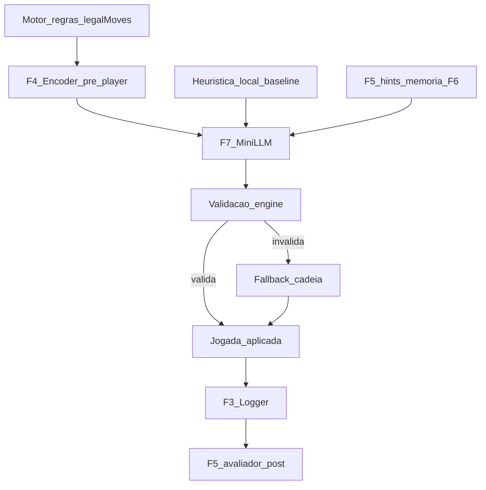
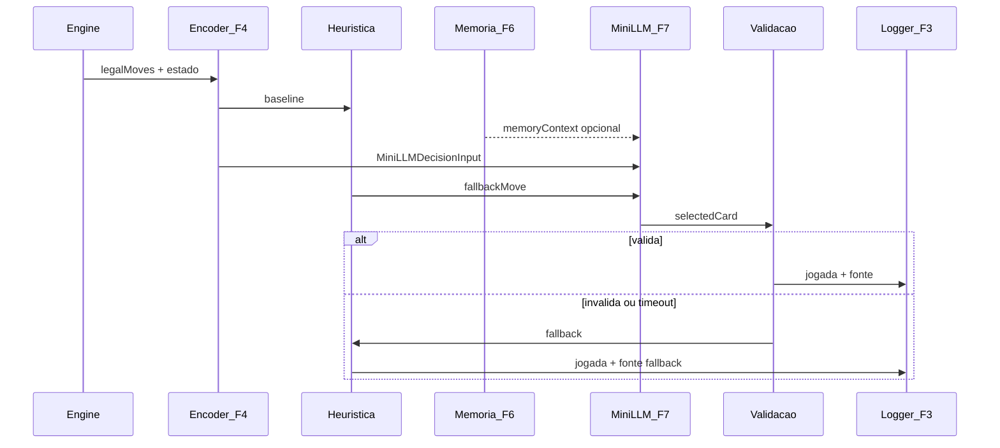

# Fase 7 — Mini-LLM local / fallback (desenho)

Documento de saída da **Fase 7** do [ROADMAP_AI](../ROADMAP_AI.md).

**Base:** [PHASE0_INVENTORY.md](PHASE0_INVENTORY.md) · [FASE_1_METRICAS.md](../specs/FASE_1_METRICAS.md) · [FASE_2A_PRIORIDADES_METRICAS.md](../specs/FASE_2A_PRIORIDADES_METRICAS.md) · [FASE_2B_FIXTURES_METRICAS.md](../specs/FASE_2B_FIXTURES_METRICAS.md) · [FASE_3_LOGGER_DESIGN.md](FASE_3_LOGGER_DESIGN.md) · [FASE_4_ENCODER_DESIGN.md](FASE_4_ENCODER_DESIGN.md) · [FASE_5_AVALIADOR_DESIGN.md](FASE_5_AVALIADOR_DESIGN.md) · [FASE_6_MEMORIA_APRENDIZAGEM_DESIGN.md](FASE_6_MEMORIA_APRENDIZAGEM_DESIGN.md)  
**Data:** 2026-05-31  
**Scope:** desenho documental — **sem implementação**, **sem código**, **sem APIs externas**, **sem escolha de provider** (Ollama, WebLLM, etc.).

---

## Frase-guia

| Papel | Metáfora | Responsabilidade |
|-------|----------|------------------|
| **Logger (Fase 3)** | Gravador | Regista eventos e **fonte** da decisão |
| **Encoder (Fase 4)** | Tradutor | `EncodedDecisionState` pré-decisão (Player View) |
| **Avaliador (Fase 5)** | Juiz | Classifica good / medium / bad / unknown **pós-jogada** |
| **Memória (Fase 6)** | Histórico / padrões | Agregados e exemplos como **contexto** |
| **Mini-LLM (Fase 7)** | Conselheiro / decisor assistido | **Sugere** carta entre legais; motor valida |

**Regra central:** a mini-LLM **nunca** pode escolher carta ilegal.

---

# 1. Resumo

Sequência Card Intelligence:

```
Fase 2A — prioridades · Fase 2B — fixtures
    ↓
Fase 3 — logger (eventos brutos)
    ↓
Fase 4 — encoder (pre_decision para sugestão; post_decision para juiz)
    ↓
Fase 5 — avaliador (DecisionEvaluationResult)
    ↓
Fase 6 — memória / aprendizagem (MetricMemoryAggregate)
    ↓
Fase 7 — mini-LLM local / fallback          ← este documento
```

**Objectivo Fase 7:** desenhar uma camada de **decisão assistida** que recebe estado codificado honesto, cartas legais, métricas, regras, hints do avaliador e memória — e devolve **sugestão validada** com confiança, razão curta e fallback explícito.

**Escopo v0 (implementação futura):** apenas decisões de **carta / play** (`DecisionPhase: play`). Bids, pass, leilão King, festa e negociação ficam **fora do v0** — ver §4.2.

A mini-LLM **não substitui** o motor de regras nem o avaliador. É um **conselheiro** que opera **dentro** do conjunto `legalMoves`.



**Persistência v0 (futura):** provider local; sem dependência obrigatória de internet; sem configurar modelo nesta fase documental.

---

# 2. O que a mini-LLM NÃO faz

| Não faz | Porquê |
|---------|--------|
| Substituir motor de regras | `legalMoves` e `playCard` são autoridade final |
| Escolher carta ilegal | Regra central; resposta rejeitada → fallback |
| Ver informação escondida na Player View | Input default `viewType: player`; hidden omitido |
| Substituir avaliador | Juiz classifica **depois**; LLM não escreve `good`/`bad` no log bruto |
| Alterar scoring | Camada de decisão, não de pontuação |
| Reescrever regras | Catálogo F1 + contratos King permanecem |
| Aprender sozinha nesta fase | Aprendizagem = F6 + pipeline offline; LLM não treina in-game |
| Ser fonte única de decisão | Cadeia com heurística + fallback obrigatória |
| Depender obrigatoriamente de internet | Local primeiro (§7) |
| Chamar APIs externas por defeito | Provider-agnostic; externo só na cadeia fallback existente |
| Decidir bids / pass / leilão / festa (v0) | Escopo v0 = **play only** (§4.2) |

---

# 3. Cadeia de decisão proposta

Pipeline documental para **uma jogada AI** (modo Decision assist — §6):

| # | Passo | Responsável | Output |
|---|-------|-------------|--------|
| 1 | Motor calcula cartas legais | `Game` / adapter | `legalMoves[]` |
| 2 | Encoder gera Player View pré-decisão | F4 `encodeMode: pre_decision` | `EncodedDecisionState` |
| 3 | Heurística / AI local gera baseline | `*Strategy.ts`, `heuristics.py` | `fallbackMove` |
| 4 | Avaliador / métricas indicam riscos | F4 `metricContext`; F5 hints opcionais | `evaluatorHints` |
| 5 | Memória fornece padrões relevantes | F6 top-K agregados | `memoryContext` |
| 6 | Mini-LLM sugere jogada | F7 provider | `MiniLLMDecisionOutput` (raw) |
| 7 | Engine valida se carta é legal | `isValidCard` / ∈ `legalMoves` | `validByEngine` |
| 8 | Inválida / incerta / timeout | Cadeia fallback (§11) | carta heurística ou 1.ª legal |
| 9 | Logger regista decisão e fonte | F3 | evento + `decisionSource` (§3.1) |
| 10 | Avaliador classifica (offline) | F5 pós-decisão | `DecisionEvaluationResult` → F6 |

**Nota timing:** passos 4–5 podem ser **opcionais v0** (só `metricContext` do encoder). Passo 10 é **assíncrono** — não bloqueia jogada (alinhado F5 §13).

## 3.1 Fonte da decisão (`decisionSource` / `aiSource`)

Taxonomia documental para o logger (extensão futura de F3 `aiSource` P1):

```typescript
type DecisionSource =
  | 'human'        // jogador humano ou remoto
  | 'bot'          // slot bot local identificado (dificuldade conhecida)
  | 'ai_internal'  // heurística / strategy interna (*Strategy.ts)
  | 'ai_external'  // AI externa Sueca (requestAiPlay / heuristics.py)
  | 'mini_llm'     // sugestão mini-LLM F7 (após validação engine)
  | 'fallback';    // primeira carta legal (G03) ou cadeia de emergência
```

| Valor | Quando usar |
|-------|-------------|
| `human` | Jogada escolhida por pessoa |
| `bot` | Decisão do bot local sem distinguir heurística vs LLM (opcional agregador) |
| `ai_internal` | Heurística actual, baseline `fallbackMove` |
| `ai_external` | Resposta Sueca HTTP/Python |
| `mini_llm` | Carta veio da mini-LLM **e** passou validação engine (§11) |
| `fallback` | Timeout, resposta inválida, ou `playFirstLegal` |

**Regra:** se mini-LLM sugere mas engine rejeita → `decisionSource` efectivo = `ai_internal` ou `fallback`, **não** `mini_llm`.

**Mapeamento F3 (futuro):** F3 hoje propõe `internal` | `external` | `fallback` | `human` — evoluir para esta lista ou alias documentado na implementação.



---

# 4. Input documental: `MiniLLMDecisionInput`

Schema documental **v7.0.0** — notação TypeScript, não código.

```typescript
interface MiniLLMDecisionInput {
  schemaVersion: '7.0.0';
  requestId: string;

  // --- Jogo e actor ---
  variant: 'sueca' | 'spades' | 'hearts' | 'king';
  playerIndex: number;
  difficulty: 'easy' | 'medium' | 'hard' | null;
  playerType: 'human' | 'ai' | 'remote';

  // --- Estado codificado (F4) ---
  encodedState: EncodedDecisionState;  // encodeMode: pre_decision; chosenCard: null

  // --- Legality (autoridade engine) ---
  legalMoves: Card[];                  // redundante intencional — validação rápida

  // --- Contexto estratégico ---
  metricContext: MetricContextEntry[]; // F4 — applicable, não classificação
  evaluatorHints?: EvaluatorHint[];    // resumos F5 / riscos conhecidos
  memoryContext?: MemoryHint[];        // top-K F6
  rulesContext: RulesContext;          // objectivo + regras essenciais + contrato

  // --- Fallback ---
  fallbackMove: Card;                  // heurística local actual
  fallbackMoveIndex: number;           // índice em legalMoves

  // --- Limites ---
  timeoutMs: number;                   // ex.: 800–2000 ms mobile
  maxReasonLength: number;             // ex.: 120 chars

  // --- Perspectiva ---
  viewType: 'player';                  // obrigatório v0 para decisão honesta
  hiddenInformationPolicy: HiddenInfoPolicy;

  // --- Versões pipeline ---
  encoderVersion: '4.0.0';
  metricCatalogVersion: '1.1';
  memorySchemaVersion?: '6.0.0';
}

interface EvaluatorHint {
  metricId: string;
  riskLevel: 'low' | 'medium' | 'high';
  reasonShort: string;                 // ex.: "SP09 bags risk if bid met"
  source: 'heuristic' | 'prior_evaluation' | 'fixture';
}

interface MemoryHint {
  metricId: string;
  badRate?: number;
  trend?: 'improving' | 'worsening' | 'stable' | 'unknown';
  reasonShort: string;                 // ex.: "bot medium often fails Q♠"
  confidence: 'high' | 'medium' | 'low';
  subjectType: 'bot' | 'human' | 'global';
}

interface RulesContext {
  variant: string;
  objectiveShort: string;              // ex.: "Win tricks; avoid wasting trumps"
  contractSummary?: string;            // King: contrato activo
  mandatoryRules?: string[];           // ex.: K02 "must play K♥ if led hearts"
  phaseNotes?: string;                 // pass, bid, auction, festa
}
```

## 4.1 Pré-condições

| Campo | Regra |
|-------|-------|
| `encodedState.encodeMode` | **`pre_decision`** |
| `encodedState.chosenCard` | **`null`** |
| `encodedState.viewType` | **`player`** (v0 decisão) |
| `legalMoves` | Não vazio; senão LLM **não** é chamada |
| `fallbackMove` | ∈ `legalMoves` |
| `encodedState.phase` | **`play`** (v0 — ver §4.2) |

## 4.2 Escopo v0 — apenas play

A mini-LLM **v0** aplica-se **somente** a decisões de **carta / play** (`DecisionPhase: play`).

| Dentro do v0 | Fora do v0 (v1 / v2) |
|--------------|----------------------|
| Escolher carta na mão durante vaza | **Bids** (Spades SP01, etc.) |
| `legalMoves` do motor de play | **Pass cards** (Hearts H05) |
| Encoder `pre_decision` fase `play` | **Leilão King** (K06, K12) |
| Validação `playCard` / `isValidCard` | **Festa** King |
| | **Negociação** / contrato-select complexo |

**Fora do v0:** bids, pass cards, leilão King, festa, negociação — permanecem heurísticas actuais até v1/v2.

**Regra:** se `encodedState.phase !== 'play'`, mini-LLM **não** é invocada (modo disabled para essa fase).

---

# 5. Output documental: `MiniLLMDecisionOutput`

```typescript
interface MiniLLMDecisionOutput {
  schemaVersion: '7.0.0';
  requestId: string;

  selectedCard: Card | null;
  selectedCardIndex: number | null;    // índice em legalMoves; preferido para validação

  confidence: 'high' | 'medium' | 'low';
  reasonShort: string;
  consideredMetricIds: string[];
  rejectedAlternatives?: RejectedAlternative[];
  uncertaintyFlags?: string[];         // ex.: "partial_context", "equal_options"

  fallbackRecommended: boolean;        // LLM pede usar fallbackMove
  modelId: string | null;              // ex.: "local:placeholder" — v0 doc only
  latencyMs: number;

  /** Preenchido DEPOIS da validação local — não pelo modelo */
  validByEngine: boolean | null;

  /** Preenchido se validByEngine=false ou timeout — carta efectiva jogada */
  appliedCard?: Card;
  appliedSource?: DecisionSource;      // §3.1 — fonte efectiva após validação
}

interface RejectedAlternative {
  card: Card;
  reasonShort: string;                 // por que não escolheu
}
```

## 5.1 Notas de output

| Campo | Nota |
|-------|------|
| `validByEngine` | `null` na resposta raw do modelo; runtime seta `true`/`false` após §11 |
| `validByEngine = false` | **Ignorar** `selectedCard`; usar `fallbackMove` ou cadeia §11 |
| `fallbackRecommended = true` | Tratar como `confidence: low` — preferir heurística se melhor calibrada |
| `selectedCardIndex` | Validação primária por índice (evita alucinação de string carta) |

---

# 6. Modos de uso

| Modo | LLM decide jogada? | Uso | Rollout |
|------|-------------------|-----|---------|
| **Disabled / fallback** | Não | Heurísticas actuais; provider ausente | **1 — default** |
| **Advisory** | Não — só sugere e explica | UI coach, debug, humano decide | **2 — obrigatório antes de assist** |
| **Decision assist** | Sim — entre legais, **engine valida sempre** | Bots Hard / slot AI experimental | **3 — só após advisory estável** |
| **Training / evaluation** | Não — analisa passado | Logs, fixtures 2B, offline | Paralelo, não gameplay live |

## 6.1 Rollout obrigatório (implementação futura)

Ordem **fixa** — não saltar etapas:

```
1. disabled / fallback     ← estado inicial; cadeia PHASE0 intacta
        ↓
2. advisory mode           ← LLM sugere; heurística/humano decide
        ↓
3. decision assist mode    ← LLM escolhe entre legais + validação engine
```

**Regras de rollout:**

| Regra | Detalhe |
|-------|---------|
| Nunca saltar para decision assist sem advisory | Validar prompt, métricas, latência |
| **Nunca decision-only** | Proibido modo em que LLM decide **sem** validação engine (§11) |
| Decision assist exige fallback | Toda jogada tem path heurística + 1.ª legal |
| Fora de play (§4.2) | Sempre disabled — bids/pass/leilão/festa/negociação |

## 6.2 Advisory mode

- Output mostrado ao utilizador ou registado em debug.
- Jogada final = humano ou heurística existente.
- Útil para validar prompt e métricas sem risco de regressão gameplay.

## 6.3 Decision assist mode

- LLM escolhe entre `legalMoves` — **apenas** fase `play` (§4.2).
- **Obrigatório:** validação engine + fallback (§11) — **nunca** decision-only.
- Logger futuro: `decisionSource: 'mini_llm'` só se `validByEngine === true` (§3.1).

## 6.4 Training / evaluation mode

- Input: encode **post_decision** + `DecisionEvaluationResult`.
- LLM explica ou replica julgamento — **não** altera partida.
- Compara `selectedCard` (LLM replay) vs `chosenCard` (log) vs veredicto F5.

## 6.5 Disabled / fallback mode

- Provider ausente, flag off, ou timeout repetido.
- Cadeia PHASE0 inalterada: heurística → externa Sueca (se activa) → primeira legal.

---

# 7. Local primeiro — provider-agnostic

| Princípio | Decisão documental |
|-----------|-------------------|
| **Provider-agnostic** | Interface abstracta `MiniLLMProvider` — **sem escolher** Ollama, WebLLM, llama.cpp ou outro nesta fase |
| Fase 7 actual | **Apenas desenho/documentação** — nenhum provider instalado ou configurado |
| Prioridade runtime (futuro) | Local / on-device ou processo local — internet **não** obrigatória |
| Provider | Implementação futura plugável atrás da interface |
| Modelo | **Não** escolher nem instalar modelo neste documento |
| Falha modelo | → `ai_internal` (heurística) |
| Falha heurística | → `ai_external` Sueca quando aplicável ([PHASE0](PHASE0_INVENTORY.md) §2.1) |
| Falha total | → `fallback` primeira carta legal (G03) |
| Performance mobile | `timeoutMs` curto; modo disabled default |

**Nota:** exemplos como Ollama ou WebLLM são **hipotéticos** — a escolha concreta pertence ao plano de implementação **posterior** à Fase 7 documental.

---

# 8. Integração com AI existente

Os **bots actuais não são destruídos**. Card Intelligence é camada **acima** ([ROADMAP_AI](../ROADMAP_AI.md) regra arquitectural).

## 8.1 Cadeia desejada (Decision assist)

```
Card Intelligence orchestrator
    ↓ (se enabled + provider ok)
Mini-LLM local / provider
    ↓ (se invalid/timeout/disabled)
Heurísticas actuais (*Strategy.ts, heuristics.py)
    ↓ (Sueca only, se configured)
AI externa Sueca (requestAiPlay)
    ↓
Fallback primeira carta legal (G03)
```

## 8.2 Pontos de integração (futuro — PHASE0)

| Ficheiro | Hook |
|----------|------|
| `GameBoard.tsx` `playAICard` | Orquestrador antes de `tryExternal` / `chooseAICard` |
| `*PlayStrategy.ts` | Baseline `fallbackMove` |
| `aiClient.ts` | Mantém Sueca externa **abaixo** da mini-LLM ou paralela por flag |
| `features.ts` | Flags: `MINI_LLM_ENABLED`, `MINI_LLM_MODE`, `USE_LOCAL_AI_ONLY` |

## 8.3 Alternativa compatível

Se integração directa em `GameBoard` for arriscada, documentar **wrapper** `chooseAICardWithIntelligence(adapter, state)` que devolve índice legal — bots internos continuam exportando `chooseXCard` como hoje.

**Regra:** qualquer path novo **deve** passar pelo mesmo `playCard` / validação que o código actual.

---

# 9. Regras por jogo

A mini-LLM recebe regras via `rulesContext` + `metricContext` (F1 / F2A). **Contrato-first** no King.

## 9.1 Sueca

| Prioridade | Regra / métrica |
|------------|-----------------|
| Manilhas | Não abrir manilha antes do Ás do naipe (S16) |
| Cortes | Criar cortes com carta seca quando útil (S04) |
| Parceiro | Proteger parceiro; não destrunfar (S19, S25) |
| Valor | Ganhar barato quando desejável (S08) |
| Trunfos | Evitar desperdício (S12, S05) |
| Memória | `importantCardsSeen`, cartas jogadas visíveis |

## 9.2 Spades

| Prioridade | Regra / métrica |
|------------|-----------------|
| Bid | Conservador Medium; nil só Hard (SP03 P2) |
| Contrato | Bid / tricks / bags (SP01, SP02, SP09) |
| Parceiro | Proteger parceiro (SP06) |
| Bags | Evitar bags após bid cumprido (SP09, T06) |
| Espadas | Não cortar alto sem necessidade (SP08) |
| Adversário | Tentar quebrar bid adversária alta (SP14 v1) |

## 9.3 Hearts

| Prioridade | Regra / métrica |
|------------|-----------------|
| Pontos | Não ganhar pontos desnecessários (H01) |
| Q♠ | Perigo máximo — evitar ficar com Q♠ (H11) |
| Limpeza | Limpar perigo quando vaza sem pontos inevitável (H13) |
| Pass | Passar cartas perigosas correctamente (H05) |
| Moon | Detectar / bloquear shoot the moon (H09, H10 v1) |
| Void | Criar void quando útil (H12) |

## 9.4 King — contrato-first

Ordem de decisão documental:

1. **Contrato activo** (K00)
2. **Regra obrigatória** (K02, K03 — ex.: Rei de Copas, não puxar copas)
3. **Penalização activa**
4. **Risco futuro** (K01 — Damas/Homens)
5. **Carta concreta**

| Fase especial | Nota |
|---------------|------|
| Nulos sem trunfo | K12 — contexto play v0 |
| Duas últimas | K10 (v1) — play v0 |
| Festa / leilão / negociação | **Fora v0** (§4.2) — heurística pura; LLM v1/v2 |

---

# 10. Prompt template interno

Template documental — **inglês técnico simples** (implementação futura pode traduzir UI).

```text
SYSTEM:
You are a trick-taking card game specialist assistant.
You MUST choose ONLY from the legal move list provided.
You MUST NOT invent cards not in the player's hand or legal_moves.
You MUST NOT assume hidden opponent cards beyond what the encoded state shows (player view).
If uncertain, set confidence to "low" and fallbackRecommended to true.

GAME: {{variant}}
OBJECTIVE: {{rulesContext.objectiveShort}}
CONTRACT: {{rulesContext.contractSummary}}
MANDATORY RULES:
{{#each rulesContext.mandatoryRules}}- {{this}}
{{/each}}

ENCODED STATE (JSON, player view, pre-decision):
{{encodedStateJson}}

LEGAL MOVES (indexed):
{{#each legalMoves}}{{@index}}: {{this}}
{{/each}}

METRICS TO CONSIDER (applicable only, not verdicts):
{{#each metricContext}}{{#if applicable}}- {{metricId}}: {{reasonShort}}
{{/if}}{{/each}}

MEMORY HINTS (advisory, may be wrong):
{{#each memoryContext}}- {{metricId}}: {{reasonShort}} (badRate={{badRate}})
{{/each}}

BASELINE MOVE (heuristic fallback): index {{fallbackMoveIndex}} — {{fallbackMove}}

Respond with STRICT JSON only, no markdown:
{
  "selectedCardIndex": <number index into legal_moves>,
  "selectedCard": "<card string matching legal_moves[index]>",
  "confidence": "high" | "medium" | "low",
  "reasonShort": "<max {{maxReasonLength}} chars, technical>",
  "consideredMetricIds": ["S08", "..."],
  "fallbackRecommended": false
}

FORBIDDEN: any card index outside 0..{{legalMoves.length - 1}}.
```

## 10.1 Exemplo de resposta esperada

```json
{
  "selectedCardIndex": 2,
  "selectedCard": "7♣",
  "confidence": "medium",
  "reasonShort": "Cheapest winner; partner not winning trick; S08",
  "consideredMetricIds": ["S08", "S12"],
  "fallbackRecommended": false
}
```

---

# 11. Validação e fallback

Regras runtime (documentais — implementação futura):

| # | Regra | Acção |
|---|-------|-------|
| V1 | `selectedCardIndex` fora de `[0, legalMoves.length)` | Rejeitar → fallback |
| V2 | `selectedCard` ∉ `legalMoves` | Rejeitar → fallback |
| V3 | `selectedCard` ∉ mão (`encodedState.hand`) | Rejeitar → fallback |
| V4 | Resposta sem `selectedCard` / JSON inválido | Rejeitar → fallback |
| V5 | `confidence: low` **e** `fallbackRecommended: true` | Usar `fallbackMove` |
| V6 | `confidence: low` **e** heurística calibrada disponível | Preferir heurística (policy configurável) |
| V7 | Timeout (`latencyMs >= timeoutMs`) | Fallback imediato |
| V8 | Provider erro / indisponível | Modo disabled → cadeia §8.1 |
| V9 | Após rejeição | Heurística local |
| V10 | Heurística falha `playCard` | Primeira carta legal (G03) |

```typescript
// Pseudocódigo documental — não implementar nesta fase
function resolveMove(input: MiniLLMDecisionInput, raw: MiniLLMDecisionOutput): Card {
  const validated = validateLLMOutput(input, raw);
  if (validated.ok) return validated.card;
  if (input.fallbackMove) return input.fallbackMove;
  return input.legalMoves[0];
}
```

**Pós-validação:** setar `validByEngine: true|false`, `appliedCard`, `appliedSource` (`DecisionSource` §3.1).

**Regra absoluta:** não existe modo «LLM-only» — toda carta aplicada passa por validação engine ou cadeia fallback.

---

# 12. Relação com memória

A memória (F6) é **contexto**, não autoridade.

| Exemplo hint | Uso LLM |
|--------------|---------|
| «Este bot falha Q♠» (H11, badRate alto) | Preferir limpar Q♠ se legal |
| «Jogador costuma dar bags» (SP09) | Conservar após bid cumprido |
| «Métrica S16 badRate alta» | Evitar manilha precoce |

**Limites:**

- Memória **não** override de regra legal ou contrato King
- Memória **não** override de `mandatoryRules` em `rulesContext`
- Conflito memória vs objectivo do jogo → **regras + metricContext** ganham
- Agregados com `confidence: low` (F6) → peso reduzido no prompt

---

# 13. Relação com avaliador

| Papel | Quem |
|-------|------|
| Sugerir carta **antes** de jogar | Mini-LLM (pré-decisão) |
| Classificar carta **depois** de jogar | Avaliador F5 (pós-decisão) |
| Hints pré-jogada | Resumo de riscos P0 — **não** veredicto F5 completo |

O avaliador **pode**:

- Fornecer `evaluatorHints` derivados de métricas / fixtures
- Validar decisão **depois** (comparar LLM vs heurística vs humano)
- Medir melhoria/piora ao activar mini-LLM
- Alimentar memória F6 com `DecisionEvaluationResult`

O avaliador **não** deve ser substituído pela LLM:

- LLM **não** escreve `classification` no logger (F3 mantém `unknown` até pipeline offline)
- Ground truth heurístico para treino = F5 + fixtures 2B
- Métricas **P3** (S23, H15, K06) — contexto explicativo LLM, não auto-veredicto ([FASE_2A](../specs/FASE_2A_PRIORIDADES_METRICAS.md))

---

# 14. Segurança / robustez

| # | Risco | Impacto | Mitigação v0 |
|---|-------|---------|--------------|
| R1 | Alucinação de cartas | Jogada ilegal | Validação índice + ∈ legalMoves + ∈ hand |
| R2 | Informação escondida no prompt | Decisão «batota» | Player View only; `hiddenInformationPolicy` |
| R3 | Resposta lenta | Lag UI / timeout | `timeoutMs`; disabled default; async advisory |
| R4 | Inconsistência entre jogos | Prompt errado | `rulesContext` + `variantEncoding` por jogo |
| R5 | LLM sobrepõe regras | Ilegal ou contrato violado | Engine gate; King contrato-first |
| R6 | Modelo local fraco | Jogadas más | Fallback heurística; modo advisory primeiro |
| R7 | Decisões bonitas mas erradas | Regressão vs Medium | A/B offline F5; não activar Hard sem métricas |
| R8 | Explicações plausíveis falsas | Confiança utilizador | `reasonShort` não mostrada como verdade absoluta |
| R9 | Regressão performance mobile | Battery / RAM | Provider opcional; timeout curto |
| R10 | Memória enviesada guia mal | Repete erro histórico | confidence F6; regras > memória (§12) |
| R11 | Dependência internet | Offline quebrado | Local primeiro (§7) |

---

# 15. Regra obrigatória para implementação futura

**Antes de qualquer implementação de código desta fase:**

1. Criar **primeiro** uma prompt/plano de implementação dedicado.
2. Essa prompt **deve** listar:
   - **Escopo** (modo advisory vs decision assist; jogos P0)
   - **Ficheiros a alterar** (`GameBoard`, strategies, features)
   - **Novos ficheiros** (`cardIntelligence/miniLlm/*`, provider interface)
   - **Riscos** (§14)
   - **Testes** (legalMoves only; timeout; fallback chain; fixtures 2B replay)
   - **Critérios de sucesso** (zero illegal plays; fallback 100% cobertura)
3. **Só depois** implementar com base nessa prompt.
4. No fim, entregar **relatório final de implementação**.

**Não saltar directamente para código.**

---

# 16. Resultado esperado

No fim desta fase documental fica claro:

| Pergunta | Resposta |
|----------|----------|
| Onde entra a mini-LLM? | Orquestrador acima de heurísticas; §3, §8 |
| O que recebe? | `MiniLLMDecisionInput` — Player View, legais, métricas, regras, memória, fallback |
| O que devolve? | `MiniLLMDecisionOutput` — carta, confiança, razão, métricas consideradas |
| Como é validada? | §11 — índice, ∈ legalMoves, ∈ mão, `validByEngine`; nunca decision-only |
| Escopo v0? | Só play; bids/pass/leilão/festa/negociação = v1/v2 (§4.2) |
| Rollout? | disabled → advisory → decision assist (§6.1) |
| Como faz fallback? | Heurística → externa Sueca → primeira legal |
| Convive com bots actuais? | Sim — baseline e cadeia PHASE0 preservados |
| Prepara aprendizagem? | Logger + F5 pós + F6 agregados; training mode offline |

---

# Dúvidas documentadas — resolvidas (v1.1)

| # | Tema | Decisão fechada |
|---|------|-----------------|
| 1 | `decisionSource` / `aiSource` | Taxonomia §3.1: human, bot, ai_internal, ai_external, mini_llm, fallback |
| 2 | Rollout | Obrigatório §6.1: disabled → advisory → decision assist; nunca decision-only |
| 3 | Escopo v0 | Só play §4.2; bids/pass/leilão/festa/negociação = v1/v2 |
| 4 | Provider | Provider-agnostic §7 — sem escolha Ollama/WebLLM nesta fase |
| 5 | Evaluator hints pré-jogada | v0 opcional — só `metricContext` encoder |
| 6 | `confidence: low` vs heurística | Policy configurável; default preferir heurística calibrada |

---

## Referências

- [ROADMAP_AI.md](../ROADMAP_AI.md) — regra arquitectural Card Intelligence acima dos bots
- [PHASE0_INVENTORY.md](PHASE0_INVENTORY.md) — cadeia fallback actual
- [FASE_4_ENCODER_DESIGN.md](FASE_4_ENCODER_DESIGN.md) — `pre_decision`, Player View
- [FASE_5_AVALIADOR_DESIGN.md](FASE_5_AVALIADOR_DESIGN.md) — juiz pós-decisão only
- [FASE_6_MEMORIA_APRENDIZAGEM_DESIGN.md](FASE_6_MEMORIA_APRENDIZAGEM_DESIGN.md) — memória como contexto
- [FASE_2A_PRIORIDADES_METRICAS.md](../specs/FASE_2A_PRIORIDADES_METRICAS.md) — P0/P3 para LLM
- [FASE_3_LOGGER_DESIGN.md](FASE_3_LOGGER_DESIGN.md) — `aiSource` P1

---

## Histórico

| Versão | Data | Nota |
|--------|------|------|
| 1.0 | 2026-05-31 | Desenho inicial Fase 7 — schema 7.0.0, pipeline, prompt, fallback |
| 1.1 | 2026-05-31 | decisionSource; rollout obrigatório; escopo v0 play-only; provider-agnostic |
