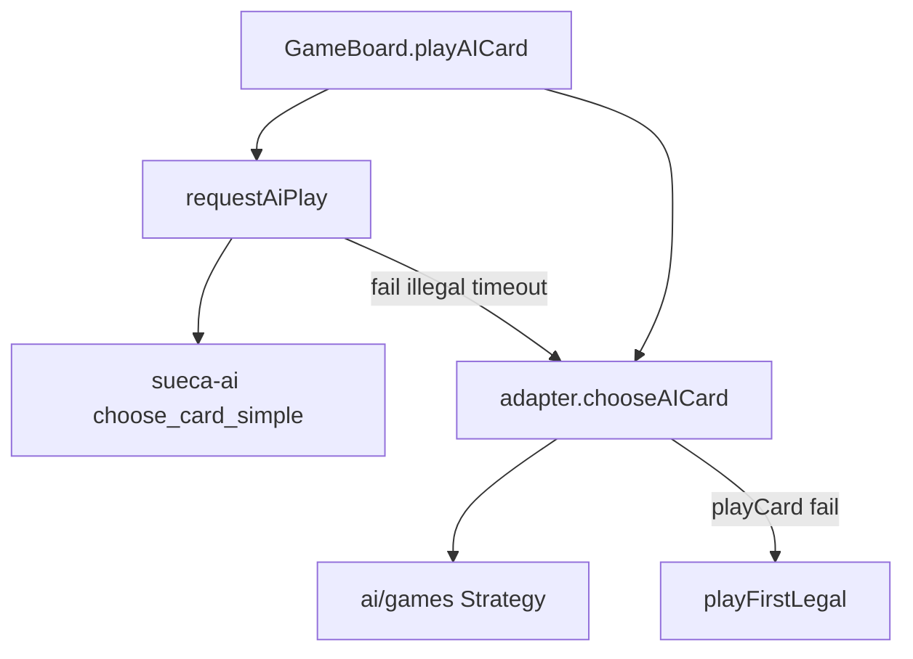

# Fase 0 — Inventário da inteligência existente

Documento de saída da **Fase 0** do [ROADMAP_AI](../ROADMAP_AI.md).

Objectivo: identificar tudo o que já existe no projecto relacionado com decisão inteligente, com foco especial na **Sueca Hard AI**, e produzir uma **lista explícita de métricas/heurísticas implícitas** já codificadas.

**Data:** 2026-05-31  
**Scope:** inventário documental apenas — nenhuma alteração de código.

---

## 1. Resumo executivo

O Suecão já possui uma arquitectura de decisão AI em **três camadas**:

1. **AI externa** (serviço Python `sueca-ai`) — activa só em Sueca + dificuldade hard.
2. **Heurísticas locais** por jogo (`frontend/src/ai/games/*`) — delegadas via `GameAdapter.chooseAICard`.
3. **Fallback** — primeira carta legal (`playFirstLegal`).

A inteligência estratégica mais rica concentra-se na **Sueca** (tracking de cartas, sinais de parceiro, probabilidade de vitória). Spades, Hearts e King têm heurísticas funcionais mas mais simples, sem tracking global de cartas jogadas.

**Conclusão central:** existem dezenas de regras estratégicas **implícitas no código**, mas **nenhuma métrica formalizada** como objecto avaliável. Tudo está em `if/else`, scores ad hoc e funções helper — não num catálogo reutilizável.

---

## 2. Mapa de ficheiros por área

### 2.1 Orquestração e cadeia de fallback

| Ficheiro | Funções / classes | Jogo | Genérico? | Reaproveitável Fase 1+ |
|----------|-------------------|------|-----------|------------------------|
| [`frontend/src/components/GameBoard.tsx`](../../frontend/src/components/GameBoard.tsx) | `playAICard`, `tryExternal`, `chooseAndPlay` | Todos | Parcial | **Sim** — hook futuro Card Intelligence |
| [`frontend/src/config/features.ts`](../../frontend/src/config/features.ts) | `USE_LOCAL_AI_ONLY` | Global | Sim | Sim |

**Fluxo actual:**

### 2.2 AI externa (Sueca-only)

| Ficheiro | Funções | Jogo | Genérico? |
|----------|---------|------|-----------|
| [`frontend/src/services/aiClient.ts`](../../frontend/src/services/aiClient.ts) | `requestAiPlay`, `AiPlayPayload` | Sueca | Contrato reutilizável |
| [`sueca-ai/api/main.py`](../../sueca-ai/api/main.py) | `POST /play` | Sueca | Serviço dedicado |
| [`sueca-ai/api/schemas.py`](../../sueca-ai/api/schemas.py) | `PlayRequest`, `PlayResponse` | Sueca | Schema encoder v0 |
| [`sueca-ai/engine/heuristics.py`](../../sueca-ai/engine/heuristics.py) | `choose_card_simple`, `_aces_seen`, `_winning_card` | Sueca | Heurística paralela |
| [`sueca-ai/engine/movegen.py`](../../sueca-ai/engine/movegen.py) | `legal_moves` | Sueca | Legality simplificada |

### 2.3 Sueca — motor e estratégia interna

| Ficheiro | Funções | Jogo | Genérico? |
|----------|---------|------|-----------|
| [`frontend/src/models/Game.ts`](../../frontend/src/models/Game.ts) | `playCard`, `isValidCard`, `evaluateTrick`, `playedCards`, `chooseAICard` | Sueca | Motor de regras |
| [`frontend/src/models/games/SuecaGame.ts`](../../frontend/src/models/games/SuecaGame.ts) | `chooseAICard` → `chooseSuecaCard` | Sueca | Adapter |
| [`frontend/src/ai/games/sueca/SuecaStrategy.ts`](../../frontend/src/ai/games/sueca/SuecaStrategy.ts) | `chooseSuecaCard`, `calculateWinProbability`, partner signals | Sueca | **Núcleo inteligência** |

### 2.4 Core AI genérico

| Ficheiro | Funções | Jogos | Genérico? |
|----------|---------|-------|-----------|
| [`frontend/src/ai/core/LegalMoveFilter.ts`](../../frontend/src/ai/core/LegalMoveFilter.ts) | `getLegalIndices` | Todos | **Sim** |
| [`frontend/src/ai/core/FallbackMoveSelector.ts`](../../frontend/src/ai/core/FallbackMoveSelector.ts) | `playFirstLegal` | Todos | **Sim** |
| [`frontend/src/ai/core/DifficultyProfile.ts`](../../frontend/src/ai/core/DifficultyProfile.ts) | `getDifficultyProfile`, `shouldPlayRandom` | Hearts, Spades, King (+ flags Sueca hard) | Parcial |

### 2.5 Outras variantes

| Jogo | Play | Bid / Pass / Auction | Ficheiros |
|------|------|----------------------|-----------|
| Spades | `chooseSpadesCard` | `chooseSpadesBid`, `estimateHandBid` | `SpadesPlayStrategy.ts`, `SpadesBidEstimator.ts` |
| Hearts | `chooseHeartsCard` | `pickAIPassCards` | `HeartsPlayStrategy.ts`, `HeartsPassStrategy.ts` |
| King | `chooseKingPtCard`, `chooseKingSimplifiedCard` | `runOneAiFestaStep` | `KingPlayStrategy.ts`, `KingAuctionStrategy.ts` |

### 2.6 Estado, tracking e regras

| Ficheiro | Campos / papel | Tracking para AI? |
|----------|----------------|-------------------|
| [`frontend/src/types/game.ts`](../../frontend/src/types/game.ts) | `GameState`, `playedCards`, `partnerSignals`, `variantState` | Parcial |
| [`frontend/src/models/Game.ts`](../../frontend/src/models/Game.ts) | `playedCards.push` em `playCard` | **Sueca only** |
| [`docs/rules/sueca.md`](../rules/sueca.md) | Regras humanas | Referência Fase 1 |

### 2.7 Persistência (não é aprendizagem)

| Ficheiro | Papel | Útil para ML? |
|----------|-------|---------------|
| [`gameSessionStorage.ts`](../../frontend/src/services/gameSessionStorage.ts) | Snapshot continue game | Não — estado, não eventos |
| [`gameHistoryStorage.ts`](../../frontend/src/services/gameHistoryStorage.ts) | Pinned + finished summary | Não — texto, não jogadas |

---

## 3. Sueca Hard AI — análise profunda

### 3.1 Activação

| Caminho | Condição | Implementação |
|---------|----------|---------------|
| Externa | `variant === 'sueca'` AND `aiDifficulty === 'hard'` AND not `USE_LOCAL_AI_ONLY` | `GameBoard` → `requestAiPlay` |
| Interna | Sempre que externa falha ou não activa | `SuecaGame.chooseAICard` → `chooseSuecaCard` |
| Medium | Mesma função `chooseSuecaCard`, flags `DifficultyProfile` desligadas | TS local |
| Easy | Ramo separado em `chooseSuecaCard` | 70/30 random/low |

Validação pós-externa: carta deve existir na mão **e** passar `canPlayCard` — senão fallback local.

### 3.2 Interna (TypeScript) — `SuecaStrategy.ts`

#### Easy

- 70%: escolher entre as 3 cartas legais mais baixas (`CARD_HIERARCHY`).
- 30%: carta legal aleatória.

#### Medium + Hard — liderar (`currentTrick.length === 0`)

- Contar cartas por naipe na mão (`suitCounts`).
- Score por carta legal: `rankValue * 2 + suitCount`.
- Bónus +5 se naipe é trunfo e `suitCount > 3`.
- Hard: bónus +3 se `suitCount >= 4` e rank ≥ K.
- Escolher carta com maior score.

#### Hard — partner signals (só hard)

| Signal | Quem envia | Quem reage | Comportamento |
|--------|------------|------------|---------------|
| `need_trump` | Parceiro | AI ao liderar | Joga trunfo se tiver; responde `helping_trump` |
| `helping_trump` | AI | — | Confirma ajuda com trunfo |
| `leading_trumps` | AI | — | Ao liderar trunfos com mão longa (>3) |
| `need_help` | Parceiro | AI ao seguir parceiro | Joga carta ganhadora **mais alta** |

Buffer: máximo 5 sinais (`partnerSignals.shift()`).

#### Hard — tracking (`calculateWinProbability`)

- Usa `playedCards`, `currentTrick`, total 40 cartas, 10 por naipe, 10 trunfos.
- Estima P(vitória) por carta candidata.
- Threshold: `> 0.5` em `isCardLikelyToWin` (hard).
- Medium usa proxy mais fraco: `< 2` cartas superiores já jogadas no naipe/trunfo.

#### Medium + Hard — seguir

- **Parceiro a liderar:** se pode ganhar naipe → `need_help` ? carta alta : carta baixa; suporte se melhor carta < K.
- **Seguir naipe:** ganhar com **carta mais baixa** que vença; pool filtrado por `isCardLikelyToWin` se hard.
- **Sem naipe, trunfo no trick:** overtrump com trunfo **mais baixo** que vença.
- **Sem naipe, trick sem trunfo:** cortar com trunfo baixo (< K); se >3 trunfos na mão, dump trunfo baixo.
- **Off-suit:** descartar carta mais baixa.

### 3.3 Externa (Python) — `heuristics.py`

| Fase | Regra | `reason` devolvido |
|------|-------|-------------------|
| Liderar | Carta mais alta legal; preferir não-7 | `lead_highest_no7`, `lead_highest` |
| Seguir naipe | Ganhar com mais baixa que bata | `follow_suit_win_low` |
| Seguir naipe, não ganha | Evitar 7 se Ás do naipe não saiu (`_aces_seen`) | `follow_suit_low_avoid7`, `follow_suit_low` |
| Cortar (sem trunfo no trick) | Trunfo mais baixo; evitar 7 | `cut_with_low_trump_no7`, `cut_with_low_trump` |
| Overtrump | Trunfo mais baixo que vença; evitar 7 | `overtrump_low_no7`, `overtrump_low` |
| Dump trunfo | Trunfo mais baixo | `dump_trump_low_no7`, `dump_trump_low` |
| Off-suit | Carta mais baixa global | `discard_lowest` |

`_aces_seen`: percorre `history[][]`, `played`, `trick` — regista naipes cujo Ás já saiu.

### 3.4 Comparação interna vs externa

| Aspecto | Interna TS | Externa Python |
|---------|------------|----------------|
| Activação | medium + hard (local); easy separado | só hard via HTTP |
| Partner signals | sim (hard) | não |
| Win probability | `calculateWinProbability` (hard) | não |
| Protecção 7 vs Ás | implícita (ranking / lead score) | explícita `_aces_seen` |
| Estratégia de liderança | score naipe + comprimento | lead highest |
| Cortar trunfo | trunfo baixo, mão longa | trunfo baixo, evitar 7 |
| Explicação | nenhuma | `reason` string |
| `history[][]` | não usado | suportado; **front não envia** |
| Legality | motor completo `Game.ts` | `legal_moves`: follow suit only |
| Payload front | `hand`, `trick`, `trump`, `played` flat | idem recebido |

**Implicação:** em Sueca hard com AI externa activa, o jogador **não** usa a lógica TS hard (signals, win prob) — substitui-a quando HTTP OK. Fallback recupera TS hard.

---

## 4. Catálogo de métricas/heurísticas já existentes

Formato: **ID** | nome sugerido | descrição | localização | jogo | formalizada?

### 4.1 Sueca — dificuldade e aleatoriedade

| ID | Nome | Descrição | Onde | Formalizada? |
|----|------|-----------|------|--------------|
| S01 | `easy_play_low_cards` | 70% jogar entre 3 cartas legais mais baixas | `SuecaStrategy.ts` L132–137 | Sueca | Não |
| S02 | `easy_random_legal` | 30% carta legal aleatória | `SuecaStrategy.ts` L137 | Sueca | Não |
| S03 | `difficulty_randomness` | `shouldPlayRandom` / `randomnessFactor` (Hearts, Spades, King) | `DifficultyProfile.ts` | Outros | Não |

### 4.2 Sueca — liderança

| ID | Nome | Descrição | Onde | Formalizada? |
|----|------|-----------|------|--------------|
| S04 | `lead_strong_suit` | Score = rank×2 + comprimento naipe; escolher máximo | `SuecaStrategy.ts` L171–181 | Sueca | Não |
| S05 | `lead_trump_when_long` | Bónus +5 se trunfo e >3 cartas do naipe | `SuecaStrategy.ts` L178 | Sueca | Não |
| S06 | `lead_trump_king_bonus` | Hard: +3 se ≥4 trunfos e rank ≥ K | `SuecaStrategy.ts` L179 | Sueca hard | Não |
| S07 | `lead_highest_no7` | Liderar carta mais alta; preferir não-7 | `heuristics.py` L64–70 | Sueca ext. | Não |

### 4.3 Sueca — seguir e ganhar barato

| ID | Nome | Descrição | Onde | Formalizada? |
|----|------|-----------|------|--------------|
| S08 | `win_with_cheapest_winner` | Ganhar vaza com carta **mais baixa** que vença | `SuecaStrategy.ts` L236–241; `heuristics.py` L84–86 | Sueca | Não |
| S09 | `likely_winner_filter` | Só tentar ganhar se `calculateWinProbability > 0.5` (hard) | `SuecaStrategy.ts` L141–153, L237 | Sueca hard | Não |
| S10 | `weak_tracking_proxy` | Medium: <2 cartas superiores jogadas no naipe | `SuecaStrategy.ts` L145–152 | Sueca medium | Não |
| S11 | `follow_suit_dump_low` | Seguir naipe sem ganhar: carta mais baixa | `SuecaStrategy.ts` L243–245 | Sueca | Não |

### 4.4 Sueca — trunfos e descarte

| ID | Nome | Descrição | Onde | Formalizada? |
|----|------|-----------|------|--------------|
| S12 | `cut_with_low_trump` | Cortar com trunfo mais baixo quando trick sem trunfo | `SuecaStrategy.ts` L259–267; `heuristics.py` L95–103 | Sueca | Não |
| S13 | `overtrump_low` | Bater trunfo existente com trunfo mínimo vencedor | `SuecaStrategy.ts` L248–256; `heuristics.py` L105–112 | Sueca | Não |
| S14 | `dump_trump_from_long_hand` | >3 trunfos: descartar trunfo baixo | `SuecaStrategy.ts` L268–272 | Sueca | Não |
| S15 | `dump_lowest_off_suit` | Sem naipe/trunfo útil: carta mais baixa | `SuecaStrategy.ts` L275–278; `heuristics.py` L119–121 | Sueca | Não |
| S16 | `avoid_wasting_seven_before_ace` | Não gastar 7 se Ás do naipe não saiu | `heuristics.py` L87–91, `_aces_seen` | Sueca ext. | Não |

### 4.5 Sueca — parceiro e tracking

| ID | Nome | Descrição | Onde | Formalizada? |
|----|------|-----------|------|--------------|
| S17 | `partner_need_trump_response` | Parceiro pediu trunfo → jogar trunfo | `SuecaStrategy.ts` L160–168 | Sueca hard | Não |
| S18 | `partner_need_help_escalate` | `need_help` → carta ganhadora alta | `SuecaStrategy.ts` L214–218 | Sueca hard | Não |
| S19 | `partner_support_low` | Parceiro a liderar: jogar baixo se não `need_help` | `SuecaStrategy.ts` L220–222 | Sueca hard | Não |
| S20 | `partner_support_under_king` | Suporte se melhor carta < K | `SuecaStrategy.ts` L224–228 | Sueca hard | Não |
| S21 | `card_tracking_win_prob` | Contagem cartas restantes → P(vitória) | `calculateWinProbability` | Sueca hard | Não |
| S22 | `played_cards_accumulation` | `playedCards` actualizado em cada jogada | `Game.ts` playCard | Sueca | Não (dado, não métrica) |

### 4.6 Infra genérica

| ID | Nome | Descrição | Onde | Formalizada? |
|----|------|-----------|------|--------------|
| G01 | `legal_move_enforcement` | Movimentos legais via `getLegalIndices` / `canPlayCard` | `LegalMoveFilter.ts`, adapters | Todos | Não |
| G02 | `external_move_validation` | Rejeitar resposta HTTP ilegal | `GameBoard.tsx` ~517–521 | Sueca ext. | Não |
| G03 | `fallback_first_legal` | Último recurso: primeira carta que `playCard` aceita | `FallbackMoveSelector.ts` | Todos | Não |
| G04 | `uses_card_tracking_flag` | Hard activa tracking via profile | `DifficultyProfile.ts` | Sueca hard | Não |
| G05 | `uses_partner_signals_flag` | Hard activa sinais | `DifficultyProfile.ts` | Sueca hard | Não |

### 4.7 Spades (resumo)

| ID | Nome | Descrição | Onde |
|----|------|-----------|------|
| SP01 | `bid_from_high_cards` | Estimar tricks: A/K/Q♠, A/K outros | `SpadesBidEstimator.ts` |
| SP02 | `long_spade_bonus` | Hard: +1 trick se ≥4 espadas | `SpadesBidEstimator.ts` |
| SP03 | `nil_random` | Nil/blind nil probabilístico | `SpadesBidEstimator.ts` |
| SP04 | `avoid_leading_spades` | Liderar non-spade se possível | `SpadesPlayStrategy.ts` |
| SP05 | `need_tricks_aggression` | Se abaixo do bid: liderar/jogar mais alto | `SpadesPlayStrategy.ts` |
| SP06 | `partner_winning_play_low` | Parceiro a ganhar → jogar baixo | `SpadesPlayStrategy.ts` |
| SP07 | `win_cheapest_when_need_tricks` | Hard: vencer com winner mais barato | `SpadesPlayStrategy.ts` |
| SP08 | `cut_low_spade_when_need_tricks` | Hard: cortar com espadas baixa | `SpadesPlayStrategy.ts` |

### 4.8 Hearts (resumo)

| ID | Nome | Descrição | Onde |
|----|------|-----------|------|
| H01 | `penalty_score` | Q♠=20, copas=10 | `HeartsPlayStrategy.ts`, `HeartsPassStrategy.ts` |
| H02 | `dump_highest_penalty_when_following` | Seguir: descartar maior penalização legal | `HeartsPlayStrategy.ts` medium |
| H03 | `lead_lowest_penalty` | Liderar: menor penalização | medium |
| H04 | `avoid_leading_hearts` | Hard: não liderar copas se alternativa | `HeartsPlayStrategy.ts` hard |
| H05 | `pass_worst_three` | Pass medium/hard: 3 piores cartas | `HeartsPassStrategy.ts` |
| H06 | `pass_void_spades` | Hard: passar espadas para void (≤3, sem Q♠) | `HeartsPassStrategy.ts` |

### 4.9 King (resumo)

| ID | Nome | Descrição | Onde |
|----|------|-----------|------|
| K01 | `contract_aware_dump` | Descartar cartas penalizantes por contrato | `KingPlayStrategy.ts` ptNegativeDump |
| K02 | `must_play_king_hearts` | Obrigar K♥ quando regras exigem | `KingPlayStrategy.ts` |
| K03 | `positive_win_cheapest` | Modo positivo: ganhar com carta mais barata | chooseKingPtHard |
| K04 | `negative_avoid_hearts_lead` | Liderar fora de copas quando possível | mediumNegativeDump |
| K05 | `no_last_two_early_free` | Contrato no_last_two: tricks 0–7 mais livre | mediumNegativeDump |
| K06 | `auction_min_bid_or_pass` | Leilão: min bid ou pass (35% pass) | `KingAuctionStrategy.ts` |
| K07 | `festa_fallback_random` | Fallback festa: pesos 4x3x3, nulos, no_trump | `KingAuctionStrategy.ts` |

**Total Sueca catalogado:** 22 métricas/heurísticas (S01–S22) + 5 infra (G01–G05).

---

## 5. O que existe mas NÃO é métrica formal

| Artefacto | Papel actual | Gap |
|-----------|--------------|-----|
| `GameState.playedCards` | Lista flat de cartas jogadas na ronda | Só Sueca actualiza; não é métrica avaliável |
| `GameState.partnerSignals` | Buffer de sinais Sueca | Sem schema formal de métricas |
| `AiPlayPayload.history` | Trick history no schema | **Nunca enviado** pelo front |
| `PlayResponse.reason` | Explicação heurística Python | Não persistida; não ligada a avaliador |
| `gameSessionStorage` | Continue game (snapshot) | Não captura decisões |
| `gameHistoryStorage` | Summary texto pós-jogo | Sem replay de jogadas |
| `mpDebug` / logs Python | Debug runtime | Não estruturado para treino |
| `variantState` | Estado por jogo (untyped) | Dificulta encoder genérico |

---

## 6. Lacunas identificadas (input para Fase 1)

1. **Métricas só em código** — nenhum objecto `Metric` / `EvaluationResult` reutilizável.
2. **Duplicação Sueca TS vs Python** — mesmas ideias (win low, cut low) implementadas duas vezes; lead strategy diverge.
3. **Hard externo substitui hard interno** — signals e win prob ignorados quando HTTP OK.
4. **`history` não populado** — encoder e AI externa subutilizados.
5. **Tracking desigual** — `playedCards` só Sueca; Spades/Hearts/King sem histórico de ronda para AI.
6. **Sem `evaluateMove(state, cardIndex)`** — impossível comparar alternativas sistematicamente.
7. **Sem logger de decisões** — humanos e bots jogam sem registo estruturado.
8. **Legality Python simplificada** — risco de respostas filtradas pelo motor TS (mascara diferenças).

---

## 7. Onde termina regras vs começa AI

| Camada | Responsabilidade | Ficheiros |
|--------|------------------|-----------|
| **Motor de regras** | Legality, scoring, fases, mutação estado | `Game.ts`, `*Game.ts` adapters, `king/*` |
| **Filtro legal genérico** | Enumerar índices legais | `LegalMoveFilter.ts` |
| **Decisão AI** | Escolher índice entre legais | `*Strategy.ts`, `heuristics.py` |
| **Orquestração** | Quando chamar externo/local/fallback | `GameBoard.playAICard` |
| **Validação final** | `playCard` rejeita ilegal | Adapters / engines |

Fronteira limpa: AI **nunca** deve implementar regras duplicadas excepto heurísticas Python (legality simplificada — ponto frágil).

---

## 8. Ficheiros para análise detalhada na Fase 1

### Prioridade P0 (Sueca — referência)

- [`frontend/src/ai/games/sueca/SuecaStrategy.ts`](../../frontend/src/ai/games/sueca/SuecaStrategy.ts)
- [`sueca-ai/engine/heuristics.py`](../../sueca-ai/engine/heuristics.py)
- [`frontend/src/ai/core/DifficultyProfile.ts`](../../frontend/src/ai/core/DifficultyProfile.ts)
- [`frontend/src/components/GameBoard.tsx`](../../frontend/src/components/GameBoard.tsx) (`playAICard`)
- [`frontend/src/services/aiClient.ts`](../../frontend/src/services/aiClient.ts)
- [`docs/rules/sueca.md`](../rules/sueca.md)

### Prioridade P1 (outras variantes + contrato)

- [`frontend/src/ai/games/spades/SpadesPlayStrategy.ts`](../../frontend/src/ai/games/spades/SpadesPlayStrategy.ts)
- [`frontend/src/ai/games/spades/SpadesBidEstimator.ts`](../../frontend/src/ai/games/spades/SpadesBidEstimator.ts)
- [`frontend/src/ai/games/hearts/HeartsPlayStrategy.ts`](../../frontend/src/ai/games/hearts/HeartsPlayStrategy.ts)
- [`frontend/src/ai/games/hearts/HeartsPassStrategy.ts`](../../frontend/src/ai/games/hearts/HeartsPassStrategy.ts)
- [`frontend/src/ai/games/king/KingPlayStrategy.ts`](../../frontend/src/ai/games/king/KingPlayStrategy.ts)
- [`frontend/src/ai/games/king/KingAuctionStrategy.ts`](../../frontend/src/ai/games/king/KingAuctionStrategy.ts)
- [`frontend/src/models/games/GameAdapter.ts`](../../frontend/src/models/games/GameAdapter.ts)

---

## 9. Ligação à Fase 1

A **Fase 1** transforma este inventário num **catálogo de métricas por jogo** com:

- objectivos estratégicos explícitos;
- métricas de boa/má jogada nomeadas e documentadas;
- contexto necessário para avaliar cada decisão;
- exemplos concretos good/bad play.

Este documento (Fase 0) fornece a matéria-prima: IDs S01–S22, comparação Sueca interna/externa, e mapa de ficheiros — sem alterar código.

---

## Referências

- [ROADMAP_AI.md](../ROADMAP_AI.md) — fases 0–7
- [AI_INTEGRATION_PLAN.md](../_archives/parallel-ai/AI_INTEGRATION_PLAN.md) — plano histórico ML/integração
- [PRODUCT_BACKLOG.md](../plan/PRODUCT_BACKLOG.md) — Monte Carlo / personalidade (futuro, não implementado)
