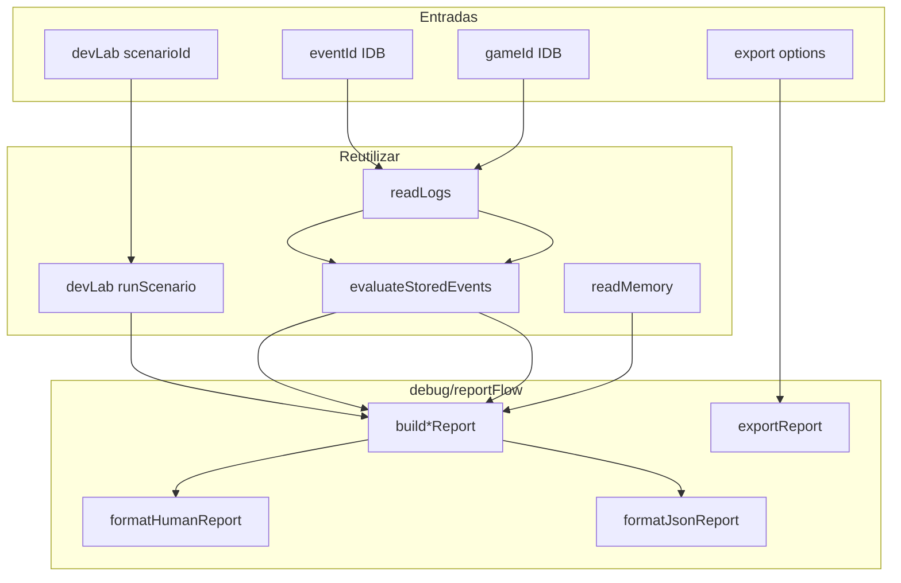

# IMPLEMENTATION_10_DEBUG_REPORT_FLOW — Prompt de implementação

**ID:** `IMPLEMENTATION_10_DEBUG_REPORT_FLOW`  
**Plano pai:** [IMPLEMENTATION_PLAN_AI.md](../IMPLEMENTATION_PLAN_AI.md) — bloco pós-Impl 9 (Debug Report Flow; opção **D** do [CARD_INTELLIGENCE_STATUS_REPORT.md](../CARD_INTELLIGENCE_STATUS_REPORT.md) §8)  
**Design base:** [FASE_5_AVALIADOR_DESIGN.md](../FASE_5_AVALIADOR_DESIGN.md) · [FASE_6_MEMORIA_APRENDIZAGEM_DESIGN.md](../FASE_6_MEMORIA_APRENDIZAGEM_DESIGN.md) · [FASE_3_LOGGER_DESIGN.md](../FASE_3_LOGGER_DESIGN.md) §8  
**Status report:** [CARD_INTELLIGENCE_STATUS_REPORT.md](../CARD_INTELLIGENCE_STATUS_REPORT.md) §9 recomendação pós-Impl 9  
**Pré-requisitos:** relatórios Impl 1–9 — especialmente [IMPLEMENTATION_7_DEBUG_EXPORT_REPORT.md](../implementation-reports/IMPLEMENTATION_7_DEBUG_EXPORT_REPORT.md), [IMPLEMENTATION_8_MINI_LLM_ADVISORY_REPORT.md](../implementation-reports/IMPLEMENTATION_8_MINI_LLM_ADVISORY_REPORT.md), [IMPLEMENTATION_9_DEV_SEEDED_GAME_LAB_REPORT.md](../implementation-reports/IMPLEMENTATION_9_DEV_SEEDED_GAME_LAB_REPORT.md) (**H9 OK** recomendado antes de implementar)  
**Código base:** [`frontend/src/cardIntelligence/debug/`](../../frontend/src/cardIntelligence/debug/) · [`devLab/`](../../frontend/src/cardIntelligence/devLab/) · [`evaluator/`](../../frontend/src/cardIntelligence/evaluator/) · [`memory/`](../../frontend/src/cardIntelligence/memory/)  
**Data:** 2026-06-06  
**Scope desta prompt:** guia **executável** para Debug Report Flow v0 — **não implementar neste passo documental**.

**Tipo de documento:** prompt de **implementação** (Agent mode) — não é relatório de estado, não é CI, não é o relatório pós-código (**§15**).

**Mapa de secções (referências internas — usar estes números):**

| § | Conteúdo |
|---|----------|
| §1–§2 | Objectivo, escopo |
| §3–§4 | Código existente, tipos |
| §5–§8 | Flags, warnings, builders, debugConsole |
| §9–§11 | Exemplos, ficheiros, testes |
| §12–§14 | Critérios, riscos, decisões D1–D11 |
| **§15** | **Relatório final pós-código** (markdown Impl 10) |
| **§16** | **Checkpoint H10** (humano) |
| **§17** | Dúvidas Q1–Q8 |
| **§18** | Metadados |

**Posicionamento no roadmap:** sequência acordada pós-Impl 9: **Impl 10 Debug Report Flow** → Evaluator v1 (Tier B) → provider LLM real → bots. Não inverter.

**Princípio:** Implementation 10 fecha o gap **«leitura humana»** — a cadeia log → encode → evaluate → memory **já funciona**, mas ainda obriga a inspeccionar objectos crus na consola. Metáfora:

| Camada | Metáfora | Impl |
|--------|----------|------|
| Logger | Gravador | 1 + 2 |
| Encoder | Tradutor | 3 |
| Fixtures 2B | Golden cases | 4 |
| Avaliador | Juiz | 5 |
| Memória | Histórico/padrões | 6 |
| Debug/Export | Laboratório / arquivo | 7 |
| Mini-LLM | Conselheiro (mock) | 8 |
| Dev Seeded Game Lab | Bancada controlada | 9 |
| **Debug Report Flow** | **Relatório legível / dossiê offline** | **10 (esta prompt)** |

**Checkpoint humano H10:** validação **pós**-Impl 10 — reports legíveis para cenário lab + partida real; prod sem helpers novos; jogo inalterado.

**Gates:**

| Fase | Bloqueio |
|------|----------|
| Redigir/ler esta prompt | **Nenhum** |
| Implementar código Impl 10 | **H9 OK recomendado** |
| Checkpoint H10 humano | **Depois** de CI verde + relatório Impl 10 |

**Supersede opção D (status report):** opção D descreve «ligar evaluator/memory a debug reports» — **esta prompt concretiza** o módulo e API; prevalece sobre bullet genérico.

**Supersede Impl 7 (`postGameReport.ts`):** **não** apagar v0 — **refactor delegação**: `buildPostGameReport` passa a chamar `buildGameReport` / summary interno do report flow, ou re-export fino. Compatibilidade `__ciPostGameReport` mantida como alias.

**Supersede Impl 9 (`devLab/scenarioReport.ts`):** cenário lab **reutiliza** pipeline report flow — evitar dois formatos divergentes. `buildScenarioReport` devLab pode delegar para `debug/reportFlow/buildScenarioReport.ts` ou vice-versa (decisão D5).

**Supersede helpers duplicados:** `__ciScenarioReport` (devLab) e futuro fluxo unificado — **uma** implementação canónica; helpers expostos no namespace `__ci` / `debugConsole` (D6).

**Supersede warnings v0:** `trick_end missing` **não** é erro de report — classificar como `informational` quando evaluation succeed (lição H9).

**Estado repo ao redigir esta prompt:**

| Artefacto | Estado |
|-----------|--------|
| `debug/postGameReport.ts` | **Existe** — resumo curto (contagens métricas) |
| `debug/evaluateStoredEvents.ts` | **Existe** — pairing, ciEncode, evaluate offline |
| `debug/exportJsonl.ts` | **Existe** — envelope 7.0.0 |
| `debug/debugConsole.ts` | **Existe** — `__ciEvaluateEvent`, `__ciPostGameReport`, … |
| `devLab/runScenario.ts` | **Existe** — `reportText` próprio |
| `devLab/devLabConsole.ts` | **Existe** — `__ciScenarioReport` |
| `debug/reportFlow/` | **Não existe** — criar §11 |

---

## Glossário de estados

| Termo | Definição |
|-------|-----------|
| **OK** | CI verde + H humano fechado no relatório |
| **Parcial** | CI verde mas smoke/H pendente — **não** CI vermelho |
| **Report source** | `live_log` \| `dev_lab_scenario` \| `fixture` \| `seeded_game` \| `synthetic_test` |
| **Warning severity** | `informational` \| `degraded` \| `blocking` — ver §6 |
| **Hot path** | GameBoard → playWithLogging → IDB logger |

**Regra anti-alucinação (relatório Impl 10):** afirmações com citação a relatório Impl 7–9, FASE, teste ou grep desta prompt.

---

## Ficheiros-fonte obrigatórios (ler antes de implementar)

| Ficheiro | O que verificar |
|----------|-----------------|
| [`debug/postGameReport.ts`](../../frontend/src/cardIntelligence/debug/postGameReport.ts) | API actual; o que falta vs Game Report §4 |
| [`debug/evaluateStoredEvents.ts`](../../frontend/src/cardIntelligence/debug/evaluateStoredEvents.ts) | `evaluateStoredPlay`, warnings trick_end |
| [`debug/readLogs.ts`](../../frontend/src/cardIntelligence/debug/readLogs.ts) | load, filter, split |
| [`debug/readMemory.ts`](../../frontend/src/cardIntelligence/debug/readMemory.ts) | aggregates, ingest offline |
| [`debug/debugConsole.ts`](../../frontend/src/cardIntelligence/debug/debugConsole.ts) | helpers existentes; ponto de install |
| [`debug/exportJsonl.ts`](../../frontend/src/cardIntelligence/debug/exportJsonl.ts) | envelope — reutilizar em Export Report |
| [`devLab/runScenario.ts`](../../frontend/src/cardIntelligence/devLab/runScenario.ts) | pipeline preset; `reportText` |
| [`devLab/scenarioReport.ts`](../../frontend/src/cardIntelligence/devLab/scenarioReport.ts) | formato texto H9 |
| [`config/features.ts`](../../frontend/src/config/features.ts) | DEBUG, DEV_LAB, LLM_ADVISORY |
| Relatório [Impl 9](../implementation-reports/IMPLEMENTATION_9_DEV_SEEDED_GAME_LAB_REPORT.md) | H9: trick_end warnings aceites |

---

## Instruções para o agente implementador

1. Confirmar **H9 OK recomendado**; ler prompt completa + relatórios Impl 7–9.
2. Implementar **apenas** §2.1; recusar §2.2.
3. Código novo principal em `frontend/src/cardIntelligence/debug/reportFlow/` + testes.
4. Alteração mínima: `postGameReport.ts`, `debugConsole.ts`, opcional `devLab/scenarioReport.ts` (delegação), `debug/index.ts`, `cardIntelligence/index.ts`.
5. **Zero** gameplay, bots, `GameBoard`, `playWithLogging`, motores, evaluator core, memory live ingest.
6. **Não** correr reports automaticamente em partida — só helpers dev.
7. **Não** chamar LLM real; mock advisory opcional P1 via flag LLM — **fora v0**.
8. Player View **por defeito**; Engine View opt-in `{ engineView: true }`.
9. **Não** mutar eventos originais nem `DecisionEvaluationResult`.
10. Memory ingest só via opt explícita `{ includeMemory: true }` ou helper dedicado — **nunca** automático em build report.
11. Warnings `trick_end missing` → `informational` se eval OK (H9).
12. Separar **resumo humano** (`text`) de **payload estruturado** (`json`) — não despejar objectos gigantes no texto.
13. Manter aliases: `__ciPostGameReport` → `__ciGameReport`; **`__ciScenarioReport` canónico em `debugConsole.ts`** (D6).
14. Ordem sugerida: types → warningTaxonomy → formatHumanReport → buildEventReport → buildGameReport → buildScenarioReport → exportReport → debugConsole → devLab delegação → testes → relatório **§15**.
15. CI: §11.2 + grep hot path §5.2.
16. Relatório final **§15**; validação humana **§16** (H10).
17. Não pedir a Francisco para ler ficheiros durante H10 — script **§16.2** autocontido.
18. **Um único** `formatHumanReport.ts` — `devLab/scenarioReport.ts` só delega (D5); teste T11 obrigatório.

---

# 1. Objectivo

## 1.1 Problema

Card Intelligence tem pipeline completo offline, mas validação humana ainda é **console-heavy**:

- `__ciEvaluateEvent` devolve objectos aninhados (`play`, `encoded`, `evaluation`).
- `__ciPostGameReport` resume contagens — **não** lista jogadas relevantes, warnings agregados, nem contexto legível.
- `devLab` gera `reportText` útil mas **isolado** do fluxo de eventos/partidas reais IDB.
- Export JSONL (Impl 7) é analítico bruto — **não** substitui relatório humano.

## 1.2 Solução

**Debug Report Flow** — camada dev-only que produz **relatórios legíveis** (texto + JSON estruturado) para quatro entradas:



**Regra central:** reports **nunca** no hot path; prod default **sem** helpers novos além dos já gated por DEBUG.

---

# 2. Escopo exacto

## 2.1 Dentro do escopo v0

| Área | Detalhe |
|------|---------|
| **Módulo** | `frontend/src/cardIntelligence/debug/reportFlow/` |
| **Scenario Report** | `LAB_*` via devLab + formato unificado |
| **Event Report** | `eventId` real ou sintético (testes) |
| **Game Report** | `gameId` — plays + trick_ends + agregados + top bad/medium |
| **Export Report** | texto / JSON / JSONL opcional (reutilizar envelope 7.0.0 quando aplicável) |
| **Schema report** | metadata `10.0.0` (tipos report flow — **não** alterar log 3.0.0) |
| **Helpers** | `__ciEventReport`, `__ciGameReport`, `__ciExportReport`; unificar `__ciScenarioReport` |
| **Flags** | `CARD_INTELLIGENCE_DEBUG`; cenários lab requerem `CARD_INTELLIGENCE_DEV_LAB` |
| **Testes** | §12 |
| **Relatório + H10** | §15–§16 |

### Fluxo 1 — Scenario Report

Entrada: `scenarioId` (ex. `LAB_K02`, `LAB_H13`).

Saída mínima (texto):

| Secção | Conteúdo |
|--------|----------|
| Cabeçalho | scenarioId, variant, primaryMetricId, humanNote, `source: dev_lab_scenario` |
| Jogada | chosenCard, legalMoves (resumido), fixtureId |
| Encode resumido | contractId, 2–4 campos P0 relevantes (variantEncoding) |
| Evaluation | classification, reasonShort, metricResults activas (não N/A) |
| Memory | só se `{ includeMemory: true }` — contagem ingested |
| Warnings | lista com severity; trick_end missing = informational |
| Footer | schemaVersion 10.0.0, generatedAt, offline: true |

Implementação: chamar [`runScenario`](../../frontend/src/cardIntelligence/devLab/runScenario.ts) **ou** extrair builder partilhado — **não** duplicar evaluate pipeline.

### Fluxo 2 — Event Report

Entrada: `eventId` (IDB ou test synthetic).

Pipeline:

1. `loadAllLogEvents` → find play
2. `evaluateStoredPlayByEventId` (já existe)
3. `buildEventReport(evalResult + metadata)`

Saída: evento base (ids, variant, trickIndex), encode resumido, evaluation, trickEnd associado ou null + warning informational, métricas activadas, reasonShort.

### Fluxo 3 — Game Report

Entrada: `gameId`.

Pipeline:

1. Filter events by gameId
2. `splitLogEvents` → counts plays / trick_ends
3. `evaluateStoredGame(gameId)` batch
4. Agregar classificações (good/medium/bad/partial/unknown)
5. Top métricas bad/medium/partial (top 5)
6. Lista curta jogadas relevantes (bad/partial ou métrica P0 falhada) — max 10 linhas
7. Memory summary opcional `{ includeMemory: true }` — `listMemoryAggregates` filtrado

Evolui [`buildPostGameReport`](../../frontend/src/cardIntelligence/debug/postGameReport.ts) — **substituir corpo** por delegação ao report flow mantendo assinatura.

### Fluxo 4 — Export Report

Entrada: `ReportExportOptions`:

```typescript
interface ReportExportOptions {
  kind: 'scenario' | 'event' | 'game';
  scenarioId?: string;
  eventId?: string;
  gameId?: string;
  format: 'text' | 'json' | 'jsonl';
  includeRawPayload?: boolean; // default false
  includeMemory?: boolean;
  engineView?: boolean;
}
```

- `text` → string legível (default H10)
- `json` → objecto `DebugReportDocument` (schema 10.0.0)
- `jsonl` → **D7 fechado v0:** uma linha envelope **7.0.0** com `exportRecordType: 'debug_report'` e `payload` = `DebugReportDocument` completo. **Não** reutilizar `buildJsonlLines` para export de report v0 — isso continua a ser `__ciExportLogsJsonl` (dump analítico bruto). P1: `includeRawPayload: true` pode anexar linhas `buildJsonlLines` **depois** da linha `debug_report`.

## 2.2 Fora do escopo (recusar)

| Item | Notas |
|------|-------|
| UI visual / gráficos / dashboard | v1+ |
| Replay visual | v1+ |
| Provider LLM real | Impl posterior |
| Decision assist / GameBoard hook | Proibido |
| Alterar bots / engines / regras | Proibido |
| Persist evaluations live | Proibido |
| Backend / cloud sync | Proibido |
| Engine View por defeito | Proibido |
| Auto-run report após cada jogada | Proibido |

## 2.3 Separação de responsabilidades

| Módulo | Produz | Não produz |
|--------|--------|------------|
| Logger live | eventos IDB | reports |
| devLab | cenários sintéticos | ler IDB partida |
| exportJsonl | dump analítico | narrativa humana |
| **reportFlow** | **texto + JSON legível** | jogadas, hooks live |
| evaluator | veredictos | formatação report |

---

# 3. Relação com código existente

## 3.1 Helpers Impl 7 — mapa de evolução

| Helper actual | Impl 10 |
|---------------|---------|
| `__ciEvaluateEvent(eventId)` | **mantém** — usado internamente por `__ciEventReport` |
| `__ciEvaluateGame(gameId)` | **mantém** — usado por `__ciGameReport` |
| `__ciPostGameReport(gameId?)` | **alias** de `__ciGameReport` |
| `__ciExportLogsJsonl(opts)` | **mantém** — distinto de `__ciExportReport` (report vs raw export) |
| `__ciScenarioReport(id)` (devLab) | **delegar** para report flow canónico |

## 3.2 devLab — unificar formato (D5 — sem regressão H9)

H9 validou legibilidade com título «Card Intelligence — Dev Lab Report». Impl 10 **unifica** para «Card Intelligence — Debug Report» **desde que**:

| Campo H9 | Mantido no texto |
|----------|------------------|
| scenarioId, variant, metric, humanNote | Sim |
| secções Encode / Evaluation / Warnings | Sim |
| `[info] trick_end missing…` | Sim (via warningTaxonomy) |
| contractId, campos P0 variant | Sim |

**Implementação v0:**

1. **`formatHumanReport.ts`** — única fonte de template texto.
2. **`devLab/scenarioReport.ts`** — `export function buildScenarioReport(...) { return formatHumanReport(toDocument(...)); }` — **zero** template duplicado.
3. **`runScenario.ts`** — `reportText` = `doc.text` do report flow (não string paralela).

Teste T11: output LAB_K02 contém `contractId: no_king_hearts` e classification (regressão H9).

## 3.3 JSON estruturado vs texto

| Camada | Formato |
|--------|---------|
| `text` | Francisco lê na consola / copy-paste H10 |
| `json` | `DebugReportDocument` — máquina + testes assert |
| `rawPayload` | opt-in — play/encoded/evaluation completos |

Default H10: **text** only; JSON via `__ciExportReport({ format: 'json' })`.

---

# 4. Tipos (`debug/reportFlow/types.ts`)

Schema metadata report flow: **`10.0.0`**.

```typescript
export const DEBUG_REPORT_SCHEMA_VERSION = '10.0.0' as const;

export type ReportSource =
  | 'live_log'
  | 'dev_lab_scenario'
  | 'fixture'
  | 'seeded_game'
  | 'synthetic_test';

export type ReportKind = 'scenario' | 'event' | 'game';

export type WarningSeverity = 'informational' | 'degraded' | 'blocking';

export interface ReportWarning {
  code: string;
  severity: WarningSeverity;
  message: string;
}

export interface DebugReportMeta {
  schemaVersion: typeof DEBUG_REPORT_SCHEMA_VERSION;
  kind: ReportKind;
  source: ReportSource;
  generatedAt: string;
  offlineEvaluation: true;
  viewTypeUsed: 'player' | 'engine';
  scenarioId?: string;
  eventId?: string;
  gameId?: string;
  variant?: GameVariant;
}

export interface DebugReportSummary {
  classification?: EvaluationClassification;
  reasonShort?: string;
  activatedMetricIds: string[];
  failedMetricIds: string[];
  topIssues: Array<{ metricId: string; classification: string; reasonShort?: string }>;
}

export interface DebugReportDocument {
  meta: DebugReportMeta;
  summary: DebugReportSummary;
  sections: {
    scenario?: { primaryMetricId: string; humanNote: string; fixtureId?: string };
    play?: { chosenCard: string; legalMovesCount: number; trickIndex: number | null };
    encode?: Record<string, unknown>;
    evaluation?: Pick<DecisionEvaluationResult, 'classification' | 'reasonShort' | 'partialEvaluation'>;
    gameStats?: { playCount: number; trickEndCount: number; byClassification: Record<string, number> };
    memory?: { aggregateCount: number; highlights: string[] };
    highlights?: string[];
  };
  warnings: ReportWarning[];
  text: string;
  rawPayload?: {
    play?: CardDecisionLogEvent;
    encoded?: EncodedDecisionState;
    evaluation?: DecisionEvaluationResult;
  };
}
```

**Erros:** `DebugReportError` — evento não encontrado, scenario missing, game vazio.

---

# 5. Feature flags e verificação runtime

## 5.1 Flags (sem flag nova v0 — D1)

| Helper | DEBUG | DEV_LAB | LLM |
|--------|-------|---------|-----|
| `__ciEventReport`, `__ciGameReport`, `__ciExportReport` | **on** | off | off |
| `__ciScenarioReport` (lab) | **on** | **on** | off |
| LLM section in report | **on** | — | **on** (P1 — skip v0) |

## 5.2 Verificação runtime (pós-implementação)

| # | Verificação | Esperado |
|---|-------------|----------|
| R1 | `grep reportFlow` em components/playWithLogging/games | zero |
| R2 | Prod build sem DEBUG | `typeof __ciEventReport === 'undefined'` |
| R3 | `__ciPostGameReport` ainda funciona | alias game report |
| R4 | LAB_H13 report | warning trick_end **informational**, classification good |

---

# 6. `warningTaxonomy.ts`

Normalizar warnings de evaluate + lab:

| code | severity | Quando |
|------|----------|--------|
| `trick_end_missing` | informational | trickIndex !== null, eval OK, métrica não exige trick_end |
| `trick_end_missing` | degraded | eval partial/unknown por falta contexto |
| `encoder_tier_b_gap` | informational | Tier B documentado |
| `event_not_found` | blocking | eventId inválido |
| `game_empty` | blocking | gameId sem plays |

**Regra H9:** não marcar `trick_end_missing` como erro no texto humano — prefixo `[info]`.

Função:

```typescript
export function classifyWarnings(
  raw: string[],
  evaluation?: DecisionEvaluationResult
): ReportWarning[];
```

---

# 7. Builders

## 7.1 `buildScenarioReport.ts`

```typescript
export async function buildScenarioDebugReport(
  scenarioId: string,
  options?: ScenarioReportFlowOptions
): Promise<DebugReportDocument>;
```

- Delegar evaluate: `runScenario(scenarioId, opts)`
- Mapear `ScenarioRunResult` → `DebugReportDocument`
- `source: 'dev_lab_scenario'`

## 7.2 `buildEventReport.ts`

```typescript
export async function buildEventDebugReport(
  eventId: string,
  options?: EventReportFlowOptions
): Promise<DebugReportDocument>;
```

- `evaluateStoredPlayByEventId`
- Encode resumido: contractId + variantEncoding keys (Player View)
- **Não** incluir mãos adversárias

## 7.3 `buildGameReport.ts`

```typescript
export async function buildGameDebugReport(
  gameId: string,
  options?: GameReportFlowOptions
): Promise<DebugReportDocument>;
```

- Batch evaluate
- Agregações + highlights
- Substituir lógica interna de `postGameReport`

## 7.4 `formatHumanReport.ts` / `formatJsonReport.ts`

- `formatHumanReport(doc): string` — template estável (exemplo §9)
- `formatJsonReport(doc): string` — JSON.stringify estável (sorted keys test optional)

## 7.5 `exportReport.ts`

```typescript
export async function exportDebugReport(
  options: ReportExportOptions
): Promise<{ text?: string; json?: DebugReportDocument; blob?: Blob; filename: string; warnings: ReportWarning[] }>;
```

---

# 8. Integração `debugConsole.ts`

## 8.1 Novos helpers (D11 — tipos de retorno fechados)

**Regra única v0:** helpers consola devolvem **`string`** (campo `doc.text`) **por defeito**.

Opt-in `{ as: 'document' }` devolve `DebugReportDocument` — usar em **testes** e `__ciExportReport`.

| Helper | Assinatura | Retorno default | Notas |
|--------|------------|-----------------|-------|
| `__ciEventReport` | `(eventId, opts?) => Promise<string \| DebugReportDocument>` | **`string`** | `{ as: 'document' }` para objecto |
| `__ciGameReport` | `(gameId?, opts?) => Promise<string \| DebugReportDocument>` | **`string`** | alias `__ciPostGameReport` |
| `__ciScenarioReport` | `(id, opts?) => Promise<string \| DebugReportDocument>` | **`string`** | requer DEV_LAB |
| `__ciExportReport` | `(options) => Promise<ExportReportResult>` | conforme `format` | ver D7 |

**D6 — local canónico:** implementação vive em [`debugConsole.ts`](../../frontend/src/cardIntelligence/debug/debugConsole.ts) (`installCardIntelligenceDebugConsole`). [`devLabConsole.ts`](../../frontend/src/cardIntelligence/debug/devLabConsole.ts) **só** re-atribui `window.__ciScenarioReport` para a **mesma referência** de função (ou chama debugConsole) — **proibido** segunda implementação. Teste T11 + T12.

Namespace `window.__ci`:

```typescript
__ci.eventReport = buildEventDebugReport;
__ci.gameReport = buildGameDebugReport;
__ci.exportReport = exportDebugReport;
```

## 8.2 Compatibilidade

- `__ciPostGameReport` → chama `__ciGameReport` (mesmo string output) — teste T8
- `devLabConsole`: `window.__ciScenarioReport = window.__ciScenarioReport` **ou** import da função canónica — **nunca** fork (T12)

## 8.3 Mensagem consola startup (actualizar)

```
[CardIntelligence] Debug console ready (Impl 10):
  await __ciEventReport('<eventId>')
  await __ciGameReport('<gameId>')
  await __ciScenarioReport('LAB_K02')  // requires DEV_LAB
  await __ciExportReport({ kind: 'game', gameId: '...', format: 'text' })
```

---

# 9. Exemplos de output (H10)

## 9.1 Scenario LAB_K02 (texto)

```
Card Intelligence — Debug Report
kind: scenario | source: dev_lab_scenario | schema: 10.0.0
Scenario: LAB_K02 (king) | Metric: K02
Fixture: K02

Play: chosen K♥ | legal: 2 moves
Encode: contractId=no_king_hearts | mustPlayKingHeartsNow=true
Evaluation: good — Jogada legal.
Metrics: K02 good
Warnings: [info] trick_end missing for trickIndex 2

generatedAt: … | offline: true | view: player
```

## 9.2 Event Report (texto)

```
Card Intelligence — Debug Report
kind: event | source: live_log
eventId: evt-… | gameId: … | variant: sueca

Play: … 
Encode: contractId=…
Evaluation: medium — …
Metrics: S16 medium, T01 good
TrickEnd: paired | trickIndex 3

Warnings: (none)
```

## 9.3 Game Report (texto)

```
Card Intelligence — Debug Report
kind: game | source: live_log
gameId: … | variant: spades
Plays: 12 | TrickEnds: 3

By classification: good 8, medium 2, bad 1, partial 1
Top issues:
  - SP09 bad @ evt-… — overtrick risk
  - …

Memory: 4 aggregates (optional)

Warnings: 2 informational
```

---

# 10. Ficheiros — criar vs alterar vs não tocar

## 10.1 Criar

```
frontend/src/cardIntelligence/debug/reportFlow/
├── types.ts
├── errors.ts
├── warningTaxonomy.ts
├── buildScenarioReport.ts
├── buildEventReport.ts
├── buildGameReport.ts
├── formatHumanReport.ts
├── formatJsonReport.ts
├── exportReport.ts
├── index.ts
├── buildEventReport.test.ts
├── buildGameReport.test.ts
├── buildScenarioReport.test.ts
├── exportReport.test.ts
└── warningTaxonomy.test.ts
```

## 10.2 Alterar (mínimo)

| Ficheiro | Alteração |
|----------|-----------|
| [`postGameReport.ts`](../../frontend/src/cardIntelligence/debug/postGameReport.ts) | delegar a `buildGameDebugReport` ou extrair summary |
| [`debugConsole.ts`](../../frontend/src/cardIntelligence/debug/debugConsole.ts) | novos helpers + aliases |
| [`devLabConsole.ts`](../../frontend/src/cardIntelligence/debug/devLabConsole.ts) | `__ciScenarioReport` → report flow |
| [`devLab/scenarioReport.ts`](../../frontend/src/cardIntelligence/devLab/scenarioReport.ts) | delegação opcional |
| [`debug/index.ts`](../../frontend/src/cardIntelligence/debug/index.ts) | exports reportFlow |
| [`cardIntelligence/index.ts`](../../frontend/src/cardIntelligence/index.ts) | exports dev opcionais |

## 10.3 Não alterar

- `GameBoard.tsx`, `playWithLogging.ts`, `ai/*`, `*Game.ts`, `Deck.ts`
- `evaluator/evaluateDecision.ts` (core)
- `memory/ingestEvaluation.ts` hot path

---

# 11. Testes mínimos

## 11.1 Checklist

| # | Teste |
|---|-------|
| T1 | Scenario LAB_K02 — text contém contractId, classification |
| T2 | Scenario LAB_H13 — warning trick_end informational; eval good |
| T3 | Event report — synthetic eventId via `createTestLogEvent` |
| T4 | Game report — múltiplos plays mock IDB ou fixtures in-memory |
| T5 | Export text — string legível non-empty |
| T6 | Export json — `JSON.parse` válido; meta.schemaVersion 10.0.0 |
| T7 | Helpers off sem DEBUG — install no-op |
| T8 | `__ciPostGameReport` alias — mesmo output que game report |
| T9 | Player View default — encode sem opponent hands |
| T10 | grep hot path — zero reportFlow em gameplay |
| T11 | LAB_K02 via `__ciScenarioReport` — regressão H9 (contractId, classification) |
| T12 | `devLabConsole` + `debugConsole` — mesma função `__ciScenarioReport` (referência ou wrapper fino) |

## 11.2 Comandos CI

```bash
cd frontend
CI=true npm test -- --testPathPattern=reportFlow --watchAll=false
CI=true npm test -- --testPathPattern=cardIntelligence --watchAll=false
CI=true npm run build

grep -rE "reportFlow|__ciEventReport|__ciGameReport" \
  frontend/src/components \
  frontend/src/cardIntelligence/logger/playWithLogging.ts \
  frontend/src/models/games
# expect: zero matches
```

---

# 12. Critérios de sucesso

| Critério | Verificação |
|----------|-------------|
| Build + testes | CI verde |
| Zero gameplay | grep §5.2 R1 |
| Dev-only | R2 prod helpers off |
| Reports legíveis | H10 sem objectos crus |
| Scenario + live | LAB_K02 + gameId real |
| Warnings H9 | trick_end informational |
| Relatório Impl 10 | **§15** |

**Parcial pós-código:** CI verde + relatório + **H10 pendente** — aceite.

---

# 13. Riscos

| ID | Risco | Mitigação |
|----|-------|-----------|
| R1 | Duplicar format devLab vs reportFlow | D5 delegação única |
| R2 | Report gigante | rawPayload opt-in; resumo humano curto |
| R3 | Confundir export JSONL vs report | nomes distintos; docs §3.1 |
| R4 | Regressão `__ciPostGameReport` | T8 alias test |
| R5 | Engine View leak | Player default; test T9 |

---

# 14. Decisões fechadas (D1–D11)

| ID | Decisão |
|----|---------|
| D1 | Sem flag nova — tudo atrás de `CARD_INTELLIGENCE_DEBUG`; lab scenario requer DEV_LAB |
| D2 | Memory ingest em report — opt-in explícito |
| D3 | Player View default |
| D4 | Não alterar `DecisionEvaluationResult` nem eventos originais |
| D5 | **Único** `formatHumanReport.ts`; devLab/runScenario delegam; título «Debug Report» OK se secções H9 intactas |
| D6 | **`__ciScenarioReport` canónico em `debugConsole.ts`**; devLabConsole re-export only |
| D7 | **`format: 'jsonl'`** → 1 linha envelope 7.0.0 `exportRecordType: 'debug_report'` + payload document 10.0.0; **não** misturar com `buildJsonlLines` v0 |
| D8 | trick_end missing informational quando H9 OK |
| D9 | H10 pós-CI (§16); H9 recomendado pré-código |
| D10 | UI skip v0 |
| D11 | Helpers `__ci*Report` → **`string` default**; `{ as: 'document' }` opt-in; testes podem usar builders directamente |

---

# 15. Relatório final esperado (pós-código)

Criar [`docs/ai/implementation-reports/IMPLEMENTATION_10_DEBUG_REPORT_FLOW_REPORT.md`](../implementation-reports/IMPLEMENTATION_10_DEBUG_REPORT_FLOW_REPORT.md):

```markdown
# IMPLEMENTATION_10_DEBUG_REPORT_FLOW — Relatório final

## Ficheiros criados
## Ficheiros alterados
## Helpers disponíveis (+ aliases)
## Exemplo Scenario Report (LAB_K02 texto completo)
## Exemplo Event Report
## Exemplo Game Report
## Exemplo Export JSON (schema 10.0.0)
## Testes executados + contagens
## Confirmação zero gameplay + grep
## Confirmação prod/flags off
## Checkpoints humanos — **H10:** OK | Pendente
## Gaps / deferidos (Q1–Q8)
## Próximos passos (Evaluator v1, LLM real, UI A)
```

---

# 16. Checkpoint H10 (humano — copy-paste)

## 16.1 Arranque

```bash
cd frontend
REACT_APP_CARD_INTELLIGENCE_DEBUG=true \
REACT_APP_CARD_INTELLIGENCE_DEV_LAB=true \
npm start
```

## 16.2 Script consola

```javascript
(async () => {
  console.log(await __ciScenarioReport('LAB_K02'));
  console.log('---');
  console.log(await __ciScenarioReport('LAB_H13'));

  const events = await __ciLoadEvents();
  const play = events.find((e) => e.eventId && !e.eventType);
  if (play) {
    console.log('--- event ---');
    console.log(await __ciEventReport(play.eventId));
  } else {
    console.warn('No play in IDB — jogar 2–3 cartas e repetir __ciEventReport');
  }

  const gameId = play?.gameId ?? events[0]?.gameId;
  if (gameId) {
    console.log('--- game ---');
    console.log(await __ciGameReport(gameId));
  }

  console.log('H10 smoke OK');
})();
```

## 16.3 Checklist H10

**Obrigatório para `H10: OK`:**

- [ ] `__ciScenarioReport('LAB_K02')` — texto legível, encode + eval
- [ ] `__ciScenarioReport('LAB_H13')` — warning trick_end **[info]**, classification good
- [ ] Prod: `typeof __ciEventReport === 'undefined'`
- [ ] Jogo normal inalterado (≥1 jogada manual)

**Recomendado (anotar no relatório se skipped):**

- [ ] `__ciEventReport(eventId)` após 2–3 jogadas IDB
- [ ] `__ciGameReport(gameId)` na mesma sessão

**Regra H10 parcial:** se IDB vazio e event/game skipped → **`H10: OK parcial`** com nota «event/game deferred — IDB vazio». **Não bloqueia** merge se cenários lab + prod check passarem.

**Passa H10 completo:** todos obrigatórios + recomendados checked + zero erros vermelhos.

## 16.4 Assinatura

Relatório Impl 10 (**§15**) secção Checkpoints: `**H10:** OK — YYYY-MM-DD` ou `**H10:** OK parcial — …` conforme §16.3.

---

# 17. Dúvidas documentadas

| ID | Tema | Resolução v0 |
|----|------|--------------|
| Q1 | Return type helpers | **Fechado → D11** — string default; `{ as: 'document' }` opt-in |
| Q2 | Onde vive `__ciScenarioReport` | **Fechado → D6** — debugConsole canónico; devLab re-export |
| Q3 | JSONL report vs exportJsonl logs | **Fechado → D7** — separados; `__ciExportReport` vs `__ciExportLogsJsonl` |
| Q4 | Mini-LLM no report | skip v0 — P1 se LLM flag |
| Q5 | Limite highlights game | max 10 — tunable P1 |
| Q6 | Persist report IDB | no — v1 |
| Q7 | i18n PT/EN | PT only v0 |
| Q8 | TrickEnd enrichment presets lab | informational v0 — enrich P1 devLab |

---

# 18. Metadados, referências e histórico

## 18.1 Metadados

| Campo | Valor |
|-------|-------|
| ID | `IMPLEMENTATION_10_DEBUG_REPORT_FLOW` |
| Data | 2026-06-06 |
| Próximo artefacto | código `debug/reportFlow/` + relatório **§15** |
| Checkpoint | H10 **§16** |

## 18.2 Referências

- [IMPLEMENTATION_PLAN_AI.md](../IMPLEMENTATION_PLAN_AI.md)
- [CARD_INTELLIGENCE_STATUS_REPORT.md](../CARD_INTELLIGENCE_STATUS_REPORT.md) §8 opção D · §9
- [ROADMAP_AI.md](../ROADMAP_AI.md)
- [IMPLEMENTATION_7_DEBUG_EXPORT_PROMPT.md](./IMPLEMENTATION_7_DEBUG_EXPORT_PROMPT.md)
- [IMPLEMENTATION_9_DEV_SEEDED_GAME_LAB_PROMPT.md](./IMPLEMENTATION_9_DEV_SEEDED_GAME_LAB_PROMPT.md)
- Código: [`postGameReport.ts`](../../frontend/src/cardIntelligence/debug/postGameReport.ts), [`debugConsole.ts`](../../frontend/src/cardIntelligence/debug/debugConsole.ts), [`devLab/runScenario.ts`](../../frontend/src/cardIntelligence/devLab/runScenario.ts)

## 18.3 Histórico

| Data | Nota |
|------|------|
| 2026-06-06 | Prompt executável Impl 10 — Debug Report Flow; 4 fluxos; schema 10.0.0; H10 |
| 2026-06-06 | Refine: mapa §15/§16/§17; D6/D7/D11 fechados; H10 parcial IDB; T11/T12; D5 anti-regressão H9 |
