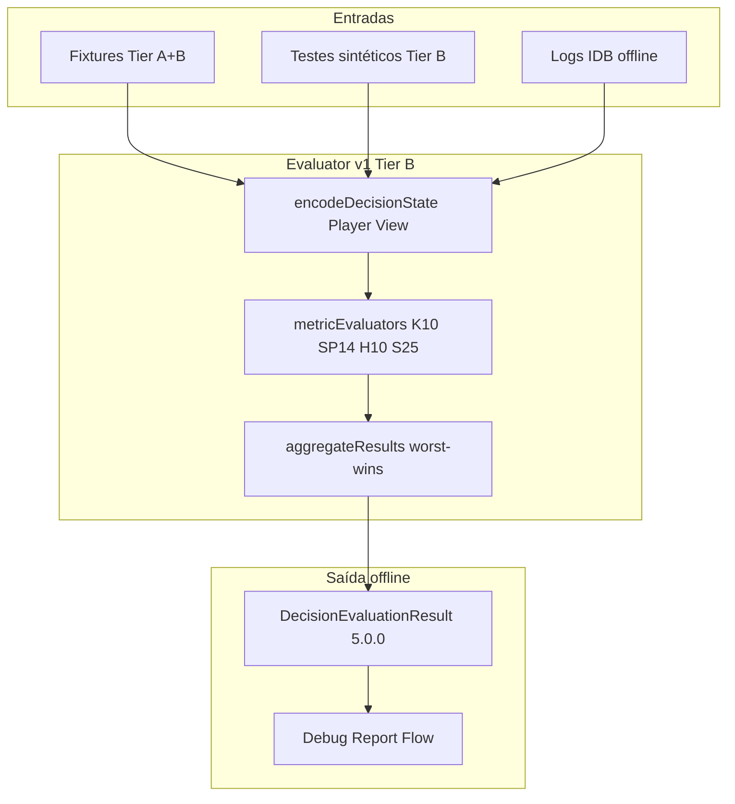

# IMPLEMENTATION_11_EVALUATOR_V1_TIER_B — Prompt de implementação

**ID:** `IMPLEMENTATION_11_EVALUATOR_V1_TIER_B`  
**Plano pai:** [IMPLEMENTATION_PLAN_AI.md](../IMPLEMENTATION_PLAN_AI.md) v1.3 — próximo bloco pós-Impl 10  
**Design base:** [FASE_5_AVALIADOR_DESIGN.md](../FASE_5_AVALIADOR_DESIGN.md) · [FASE_2A_PRIORIDADES_METRICAS.md](../FASE_2A_PRIORIDADES_METRICAS.md) · [FASE_2B_FIXTURES_METRICAS.md](../FASE_2B_FIXTURES_METRICAS.md) · [FASE_4_ENCODER_DESIGN.md](../FASE_4_ENCODER_DESIGN.md) §9  
**Status report:** [CARD_INTELLIGENCE_STATUS_REPORT.md](../CARD_INTELLIGENCE_STATUS_REPORT.md) v1.4 · [ROADMAP_COMPLIANCE_REVIEW.md](../reviews/ROADMAP_COMPLIANCE_REVIEW.md) · [TECHNICAL_INTEGRITY_REVIEW.md](../reviews/TECHNICAL_INTEGRITY_REVIEW.md)  
**Pré-requisitos:** [IMPLEMENTATION_5_EVALUATOR_V0_REPORT.md](../implementation-reports/IMPLEMENTATION_5_EVALUATOR_V0_REPORT.md) · [IMPLEMENTATION_10_DEBUG_REPORT_FLOW_REPORT.md](../implementation-reports/IMPLEMENTATION_10_DEBUG_REPORT_FLOW_REPORT.md) — **H10 OK** recomendado  
**Código base:** [`frontend/src/cardIntelligence/evaluator/`](../../frontend/src/cardIntelligence/evaluator/) · [`encoder/`](../../frontend/src/cardIntelligence/encoder/) · [`fixtures/`](../../frontend/src/cardIntelligence/fixtures/) · [`devLab/`](../../frontend/src/cardIntelligence/devLab/) · [`debug/`](../../frontend/src/cardIntelligence/debug/)  
**Data:** 2026-06-06  
**Scope desta prompt:** guia **executável** para Evaluator v1 Tier B — **não implementar neste passo documental**.

**Tipo de documento:** prompt de **implementação** (Agent mode) — não é relatório de estado, não é CI, não é o relatório pós-código (**§15**).

**Mapa de secções (referências internas — usar estes números):**

| § | Conteúdo |
|---|----------|
| §1–§2 | Objectivo, escopo |
| §3 | Glossário `partial` / `partialEvaluation` / agregação |
| §4–§5 | Código existente, specs Tier B (K10, SP14, H10, S25) |
| §6–§8 | Agregador, encoder mínimo, helpers |
| §9–§11 | Ficheiros, testes, CI |
| §12–§14 | Critérios, riscos, decisões D1–D10 |
| **§15** | **Relatório final pós-código** |
| **§16** | **Checkpoint H11** (humano) |
| **§17** | Dúvidas Q1–Q8 |
| **§18** | Metadados |

**Posicionamento no roadmap:**

```
Impl 1–10 (fechados) → Impl 11 Evaluator v1 Tier B → Provider LLM real → Melhoria bots
```

**Princípio:** Implementation 11 **descongela** métricas Tier B (S25, SP14, H10, K10) quando há **dados suficientes** para good/medium/bad — mantém `partial` quando faltam dados ou a decisão é estrategicamente ambígua. **Não** tornar o juiz opinativo; **não** ligar ao hot path.

| Camada | Metáfora | Impl |
|--------|----------|------|
| Logger | Gravador | 1–2 |
| Encoder | Tradutor | 3 (+ mínimo v1 Hearts/Spades se D2/D4) |
| Fixtures 2B | Golden cases | 4 |
| **Avaliador v0** | Juiz P0 + Tier B congelado | 5 |
| Debug Report Flow | Relatório legível | 10 |
| **Avaliador v1 Tier B** | **Juiz heurísticas claras** | **11 (esta prompt)** |

**Checkpoint humano H11:** validação **pós**-Impl 11 — Dev Lab / report flow + `reasonShort` Tier B; **não** confundir com H10 (Debug Report Flow). **Pré-requisito:** H10 OK.

**Gates:**

| Fase | Bloqueio |
|------|----------|
| Redigir/ler esta prompt | **Nenhum** |
| Implementar código Impl 11 | **H10 OK recomendado** |
| Checkpoint H11 humano | **Depois** de CI verde + relatório Impl 11 |

**Supersede Impl 5 (Tier B):** v0 força `classification: partial` global para fixtures S25/H10/SP14/K10 via `tierBPartial` em [`aggregateResults.ts`](../../frontend/src/cardIntelligence/evaluator/aggregateResults.ts). **Esta prompt prevalece:** remover hack; classificação global = worst-wins real.

**Supersede Impl 5 (stubs):** [`metricEvaluators.ts`](../../frontend/src/cardIntelligence/evaluator/metricEvaluators.ts) devolve `partial` fixo para S25/SP14/H10/K10 — substituir por heurísticas §4.

**Supersede golden test:** [`evaluatorGolden.test.ts`](../../frontend/src/cardIntelligence/evaluator/evaluatorGolden.test.ts) `Tier B → partial` global — substituir por expected **por fixtureId** §11.1.

---

## Glossário de estados

| Termo | Definição |
|-------|-----------|
| **Tier B** | Métricas Hard parciais F2A: S25, SP14, H10, K10 (`TIER_B_FIXTURE_IDS`) |
| **partial (métrica)** | Métrica activa; dados insuficientes para good/medium/bad |
| **partialEvaluation** | Flag global: true se qualquer métrica activa = partial OU contexto incompleto |
| **unknown** | Zero avaliação útil — distinto de partial |
| **Hot path** | GameBoard → playWithLogging → IDB logger |
| **Player View** | Encode/evaluate sem mãos adversárias |

**Regra anti-alucinação (relatório Impl 11):** afirmações com citação a Impl 5/10, FASE, teste ou grep desta prompt.

---

## Ficheiros-fonte obrigatórios (ler antes de implementar)

| Ficheiro | O que verificar |
|----------|-----------------|
| [`evaluator/metricEvaluators.ts`](../../frontend/src/cardIntelligence/evaluator/metricEvaluators.ts) | Stubs S25/SP14/H10/K10 |
| [`evaluator/aggregateResults.ts`](../../frontend/src/cardIntelligence/evaluator/aggregateResults.ts) | `tierBPartial`, PRIORITY |
| [`evaluator/evalHelpers.ts`](../../frontend/src/cardIntelligence/evaluator/evalHelpers.ts) | Context, encodings, trick helpers |
| [`evaluator/evaluatorGolden.test.ts`](../../frontend/src/cardIntelligence/evaluator/evaluatorGolden.test.ts) | Assert Tier B global |
| [`evaluator/evaluatorSynthetic.test.ts`](../../frontend/src/cardIntelligence/evaluator/evaluatorSynthetic.test.ts) | Padrão testes sintéticos |
| [`encoder/heartsEncoder.ts`](../../frontend/src/cardIntelligence/encoder/heartsEncoder.ts) | Gap `moonThreatLevel` |
| [`encoder/spadesEncoder.ts`](../../frontend/src/cardIntelligence/encoder/spadesEncoder.ts) | teamBid, scoreContext |
| [`encoder/kingEncoder.ts`](../../frontend/src/cardIntelligence/encoder/kingEncoder.ts) | `isLastTwoPhase`, `penaltyMap` |
| [`encoder/suecaEncoder.ts`](../../frontend/src/cardIntelligence/encoder/suecaEncoder.ts) | S25 context |
| [`fixtures/*Fixtures.ts`](../../frontend/src/cardIntelligence/fixtures/) | S25, SP14, H10, K10 events |
| [`debug/reportFlow/`](../../frontend/src/cardIntelligence/debug/reportFlow/) | H11 smoke via reports |
| Relatório [Impl 5](../implementation-reports/IMPLEMENTATION_5_EVALUATOR_V0_REPORT.md) | Tier B v0 design |
| Relatório [Impl 10](../implementation-reports/IMPLEMENTATION_10_DEBUG_REPORT_FLOW_REPORT.md) | Pipeline legível offline |

---

## Instruções para o agente implementador

1. Confirmar **H10 OK recomendado**; ler prompt completa + FASE_5 §4.2/§8.5 + fixtures Tier B.
2. Implementar **apenas** §2.1; recusar §2.2.
3. Ordem de implementação **D9:** K10 → SP14 → H10 encoder → H10 eval → S25 synthetic.
4. **Zero** gameplay, bots, `GameBoard`, `playWithLogging`, motores `*Game.ts`, memory live, LLM.
5. **Não** hookar `evaluateDecision` no hot path.
6. Player View **por defeito**; Engine View só testes explícitos.
7. **Não** mutar `CardDecisionLogEvent` nem logger `classification: unknown`.
8. Schema evaluator **5.0.0** mantido (D5); encoder **4.0.0** — campos novos nullable only (D6).
9. Remover `tierBPartial` force-partial (§6); actualizar golden §11.1.
10. `reasonShort` em **português de mesa** — curto, legível no report flow (H11).
11. Se lógica Tier B > ~30 linhas/métrica → extrair `tierBHelpers.ts` (§9).
12. Preferir **`partial`** a inventar inferência profunda (S25 void, moon estratégico).
13. Tier A (20 fixtures) **deve** permanecer `good` — gate regressão.
14. CI: §11.2 + grep hot path §11.3.
15. Relatório final **§15**; validação humana **§16** (H11).
16. Actualizar `IMPLEMENTATION_PLAN_AI.md` + `CARD_INTELLIGENCE_STATUS_REPORT.md` **no relatório Impl 11** (não nesta fase documental).
17. **Não** pedir a Francisco para ler repo durante H11 — script §16.2 autocontido.
18. Um helper `tierBHelpers.ts` opcional — **não** over-abstract one-liners.

---

# 1. Objectivo

## 1.1 Problema

Evaluator v0 (Impl 5) avalia **Tier A** (20 fixtures → `good`) mas **congela Tier B**:

- `evaluateS25`, `evaluateSP14`, `evaluateH10`, `evaluateK10` devolvem sempre `partial`.
- `aggregateResults` força global `partial` para qualquer fixture Tier B.
- Relatórios debug mostram `partial` mesmo quando contexto encode é rico (ex. K10 `isLastTwoPhase`, SP14 score).

Isto impede validação humana útil de métricas Hard e mantém `partialEvaluation` artificialmente alta.

## 1.2 Solução

**Evaluator v1 Tier B** — heurísticas **conservadoras** offline que:

- Convertem cenários **claros** de `partial` → `good` | `medium` | `bad`.
- Mantêm `partial` quando faltam dados (Player View honesto) ou decisão estratégica demais.
- Removem hack agregador `tierBPartial`.
- Opcional: campo encoder mínimo `moonThreatLevel` (Hearts) — D2.



**Regra central:** evaluator continua **offline/debug/test-only** — prod gameplay inalterado.

---

# 2. Escopo exacto

## 2.1 Dentro do escopo v1

| Área | Detalhe |
|------|---------|
| **Métricas** | S25, SP14, H10, K10 — heurísticas §4 |
| **Agregador** | Remover `tierBPartial`; regras §6 |
| **Encoder mínimo** | `moonThreatLevel` Hearts (D2); opcional helpers SP14 opponent derivados |
| **Helpers** | `tierBHelpers.ts` se necessário |
| **Testes** | Golden por fixture §11.1 + sintéticos §11.2 |
| **Fixtures** | Ajuste mínimo expected; **não** expandir registry 23 salvo necessidade |
| **Dev Lab** | Presets `LAB_*` Tier B — **P1** (D7) |
| **Relatório + H11** | §15–§16 |

## 2.2 Fora do escopo (recusar)

| Item | Motivo |
|------|--------|
| Gameplay / bots / `*Game.ts` / `GameBoard` | Proibido |
| Evaluator **live** em partida | Proibido |
| Engine View por defeito | Proibido |
| Mãos adversárias / voids profundos | Player View |
| Leilão King / pass Hearts real | v1+ |
| Score global moon estratégico | v1+ |
| Leitura complexa parceiro (S25 inferência) | partial default |
| Memory a influenciar eval | Proibido |
| LLM / provider real | Proibido |
| Persistência eval IDB | v1+ |
| Tier A regressão | Gate CI |
| SP01/H05 bid/pass real | Fora Tier B v1 |
| Bump schema evaluator 5.0.0 | D5 — manter salvo necessidade |

---

# 3. Glossário — `partial` vs `partialEvaluation` vs agregação

Alinhar [FASE_5 §4.2/§8.5](../FASE_5_AVALIADOR_DESIGN.md).

## 3.1 Eixos independentes

| Conceito | Quando | `partialEvaluation` |
|----------|--------|---------------------|
| **`unknown`** | Nenhuma métrica activa avaliável | `false` |
| **`partial` (métrica)** | Métrica activa; dados insuficientes | contribui para global |
| **`good`/`medium`/`bad`** | Veredicto claro na métrica | — |
| **Global `partial`** | Worst-wins inclui métrica `partial` OU `hasIncompleteContext` | **`true`** |
| **Global `good`** | Todas métricas activas good (ou not_applicable) | `false` |

## 3.2 Ordem agregação v1 (fechada)

**Pior vence** — prioridade explícita (código actual `PRIORITY`):

```
bad > partial > medium > good > unknown
```

Documentar no relatório Impl 11 — FASE_5 §4.3 lista subset; **esta prompt prevalece** para Tier B v1.

## 3.3 Exemplo Q6 (fechado)

| Métricas activas | Global | `partialEvaluation` |
|------------------|--------|---------------------|
| T01 `good` + H10 `partial` | **`partial`** | **`true`** |
| T01 `good` + K10 `good` | **`good`** | `false` |
| SP14 `bad` + T01 `good` | **`bad`** | `false` |
| S25 `partial` only | **`partial`** | **`true`** |

`reasonShort` global: métrica de maior prioridade (ver `pickReason` existente).

## 3.4 O que muda vs Impl 5

| Impl 5 v0 | Impl 11 v1 |
|-----------|------------|
| `if (tierBPartial) classification = 'partial'` | **Removido** |
| Tier B fixture sempre global partial | K10/SP14 podem ser `good`; S25/H10 golden podem ficar `partial` |
| Stubs metric `partial` fixo | Heurísticas §4 |

---

# 4. Specs por métrica Tier B

Ordem implementação **D9:** K10 → SP14 → H10 → S25.

## 4.1 K10 — King duas últimas / 11.ª vaza

**FASE_2A:** Hard · contrato `no_last_two` · trick 10–12.

### Pré-condições

- `fixtureId === 'K10'` **ou** `isMetricApplicable(ctx, 'K10')`.
- `kingEnc(ctx).isLastTwoPhase === true`.
- `trickNumberForLastTwo ∈ {11, 12}`.
- `penaltyMap['no_last_two']` presente (número).

Se `isLastTwoPhase === null` ou `penaltyMap` null → métrica **`partial`**, reason: «Endgame duas últimas — dados em falta.»

### Campos usados

`isLastTwoPhase`, `trickNumberForLastTwo`, `penaltyMap`, `handBefore`, `legalMoves`, `chosenCard`, `currentTrick`, `contractId`.

### Heurística mínima (Q3 — fechada)

Função auxiliar sugerida: `highestRankInHand(hand)`, `wouldWinTrick(card)`, `lowestLegalThatLoses()`.

| Classificação | Condição conservadora |
|---------------|----------------------|
| **bad** | Existe alternativa legal **estrictamente mais baixa** (rank) que **não** ganha trick **e** `chosenCard` ganha trick **ou** é a carta mais alta da mão em trick 11/12 com risco `no_last_two` |
| **good** | Trick vazio (lead) e `chosenCard` **não** é a mais alta da mão; **ou** descarte baixo quando trick já perdido; **ou** carta escolhida é a mais baixa entre legais que ainda cumprem objectivo imediato |
| **medium** | Reduz risco trick 11 mas deixa carta alta para trick 12 inevitável |
| **partial** | Pré-condições em falta |

### Anti-patterns

- Não simular leilão/festa.
- Não prever trick 12 winner sem dados trick leader futuro.

### Fixture golden K10

[`kingFixtures.ts`](../../frontend/src/cardIntelligence/fixtures/kingFixtures.ts): trick 11, lead `c2`, mão `[c2,c3,d4]`.

**Expected global v1:** **`good`**.

### Testes sintéticos

- K10 **bad**: escolher carta mais alta com alternativa baixa em lead trick 11.
- K10 **medium**: trade-off documentado.
- K10 **partial**: `isLastTwoPhase` null injectado.

---

## 4.2 SP14 — Spades quebrar bid adversária alta

**FASE_2A:** Hard · bid adversária 8+ · score-aware.

### Pré-condições

- `fixtureId === 'SP14'` **ou** SP14 aplicável via `metricContext`.
- Dados opponent derivados (§5.2) **não** null.

### Derivação opponent (D4)

A partir de `EncodedDecisionState`:

```typescript
// teamIndex: SuecaEncoding.teamIndex ou infer playerIndex % 2 → team 1|2
const myTeam = teamIndex; // 1 | 2
const oppTeam = myTeam === 1 ? 2 : 1;
const raw = encoded.scoreContext?.raw ?? {};
const opponentTeamBid = oppTeam === 1 ? raw.team1Bid : raw.team2Bid;
const opponentTeamTricks = oppTeam === 1 ? raw.team1Tricks : raw.team2Tricks;
const opponentNeedTricks = max(0, opponentTeamBid - opponentTeamTricks);
```

Usar também campos encoder: `teamBid`, `teamTricks`, `bidMet`, `needTricks`, `spadesBroken`, `partnerWinning`, `legalMoves`, `chosenCard`.

### Bid adversária «alta» (Q2 — fechada)

Ameaça activa quando **ambos**:

1. `opponentTeamBid >= 8` **OU** (`opponentNeedTricks <= 2` **E** `opponentTeamBid > myTeamBid`)
2. `opponentNeedTricks > 0`

Se opponent bid/tricks null → **`partial`**: «Pressão bid adversária — score em falta.»

### Heurística

| Classificação | Condição |
|---------------|----------|
| **good** | Ameaça activa + `chosenCard` **ganha** trick actual (spade trump ou led winner) quando existia alternativa que **não** ganha **e** ganhar reduz `opponentNeedTricks` |
| **bad** | Ameaça activa + `chosenCard` **não** compete (descarte/perde trick) quando alternativa legal **ganhava** trick necessário |
| **medium** | Ameaça activa + ganha trick mas com spade/recurso mais alto que o mínimo vencedor |
| **partial** | Score/bids em falta **ou** ameaça não activa |

### Fixture golden SP14

Player 0 team1 (bid 6, tricks 5, need 1). Opponent team2 bid **8**, tricks **6**, need **2**. Lead `hK`, jogada `sA` ganha trick.

**Expected global v1:** **`good`** — bloqueia pressão adversária com recurso adequado.

### Testes sintéticos

- SP14 **bad**: adversário precisa tricks; jogada não ganha com alternativa ganhadora.
- SP14 **partial**: `scoreBefore` null / opponent bid null.

---

## 4.3 H10 — Hearts bloquear shoot the moon

**FASE_2A:** Hard · moon still possible.

### Encoder v1 (D2 — fechado)

Adicionar a [`HeartsEncoding`](../../frontend/src/cardIntelligence/encoder/types.ts):

```typescript
moonThreatLevel: 'none' | 'possible' | 'likely' | null;
```

Implementar em [`heartsEncoder.ts`](../../frontend/src/cardIntelligence/encoder/heartsEncoder.ts) — derivado **só** de `roundPlayHistory` + `heartsBroken` (Player View). **Sem** mãos adversárias.

### Tabela `moonThreatLevel` (Q1 — fechada)

| Nível | Regra conservadora |
|-------|-------------------|
| `null` | `heartsBroken !== true` **ou** `roundPlayHistory` vazia |
| `none` | Nenhum jogador com ≥4 hearts capturados **e** nenhum com ≥20 pontos hearts acumulados |
| `possible` | Algum jogador com ≥4 hearts capturados **ou** ≥20 pontos hearts acumulados |
| `likely` | Algum jogador com ≥8 hearts capturados **ou** ≥22 pontos hearts acumulados |
| **Abort** | Contagem ambígua / empate top candidate → encoder devolve `null` |

Contagem hearts/pontos: iterar `roundPlayHistory` por `playerIndex`; hearts = suit hearts; pontos = 1 por heart + 13 Q♠.

### Heurística evaluator

| Classificação | Condição |
|---------------|----------|
| **partial** | `moonThreatLevel === null` **ou** `'none'` |
| **good** | `possible` ou `likely` + jogada **impede** moon (ex. leva pontos hearts contra moon candidate; ou força descarte que quebra sequência) — regra **conservadora** documentada no código |
| **bad** | `likely` + jogada **facilita** moon óbvio (ex. alimenta hearts quando podia cortar/baralhar) |
| **medium** | P1 — opcional v1 |

### Golden H10 (D10 — fechado)

Fixture actual [`heartsFixtures.ts`](../../frontend/src/cardIntelligence/fixtures/heartsFixtures.ts) **não** atinge `possible`/`likely` com regras conservadoras.

**Expected global v1:** **`partial`** — reason moon threat indisponível.

**H10 `good`:** apenas **teste sintético** com history injectada que atinge `moonThreatLevel: 'likely'`.

### Anti-patterns

- Não forçar `good` no golden H10 enriquecendo fixture **nesta impl** salvo history explícita moon — preferir sintético (D10).

---

## 4.4 S25 — Sueca destrunfar sem prejudicar parceiro

**FASE_2A:** Hard · void parceiro inferido · cooperação avançada.

### Regra central (D3)

**Não inferir void parceiro** em Player View para golden.

### Golden S25

[`suecaFixtures.ts`](../../frontend/src/cardIntelligence/fixtures/suecaFixtures.ts): `metricContext.applicable: false`, `allowPartial: true`.

**Expected global v1:** **`partial`** — inalterado.

### Testes sintéticos only

Injectar contexto explícito (helper interno **não** exportado para gameplay):

```typescript
interface S25TestContext {
  partnerVoidInLedSuit?: boolean; // só testes
  leadingTrump?: boolean;
  partnerWasCutting?: boolean;
}
```

| Classificação | Condição (sintético) |
|---------------|---------------------|
| **good** | Leading trump + trick vazio + `partnerVoidInLedSuit === true` + destrunfo remove trunfo alto **sem** `partnerWasCutting` |
| **bad** | `partnerWasCutting === true` + destrunfo tira oportunidade óbvia de corte |
| **partial** | Sem sinal void/corte |

**Proibido:** usar `partnerWinning !== true` como **única** regra good no golden.

---

# 5. Código existente — estado ao redigir

| Artefacto | Estado |
|-----------|--------|
| `evaluateK10/SP14/H10/S25` | Stub → `partial` fixo |
| `aggregateResults.tierBPartial` | Force global partial Tier B |
| `evaluatorGolden.test.ts` | `Tier B → partial` ×4 |
| `HeartsEncoding` | Sem `moonThreatLevel` |
| `SpadesEncoding` | Sem opponent* explícito — derivar scoreContext |
| `KingEncoding` | `isLastTwoPhase` **existe** |
| Dev Lab | 4 presets Tier A only |

---

# 6. Agregador — alteração obrigatória

## 6.1 Remover

```typescript
// aggregateResults.ts — REMOVER bloco:
const tierBPartial =
  fixtureId !== undefined &&
  (TIER_B_FIXTURE_IDS as readonly string[]).includes(fixtureId);
if (tierBPartial) {
  classification = 'partial';
}
```

## 6.2 Manter / clarificar

- Worst-wins com PRIORITY §3.2.
- `hasIncompleteContext` path existente (Tier A S08 cutRisk).
- `partialEvaluation: classification === 'partial'` (compat Impl 5).

## 6.3 `TIER_B_FIXTURE_IDS`

Manter constante para **testes** e documentação — **não** para force-partial.

---

# 7. Encoder — alterações mínimas

| Ficheiro | Alteração | Obrigatório |
|----------|-----------|-------------|
| `encoder/types.ts` | `moonThreatLevel` em `HeartsEncoding` | **Sim** (D2) |
| `encoder/heartsEncoder.ts` | Derivar moon §4.3 | **Sim** |
| `encoder/metricContext.ts` | H10 `neededFields` incluir `moonThreatLevel` | Recomendado |
| `encoder/spadesEncoder.ts` | Opcional: `opponentTeamBid` cached | **Não** se derivar em evalHelpers |
| `encoder/suecaEncoder.ts` | **Não** alterar v1 (S25 synthetic only) | — |

**D6:** novos campos **nullable**; schema encoder **4.0.0** mantido.

---

# 8. Helpers sugeridos (`tierBHelpers.ts`)

| Helper | Uso |
|--------|-----|
| `deriveOpponentSpadesPressure(encoded)` | SP14 opponent bid/tricks/need |
| `isOpponentHighBidThreat(...)` | Q2 rule |
| `highestRankInHand(cards)` | K10 |
| `countHeartsByPlayer(history)` | H10 encoder |
| `buildS25SyntheticContext(...)` | Testes only |

Manter funções **puras** e testadas unitariamente.

---

# 9. Ficheiros — criar vs alterar vs não tocar

## 9.1 Criar (provável)

```
frontend/src/cardIntelligence/evaluator/
├── tierBHelpers.ts              # opcional §8
├── tierBHelpers.test.ts         # se helpers
└── tierBv1.test.ts              # ou expandir evaluatorSynthetic.test.ts
```

## 9.2 Alterar (mínimo)

| Ficheiro | Alteração |
|----------|-----------|
| `evaluator/metricEvaluators.ts` | Implementar §4 |
| `evaluator/evalHelpers.ts` | SP14 opponent deriv.; K10 rank helpers |
| `evaluator/aggregateResults.ts` | Remover tierBPartial |
| `evaluator/evaluatorGolden.test.ts` | Expected por fixture §11.1 |
| `evaluator/evaluatorSynthetic.test.ts` | Casos §11.2 |
| `encoder/heartsEncoder.ts` | moonThreatLevel |
| `encoder/types.ts` | HeartsEncoding field |
| `encoder/metricContext.ts` | H10 neededFields (opcional) |

## 9.3 Não alterar

- `GameBoard.tsx`, `playWithLogging.ts`, `frontend/src/ai/*`, `*Game.ts`
- `debug/reportFlow/*` (usar em H11 only)
- `memory/*` hot path
- `llm/*`
- Logger schema 3.0.0

---

# 10. Integração debug / devLab

- **Não** novos helpers consola obrigatórios — reutilizar `__ciEvaluateEvent`, `__ciScenarioReport`, report flow Impl 10.
- **P1:** presets `LAB_K10`, `LAB_SP14` em [`devLab/presetScenarios.ts`](../../frontend/src/cardIntelligence/devLab/presetScenarios.ts) — opcional v1 (D7).
- Reports devem mostrar `metricResults` SP14/K10 com classificações não-partial quando aplicável.

---

# 11. Testes mínimos

## 11.1 Golden — expected por fixtureId

Substituir teste global `Tier B %s → partial`:

| fixtureId | Expected global v1 | Gate |
|-----------|---------------------|------|
| **K10** | **`good`** | Obrigatório |
| **SP14** | **`good`** | Obrigatório |
| **H10** | **`partial`** | Obrigatório (D10) |
| **S25** | **`partial`** | Obrigatório (D3) |
| Tier A ×20 | **`good`** | Regressão — inalterado |

Implementação teste sugerida:

```typescript
const TIER_B_EXPECTED: Record<string, EvaluationClassification> = {
  K10: 'good',
  SP14: 'good',
  H10: 'partial',
  S25: 'partial',
};
```

## 11.2 Sintéticos — checklist T1–T15

| # | Teste |
|---|-------|
| T1 | S25 good — sintético partnerVoid injectado |
| T2 | S25 bad — sintético partnerWasCutting |
| T3 | S25 partial — sem sinal void |
| T4 | SP14 good — fixture ou sintético ameaça activa |
| T5 | SP14 bad — entrega trick necessário |
| T6 | SP14 partial — score/opponent null |
| T7 | H10 good — sintético moonThreat `likely` + bloqueio |
| T8 | H10 partial — fixture golden / moon none |
| T9 | K10 good — golden |
| T10 | K10 bad — carta alta desnecessária trick 11 |
| T11 | K10 medium — trade-off trick 12 |
| T12 | K10 partial — isLastTwoPhase null |
| T13 | Agregador — métrica `bad` Tier B → global **bad** (não forced partial) |
| T14 | Tier A 20 fixtures → `good` |
| T15 | `grep` hot path — zero evaluateDecision live |

## 11.3 Comandos CI

```bash
cd frontend
CI=true npm test -- --testPathPattern=evaluator --watchAll=false
CI=true npm test -- --testPathPattern=cardIntelligence --watchAll=false
CI=true npm run build

grep -rE "evaluateDecision" \
  frontend/src/components \
  frontend/src/cardIntelligence/logger/playWithLogging.ts \
  frontend/src/models/games
# expect: zero matches
```

---

# 12. Critérios de sucesso

| Critério | Verificação |
|----------|-------------|
| Build + testes | CI verde |
| Tier A regressão | 20 fixtures `good` |
| Tier B golden | K10/SP14 `good`; H10/S25 `partial` |
| Sintéticos Tier B | T1–T12 passam |
| Agregador | Sem `tierBPartial` force |
| Zero gameplay | grep §11.3 |
| Encoder | `moonThreatLevel` nullable; Player View |
| Relatório Impl 11 | §15 |
| H11 | §16 pendente pós-CI |

**Parcial pós-código:** CI verde + relatório + **H11 pendente** — aceite.

---

# 13. Riscos

| ID | Risco | Mitigação |
|----|-------|-----------|
| R1 | Regressão Tier A | Gate 20 fixtures; review agregador |
| R2 | H10 falso positivo moon | Abort → `null`; golden partial |
| R3 | SP14 logs reais sem score | partial offline — aceite |
| R4 | S25 over-inference | golden partial; synthetic explicit only |
| R5 | Juiz demasiado opinativo | partial default; medium generoso |
| R6 | Engine View leak | Player default; test grep |
| R7 | Memory partialCount drift | Q7 defer — documentar no relatório |

---

# 14. Decisões fechadas (D1–D10)

| ID | Decisão |
|----|---------|
| **D1** | Remover `tierBPartial`; worst-wins `bad > partial > medium > good`; `partialEvaluation` se any metric partial |
| **D2** | H10: campo `moonThreatLevel` no encoder Hearts; tabela §4.3 |
| **D3** | S25 golden `partial`; good/bad só sintético com sinal explícito |
| **D4** | SP14: derivar opponent de `scoreContext.raw`; bid alta §4.2 |
| **D5** | Schema evaluator **5.0.0** mantido |
| **D6** | Encoder **4.0.0** — campos nullable only |
| **D7** | Dev Lab presets Tier B — **P1** opcional |
| **D8** | H11 OK parcial se synthetic + golden K10/SP14 validados |
| **D9** | Ordem impl: **K10 → SP14 → H10 encoder → H10 eval → S25 synthetic** |
| **D10** | Golden H10 **`partial`** v1; H10 `good` só sintético |

---

# 15. Relatório final esperado (pós-código)

Criar [`docs/ai/implementation-reports/IMPLEMENTATION_11_EVALUATOR_V1_TIER_B_REPORT.md`](../implementation-reports/IMPLEMENTATION_11_EVALUATOR_V1_TIER_B_REPORT.md):

```markdown
# IMPLEMENTATION_11_EVALUATOR_V1_TIER_B — Relatório final

## Ficheiros criados
## Ficheiros alterados
## Métricas Tier B melhoradas (S25/SP14/H10/K10)
## Quais continuam partial e porquê
## Agregador — confirmação remoção tierBPartial
## Testes executados + contagens
## Exemplos DecisionEvaluationResult (5–8 reasonShort PT)
## Confirmação zero gameplay + grep
## Encoder moonThreatLevel (se aplicável)
## Gaps / deferidos (Q7–Q8)
## Checkpoints — **H11:** OK | Pendente
## Actualização IMPLEMENTATION_PLAN + STATUS (Impl 11)
## Próximos passos (provider LLM / bots)
```

---

# 16. Checkpoint H11 (humano — copy-paste)

**Pré-requisito:** H10 OK (Debug Report Flow) — **não** re-validar H10 aqui.

## 16.1 Arranque

```bash
cd frontend
REACT_APP_CARD_INTELLIGENCE_DEBUG=true \
REACT_APP_CARD_INTELLIGENCE_DEV_LAB=true \
npm start
```

## 16.2 Script consola

```javascript
(async () => {
  // Regressão Tier A via Dev Lab
  console.log(await __ciScenarioReport('LAB_K02'));

  // Tier B — evaluate offline fixtures (após Impl 11)
  for (const id of ['K10', 'SP14', 'H10', 'S25']) {
    const fixture = (await import('./cardIntelligence/fixtures')).getFixtureById(id);
    if (!fixture) continue;
    const { encodeDecisionState } = await import('./cardIntelligence/encoder/encodeDecisionState');
    const { evaluateDecision } = await import('./cardIntelligence/evaluator');
    const enc = encodeDecisionState({ event: fixture.event });
    const ev = evaluateDecision({
      schemaVersion: '5.0.0',
      encodedState: enc,
      chosenCard: fixture.event.chosenCard,
      legalMoves: fixture.event.legalMoves,
      fixtureId: id,
    });
    console.log(id, ev.classification, ev.reasonShort);
    ev.metricResults
      .filter((m) => ['S25','SP14','H10','K10'].includes(m.metricId))
      .forEach((m) => console.log(' ', m.metricId, m.classification, m.reasonShort));
  }
  console.log('H11 smoke — validar reasonShort à mesa');
})();
```

**Nota:** ajustar imports dinâmicos se CRA não permitir — alternativa: usar test output no relatório Impl 11.

## 16.3 Checklist H11

**Obrigatório para `H11: OK`:**

- [ ] K10 golden → global **`good`**; reasonShort intuitivo
- [ ] SP14 golden → global **`good`**; reasonShort intuitivo
- [ ] H10 golden → global **`partial`** (moon indisponível)
- [ ] S25 golden → global **`partial`**
- [ ] Ler 5–8 `reasonShort` — fazem sentido à mesa
- [ ] `partial` só quando reason menciona dados em falta
- [ ] Prod: evaluator **não** no hot path (grep)
- [ ] Jogo normal inalterado

**Recomendado:**

- [ ] Report flow num evento IDB com métrica Tier A intacta

**H11 OK parcial (D8):** synthetic Tier B validado + golden K10/SP14 OK; restante anotado no relatório.

## 16.4 Assinatura

Relatório Impl 11 secção Checkpoints: `**H11:** OK — YYYY-MM-DD` ou `**H11:** OK parcial — …`

---

# 17. Dúvidas documentadas

| ID | Tema | Resolução v1 |
|----|------|--------------|
| **Q1** | Moon limiar | **Fechado** — tabela §4.3 |
| **Q2** | Bid alta SP14 | **Fechado** — ≥8 ou needTricks ≤2 §4.2 |
| **Q3** | K10 inevitabilidade | **Fechado** — heurística §4.1 |
| **Q4** | Fixture S25 | **Fechado** — golden partial; synthetic only |
| **Q5** | LAB_* Tier B | **P1** — opcional v1 |
| **Q6** | partialEvaluation mix | **Fechado** — §3.3 |
| **Q7** | Memory partialCount | **Deferir** — documentar no relatório Impl 11 |
| **Q8** | STATUS test count | **Deferir** — actualizar no relatório Impl 11 |

---

# 18. Metadados, referências e histórico

## Referências

- [IMPLEMENTATION_PLAN_AI.md](../IMPLEMENTATION_PLAN_AI.md)
- [CARD_INTELLIGENCE_STATUS_REPORT.md](../CARD_INTELLIGENCE_STATUS_REPORT.md)
- [ROADMAP_AI.md](../ROADMAP_AI.md)
- [FASE_5_AVALIADOR_DESIGN.md](../FASE_5_AVALIADOR_DESIGN.md)
- [FASE_2A_PRIORIDADES_METRICAS.md](../FASE_2A_PRIORIDADES_METRICAS.md)
- [FASE_2B_FIXTURES_METRICAS.md](../FASE_2B_FIXTURES_METRICAS.md)
- [IMPLEMENTATION_5_EVALUATOR_V0_REPORT.md](../implementation-reports/IMPLEMENTATION_5_EVALUATOR_V0_REPORT.md)
- [IMPLEMENTATION_10_DEBUG_REPORT_FLOW_REPORT.md](../implementation-reports/IMPLEMENTATION_10_DEBUG_REPORT_FLOW_REPORT.md)
- [ROADMAP_COMPLIANCE_REVIEW.md](../reviews/ROADMAP_COMPLIANCE_REVIEW.md)
- [TECHNICAL_INTEGRITY_REVIEW.md](../reviews/TECHNICAL_INTEGRITY_REVIEW.md)

## Histórico desta prompt

| Versão | Data | Nota |
|--------|------|------|
| 1.0 | 2026-06-06 | Prompt inicial pós-Impl 10; D1–D10; golden expected por fixture; H11 |

---

**Fim da prompt — não implementar código até aprovação explícita.**
