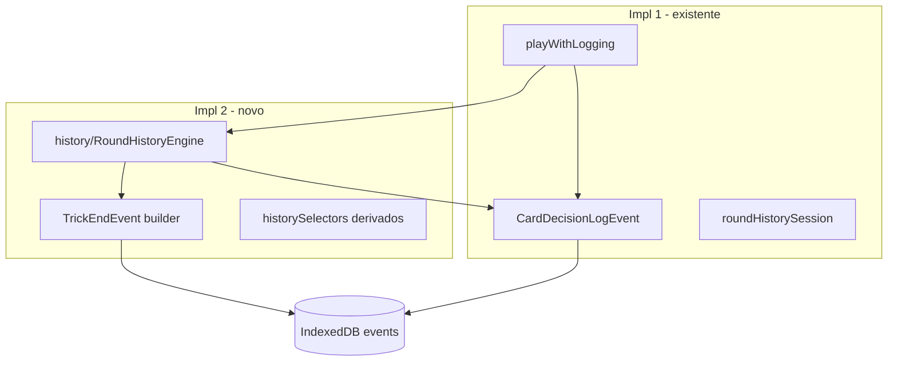

# IMPLEMENTATION_2_ROUND_HISTORY — Prompt de implementação

**ID:** `IMPLEMENTATION_2_ROUND_HISTORY`  
**Plano pai:** [IMPLEMENTATION_PLAN_AI.md](../IMPLEMENTATION_PLAN_AI.md)  
**Design base:** [FASE_3_LOGGER_DESIGN.md](../FASE_3_LOGGER_DESIGN.md) · [FASE_4_ENCODER_DESIGN.md](../FASE_4_ENCODER_DESIGN.md)  
**Pré-requisitos:** [IMPLEMENTATION_1_LOGGER_V0](../implementation-prompts/IMPLEMENTATION_1_LOGGER_V0_PROMPT.md) + [1.1 hardening](../implementation-reports/IMPLEMENTATION_1_1_LOGGER_HARDENING_REPORT.md) — **H1 OK**  
**Data:** 2026-06-03  
**Scope desta prompt:** guia **executável** para histórico transversal + `TrickEndEvent` — **não implementar neste passo documental**.

**Princípio:** Implementation 2 cria **histórico e eventos auxiliares**, não inteligência. Metáfora: o gravador (Impl 1) passa a registar também **fim de vaza** e a manter **memória de ronda** fiável para o tradutor (Impl 3 encoder).

**Checkpoint humano H2** ([IMPLEMENTATION_PLAN_AI.md](../IMPLEMENTATION_PLAN_AI.md) §8): histórico correcto nos 4 jogos + `TrickEndEvent` visível — antes de Impl 3.

---

## Instruções para o agente implementador

1. Ler esta prompt **completa** + secções citadas de FASE_3 §4–§6 antes de editar código.
2. Implementar **apenas** o escopo §2; recusar scope creep (§3 fora de scope).
3. Código novo principalmente em `frontend/src/cardIntelligence/history/` — **não** misturar com `frontend/src/ai/`.
4. **Zero** alteração de regras, scoring, bots, gameplay, avaliador, encoder, memória, LLM.
5. Hooks **passivos** — fail-silent (reutilizar `recordLogFailure` de Impl 1.1).
6. No fim, entregar **relatório final** conforme §14.

---

# 1. Objectivo

Implementation 2 completa a **camada de histórico transversal** do Card Intelligence:

- **`roundPlayHistory`** consistente e **independente** de `GameState.playedCards` (gap PHASE0: campo Sueca-only).
- **`TrickEndEvent`** persistido quando uma vaza fecha (4.ª carta).
- Base **encoder-ready** (FASE_4): cartas vistas, voids futuros, pontos/penalizações por vaza quando deriváveis **sem alterar motor**.

**Não é:** classificar jogadas, alterar bots, reescrever motores, ou implementar encoder/avaliador/memória.

---

# 2. Escopo exacto

## 2.1 Dentro do escopo

| Área | Detalhe |
|------|---------|
| **Tracking em memória** | Acumulador de sessão por `gameId`/`sessionId`: plays + vazas completas |
| **`roundPlayHistory`** | Snapshot por `CardDecisionLogEvent` alimentado pelo acumulador unificado (4 jogos) |
| **`TrickEndEvent`** | Emitir + persistir na store `events` (mesmo IDB v1 ou bump controlado — ver §6) |
| **Ligação logger** | Extender [`playWithLogging.ts`](../../frontend/src/cardIntelligence/logger/playWithLogging.ts) — **sem** duplicar paths no `GameBoard` |
| **Campos por jogo** | `variantFields` / campos derivados **read-only** no evento TrickEnd (§7–§10) |
| **Testes** | Unit por variant + regressão logger v0 |
| **Relatório + H2** | §14 |

## 2.2 Fora do escopo (recusar)

| Item | Impl futura |
|------|-------------|
| Encoder v0 | Impl 3 |
| Avaliador | Impl 5 |
| Memória / agregados | Impl 6 |
| Mini-LLM | Impl 8 |
| UI debug/export JSONL | Impl 7 |
| Multiplayer joiner logging | v0 skip — ver §2.4 |
| Hook em [`applyHostAction.ts`](../../frontend/src/multiplayer/applyHostAction.ts) | **Gap v0** — só se trivial e zero risco; default **não implementar** |
| Reescrever `*Game.ts` / `Game.ts` regras | Proibido |
| Corrigir estratégia bots | Proibido |
| `classification` / `reason` | Sempre unknown/null |
| `GameStartEvent`, `RoundStartEvent`, `BidEvent`, etc. | P0 auxiliares F3 — **opcional P2**; foco = TrickEnd + history |
| Fix H1-D1 React `GameActions` | Issue deferido |

## 2.3 Separação de responsabilidades



## 2.4 Multiplayer — gap v0 (`applyHostAction`)

**Estado actual:** jogadas do joiner remoto são aplicadas pelo host em [`applyHostAction.ts`](../../frontend/src/multiplayer/applyHostAction.ts) via `adapter.playCard(...)` **sem** passar por [`playWithLogging.ts`](../../frontend/src/cardIntelligence/logger/playWithLogging.ts). Histórico unificado + `TrickEndEvent` **não** cobrem essas cartas em v0.

| Path | Logging Impl 2 v0 |
|------|-------------------|
| Solo / host local (humano + AI via `GameBoard`) | Sim — hook `playWithLogging` |
| Joiner remoto (`submitAction` only) | Não — fora scope |
| Host aplica `playCard` remoto (`applyHostAction`) | **Gap v0 documentado** |

**Regra Impl 2:** não implementar hook multiplayer nesta fase, **excepto** se for trivial (ex.: chamar helper partilhado read-only) **e** sem risco de alterar ordem/autoridade do host — default = **não fazer**.

**H2:** validar em **solo ou host local** (cartas tuas + bots). Multiplayer completo fica issue deferida no relatório §14.

---

# 3. Ficheiros prováveis a criar

```
frontend/src/cardIntelligence/history/
├── types.ts                 # RoundPlayHistory, TrickPlayRecord, CompletedTrickRecord, TrickEndPayload
├── roundHistory.ts          # RoundHistoryEngine — substitui/evolui roundHistorySession
├── trickEvents.ts           # buildTrickEndEvent, detectTrickClosed, logTrickEnd
├── historySelectors.ts      # acesSeen, trumpCardsSeen, visiblePlayedCards — read-only helpers
├── variantTrickFields.ts    # extractTrickEndVariantFields(variant, state, trick)
├── roundHistory.test.ts
├── trickEvents.test.ts
└── historySelectors.test.ts
```

**Opcional (se IDB union tipada):**

- `frontend/src/cardIntelligence/shared/types/logEvents.ts` — union `LogEvent = CardDecisionLogEvent | TrickEndEvent`
- `frontend/src/cardIntelligence/shared/storage/logStore.ts` — `appendLogEvent(event: LogEvent, ...)`
- [`frontend/src/cardIntelligence/shared/storage/logStore.localStorage.ts`](../../frontend/src/cardIntelligence/shared/storage/logStore.localStorage.ts) — **obrigatório** se union `LogEvent` mudar (fallback IDB)

**Testes por variant (mínimo 1 ficheiro ou suites nested):**

- `history/variants/suecaTrick.test.ts` (ou inline em `trickEvents.test.ts`)
- King: **dois** motores — [`KingPtGame.ts`](../../frontend/src/models/games/KingPtGame.ts) **e** [`KingSimplifiedGame.ts`](../../frontend/src/models/games/KingSimplifiedGame.ts) via [`KingGame.ts`](../../frontend/src/models/games/KingGame.ts)

---

# 4. Ficheiros prováveis a alterar

Análise do repo **actual** (2026-06-03):

| Ficheiro | Porquê |
|----------|--------|
| [`frontend/src/cardIntelligence/logger/playWithLogging.ts`](../../frontend/src/cardIntelligence/logger/playWithLogging.ts) | **Hook principal:** após play success, chamar `history.onPlay(...)`; se vaza fechou (`waitingForTrickEnd` + trick length 4), `logTrickEnd(...)` |
| [`frontend/src/cardIntelligence/logger/buildCardDecisionEvent.ts`](../../frontend/src/cardIntelligence/logger/buildCardDecisionEvent.ts) | `roundPlayHistory` ← acumulador `history/` em vez de só `roundHistorySession` |
| [`frontend/src/cardIntelligence/logger/CardIntelligenceLogger.ts`](../../frontend/src/cardIntelligence/logger/CardIntelligenceLogger.ts) | Reset history engine em `resetLoggerSessionForTests`; partilhar `gameId`/`sessionId` |
| [`frontend/src/cardIntelligence/shared/types/trickEndEvent.ts`](../../frontend/src/cardIntelligence/shared/types/trickEndEvent.ts) | Expandir schema (§5) — hoje **types only** mínimos |
| [`frontend/src/cardIntelligence/shared/storage/logStore.ts`](../../frontend/src/cardIntelligence/shared/storage/logStore.ts) | Aceitar `TrickEndEvent` no store `events`; union `LogEvent` |
| [`frontend/src/cardIntelligence/shared/storage/logStore.localStorage.ts`](../../frontend/src/cardIntelligence/shared/storage/logStore.localStorage.ts) | **Mesma union** que IDB — fallback localStorage não pode ficar desalinhado |
| [`frontend/src/cardIntelligence/shared/storage/indexedDb.ts`](../../frontend/src/cardIntelligence/shared/storage/indexedDb.ts) | Opcional: índice `eventType`; bump `LOG_DB_VERSION` se migration necessária |
| [`frontend/src/cardIntelligence/index.ts`](../../frontend/src/cardIntelligence/index.ts) | Exports mínimos se testes precisarem |

### Onde a vaza é resolvida (motores — **só leitura**, não editar regras)

| Variant | 4.ª carta (`playCard`) | `finishTrick` (UI Continue) |
|---------|------------------------|-----------------------------|
| **Sueca** | [`Game.ts`](../../frontend/src/models/Game.ts) `evaluateTrick()` ~L393 — pontos equipa, `lastTrickWinner`, `waitingForTrickEnd` | [`Game.ts`](../../frontend/src/models/Game.ts) `finishTrick()` ~L447 — limpa trick |
| **Spades** | [`SpadesGame.ts`](../../frontend/src/models/games/SpadesGame.ts) ~L327 — winner, `waitingForTrickEnd` | ~L338 — incrementa tricks em `variantState.spades` |
| **Hearts** | [`HeartsGame.ts`](../../frontend/src/models/games/HeartsGame.ts) ~L323 | ~L333 — `trickPoints`, Q♠, penalty cards em `finishTrick` |
| **King PT** | [`KingPtGame.ts`](../../frontend/src/models/games/KingPtGame.ts) ~L730 | ~L741 — penalizações festa/contrato |
| **King Simplified** | [`KingSimplifiedGame.ts`](../../frontend/src/models/games/KingSimplifiedGame.ts) ~L152 | ~L160 — scoring +5/−5 |

**Decisão fechada para Impl 2:**

- **`TrickEndEvent` dispara no fecho lógico da vaza = imediatamente após 4.ª jogada bem-sucedida** (quando `stateAfter.waitingForTrickEnd === true` e `stateBefore.currentTrick.length === 3`).
- **Não** amarrar TrickEnd ao botão «Continuar» (`GameBoard` `onContinueTrick` ~L1036) — isso só limpa UI/mesa.
- Campos que só existem em `finishTrick` (ex.: Hearts `roundPoints` delta, King `negativeTrickPenalty`): **derivar da trick + variantState read-only** na 4.ª jogada quando possível; senão `null` + gap documentado — **não** chamar `finishTrick` cedo nem duplicar scoring.

### Onde **não** hookar

- [`GameBoard.tsx`](../../frontend/src/components/GameBoard.tsx) `onContinueTrick` — excepto se no futuro P1 quiser evento separado «TrickSettled» (fora scope).
- Motores `*Game.ts` / [`Game.ts`](../../frontend/src/models/Game.ts) — **proibido** alterar `evaluateTrick`, `finishTrick`, pontuação.
- [`frontend/src/ai/**`](../../frontend/src/ai/) — intocado.
- [`applyHostAction.ts`](../../frontend/src/multiplayer/applyHostAction.ts) — **gap v0** (§2.4); não hookar salvo excepção trivial aprovada no relatório.

### Estado actual `roundPlayHistory`

- [`roundHistorySession.ts`](../../frontend/src/cardIntelligence/logger/roundHistorySession.ts) — append simples por play; **migrar lógica** para `history/roundHistory.ts` e deprecar session isolada.
- [`trickIndexTracker`](../../frontend/src/cardIntelligence/logger/resolveTrickIndex.ts) — reutilizar; garantir alinhamento com `CompletedTrickRecord.trickIndex`.

---

# 5. Tipos / schemas

## 5.1 Tipos de histórico (memória)

```typescript
/** Alias semântico — mesmo shape que RoundPlayEntry em logEvents.ts */
interface TrickPlayRecord {
  roundIndex: number;
  trickIndex: number | null;
  turnIndex: number;       // 0–3
  playerIndex: number;
  card: Card;
}

interface CompletedTrickRecord {
  roundIndex: number;
  trickIndex: number;
  trickLeader: number;
  plays: TrickPlayRecord[];  // exactamente 4 entries ordenadas
  winnerIndex: number;
  ledSuit: Suit | null;
  trumpSuit: Suit | null;
  completedAt: string;       // ISO
  pointsInTrick: number | null;
  penaltiesInTrick: number | null;
  contractId: string | null;
  variantFields: TrickEndVariantFields;
}

interface RoundPlayHistory {
  plays: TrickPlayRecord[];
  completedTricks: CompletedTrickRecord[];
}
```

## 5.2 `TrickEndEvent` (persistido)

**Migrar o stub Impl 1** em [`trickEndEvent.ts`](../../frontend/src/cardIntelligence/shared/types/trickEndEvent.ts) para o schema final abaixo.

Stub actual (Impl 1, types-only): `trickWinner`, `trickPoints` — **substituir** por `winnerIndex`, `pointsInTrick`, `plays[]`, `variantFields`, etc. Isto é **breaking change** face ao stub (não há dados TrickEnd em produção). O relatório Impl 2 §14 deve documentar explicitamente a substituição de nomes/campos.

```typescript
interface TrickEndEvent {
  eventType: 'trick_end';
  eventId: string;
  gameId: string;
  sessionId: string;
  timestamp: string;
  schemaVersion: '3.0.0';   // manter alinhado CardDecision; ou '3.1.0' se breaking — documentar no relatório

  variant: GameVariant;
  roundIndex: number;
  trickIndex: number;

  trickLeader: number;
  trickCards: Card[];       // ordem jogada
  plays: TrickPlayRecord[];
  winnerIndex: number;

  ledSuit: Suit | null;
  trumpSuit: Suit | null;
  pointsInTrick: number | null;
  penaltiesInTrick: number | null;
  contractId: string | null;
  contractType: string | null;

  /** Snapshot parcial do histórico até esta vaza — encoder P0 */
  roundPlayHistory: RoundPlayEntry[];

  variantFields: TrickEndVariantFields;

  source: LogSource;
}
```

**Discriminador:** campo `eventType` obrigatório em **todos** os eventos na store `events` (adicionar `eventType: 'card_decision'` em `CardDecisionLogEvent` **opcional** — preferir campo opcional default implícito para não migrar dados H1; TrickEnd **sempre** `'trick_end'`).

## 5.3 Campos mínimos obrigatórios (checklist implementação)

- [ ] `gameId`, `sessionId`, `variant`, `roundIndex`, `trickIndex`
- [ ] `plays[]` com 4 entradas ordenadas (`playerIndex`, `turnIndex`, `card`)
- [ ] `winnerIndex`
- [ ] `ledSuit`, `trumpSuit` (nullable)
- [ ] `pointsInTrick` / `penaltiesInTrick` (nullable se variant não expõe na 4.ª jogada)
- [ ] `contractId` (King + presets; null noutros)
- [ ] `completedAt` / `timestamp`
- [ ] `roundPlayHistory` snapshot coerente com plays acumulados

---

# 6. Integração com Logger v0

| Regra | Detalhe |
|-------|---------|
| **CardDecisionLogEvent** | Continua **1 evento por carta**; invariantes Impl 1 inalterados |
| **TrickEndEvent** | **Complementa** — ~1 evento por vaza; **não substitui** play events |
| **Store** | Mesma DB `cardIntelligenceLogs`, store `events` — JSON polimórfico via `eventType` |
| **Schema version** | Preferir **3.0.0** + `eventType`; bump IDB só se índices/migration exigirem |
| **Hook único** | [`playWithLogging.ts`](../../frontend/src/cardIntelligence/logger/playWithLogging.ts) — GameBoard **não** ganha novos call sites |
| **Flag** | Respeitar `CARD_INTELLIGENCE_LOGGER_ENABLED` — history noop se off |
| **Fail-silent** | `recordLogFailure`; gameplay inalterado |
| **Session reset** | Novo `gameId` (variant change) → reset history engine (igual Impl 1) |
| **Async / hot path** | **Sem `await`** no helper boolean — fire-and-forget como Impl 1.1 |

Fluxo pós-Impl 2 (**fire-and-forget**, alinhado com [`playWithLogging.ts`](../../frontend/src/cardIntelligence/logger/playWithLogging.ts) actual):

```typescript
// playWithLogging.ts (conceptual — NÃO introduzir async/await no hot path)
const played = adapter.playCard(...);
if (played && loggerEnabled) {
  history.recordPlay({ stateBefore, stateAfter, playerIndex, cardIndex, trickIndex, ... });
  void logCardDecision(...).catch(recordLogFailure);  // roundPlayHistory from history.snapshot()
  if (isTrickJustClosed(stateBefore, stateAfter)) {
    void logTrickEnd({ stateAfter, history, gameAdapter, playerIndex, ... })
      .catch(recordLogFailure);
  }
}
```

**Regra:** `playCardAndLogDecision` / `playFirstLegalAndLogDecision` mantêm signature **síncrona** (`boolean` / `number`); persistência IDB nunca bloqueia o return do play.

Helper `isTrickJustClosed`:

- `stateBefore.currentTrick.length === 3`
- `stateAfter.waitingForTrickEnd === true`
- `stateAfter.currentTrick.length === 4`

---

# 7. Sueca

Campos / derivados **TrickEnd** + selectors (encoder futuro):

| Necessidade | Fonte Impl 2 |
|-------------|--------------|
| Cartas importantes vistas | `historySelectors` scan `roundPlayHistory` + trick |
| Áses vistos | por suit em plays acumulados |
| Manilhas / trunfos vistos | cartas trump suit em plays |
| Pontos na vaza | soma `CARD_POINTS` das 4 cartas (mirror [`Game.ts`](../../frontend/src/models/Game.ts) L427 — **read-only**, não chamar motor) |
| Parceiro | `(winnerIndex + 2) % 4`; partner winning derivável |
| Winner vaza | `stateAfter.lastTrickWinner` após 4.ª jogada |

**Sueca — `currentPlayerIndex`:** em [`Game.ts`](../../frontend/src/models/Game.ts), na 4.ª carta o motor **avança** `currentPlayerIndex` **antes** de `evaluateTrick`. **TrickEnd não deve inferir** «quem jogou» a partir de `stateAfter.currentPlayerIndex`. Usar sempre `playerIndex` capturado no **play record** / argumento do helper (`playCardAndLogDecision`) e `plays[]` do histórico.

**Nota:** `GameState.playedCards` — **não usar** como fonte primária ([PHASE0_INVENTORY.md](../PHASE0_INVENTORY.md)).

---

# 8. Spades

| Campo | Impl 2 |
|-------|--------|
| Espadas vistas | scan plays onde `suit === 'spades'` |
| `spadesBroken` | `variantState.spades.spadesBroken` em `stateAfter` |
| Bids / tricks | snapshot `teamBids`, `team1Tricks`/`team2Tricks` **antes** de incremento em `finishTrick` — tricks incrementam só no Continue; documentar `tricksAfterTrick: null` ou derivar winner team only |
| Bags | **null** v0 TrickEnd (scoring ronda-end) |
| Winner / equipa | `winnerIndex`, `players[winner].team` |

---

# 9. Hearts

| Campo | Impl 2 |
|-------|--------|
| Copas vistas | count/hearts in plays |
| Q♠ vista | scan plays |
| Pontos na vaza | `trickPoints(currentTrick)` — reutilizar helper [`HeartsGame.ts`](../../frontend/src/models/games/HeartsGame.ts) **export read-only** ou duplicar fórmula mínima em `history/` (**não** alterar regras Hearts) |
| Pontos por jogador | snapshot `variantState.hearts.roundPoints` na 4.ª jogada (pré-`finishTrick` apply) |
| Moon tracking | **null** v0 — gap Impl 3/5 |

---

# 10. King (dual-engine — **não** motor único)

King roteia via [`KingGame.ts`](../../frontend/src/models/games/KingGame.ts) para **dois** motores. Testes e relatório devem cobrir **ambos** quando aplicável:

| Motor | Ficheiro | Notas Impl 2 |
|-------|----------|--------------|
| **King PT** | [`KingPtGame.ts`](../../frontend/src/models/games/KingPtGame.ts) | Contratos, festa, `negativeTrickPenalty`, trick 11/12 |
| **King Simplified** | [`KingSimplifiedGame.ts`](../../frontend/src/models/games/KingSimplifiedGame.ts) | Scoring simplificado (+5/−5); `variantFields` distintos |

| Campo | Impl 2 |
|-------|--------|
| `contractId`, `contractType` | `variantState` King **PT** (null em Simplified se N/A) |
| Penalizações vaza | preferir **derivar** de `negativeTrickPenalty(contract, trick, trickNumber)` **read-only** se função exportável; senão `null` + gap |
| Cartas penalizantes | cartas da trick que disparam penalização (K♥, etc.) — lista IDs |
| Trick 11/12 | `king.trickNumber + 1` após incremento lógico (= vaza que acabou) |
| Festa / nulos | `festaPhase`, `festaMode`, `noTrump` em variantFields |

King é o variant **mais complexo** — testes dedicados obrigatórios; aceitar `null` documentado antes de inventar scoring.

---

# 11. Testes mínimos

```bash
cd frontend
CI=true npm test -- --watchAll=false --testPathPattern=cardIntelligence
CI=true npm run build
```

| Teste | Assert |
|-------|--------|
| `roundHistory.recordPlay` | 2 plays → history.plays.length === 2 |
| Trick close | 4 plays mesma vaza → 1 `CompletedTrickRecord`, 4 plays ordenados |
| `buildTrickEndEvent` | winnerIndex, trickIndex, ledSuit coerentes com mock state |
| Persistência | mock store recebe TrickEnd + CardDecision; `eventType` correcto |
| CardDecision inalterado | schema Impl 1; classification unknown |
| Sueca trick points | pointsInTrick === soma esperada |
| Spades / Hearts / King PT / King Simplified | variantFields mínimos não vazios onde aplicável |
| King dual-engine | Pelo menos 1 teste PT + 1 Simplified (ou suite parametrizada) |
| Logger off | history + TrickEnd skipped; play inalterado |
| Fail-silent | store reject → play still true; failureCount++ |
| Regressão Impl 1.1 | `playWithLogging.test.ts` continua verde |

**Fixtures:** preferir mocks adapter/state — **não** depender de E2E browser.

---

# 12. Critérios de sucesso

- [ ] `CI=true npm run build` — PASS
- [ ] `CI=true npm test --testPathPattern=cardIntelligence` — PASS (documentar contagem suites/tests no relatório)
- [ ] Gameplay idêntico logger on/off (mesma partida manual)
- [ ] **H2 manual (Francisco)** — **solo ou host local** (§2.4); multiplayer joiner/`applyHostAction` fora scope v0:
  - [ ] `CardDecisionLogEvent` continua a aparecer por jogada
  - [ ] `TrickEndEvent` (`eventType: 'trick_end'`) aparece ~1× por vaza em IndexedDB
  - [ ] **Contexto Impl 1:** `roundPlayHistory` em play events **já acumulava** entradas básicas via [`roundHistorySession`](../../frontend/src/cardIntelligence/logger/roundHistorySession.ts) (independente de `GameState.playedCards`). **Impl 2 valida:** (a) coerência **transversal** nos 4 jogos após migração para `history/`; (b) **`completedTricks`** / vazas completas no engine; (c) **`TrickEndEvent`** complementar por vaza
  - [ ] Abrir TrickEnd: `plays.length === 4`, `winnerIndex` plausível (não confundir com `stateAfter.currentPlayerIndex` em Sueca)
  - [ ] Zero alteração UX (Continuar, sons, timing)

---

# 13. Riscos

| Risco | Mitigação |
|-------|-----------|
| Duplicar histórico Sueca `playedCards` | Fonte única: acumulador Card Intelligence |
| Divergência engine vs logger | Só **ler** `stateAfter`; derivar pontos com fórmulas read-only duplicadas mínimas |
| `trickIndex` errado | Reutilizar `TrickIndexTracker`; testes 4 plays → trickIndex 0, próxima vaza → 1 |
| Pontos/penalizações divergentes | Nullable + testes; não reimplementar scoring completo King |
| Performance mobile | History em memória O(n) por partida; sem sync IDB bloqueante |
| King complexidade | variantFields parciais; gaps explícitos no relatório |
| Multiplayer host/joiner | Gap v0: `applyHostAction` sem hook (§2.4); H2 solo/host local |
| Sueca `currentPlayerIndex` pós-4.ª carta | TrickEnd usa `playerIndex` do play record, não `stateAfter.currentPlayerIndex` |
| Stub `trickWinner`/`trickPoints` | Migrar para schema §5.2; breaking change documentado no relatório |
| localStorage fallback desalinhado | Actualizar `logStore.localStorage.ts` em paralelo com `logStore.ts` |
| Alteração acidental scoring | Proibido editar `evaluateTrick`/`finishTrick`; code review checklist |
| IDB migration | Preferir polimorfismo sem bump; se bump, migration script mínimo |
| Hook no Continue vs 4.ª carta | Decisão §4 — **4.ª carta** |
| Regressão legalMoves Impl 1.1 | Não tocar snapshot legalMoves; TrickEnd é path separado |

---

# 14. Relatório final esperado após implementação

Criar [`docs/ai/implementation-reports/IMPLEMENTATION_2_ROUND_HISTORY_REPORT.md`](../implementation-reports/IMPLEMENTATION_2_ROUND_HISTORY_REPORT.md):

1. Ficheiros criados / alterados
2. Resumo técnico — history engine + TrickEnd hook em `playWithLogging`
3. Schema `TrickEndEvent` final (campos null por variant) + **breaking change** vs stub Impl 1 (`trickWinner`→`winnerIndex`, `trickPoints`→`pointsInTrick`, novos `plays[]`/`variantFields`)
4. Integração IDB (`eventType`, migration se houver)
5. Testes — comando + **contagem real** suites/tests
6. **H2** — checklist preenchido por Francisco
7. Confirmação gameplay / bots / regras intactos
8. Gaps para **Impl 3 Encoder** (campos derivados faltantes, Player View)
9. Issues deferidos (multiplayer `applyHostAction`/joiner §2.4, GameStart, H1-D1)

---

# Dúvidas documentadas — resolver na implementação

| # | Tema | Proposta default |
|---|------|------------------|
| D1 | `eventType` em CardDecisionLogEvent retroactivo | Opcional; TrickEnd sempre `'trick_end'` |
| D2 | IDB version bump | Só se índice `eventType` necessário |
| D3 | Hearts/King points só em `finishTrick` | Derivar trick points de cartas na 4.ª jogada; player totals = snapshot read-only |
| D4 | Exportar helpers de [`HeartsGame.ts`](../../frontend/src/models/games/HeartsGame.ts) | Preferir função pura em `history/` duplicando fórmula mínima — evita editar motor |
| D5 | Spades tricks count pós-vaza | Reportar winner team; tricks count nullable até P1 ou snapshot pós-Continue **sem** scoring |

---

## Referências

- [IMPLEMENTATION_1_LOGGER_V0_REPORT.md](../implementation-reports/IMPLEMENTATION_1_LOGGER_V0_REPORT.md)
- [IMPLEMENTATION_1_1_LOGGER_HARDENING_REPORT.md](../implementation-reports/IMPLEMENTATION_1_1_LOGGER_HARDENING_REPORT.md)
- [PHASE0_INVENTORY.md](../PHASE0_INVENTORY.md) — `playedCards` gap
- [FASE_3_LOGGER_DESIGN.md](../FASE_3_LOGGER_DESIGN.md) §4 TrickEndEvent, §5 variantFields
- [FASE_4_ENCODER_DESIGN.md](../FASE_4_ENCODER_DESIGN.md) — consumidor de `roundPlayHistory`

---

## Histórico

| Versão | Data | Nota |
|--------|------|------|
| 1.0 | 2026-06-03 | Prompt executável Impl 2 — pós H1 + hardening 1.1 |
| 1.1 | 2026-06-03 | Revisão: multiplayer gap, schema TrickEnd, King dual-engine, Sueca currentPlayerIndex, fire-and-forget, H2 clarificado, localStorage fallback |
