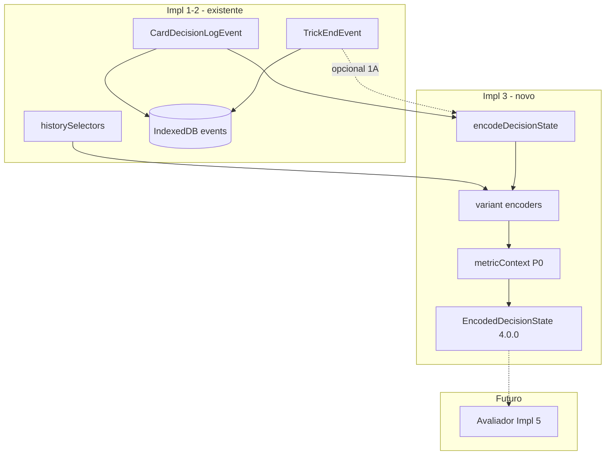

# IMPLEMENTATION_3_ENCODER_V0 — Prompt de implementação

**ID:** `IMPLEMENTATION_3_ENCODER_V0`  
**Plano pai:** [IMPLEMENTATION_PLAN_AI.md](../IMPLEMENTATION_PLAN_AI.md)  
**Design base:** [FASE_4_ENCODER_DESIGN.md](../FASE_4_ENCODER_DESIGN.md) · [FASE_3_LOGGER_DESIGN.md](../FASE_3_LOGGER_DESIGN.md) · [FASE_2A_PRIORIDADES_METRICAS.md](../FASE_2A_PRIORIDADES_METRICAS.md) · [FASE_2B_FIXTURES_METRICAS.md](../FASE_2B_FIXTURES_METRICAS.md)  
**Pré-requisitos:** [IMPLEMENTATION_1_LOGGER_V0](../implementation-prompts/IMPLEMENTATION_1_LOGGER_V0_PROMPT.md) + [1.1 hardening](../implementation-reports/IMPLEMENTATION_1_1_LOGGER_HARDENING_REPORT.md) — **H1 OK** · [IMPLEMENTATION_2_ROUND_HISTORY](../implementation-prompts/IMPLEMENTATION_2_ROUND_HISTORY_PROMPT.md) + [relatório](../implementation-reports/IMPLEMENTATION_2_ROUND_HISTORY_REPORT.md) + [H2 hotfix](../implementation-reports/IMPLEMENTATION_2_H2_HOTFIX_REPORT.md) — **H2 OK**  
**Data:** 2026-06-04  
**Scope desta prompt:** guia **executável** para Encoder v0 — **não implementar neste passo documental**.

**Princípio:** Implementation 3 cria o **tradutor** (log → `EncodedDecisionState`), não o juiz. Metáfora fechada:

| Camada | Metáfora | Impl |
|--------|----------|------|
| Logger | Gravador | 1 + 1.1 + 2 |
| **Encoder** | **Tradutor** | **3 (esta prompt)** |
| Avaliador | Juiz | 5 |

**Checkpoint humano H3** ([IMPLEMENTATION_PLAN_AI.md](../IMPLEMENTATION_PLAN_AI.md) §8): Player View honesta; campos P0 King/Spades ok — antes de Impl 4 (fixtures golden).

**Checklist gaps Impl 3:** ver [IMPLEMENTATION_2_ROUND_HISTORY_REPORT.md](../implementation-reports/IMPLEMENTATION_2_ROUND_HISTORY_REPORT.md) §8–9 (`nullable`/`missingFields`, Spades tricks/bags, King scoring parcial, multiplayer).

---

## Instruções para o agente implementador

1. Ler esta prompt **completa** + FASE_4 §4–§7 + §9 antes de editar código.
2. Implementar **apenas** o escopo §2; recusar scope creep (§2.2).
3. Código novo principalmente em `frontend/src/cardIntelligence/encoder/` — **não** misturar com `frontend/src/ai/`.
4. **Zero** alteração de regras, scoring, bots, gameplay, avaliador, memória, LLM, UI export.
5. **Não** hookar encoder em `playWithLogging`, `GameBoard`, ou hot path — só testes (+ exports dev §8).
6. Fonte de verdade = **snapshot do log** (`CardDecisionLogEvent`) — **nunca** `Game.getState()` live (lição H2 shallow copy).
7. Output **nunca** contém `classification`, `reason`, `good`/`medium`/`bad`.
8. No fim, entregar **relatório final** conforme §14.

---

# 1. Objectivo

Implementation 3 implementa **Encoder v0**: transforma eventos já gravados em **`EncodedDecisionState`** (schema **4.0.0**), pronto para avaliador (Impl 5) e fixtures golden (Impl 4).

| Entrada | Saída |
|---------|-------|
| `CardDecisionLogEvent` (principal) | `EncodedDecisionState` Player View por defeito |
| `TrickEndEvent` (opcional — §9) | Enriquecimento de winner/pontos pós-vaza |
| `roundPlayHistory` no evento + [`historySelectors`](../../frontend/src/cardIntelligence/history/historySelectors.ts) | Features derivadas recalculáveis |

**Schema:** log **3.0.0** → encode **4.0.0** (dois schemas distintos; não confundir).

**Não é:** classificar jogadas, escolher cartas, alterar bots, chamar LLM, agregar memória, export JSONL, golden fixtures 2B completos (Impl 4).

---

# 2. Escopo exacto

## 2.1 Dentro do escopo

| Área | Detalhe |
|------|---------|
| **Módulo encoder** | `frontend/src/cardIntelligence/encoder/` — router + encoders por variant |
| **Tipos** | `EncodedDecisionState`, `EncoderInput`, `ScoreContext`, `RiskContext`, `MemoryContext`, `MetricContextEntry`, encodings por jogo |
| **API** | `encodeDecisionState(input, options?)` — defaults §4 |
| **Player View** | Implementação **completa** v0 — default |
| **Engine View** | Types completos + **stub** (§4.3) — debug/test only |
| **encodeMode** | `pre_decision` \| `post_decision` tipados; v0 foco **post_decision** a partir de log |
| **metricContext** | Política **7C** (§6) — P0 incremental, **sem** veredictos |
| **Shared King** | `cardIntelligence/shared/kingObligations.ts` — `mustPlayKingHeartsNow` (§5.4, decisão **3B**) |
| **History selector** | `sevensSeenFromPlays` em `history/historySelectors.ts` (decisão **4A**) |
| **Testes** | Unit por variant + Player View leak + metricContext + stub Engine View |
| **Exports** | Mínimos em `index.ts` (decisão **8A**) |
| **Relatório + H3** | §14 |

## 2.2 Fora do escopo (recusar)

| Item | Impl futura |
|------|-------------|
| Avaliador / `DecisionEvaluationResult` | Impl 5 |
| `good` / `medium` / `bad` / `partialEvaluation` | Impl 5 |
| Memory aggregates / IndexedDB memory | Impl 6 |
| Mini-LLM / advisory | Impl 8 |
| UI debug / export JSONL | Impl 7 |
| Golden fixtures 2B completos | Impl 4 |
| Hook encoder em `playWithLogging` / `GameBoard` | **Proibido** v0 |
| Multiplayer joiner / `applyHostAction` | Gap v0 — ver §15 |
| Inferência complexa de voids | P1+ — `inferredVoids` omitido ou vazio v0 |
| Leilão King avançado | P2 |
| Shoot the moon avançado | P1+ |
| «Mandar putos à escola» / SP01 bid in-play | P1 |
| Reescrever `*Game.ts` / bots | Proibido |
| Import mutável de motores para encode live | Proibido — só log + helpers read-only |

## 2.3 Separação de responsabilidades



## 2.4 Decisões de design fechadas (utilizador)

| # | Decisão | Implicação na implementação |
|---|---------|----------------------------|
| **1A** | `TrickEndEvent` **opcional** | Router funciona só com `CardDecisionLogEvent`; `trickEndEvent?` enriquece se fornecido |
| **2A** | Engine View = **types + stub** | `viewType: 'engine'` fora de test → throw documentado; Player View única impl v0 |
| **3B** | `mustPlayKingHeartsNow` em **`shared/kingObligations.ts`** | Reutilizável por encoder + avaliador Impl 5; sem editar `KingGame` |
| **4A** | `sevensSeenFromPlays` em **`history/historySelectors.ts`** | Novo selector espelho de `acesSeenFromPlays` |
| **5C** | Spades tricks: **variantState → histórico → null** | Cadeia de fallback; `missingFields` honestos |
| **6A** | Hearts metrics: lista utilizador + **nota T07 P1** | Ver §5.3 |
| **7C** | **metricContext incremental** | Lista utilizador + T01 sempre; outros P0 FASE_2A só se campos existirem |
| **8A** | Barrel mínimo | Só `encodeDecisionState` + `EncodedDecisionState` + `EncoderInput` |
| **9C** | Sueca corte: **`canCutWithLowestTrump` + `cutRisk`** | Ambos campos; ver §5.1 |
| **10A** | Árvore ficheiros desta prompt | `encodeDecisionState.ts` na raiz de `encoder/` — **não** `encodeDecision.ts` / `variants/*` |

Resposta compacta: **1A 2A 3B 4A 5C 6A 7C 8A 9C 10A**

**Nota plano pai:** [`IMPLEMENTATION_PLAN_AI.md`](../IMPLEMENTATION_PLAN_AI.md) menciona `encodeDecision.ts`, `encoder/variants/*`, `shared/types/encodedState.ts` — **prevalece esta prompt (10A)** para Impl 3.

---

# 3. Ficheiros prováveis a criar

```
frontend/src/cardIntelligence/encoder/
├── types.ts                    # EncodedDecisionState, contexts, variant encodings
├── encodeDecisionState.ts      # router + defaults + Engine View stub
├── suecaEncoder.ts
├── spadesEncoder.ts
├── heartsEncoder.ts
├── kingEncoder.ts
├── metricContext.ts            # buildMetricContext — política 7C
├── encodeDecisionState.test.ts
├── suecaEncoder.test.ts
├── spadesEncoder.test.ts
├── heartsEncoder.test.ts
├── kingEncoder.test.ts
└── metricContext.test.ts

frontend/src/cardIntelligence/shared/
├── kingObligations.ts          # mustPlayKingHeartsNow, kingHeartsPlayed (3B)
└── kingObligations.test.ts
```

**Opcional:** `encoder/index.ts` barrel interno — não obrigatório.

---

# 4. Ficheiros prováveis a alterar

| Ficheiro | Porquê |
|----------|--------|
| [`history/historySelectors.ts`](../../frontend/src/cardIntelligence/history/historySelectors.ts) | `sevensSeenFromPlays` (4A) + teste |
| [`history/historySelectors.test.ts`](../../frontend/src/cardIntelligence/history/historySelectors.test.ts) | Cobertura sevens |
| [`cardIntelligence/index.ts`](../../frontend/src/cardIntelligence/index.ts) | Exports 8A |

### Onde **não** alterar

| Ficheiro | Motivo |
|----------|--------|
| [`playWithLogging.ts`](../../frontend/src/cardIntelligence/logger/playWithLogging.ts) | Encoder **não** corre no hot path v0 |
| [`GameBoard.tsx`](../../frontend/src/components/GameBoard.tsx) | Zero hook gameplay |
| [`*Game.ts`](../../frontend/src/models/) | Proibido editar motores |
| [`frontend/src/ai/**`](../../frontend/src/ai/) | Intocado |
| Logger types / IDB | Sem migration v0 salvo tipos importados read-only |

**Verificação CI/review:** `grep -r encodeDecisionState frontend/src` **não** deve aparecer em `GameBoard`, `playWithLogging`, motores, bots.

---

# 5. Tipos / schemas

## 5.1 Schema global — `EncodedDecisionState` (v4.0.0)

Referência canónica: [FASE_4_ENCODER_DESIGN.md](../FASE_4_ENCODER_DESIGN.md) §4.1. Implementar em [`encoder/types.ts`](../../frontend/src/cardIntelligence/encoder/types.ts).

```typescript
interface EncodedDecisionState {
  schemaVersion: '4.0.0';
  sourceEventId: string | null;
  gameId: string;
  sessionId: string;
  timestamp: string;

  variant: 'sueca' | 'spades' | 'hearts' | 'king';
  mode: string | null;
  contractId: string | null;
  phase: DecisionPhase;

  playerIndex: number;
  playerType: 'human' | 'ai' | 'remote';
  difficulty: 'easy' | 'medium' | 'hard' | null;
  viewType: 'engine' | 'player';
  encodeMode: 'pre_decision' | 'post_decision';

  roundIndex: number;
  trickIndex: number;
  turnIndex: number;

  hand: Card[];
  legalMoves: Card[];
  chosenCard: Card | null;

  currentTrick: Card[];
  trickPosition: number;
  ledSuit: Suit | null;
  trumpSuit: Suit | null;
  currentWinner: number | null;

  visiblePlayedCards: RoundPlayEntry[];
  importantCardsSeen: ImportantCardsSeen;

  scoreContext: ScoreContext;
  riskContext: RiskContext;
  memoryContext: MemoryContext;

  metricContext: MetricContextEntry[];

  availableInformation: InformationBucket;
  hiddenInformationPolicy: HiddenInformationPolicy;

  variantEncoding: SuecaEncoding | SpadesEncoding | HeartsEncoding | KingEncoding;
}
```

### Defaults fechados

| Opção | Default Impl 3 |
|-------|----------------|
| `viewType` | `'player'` |
| `encodeMode` | `'post_decision'` |
| `hiddenInformationPolicy.sourceOfTruth` | `'log'` |
| `phase` | `'play'` (v0 só encode de play events) |

### Proibições absolutas no output

- `classification`, `reason`, `good`, `medium`, `bad`, `partialEvaluation`
- Mãos adversárias exactas na Player View
- Campos `hidden` expostos como `known`

## 5.2 `EncoderInput`

```typescript
interface EncoderInput {
  event: CardDecisionLogEvent;
  trickEndEvent?: TrickEndEvent;   // opcional — 1A
  encodeMode?: 'pre_decision' | 'post_decision';
  viewType?: 'engine' | 'player';
}
```

| Modo | `chosenCard` | Uso v0 |
|------|--------------|--------|
| `post_decision` | Preenchido (= `event.chosenCard`) | **Default** — entrada avaliador futuro |
| `pre_decision` | **`null`** | Tipado + testado; sem hook bot v0 |

## 5.3 Context buckets (v0 mínimo)

```typescript
interface ScoreContext {
  raw: Record<string, unknown>;   // espelho scoreBefore filtrado Player View
  teamIndex: 1 | 2 | null;
}

interface RiskContext {
  cutRisk: 'low' | 'medium' | 'high' | null;  // Sueca; null noutros
  avoidBagMode: boolean | null;               // Spades
}

interface MemoryContext {
  schemaVersion: '6.0.0-stub';
  aggregates: [];                             // Impl 6 preenche
}

interface MetricContextEntry {
  metricId: string;
  metricNameHuman: string;
  applicable: boolean;
  neededFields: string[];
  missingFields: string[];
  confidence: number;
  reasonShort: string;                        // descritivo — NÃO veredicto
}

interface HiddenInformationPolicy {
  viewType: 'engine' | 'player';
  excludedFields: string[];
  inferenceAllowed: boolean;
  sourceOfTruth: 'log' | 'replay' | 'live_engine';
}
```

## 5.4 Engine View stub (decisão 2A)

- Tipos `EngineEncodedDecisionState` ou campos opcionais documentados em FASE_4 §3.1 (**types only** na prática v0).
- `encodeDecisionState(..., { viewType: 'engine' })`:
  - Em **testes** (`NODE_ENV=test` ou flag explícita `allowEngineView: true`): pode retornar Player View + campos extra documentados **ou** throw com mensagem «Engine View not implemented v0» — escolher **uma** abordagem e documentar no relatório.
  - **Default recomendado:** throw `EngineViewNotSupportedError` excepto quando `allowEngineView: true` em testes.
- **Nunca** usar Engine View como default em produção / futura mini-LLM.

## 5.5 Encoders por jogo — campos P0

### 5.5.1 Sueca — `SuecaEncoding`

**metricIds base (lista utilizador):** `S08, S12, S16, S19, T01, T04, T05`

| Campo | Tipo | Fonte | Notas |
|-------|------|-------|-------|
| `variant` | GameVariant | log | |
| `playerIndex` | number | log | |
| `hand` | Card[] | `handBefore` | global também |
| `legalMoves` | Card[] | log | |
| `chosenCard` | Card \| null | log / encodeMode | |
| `currentTrick` | Card[] | `trickBefore` | **não** `trickAfter` |
| `ledSuit` | Suit \| null | log | |
| `trumpSuit` | Suit \| null | log | |
| `partnerIndex` | number | derivado | `(playerIndex + 2) % 4` ou `variantFields` |
| `teamIndex` | 1 \| 2 | `variantFields` | |
| `acesSeenBySuit` | Record<Suit, boolean> | `acesSeenFromPlays(roundPlayHistory)` | history/ |
| `sevensSeenBySuit` | Record<Suit, boolean> | `sevensSeenFromPlays` | **4A — novo selector** |
| `trumpSeenCount` | number | `countTrumpInPlays` | history/ |
| `partnerWinning` | boolean \| null | derivado | parceiro = `currentWinner`; null se incalculável |
| `canWinCheaply` | boolean \| null | derivado | ∃ legal move que ganha trick com carta mínima; T04 |
| `canCutWithLowestTrump` | boolean \| null | derivado | S12 — trunfo mínimo em `legalMoves` que ganha |
| `cutRisk` | 'low' \| 'medium' \| 'high' \| null | derivado | **9C** — derivar de trick + trunfos vistos; complementa `canCutWithLowestTrump` |

**`currentWinnerBefore`/`After` no log:** podem ser **null** v0 — derivar winner via regras trick-taking read-only sobre `trickBefore` + carta escolhida; se impossível → `null` + `missingFields` em S08/S19.

**Não v0:** `inferredVoids`, `trumpControlEstimate`, `safeToFeedPartner` (opcional P1 se campos simples).

### 5.5.2 Spades — `SpadesEncoding`

**metricIds base:** `SP06, SP08, SP09, T01, T05, T06`

| Campo | Tipo | Fonte (cadeia **5C**) |
|-------|------|------------------------|
| `playerBid` | number \| null | `variantFields` / `scoreBefore.raw` |
| `teamBid` | number \| null | idem |
| `playerTricks` | number \| null | 1º variantState; 2º derivar histórico; senão null |
| `teamTricks` | number \| null | idem |
| `bags` | number \| null | variantState / score raw; null aceitável v0 |
| `spadesBroken` | boolean \| null | `variantFields` |
| `bidMet` | boolean \| null | `teamTricks >= teamBid` quando ambos known |
| `needTricks` | number \| null | `max(0, teamBid - teamTricks)` |
| `avoidBagMode` | boolean \| null | derivado — bid met + risco bag |
| `partnerWinning` | boolean \| null | derivado winner + partner seat |

**Nota Impl 2:** tricks incrementam em `finishTrick` (Continue) — encoder aceita null + gap; preferir snapshot em `scoreBefore.raw` se logger passar a incluir.

### 5.5.3 Hearts — `HeartsEncoding`

**metricIds base (6A):** `H01, H05, H11, H13, T01, T06, T07`

**Nota T07:** classificado **P1** em FASE_2A — incluído na lista utilizador com nota «P1 alargado»; `metricContext` entry com `confidence` moderada se aplicável.

| Campo | Tipo | Fonte |
|-------|------|-------|
| `heartsBroken` | boolean \| null | `variantFields` |
| `queenSpadesPlayed` | boolean | scan `roundPlayHistory` |
| `pointsInTrick` | number \| null | `heartsTrickPoints(trickBefore + chosenCard)` ou TrickEnd |
| `dangerousCardsInHand` | Card[] | Q♠, ♥, etc. — regra penalty read-only |
| `trickIsSafeAndPointless` | boolean \| null | H13 — trick ours, 0 pts |
| `canCleanDangerousCard` | boolean \| null | H13/T07 — pode descartar perigo legalmente |

**Não expor** `canWinCheaply` genérico (FASE_4 §6.3).

### 5.5.4 King — `KingEncoding` (contrato-first)

**metricIds base:** `K00, K01, K02, K03, K08, K09, K12, T01, T04, T06`

**Ordem de preenchimento:** contrato → obrigações legais → penalizações → fase local.

| Campo | Tipo | Fonte |
|-------|------|-------|
| `contractId` | string \| null | `variantFields` / log.contract |
| `contractType` | string \| null | `variantFields` |
| `festaPhase` | string \| null | `variantFields` |
| `trumpSuit` | Suit \| null | log |
| `noTrump` | boolean \| null | `variantFields` |
| `kingHeartsPlayed` | boolean | histórico plays |
| `mustPlayKingHeartsNow` | boolean | **`shared/kingObligations.ts` (3B)** |
| `cannotLeadHearts` | boolean \| null | derivado regra + legalMoves |
| `penaltyMap` | Record<string, number> \| null | contrato read-only |
| `contractPenaltiesInTrick` | number \| null | derivado trick |
| `nulosMode` | boolean \| null | `variantFields` / contrato |
| `isLastTwoPhase` | boolean \| null | trick 11–12 King PT |
| `trickNumberForLastTwo` | number \| null | 1-based |

#### `mustPlayKingHeartsNow` — regra operacional (P0 · K02)

Implementar em [`kingObligations.ts`](../../frontend/src/cardIntelligence/shared/kingObligations.ts) — **4 condições** FASE_4 §6.4 + [`king.md`](../../rules/king.md):

1. Jogador **tem** K♥ na mão;
2. **É legal** jogar K♥ agora (`K♥ ∈ legalMoves`);
3. **Primeira** oportunidade legal (K♥ nunca jogado numa ocasião legal anterior na ronda/partida);
4. Regra King obriga jogá-lo nessa oportunidade.

`false` em qualquer outro caso. **Distinção:** `kingHeartsPlayed` = histórico; `mustPlayKingHeartsNow` = obrigação **activa neste instante**.

**Dual-engine:** routing via `variantFields.syntheticMode` / preset — testes King PT **e** Simplified quando aplicável.

---

# 6. MetricContext — política incremental (7C)

O encoder **prepara** contexto; o avaliador **julga** (Impl 5).

## 6.1 Regras

| # | Regra |
|---|-------|
| 1 | **Sempre** incluir entrada **T01** em encode de `phase: 'play'` |
| 2 | Incluir entradas da **lista utilizador** por variant (§5.5) |
| 3 | Outros P0 FASE_2A: incluir **só se** todos `neededFields` estão preenchidos (não null); senão `applicable: false` + `missingFields` **ou** omitir entrada |
| 4 | **Não** forçar cobertura total do catálogo FASE_2A v0 |
| 5 | Expandir além de [`suggestMetricCandidates.ts`](../../frontend/src/cardIntelligence/logger/suggestMetricCandidates.ts) (logger: subconjunto parcial) |
| 6 | `applicable: true` ≠ boa jogada; `reasonShort` descritivo, **nunca** veredicto |

## 6.2 Listas metricIds por variant (base utilizador)

| Variant | metricIds |
|---------|-----------|
| Sueca | S08, S12, S16, S19, T01, T04, T05 |
| Spades | SP06, SP08, SP09, T01, T05, T06 |
| Hearts | H01, H05, H11, H13, T01, T06, T07 *(T07: nota P1)* |
| King | K00, K01, K02, K03, K08, K09, K12, T01, T04, T06 |

## 6.3 Triggers resumidos (FASE_4 §7.4)

| ID | Trigger encoder |
|----|-----------------|
| T01 | Sempre em play |
| T04 | `canWinCheaply` (Sueca) ou `canCleanDangerousCard` (Hearts) |
| T05 | `partnerWinning` (Sueca/Spades) |
| T06 | `bidMet` / nulos King |
| S08 | `canWinCheaply` && contexto trick |
| S12 | `canCutWithLowestTrump` / `cutRisk` |
| S16 | leading + 7 in hand + !`acesSeenBySuit[suit]` |
| S19 | `partnerWinning` |
| SP06 | `partnerWinning` |
| SP08 | void + spades legais |
| SP09 | `avoidBagMode` |
| H01 | `pointsInTrick` / pontos |
| H13 | `trickIsSafeAndPointless` |
| K02 | `mustPlayKingHeartsNow` |

---

# 7. Integração logger / history

## 7.1 Mapeamento `CardDecisionLogEvent` → `EncodedDecisionState`

| Origem (log) | Destino |
|--------------|---------|
| `eventId` | `sourceEventId` |
| `handBefore` | `hand` |
| `trickBefore` | `currentTrick` |
| `trickBefore.length` | `trickPosition` |
| `trickAfter` | contexto pós-jogada apenas — **não** substituir `currentTrick` em encode pre-decision |
| `roundPlayHistory` | `visiblePlayedCards` (Player View = mesmo array; sem mãos ocultas) |
| `variantFields` | seed `variantEncoding` |
| `scoreBefore` | `scoreContext.raw` |
| `currentWinnerBefore` | `currentWinner` ou derivar; null → recalcular ou null |
| `metricsCandidateIds` | **ignorar** para encode — encoder recalcula metricContext completo |

## 7.2 `TrickEndEvent` opcional (1A)

| Cenário | Comportamento |
|---------|---------------|
| Só `CardDecisionLogEvent` | **Suficiente** v0 — router produz encode válido |
| + `trickEndEvent` | Enriquece: `pointsInTrick`, `winnerIndex` fechado, `variantFields` TrickEnd (ex. `partnerWinning` pós-4.ª carta) |
| Router | **Não exige** TrickEnd; **não** falha se ausente |

**`partnerWinning`:** preferir TrickEnd.variantFields se presente na 4.ª carta; senão derivar de winner + partnerIndex.

## 7.3 Helpers existentes — reutilizar

| Helper | Ficheiro |
|--------|----------|
| `acesSeenFromPlays` | history/historySelectors.ts |
| `countTrumpInPlays` | history/historySelectors.ts |
| `heartsTrickPoints` | history/historySelectors.ts |
| `importantCardsFromPlays` | history/historySelectors.ts |
| `sevensSeenFromPlays` | **criar** history/historySelectors.ts (4A) |

## 7.4 Player View — campos excluídos

`hiddenInformationPolicy.excludedFields` deve incluir pelo menos:

- `opponentHands`
- `deckRemaining`
- voids confirmados só pela engine

Teste: output JSON **não** contém arrays de cartas de adversários não jogadas.

---

# 8. Sueca / Spades / Hearts / King — notas implementação

## 8.1 Sueca

- `partnerIndex = (playerIndex + 2) % 4`
- Winner trick: regras Sueca read-only (naipe led, trunfo, rank) — **não** importar `Game.evaluateTrick` mutável
- `canCutWithLowestTrump` + `cutRisk` coerentes (9C)

## 8.2 Spades

- Cadeia **5C** para tricks/bags
- `needTricks`, `bidMet` só quando inputs non-null

## 8.3 Hearts

- `dangerousCardsInHand`: Q♠, ♥ (lista mínima v0)
- Moon tracking: **null** / omitido v0 (gap Impl 2 §8)

## 8.4 King

- Contrato-first no encoder e no `metricContext` ordering
- Testes: cenário `mustPlayKingHeartsNow === true` **e** `false`
- PT vs Simplified: parametrizar ou fixtures separados

---

# 9. Testes mínimos

```bash
cd frontend
CI=true npm test -- --watchAll=false --testPathPattern=cardIntelligence
CI=true npm run build
```

| Teste | Assert |
|-------|--------|
| Encode básico Sueca | `schemaVersion === '4.0.0'`, campos globais preenchidos |
| Player View leak | sem mãos adversárias; `excludedFields` presente |
| Sueca P0 | trunfo, parceiro, `acesSeenBySuit`, `sevensSeenBySuit`, `canCutWithLowestTrump`, `cutRisk` |
| Spades P0 | bid, `needTricks`, `bidMet`; fallback histórico quando variantState ausente (5C) |
| Hearts P0 | Q♠ played, `pointsInTrick`, `dangerousCardsInHand` |
| King P0 | `mustPlayKingHeartsNow` true/false; contrato-first fields |
| metricContext | T01 sempre; lista utilizador; **zero** classification/reason no output |
| post_decision | `chosenCard` preenchido |
| pre_decision | `chosenCard === null` |
| Engine View stub | throw fora de test / `allowEngineView` (2A) |
| sevensSeenFromPlays | history selector unit test |
| kingObligations | unit test 4 condições |
| Regressão logger/history | suites Impl 1–2 continuam verdes |
| No hot path | grep: encoder não importado em GameBoard/playWithLogging |

**Fixtures:** construir `CardDecisionLogEvent` mínimos **inline** nos testes — **não** depender Impl 4 golden fixtures.

---

# 10. Critérios de sucesso

- [ ] `CI=true npm run build` — PASS
- [ ] `CI=true npm test --testPathPattern=cardIntelligence` — PASS
- [ ] Gameplay idêntico — encoder **não** invocado durante partida normal
- [ ] Output sem `classification` / `reason` / veredictos
- [ ] Player View honesta — teste leak PASS
- [ ] **H3 manual (Francisco):**
  - [ ] Encode de eventos reais IndexedDB faz sentido (solo/host local)
  - [ ] King `mustPlayKingHeartsNow` plausível em cenários conhecidos
  - [ ] Spades bid/bags/needTricks coerentes ou null documentado
  - [ ] Zero alteração UX

---

# 11. Checkpoint H3

Validar **antes de Impl 4**:

1. Player View sem informação oculta contaminada
2. Campos P0 King (`mustPlayKingHeartsNow`, contrato) e Spades (bid/tricks) aceites
3. `metricContext` listado sem classificações
4. Encoder isolado do hot path confirmado

---

# 12. Riscos

| Risco | Mitigação |
|-------|-----------|
| Player View leak | teste explícito + `hiddenInformationPolicy.excludedFields` |
| Derivados inventados | `boolean \| null`; `missingFields` honestos |
| King dual-engine | routing `syntheticMode` / variantFields; testes PT + Simplified |
| Encoder no hot path | grep CI; zero imports GameBoard/playWithLogging |
| Log stale / shallow copy | fonte = evento log imutável; nunca live `getState()` |
| Spades tricks ausentes | cadeia 5C + missingFields |
| Duplicar lógica motor | helpers read-only mínimos em encoder/shared/history |
| Engine View leak | stub 2A; default player |
| metricContext scope creep | política 7C — incremental |

---

# 13. Relatório final esperado após implementação

Criar [`docs/ai/implementation-reports/IMPLEMENTATION_3_ENCODER_V0_REPORT.md`](../implementation-reports/IMPLEMENTATION_3_ENCODER_V0_REPORT.md):

1. Ficheiros criados / alterados
2. Resumo técnico — router, encoders, metricContext, kingObligations, sevens selector
3. Schema `EncodedDecisionState` 4.0.0 — campos null por variant
4. Decisões **1A–10A** confirmadas
5. Testes — comando + contagem suites/tests
6. **H3** — checklist Francisco
7. Confirmação gameplay / bots / regras intactos; encoder **não** no hot path
8. Gaps para **Impl 4** (fixtures golden, Engine View completa)
9. Issues deferidos (multiplayer, H1-D1, voids complexos)

---

# 14. Decisões fechadas + gaps deferidos

## 14.1 Decisões fechadas (não reabrir v0)

Ver §2.4 — **1A 2A 3B 4A 5C 6A 7C 8A 9C 10A**.

## 14.2 Gaps deferidos (não resolver Impl 3)

| ID | Item | Nota |
|----|------|------|
| MP-v0 | Multiplayer `applyHostAction` / joiner | Logs incompletos — missingFields aceitável |
| H1-D1 | React `GameActions` | Deferido |
| Impl-4 | Golden fixtures 2B | Snapshots encoder — próxima impl |
| P1 | voids inferidos complexos, moon, SP01 bid | Campos null ou omitidos |
| P2 | Engine View completa | Types + stub v0 (2A) |
| Plan-AI | Nomes ficheiros plano pai | Prevalece 10A desta prompt |

---

## Referências

- [IMPLEMENTATION_1_LOGGER_V0_REPORT.md](../implementation-reports/IMPLEMENTATION_1_LOGGER_V0_REPORT.md)
- [IMPLEMENTATION_1_1_LOGGER_HARDENING_REPORT.md](../implementation-reports/IMPLEMENTATION_1_1_LOGGER_HARDENING_REPORT.md)
- [IMPLEMENTATION_2_ROUND_HISTORY_REPORT.md](../implementation-reports/IMPLEMENTATION_2_ROUND_HISTORY_REPORT.md) §8–9
- [IMPLEMENTATION_2_H2_HOTFIX_REPORT.md](../implementation-reports/IMPLEMENTATION_2_H2_HOTFIX_REPORT.md)
- [FASE_4_ENCODER_DESIGN.md](../FASE_4_ENCODER_DESIGN.md) §4–§7, §9
- [FASE_2A_PRIORIDADES_METRICAS.md](../FASE_2A_PRIORIDADES_METRICAS.md) §encoder P0
- [CardDecisionLogEvent](../../frontend/src/cardIntelligence/shared/types/logEvents.ts)
- [historySelectors](../../frontend/src/cardIntelligence/history/historySelectors.ts)

---

## Histórico

| Versão | Data | Nota |
|--------|------|------|
| 1.0 | 2026-06-04 | Prompt executável Impl 3 — pós H1 + H2; decisões 1A–10A fechadas |
