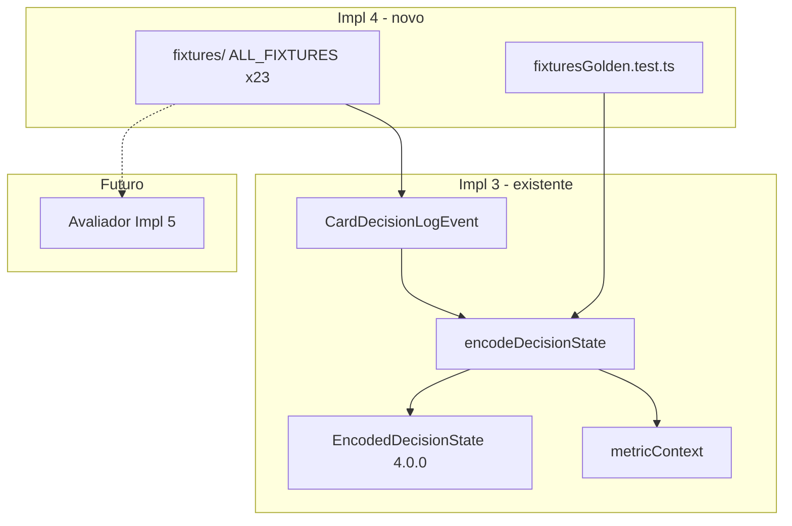

# IMPLEMENTATION_4_FIXTURES_2B — Prompt de implementação

**ID:** `IMPLEMENTATION_4_FIXTURES_2B`  
**Plano pai:** [IMPLEMENTATION_PLAN_AI.md](../IMPLEMENTATION_PLAN_AI.md) §Impl 4  
**Design base:** [FASE_2A_PRIORIDADES_METRICAS.md](../FASE_2A_PRIORIDADES_METRICAS.md) · [FASE_2B_FIXTURES_METRICAS.md](../FASE_2B_FIXTURES_METRICAS.md) · [FASE_2B_ARQUIVO_FIXTURES.md](../FASE_2B_ARQUIVO_FIXTURES.md) (referência only — **não** implementar arquivados) · [FASE_4_ENCODER_DESIGN.md](../FASE_4_ENCODER_DESIGN.md) §9 · [FASE_5_AVALIADOR_DESIGN.md](../FASE_5_AVALIADOR_DESIGN.md) (preparação only)  
**Pré-requisitos:** [IMPLEMENTATION_3_ENCODER_V0](../implementation-prompts/IMPLEMENTATION_3_ENCODER_V0_PROMPT.md) + [relatório](../implementation-reports/IMPLEMENTATION_3_ENCODER_V0_REPORT.md) — **código concluído** (incl. hotfix King §8.1 Impl 3.1: `kingPt.contract`, `roundPlayHistoryBeforeCurrentDecision`)  
**Data:** 2026-06-04  
**Scope desta prompt:** guia **executável** para Fixtures 2B golden — **não implementar neste passo documental**.

**Princípio:** Implementation 4 cria o **corpus de teste** (fixtures → encode), não o juiz. Metáfora fechada:

| Camada | Metáfora | Impl |
|--------|----------|------|
| Logger | Gravador | 1 + 1.1 + 2 |
| Encoder | Tradutor | 3 + 3.1 |
| **Fixtures 2B** | **Golden cases** | **4 (esta prompt)** |
| Avaliador | Juiz | 5 |

**Checkpoint humano H4** ([IMPLEMENTATION_PLAN_AI.md](../IMPLEMENTATION_PLAN_AI.md) §8): fixtures 2B representados em testes — **após** implementação Impl 4 em código; Francisco valida amostra.

**H3 manual:** recomendado antes de **correr** a implementação Impl 4 em código; **não bloqueia** a redacção deste markdown nem a implementação se Impl 3 unit tests passam.

**Supersede plano-mãe (golden):** [`IMPLEMENTATION_PLAN_AI.md`](../IMPLEMENTATION_PLAN_AI.md) §Impl 4 menciona «snapshots JSON». **Esta prompt prevalece:** golden = **asserts estruturados** (`encodeDecisionState` + `metricContext` + paths em `variantEncoding`), **sem** ficheiros `.snap` nem JSON gigantes.

**Registry fixo:** `ALL_FIXTURES` tem **exactamente 23 entradas** — IDs de [FASE_2B_FIXTURES_METRICAS.md](../FASE_2B_FIXTURES_METRICAS.md) (20 jogo + 3 transversais). Testes parametrizados (T01×4 variants, T06×3 variants, T04-King opcional) **não** entram no array.

---

## Instruções para o agente implementador

1. Ler esta prompt **completa** + FASE_2B (23 activos) + FASE_4 §9 antes de editar código.
2. Implementar **apenas** o escopo §2; recusar scope creep (§2.2).
3. Código novo em `frontend/src/cardIntelligence/fixtures/` + testes; extensões mínimas em `encoder/metricContext.ts`.
4. **Zero** alteração de regras, scoring, bots, gameplay, avaliador, memória, LLM, UI export.
5. **Não** hookar fixtures em `playWithLogging`, `GameBoard`, ou hot path.
6. Fonte de cada fixture = **`CardDecisionLogEvent` sintético** via `buildFixtureEvent` / `createTestLogEvent` — **nunca** `Game.getState()` live.
7. Player View por defeito; **sem** mãos adversárias; **sem** dados escondidos inventados.
8. King **contract-first:** `scoreBefore.raw.variantState.kingPt.contract` (lição Impl 3.1).
9. Fixtures King **K02:** incluir `roundPlayHistory` com entrada duplicada da jogada actual (logger-realista).
10. **Não** classificar `good` / `medium` / `bad`; output encode **nunca** inclui `classification` / `reason`.
11. Ordem sugerida de commits (mesmo PR OK): subset P0 → restantes 23 → metricContext gaps → testes parametrizados.
12. No fim, entregar **relatório final** conforme §13.

---

# 1. Objectivo

Implementation 4 transforma os **23 fixtures prioritários** da Fase 2B em **golden cases** que validam:

| # | Validação |
|---|-----------|
| 1 | Estado mínimo encodable (`CardDecisionLogEvent` sintético por fixture) |
| 2 | `encodeDecisionState({ event })` **não lança** |
| 3 | `metricContext` contém a **métrica principal** com política Tier A/B (§14) |
| 4 | Campos `variantEncoding` / top-level alinhados com FASE_4 §9 |
| 5 | Player View honesta (sem leak de mãos adversárias) |
| 6 | Ausência de veredictos (`classification`, `reason`, `good`/`medium`/`bad`) |

**Não é:** avaliar jogadas (Impl 5), memória (Impl 6), LLM (Impl 8), export (Impl 7), alterar bots ou regras, implementar os ~40 fixtures arquivados.

**Prepara Impl 5:** o avaliador importará `ALL_FIXTURES` / `getFixtureById` para comparar `chosenCard` vs alternativas legais.

---

# 2. Escopo exacto

## 2.1 Dentro do escopo

| Área | Detalhe |
|------|---------|
| **Módulo fixtures** | `frontend/src/cardIntelligence/fixtures/` — types, catálogo por jogo, registry |
| **Registry** | `ALL_FIXTURES`: **23** entradas; `getFixtureById(id)`; `fixtureIds` únicos |
| **Golden tests** | `fixtures/fixturesGolden.test.ts` (+ asserts Tier A/B) |
| **Testes parametrizados** | T01 legalidade × 4 variants; T06 × spades/hearts/king; T04-King opcional — **fora** do array |
| **metricContext gaps** | Novos `MetricDef` em [`metricContext.ts`](../../frontend/src/cardIntelligence/encoder/metricContext.ts): **SP01, SP14, S25, K10, H10** (ausentes hoje) |
| **Helpers** | `buildFixtureEvent()` — wrap `createTestLogEvent`, `source: 'fixture'` |
| **Exports opcionais** | `ALL_FIXTURES` em [`index.ts`](../../frontend/src/cardIntelligence/index.ts) — dev/test only |
| **Relatório + H4** | §13 |

## 2.2 Fora do escopo (recusar)

| Item | Impl futura |
|------|-------------|
| Avaliador / `DecisionEvaluationResult` | Impl 5 |
| `good` / `medium` / `bad` / `partialEvaluation` | Impl 5 |
| Memory aggregates | Impl 6 |
| Mini-LLM / advisory | Impl 8 |
| UI debug / export JSONL | Impl 7 |
| Fixtures arquivados (~40) | FASE_2B_ARQUIVO — referência only |
| Snapshots Jest `.snap` / JSON golden files | **Recusado** — asserts estruturados |
| Hook fixtures em gameplay | **Proibido** |
| Reescrever `*Game.ts` / bots / estratégias | Proibido |
| `kingSimplified` contract fallback | Fora — só `kingPt` (Impl 3.1) |
| Engine View completa | P2 |
| Multiplayer logs | MP-v0 |

## 2.3 Separação de responsabilidades



## 2.4 Ordem de implementação sugerida (mesmo PR permitido)

1. **Subset P0:** T01, K02, K03, SP09, S08 (+ types, registry, test harness)
2. **Restantes fixtures** até 23 entradas
3. **metricContext** — SP01, SP14, S25, K10, H10
4. **Testes parametrizados** T01×4, T06×3, T04-King opcional
5. Relatório + H4

---

# 3. Ficheiros prováveis a criar

```
frontend/src/cardIntelligence/fixtures/
├── types.ts                 # FixtureCase, FixtureExpected, FixtureTier, helpers
├── buildFixtureEvent.ts     # wrap createTestLogEvent, source: 'fixture'
├── suecaFixtures.ts         # S08, S16, S19, S12, S25
├── spadesFixtures.ts        # SP01, SP06, SP09, SP08, SP14
├── heartsFixtures.ts        # H01, H05, H13, H11, H10
├── kingFixtures.ts          # K00, K02, K03, K01, K10
├── transversalFixtures.ts   # T01, T04, T06
├── index.ts                 # ALL_FIXTURES, getFixtureById, FIXTURE_IDS
└── fixturesGolden.test.ts   # golden + parametrized blocks
```

**Convenções:**

- Um ficheiro por jogo + transversal + index + teste.
- Cada fixture exportada como constante nomeada (`S08_FIXTURE`, …) e agregada em `ALL_FIXTURES`.
- IDs **exactos** da FASE_2B (case-sensitive): `S08`, `SP01`, `K02`, `T01`, …

---

# 4. Ficheiros prováveis a alterar

| Ficheiro | Alteração |
|----------|-----------|
| [`encoder/metricContext.ts`](../../frontend/src/cardIntelligence/encoder/metricContext.ts) | +5 MetricDef (SP01, SP14, S25, K10, H10) |
| [`encoder/metricContext.test.ts`](../../frontend/src/cardIntelligence/encoder/metricContext.test.ts) | Smoke dos novos MetricDef |
| [`cardIntelligence/index.ts`](../../frontend/src/cardIntelligence/index.ts) | Export opcional `ALL_FIXTURES`, `getFixtureById` |

**Não alterar:** `playWithLogging.ts`, `GameBoard`, motores `*Game.ts`, bots `*Strategy.ts`, logger hot path.

---

# 5. Tipos / schemas

## 5.1 `FixtureTier`

```typescript
export type FixtureTier = 'A' | 'B';
// A = primary metric applicable === true obrigatório
// B = allowPartial (S25, H10, SP14 parcial) — ver §14
```

## 5.2 `FixtureExpected`

```typescript
export interface FixtureMetricExpectation {
  metricId: string;
  applicable: boolean;
  /** Tier B: true permite applicable false com gap documentado */
  allowPartial?: boolean;
  reasonShortIncludes?: string;
}

export interface FixtureExpected {
  metricContext: FixtureMetricExpectation;
  /** Paths dot-notation ou função assert sobre EncodedDecisionState */
  encodedFields?: Record<string, unknown>;
  /** Asserts sobre variantEncoding específico */
  variantFields?: Record<string, unknown>;
  secondaryMetrics?: FixtureMetricExpectation[]; // ex. S08 → T04
}
```

## 5.3 `FixtureCase`

```typescript
export interface FixtureCase {
  fixtureId: string;           // único; ∈ FASE_2B 23 IDs
  variant: GameVariant;
  primaryMetricId: string;
  level: 'medium' | 'hard';
  tier: FixtureTier;
  humanNote: string;           // 1–2 frases; de FASE_2B
  event: CardDecisionLogEvent;
  expected: FixtureExpected;
}
```

## 5.4 `buildFixtureEvent`

```typescript
import { createTestLogEvent } from '../encoder/encodeDecisionState';
import { CardDecisionLogEvent } from '../shared/types/logEvents';

export function buildFixtureEvent(
  overrides: Partial<CardDecisionLogEvent> & Pick<CardDecisionLogEvent, 'variant'>
): CardDecisionLogEvent {
  return createTestLogEvent({
    source: 'fixture',
    schemaVersion: '3.0.0',
    classification: 'unknown',
    reason: null,
    ...overrides,
  });
}
```

**Regras:**

- `chosenCard` ∈ `legalMoves` — validado em teste global.
- `source: 'fixture'` **obrigatório** (tipo [`LogSource`](../../frontend/src/cardIntelligence/shared/types/logEvents.ts)).
- Sem `opponentHands`, `deckRemaining`, `confirmedVoids` no evento.

## 5.5 Registry

```typescript
export const ALL_FIXTURES: FixtureCase[] = [
  /* exactamente 23 — ver §6 */
];

export function getFixtureById(id: string): FixtureCase | undefined {
  return ALL_FIXTURES.find((f) => f.fixtureId === id);
}

export const FIXTURE_IDS = ALL_FIXTURES.map((f) => f.fixtureId);
```

**Assert de sanidade (teste):** `ALL_FIXTURES.length === 23` e `new Set(FIXTURE_IDS).size === 23`.

---

# 6. Catálogo — 23 fixtures

Fonte narrativa: [FASE_2B_FIXTURES_METRICAS.md](../FASE_2B_FIXTURES_METRICAS.md). Campos encoder mínimos: [FASE_4_ENCODER_DESIGN.md](../FASE_4_ENCODER_DESIGN.md) §9.

## 6.1 Sueca (5)

| ID | Primary | Tier | Level | Encoded fields chave | humanNote (resumo) |
|----|---------|------|-------|----------------------|-------------------|
| **S08** | S08 | A | medium | `canWinCheaply`, `cutRisk`; secundário **T04** | Ganhar barato com risco corte; ver S08 FASE_2B |
| **S16** | S16 | A | medium | `sevensSeenBySuit`, `acesSeenBySuit`; `trickPosition === 0` | Não abrir manilha antes do Ás sair |
| **S19** | S19 | A | medium | `partnerWinning === true` | Parceiro ganha vaza segura — jogar baixo |
| **S12** | S12 | A | medium | `canCutWithLowestTrump` | Cortar com trunfo mínimo |
| **S25** | S25 | **B** | hard | `partnerIndex`, `cutRisk`, leading | Destrunfar sem prejudicar parceiro — avaliação parcial FASE_2B |

## 6.2 Spades (5)

| ID | Primary | Tier | Level | Encoded fields chave | humanNote (resumo) |
|----|---------|------|-------|----------------------|-------------------|
| **SP01** | SP01 | A | medium | `playerBid`, `needTricks`, `teamBid` | Bid conservador — **proxy play-phase** (§14) |
| **SP06** | SP06 | A | medium | `partnerWinning === true` | Proteger parceiro — jogar baixo |
| **SP09** | SP09 | A | medium | `avoidBagMode === true`, `bidMet === true` | Evitar bags pós-bid cumprido |
| **SP08** | SP08 | A | medium | `needTricks`, `spadesBroken` | Cortar com espada mínima |
| **SP14** | SP14 | **B** | hard | `bidMet`, `needTricks`, scoreContext | Quebrar bid adversária alta |

## 6.3 Hearts (5)

| ID | Primary | Tier | Level | Encoded fields chave | humanNote (resumo) |
|----|---------|------|-------|----------------------|-------------------|
| **H01** | H01 | A | medium | `pointsInTrick` | Evitar pontos desnecessários |
| **H05** | H05 | A | medium | `dangerousCardsInHand.length > 0` | Pass perigosos — **proxy play** (§14) |
| **H13** | H13 | A | medium | `trickIsSafeAndPointless === true` | Limpar perigo vaza nossa — **não** T04 default |
| **H11** | H11 | A | medium | `queenSpadesPlayed`, dangerous hand | Q♠ perigo máximo |
| **H10** | H10 | **B** | hard | `heartsBroken`, history moon-threat | Bloquear shoot the moon |

## 6.4 King (5)

| ID | Primary | Tier | Level | Encoded fields chave | humanNote (resumo) |
|----|---------|------|-------|----------------------|-------------------|
| **K00** | K00 | A | medium | `contractId` via `kingPt.contract` | Contrato activo define objectivo |
| **K02** | K02 | A | medium | `mustPlayKingHeartsNow === true`, history duplicado | K♥ obrigatório 1.ª oportunidade |
| **K03** | K03 | A | medium | `cannotLeadHearts === true`, leading | Não puxar copas com alternativa |
| **K01** | K01 | A | medium | `penaltyMap` | Descarte consciente por contrato |
| **K10** | K10 | **B** | hard | `isLastTwoPhase`, `trickNumberForLastTwo` | Duas últimas — trick 11/12 |

## 6.5 Transversais (3 entradas no registry)

| ID | Primary | Tier | Variant no evento | Notas |
|----|---------|------|---------------------|-------|
| **T01** | T01 | A | **sueca** (default) | Legalidade — teste parametrizado ×4 variants **fora** do array |
| **T04** | T04 | A | **sueca** | Ganhar barato condicional — **não** Hearts; teste King opcional |
| **T06** | T06 | A | **spades** | Jogar baixo perder/evitar penalização — teste parametrizado spades/hearts/king |

**S08 + T04:** `primaryMetricId: 'S08'`; em `expected.secondaryMetrics` incluir `{ metricId: 'T04', applicable: true }`.

---

# 7. Construção de eventos sintéticos

## 7.1 Regras gerais

| Regra | Detalhe |
|-------|---------|
| Cartas | `{ suit, rank, id }` estáveis — ex. `'Kh'`, `'7d'`, `'2c'` |
| Player View | Default; sem mãos adversárias no evento |
| Histórico | `roundPlayHistory` mínimo para aces/sevens/Q♠/K♥ já vistos |
| Impl 3.1 King | `scoreBefore.raw.variantState.kingPt.contract` — **não** `variantFields.contractId` alone |
| K02 | `roundPlayHistory` inclui entrada **igual** à jogada actual (simula logger) |
| Spades | `scoreBefore.raw.variantState.spades` — padrão Impl 3 |
| Sueca | `trumpSuit`, `variantFields.partnerIndex`, `teamIndex` |
| Hearts | `heartsBroken`, `roundPlayHistory` para Q♠ |

## 7.2 Proxies documentados (não são bugs)

| Fixture | FASE_2B fase | Proxy Impl 4 |
|---------|--------------|--------------|
| **SP01** | bid | Evento **play** com snapshot Spades (`playerBid`, `teamBid`, tricks) — avaliação bid completa = Impl 5 |
| **H05** | pass | Evento **play** com `dangerousCardsInHand` preenchido — pass real = Impl 5 |

Encoder v0 fixa `phase: 'play'` em [`encodeDecisionState.ts`](../../frontend/src/cardIntelligence/encoder/encodeDecisionState.ts) — fixtures não tentam mudar fase no encode v0.

## 7.3 Exemplo stub — S08 (ilustrativo; copiar/adaptar na implementação)

```typescript
const qd = { suit: 'diamonds' as const, rank: 'Q' as const, id: 'Qd' };
const kd = { suit: 'diamonds' as const, rank: 'K' as const, id: 'Kd' };
const ad = { suit: 'diamonds' as const, rank: 'A' as const, id: 'Ad' };
const n9 = { suit: 'diamonds' as const, rank: '9' as const, id: '9d' };
const c3 = { suit: 'clubs' as const, rank: '3' as const, id: '3c' };

export const S08_FIXTURE: FixtureCase = {
  fixtureId: 'S08',
  variant: 'sueca',
  primaryMetricId: 'S08',
  level: 'medium',
  tier: 'A',
  humanNote: 'Parceiro liderou Q♦; adversário K♦; ganhar barato vs risco corte.',
  event: buildFixtureEvent({
    variant: 'sueca',
    playerIndex: 0,
    turnIndex: 2,
    trickIndex: 3,
    trumpSuit: 'clubs',
    handBefore: [ad, n9, c3],
    legalMoves: [ad, n9],
    chosenCard: n9,
    trickBefore: [qd, kd],
    ledSuit: 'diamonds',
    variantFields: { partnerIndex: 2, teamIndex: 1 },
    roundPlayHistory: [],
  }),
  expected: {
    metricContext: { metricId: 'S08', applicable: true },
    secondaryMetrics: [{ metricId: 'T04', applicable: true }],
    variantFields: {
      canWinCheaply: true,
      cutRisk: expect.any(String), // 'low' | 'medium' | 'high'
    },
  },
};
```

## 7.4 Exemplo stub — K02 (ilustrativo)

```typescript
const kh = { suit: 'hearts' as const, rank: 'K' as const, id: 'Kh' };
const h3 = { suit: 'hearts' as const, rank: '3' as const, id: '3h' };
const h2 = { suit: 'hearts' as const, rank: '2' as const, id: '2h' };

const playEntry = {
  roundIndex: 0,
  trickIndex: 2,
  turnIndex: 1,
  playerIndex: 0,
  card: kh,
};

export const K02_FIXTURE: FixtureCase = {
  fixtureId: 'K02',
  variant: 'king',
  primaryMetricId: 'K02',
  level: 'medium',
  tier: 'A',
  humanNote: 'no_king_hearts: 1.ª oportunidade legal com K♥ na mão — obrigatório jogar.',
  event: buildFixtureEvent({
    variant: 'king',
    playerIndex: 0,
    turnIndex: 1,
    trickIndex: 2,
    handBefore: [kh, h3],
    legalMoves: [kh, h3],
    chosenCard: kh,
    trickBefore: [h2],
    ledSuit: 'hearts',
    contract: null,
    variantFields: {
      contractId: null,
      contractType: null,
      festaPhase: null,
      noTrump: false,
      syntheticMode: false,
    },
    roundPlayHistory: [playEntry], // duplicado logger-realista
    scoreBefore: {
      raw: {
        variantState: {
          kingPt: { contract: 'no_king_hearts', trickNumber: 3 },
        },
      },
    },
  }),
  expected: {
    metricContext: {
      metricId: 'K02',
      applicable: true,
      reasonShortIncludes: 'Obrigação K♥',
    },
    variantFields: {
      contractId: 'no_king_hearts',
      mustPlayKingHeartsNow: true,
      kingHeartsPlayed: false,
    },
  },
};
```

---

# 8. MetricContext — extensões (5 MetricDef)

Adicionar em [`metricContext.ts`](../../frontend/src/cardIntelligence/encoder/metricContext.ts). **`neededFields` ⊆ campos reais do encoding v0** — nunca inventar campos no evento só para passar teste.

## 8.1 SP01 (Spades)

```typescript
{
  metricId: 'SP01',
  metricNameHuman: 'Bid conservador / need tricks',
  neededFields: ['playerBid', 'needTricks'],
  isApplicable: (_, e) =>
    (e as SpadesEncoding).playerBid !== null &&
    (e as SpadesEncoding).needTricks !== null,
  reasonShort: () => 'Contexto bid (proxy play)',
  confidence: () => 0.7,
}
```

## 8.2 SP14 (Spades) — Tier B target applicable se campos OK

```typescript
{
  metricId: 'SP14',
  metricNameHuman: 'Pressão bid adversária alta',
  neededFields: ['bidMet', 'needTricks'],
  isApplicable: (_, e) => (e as SpadesEncoding).bidMet !== null,
  reasonShort: () => 'Gestão bid equipa',
  confidence: () => 0.75,
}
```

## 8.3 S25 (Sueca) — Tier B

```typescript
{
  metricId: 'S25',
  metricNameHuman: 'Destrunfar parceiro',
  neededFields: ['partnerIndex', 'cutRisk'],
  isApplicable: (s) => s.trickPosition === 0,
  reasonShort: () => 'Leading — destrunfar (parcial)',
  confidence: () => 0.65,
}
```

**Nota:** void parceiro / `inferredVoids` **não** existem v0 — gap Impl 5; fixture Tier B pode ter `allowPartial: true`.

## 8.4 K10 (King) — Tier B

```typescript
{
  metricId: 'K10',
  metricNameHuman: 'Duas últimas / trick 11–12',
  neededFields: ['isLastTwoPhase', 'trickNumberForLastTwo'],
  isApplicable: (_, e) => (e as KingEncoding).isLastTwoPhase === true,
  reasonShort: () => 'Fase penúltima/última vaza',
  confidence: () => 0.8,
}
```

## 8.5 H10 (Hearts) — Tier B

**Opção A (preferida v0):** MetricDef só com campos existentes:

```typescript
{
  metricId: 'H10',
  metricNameHuman: 'Bloquear shoot the moon',
  neededFields: ['heartsBroken'],
  isApplicable: () => true,
  reasonShort: () => 'Moon threat (parcial v0)',
  confidence: () => 0.6,
}
```

**Opção B:** se `moonStillPossible` for acrescentado a `HeartsEncoding` no mesmo PR, actualizar `neededFields`. **Senão:** fixture H10 Tier B com `allowPartial: true` e gap no relatório.

---

# 9. Testes mínimos

## 9.1 Sanidade registry

```typescript
expect(ALL_FIXTURES.length).toBe(23);
expect(new Set(FIXTURE_IDS).size).toBe(23);
```

Lista esperada de IDs (ordem livre no array):

`S08, S16, S19, S12, S25, SP01, SP06, SP09, SP08, SP14, H01, H05, H13, H11, H10, K00, K02, K03, K01, K10, T01, T04, T06`

## 9.2 Por fixture (loop `ALL_FIXTURES`)

Para cada `fixture`:

1. `fixture.event.legalMoves.length > 0`
2. `legalMoves` contém `chosenCard` (via `cardsMatch`)
3. `encodeDecisionState({ event: fixture.event })` não lança
4. `encoded.hiddenInformationPolicy.viewType === 'player'`
5. `'classification' in encoded` → **false**
6. Tier **A:** `metricContext.find(m => m.metricId === primary).applicable === true`
7. Tier **B:** se `!applicable && expected.metricContext.allowPartial` → OK; senão falha
8. Asserts `expected.variantFields` / `encodedFields`
9. `secondaryMetrics` quando definidos (ex. S08 → T04)

## 9.3 Testes parametrizados (fora do array)

### T01 — legalidade × 4 variants

```typescript
describe.each(['sueca', 'spades', 'hearts', 'king'] as const)(
  'T01 legalidade (%s)',
  (variant) => {
    it('encode + T01 applicable', () => {
      const event = buildMinimalLegalEvent(variant); // helper partilhado
      const enc = encodeDecisionState({ event });
      const t01 = enc.metricContext.find((m) => m.metricId === 'T01');
      expect(t01?.applicable).toBe(true);
    });
  }
);
```

**Não** adicionar `T01-spades`, etc. ao `ALL_FIXTURES`.

### T06 — spades, hearts, king (não sueca)

```typescript
describe.each(['spades', 'hearts', 'king'] as const)('T06 (%s)', ...);
```

### T04 — King opcional

Teste separado: evento King mínimo com `contractPenaltiesInTrick` ou contexto negativo; assert T04 metric se aplicável em King.

## 9.4 Comandos CI

```bash
cd frontend
CI=true npm test -- --testPathPattern=fixtures --watchAll=false
CI=true npm test -- --testPathPattern=cardIntelligence --watchAll=false
npm run build
```

---

# 10. Critérios de sucesso

| Critério | Verificação |
|----------|-------------|
| Build passa | `npm run build` |
| Testes passam | fixtures + cardIntelligence |
| Registry 23 | assert length + IDs únicos |
| Zero gameplay | `git diff` sem `GameBoard`, `*Game.ts`, bots |
| Cobertura FASE_2B | 23 IDs presentes |
| Gaps Tier B | Listados no relatório §13 |
| Impl 5 ready | `getFixtureById('K02')` utilizável pelo avaliador |

---

# 11. Checkpoint H4 (humano)

Após implementação Impl 4 em código, Francisco valida:

1. [ ] Amostra 3 fixtures (ex. S08, K02, SP09) — narrativa FASE_2B ↔ `humanNote` ↔ encode
2. [ ] Nenhuma alteração visível em jogo normal
3. [ ] Tier B gaps aceites (S25, H10) documentados
4. [ ] Aprovação para Impl 5 Evaluator v0

---

# 12. Riscos

| # | Risco | Mitigação |
|---|-------|-----------|
| R1 | FASE_2B markdown ≠ estado encodable | Simplificar mesa; documentar em `humanNote` |
| R2 | Confundir registry 23 com testes parametrizados | §5.5 + assert length |
| R3 | Forçar `applicable: true` Tier B | Política §14 + `allowPartial` |
| R4 | Scope creep 40 arquivados | Recusar; citar FASE_2B_ARQUIVO como referência |
| R5 | Snapshots JSON drift | Asserts estruturados only (supersede plano-mãe) |
| R6 | metricContext creep | Só 5 MetricDef listados §8 |

---

# 13. Relatório final esperado após implementação

Criar [`docs/ai/implementation-reports/IMPLEMENTATION_4_FIXTURES_2B_REPORT.md`](../implementation-reports/IMPLEMENTATION_4_FIXTURES_2B_REPORT.md):

```markdown
# IMPLEMENTATION_4_FIXTURES_2B — Relatório final

## Ficheiros criados
- (lista)

## Ficheiros alterados
- metricContext.ts, index.ts?, ...

## Testes executados
- CI=true npm test --testPathPattern=fixtures
- cardIntelligence suite count

## Fixtures por jogo
| Jogo | IDs implementados | Tier B |
|------|-------------------|--------|

## Gaps documentados
- SP01: proxy play-phase; bid real Impl 5
- H05: proxy pass
- S25: void parceiro / destrunfar parcial
- H10: moonStillPossible ausente v0
- kingSimplified: out of scope

## Confirmação zero gameplay
- git diff summary

## Próximos passos Impl 5
- import ALL_FIXTURES
- ordem P0 FASE_2A: T01, K02, K03, SP09, ...
```

---

# 14. Decisões fechadas + gaps deferidos

| # | Decisão |
|---|---------|
| **D1** | `ALL_FIXTURES.length === 23` — IDs exactos FASE_2B |
| **D2** | T01: 1 entrada registry (sueca); legalidade 4 variants = teste parametrizado separado |
| **D3** | T04 registry = sueca; Hearts **excluído** de T04; King = teste opcional |
| **D4** | T06 registry = spades; parametrized spades/hearts/king; Sueca **excluído** |
| **D5** | Golden = asserts estruturados — **supersede** snapshots JSON do plano-mãe |
| **D6** | Tier A (18 fixtures): `applicable === true` obrigatório |
| **D7** | Tier B (S25, H10, SP14): encode OK; `allowPartial` permitido; gap no relatório |
| **D8** | S08: assert secundário T04 no mesmo fixture |
| **D9** | `source: 'fixture'` em todos os eventos |
| **D10** | King K02: kingPt + history duplicado (Impl 3.1) |
| **D11** | `kingSimplified` fora de scope |
| **D12** | H3 manual recomendado; não bloqueia Impl 4 código |
| **D13** | Ordem subset P0 → 23 → metricContext → parametrized — mesmo PR OK |

## Gaps deferidos (Impl 5+)

| Gap | Impl |
|-----|------|
| Classificação good/medium/bad | 5 |
| SP01 bid phase real | 5 |
| H05 pass phase real | 5 |
| S25 void parceiro / inferredVoids | 5 / P1 |
| H10 moonStillPossible completo | 5 / P1 |
| Logger `variantFields.contractId` King | 3.x logger (opcional) |
| Fixtures arquivados ~40 | P2+ |

---

## Referências

- [IMPLEMENTATION_PLAN_AI.md](../IMPLEMENTATION_PLAN_AI.md)
- [IMPLEMENTATION_3_ENCODER_V0_REPORT.md](../implementation-reports/IMPLEMENTATION_3_ENCODER_V0_REPORT.md) §8.1 Impl 3.1
- [FASE_2B_FIXTURES_METRICAS.md](../FASE_2B_FIXTURES_METRICAS.md)
- [FASE_4_ENCODER_DESIGN.md](../FASE_4_ENCODER_DESIGN.md) §9
- [FASE_5_AVALIADOR_DESIGN.md](../FASE_5_AVALIADOR_DESIGN.md)

---

## Histórico

| Versão | Data | Nota |
|--------|------|------|
| 1.0 | 2026-06-04 | Prompt inicial Impl 4 — golden fixtures 2B |
