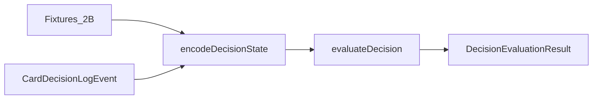
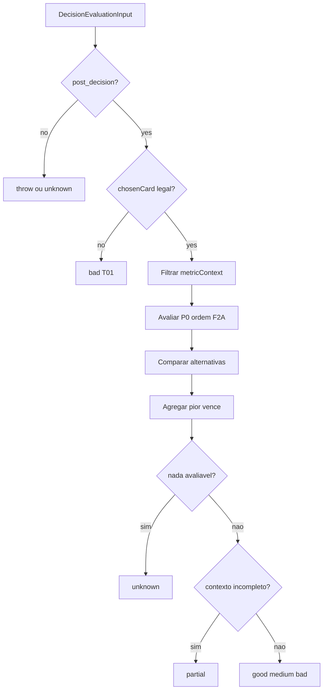

# IMPLEMENTATION_5_EVALUATOR_V0 — Prompt de implementação

**ID:** `IMPLEMENTATION_5_EVALUATOR_V0`  
**Plano pai:** [IMPLEMENTATION_PLAN_AI.md](../IMPLEMENTATION_PLAN_AI.md) §Impl 5  
**Design base:** [FASE_5_AVALIADOR_DESIGN.md](../FASE_5_AVALIADOR_DESIGN.md) · [FASE_2A_PRIORIDADES_METRICAS.md](../FASE_2A_PRIORIDADES_METRICAS.md) · [FASE_2B_FIXTURES_METRICAS.md](../FASE_2B_FIXTURES_METRICAS.md) · [FASE_4_ENCODER_DESIGN.md](../FASE_4_ENCODER_DESIGN.md) §9  
**Pré-requisitos:** [IMPLEMENTATION_3_ENCODER_V0](../implementation-reports/IMPLEMENTATION_3_ENCODER_V0_REPORT.md) · [IMPLEMENTATION_4_FIXTURES_2B](../implementation-reports/IMPLEMENTATION_4_FIXTURES_2B_REPORT.md) — **código concluído** (encoder 4.0.0, `ALL_FIXTURES` ×23, CI verde)  
**Data:** 2026-05-31  
**Scope desta prompt:** guia **executável** para Avaliador v0 — **não implementar neste passo documental**.

**Princípio:** Implementation 5 cria o **primeiro juiz** heurístico offline. Metáfora fechada:

| Camada | Metáfora | Impl |
|--------|----------|------|
| Logger | Gravador | 1 + 1.1 + 2 |
| Encoder | Tradutor | 3 + 3.1 |
| Fixtures 2B | Golden cases | 4 |
| **Avaliador** | **Juiz** | **5 (esta prompt)** |

**Checkpoint humano H5** ([IMPLEMENTATION_PLAN_AI.md](../IMPLEMENTATION_PLAN_AI.md) §8): veredictos intuitivos + linguagem `reasonShort` — **não** reproduzir fixtures no jogo (ver §13).

**Supersede plano-mãe (partial):** [`IMPLEMENTATION_PLAN_AI.md`](../IMPLEMENTATION_PLAN_AI.md) §Impl 5 usa `partialEvaluation: boolean`. **Esta prompt prevalece v0:** `classification` inclui valor **`partial`**; ver §5.2 D1.

**Supersede plano-mãe (storage):** plano-mãe menciona store de avaliações. **Esta prompt prevalece v0:** **sem persistência** — resultado devolvido em memória / testes only.

**Supersede plano-mãe (golden):** asserts estruturados — **sem** snapshots JSON (herança Impl 4).

---

## Instruções para o agente implementador

1. Ler esta prompt **completa** + FASE_5 §3–8 + FASE_2B antes de editar código.
2. Implementar **apenas** o escopo §2; recusar scope creep (§2.2).
3. Código novo em `frontend/src/cardIntelligence/evaluator/` + testes; alterações mínimas em `fixtures/types.ts` (opcional `evaluatorExpected`) e `index.ts` (exports dev/test).
4. **Zero** alteração de regras, scoring, bots, gameplay, memória, LLM, UI export.
5. **Não** hookar `evaluateDecision` em `playWithLogging`, `GameBoard`, ou hot path.
6. Input = `EncodedDecisionState` (`encodeMode: post_decision`) + `chosenCard` + `legalMoves`.
7. Output = `DecisionEvaluationResult` schema **5.0.0** — **separado** de `CardDecisionLogEvent`; logger mantém `classification: unknown`.
8. Player View por defeito; Engine View só `evaluatorMode: debug` + testes explícitos.
9. Pipeline testes: `getFixtureById` → `encodeDecisionState` → `evaluateDecision` → asserts §8.1.
10. `reasonShort` em **português de mesa** — legível por humano no relatório H5, sem jargão de campos internos.
11. Reutilizar read-only: [`encodeDecisionState`](../../frontend/src/cardIntelligence/encoder/encodeDecisionState.ts), [`kingObligations.ts`](../../frontend/src/cardIntelligence/shared/kingObligations.ts) — não duplicar regras King em silêncio.
12. Ordem sugerida de commits: tipos + T01 gate → King K02/K03/K00/K01 → Spades SP09/SP06 → Sueca/Hearts → agregador → golden fixtures → unit sintéticos bad/medium.
13. No fim, entregar **relatório final** conforme §16.

---

# 1. Objectivo

Implementation 5 cria o **primeiro juiz heurístico v0**, limitado e **offline/dev/test**:

- Recebe decisão **já tomada** (`EncodedDecisionState` + `chosenCard`).
- Compara com alternativas legais quando possível.
- Devolve `DecisionEvaluationResult` com `good` | `medium` | `bad` | `partial` | `unknown`.
- **Não** joga cartas, **não** altera gameplay, **não** persiste resultados v0.



---

# 2. Escopo exacto

## 2.1 Dentro do escopo (implementação futura)

| Área | Detalhe |
|------|---------|
| **Módulo** | `frontend/src/cardIntelligence/evaluator/` |
| **Função central** | `evaluateDecision(input: DecisionEvaluationInput): DecisionEvaluationResult` |
| **Avaliadores** | Por métrica/jogo + transversais + agregador «pior vence» |
| **Fixtures 2B** | Golden: encode → evaluate → assert §8.1 |
| **Testes sintéticos** | bad/medium fora dos 23 (§12.2) |
| **Exports** | `evaluateDecision`, tipos — dev/test only em `index.ts` |
| **Relatório + H5** | §16 |

## 2.2 Fora do escopo (recusar)

| Item | Impl futura |
|------|-------------|
| Memória / agregados / IndexedDB evaluations | Impl 6 |
| Mini-LLM / aprendizagem | Impl 7–8 |
| Dashboard / export UI | Impl 7 |
| Alterar bots / estratégia / `*Game.ts` | Proibido |
| Avaliação **live** em partida | Proibido v0 |
| Leilão King / festa / bids reais | v1+ |
| SP01 bid phase real / H05 pass real | proxy only + `evaluatorWarnings` |
| Métricas P2/P3 profundas | v1+ |
| Store persistido de `DecisionEvaluationResult` | v1+ |
| Mutar `CardDecisionLogEvent` com veredicto | Proibido |
| Engine View default | Proibido |

## 2.3 Separação de responsabilidades

| Camada | Produz | Não produz |
|--------|--------|------------|
| Logger | evento bruto, `unknown` | veredicto |
| Encoder | `EncodedDecisionState`, `metricContext.applicable` | classificação |
| Fixtures | mesa sintética + `expected` encode | veredicto |
| **Avaliador** | **`DecisionEvaluationResult`** | alteração de estado |

**Importante:** `metricContext[].applicable` descreve **contexto encodable**, não qualidade da jogada.

---

# 3. Pipeline v0

## 3.1 Passos

1. Receber `EncodedDecisionState` (`encodeMode === 'post_decision'`).
2. Validar `chosenCard !== null` (card play).
3. **Gate T01:** `chosenCard ∈ legalMoves` — se não → `bad`, `confidence: high`, fim.
4. Obter `metricContext` de `encodedState` + filtrar por `evaluationScope` / `evaluatorMode`.
5. Correr avaliadores P0 aplicáveis (ordem §7).
6. Comparar `chosenCard` com alternativas legais (`betterAlternatives`, `equivalentAlternatives`).
7. Produzir `metricResults[]` por métrica.
8. Agregar classificação global (§6).
9. Se **nenhuma** métrica P0 avaliável → `classification: unknown`.
10. Se **alguma** métrica avaliada mas contexto estratégico incompleto → `classification: partial` (§5.2).

## 3.2 Diagrama



## 3.3 Ordem P0 v0

**Esta prompt prevalece** sobre listas parciais do plano-mãe:

```
T01 → K02 → K03 → K00 → K01 → K08* → SP09 → H13 → S08 → SP06 → S12 → S16 → S19
→ SP08 → H01 → H11 → T04 → T06 → SP01* → H05* → SP14* → H10* → S25* → K10* → K09* → K12*
```

`*` = proxy, Tier B, ou sem fixture 2B dedicado (§7).

King: **contrato-first** — K00/K01/K08 antes de T04 estratégico.

---

# 4. Regras de classificação

## 4.1 Definições

| Valor | Significado |
|-------|-------------|
| **good** | Legal; cumpre objectivo/contrato; aplica métrica P0; evita erro claro |
| **medium** | Legal; não é erro grave; perde oportunidade clara ou subóptima |
| **bad** | Ilegal; viola obrigação; oposto do objectivo; penalização evitável; carta crítica desperdiçada |
| **unknown** | **Zero** avaliação útil — dados insuficientes para qualquer métrica P0 relevante |
| **partial** | Avaliação **válida mas incompleta** — parte julgada; contexto estratégico em falta |

**Regra crítica:** `partial !== unknown`.

## 4.2 D1 — Casos limítrofes (supersede FASE_5 §4.2–4.3)

| # | Situação | classification global | Notas |
|---|----------|----------------------|-------|
| L1 | `chosenCard ∉ legalMoves` | **bad** | T01 gate; não continuar |
| L2 | K02 **bad** (escondeu K♥) + S19 **good** | **bad** | «Pior vence»; K02 crítica |
| L3 | K02 **good** + S08 **not_applicable** (sem cutRisk) | **partial** | Não usar `unknown` só por S08 em falta |
| L4 | Strict mode; todas métricas `missingFields` | **unknown** | `partialEvaluation` compat = false |
| L5 | Tier B fixture (ex. S25) | **partial** | Fixo §8.1 — não `good` nem `unknown` |
| L6 | SP09 **good** (descarte) + T06 **good** | **good** | Contexto completo |

**Compat FASE_5 (relatório only):** emitir `partialEvaluation: boolean` derivado: `classification === 'partial'`.

## 4.3 Exemplos concretos

| Jogo | bad | medium | good |
|------|-----|--------|------|
| King K02 | `3♥` escondendo K♥ | — | `K♥` na 1.ª oportunidade |
| King K03 | `K♥` com `2♣` legal | — | `2♣` off-suit |
| Spades SP09 | `A♠` pós-bid | — | descarte baixo |
| Sueca S16 | `7♦` antes do Ás | `J♠` side suit | `4♦` |
| Hearts H13 | slough Q♠ em vaza com pontos | — | Q♠ em vaza nossa 0 pts |
| Sueca S08 | — | `A♦` quando `9♦` ganha | `9♦` |

---

# 5. Agregação v0 — «pior vence»

## 5.1 Prioridade global

```
bad  >  partial  >  medium  >  good
unknown  ←  só se nada avaliável (§4.2 L4)
```

## 5.2 Métricas críticas v0

Tratadas como **bad** domina global: **T01**, **K02**, **K03**, **K00**, **K01**, **SP09** (obrigações, contrato, bags).

## 5.3 Tabela de agregação

| Métrica A | Métrica B | Global |
|-----------|-----------|--------|
| K02 bad | S19 good | **bad** |
| SP09 bad | SP06 good | **bad** |
| S08 medium | S19 good | **medium** |
| K02 good | S08 N/A (cutRisk) | **partial** |
| Todas good, nenhum gap | — | **good** |
| Tier B only (S25) | — | **partial** |

---

# 6. Métricas v0 por jogo

## 6.1 Transversal

| ID | Descrição | Fixture | Campos encoder | v0 |
|----|-----------|---------|----------------|-----|
| T01 | Jogada legal | T01 | `legalMoves`, `chosenCard` | automática |
| T04 | Ganhar barato condicional | T04, S08 | `canWinCheaply`, objectivo | parcial se cutRisk null |
| T06 | Jogar baixo / evitar penalização | T06, SP09 | `bidMet`, `nulosMode`, `pointsInTrick` | parcial King nulos |

## 6.2 Sueca

| ID | Fixture | Campos chave |
|----|---------|--------------|
| S08 | S08 | `canWinCheaply`, `cutRisk` |
| S12 | S12 | `canCutWithLowestTrump`, `cutRisk` |
| S16 | S16 | `sevensSeenBySuit`, `acesSeenBySuit`, leading |
| S19 | S19 | `partnerWinning`, `safeToFeedPartner` |
| S25 | S25 Tier B | gap `cutRisk` lead — **partial** |

## 6.3 Spades

| ID | Fixture | Notas |
|----|---------|-------|
| SP06 | SP06 | `partnerWinning` |
| SP08 | SP08 | espada mínima |
| SP09 | SP09 | `bidMet`, `avoidBagMode` |
| SP01 | SP01 | proxy play — `evaluatorWarnings` |
| SP14 | SP14 Tier B | score-aware parcial |

## 6.4 Hearts

| ID | Fixture | Notas |
|----|---------|-------|
| H01 | H01 | `pointsInTrick` |
| H11 | H11 | Q♠ perigo |
| H13 | H13 | `trickIsSafeAndPointless`, `canCleanDangerousCard` |
| H05 | H05 | proxy pass |
| H10 | H10 Tier B | moon gap — **partial** |

## 6.5 King (contrato-first)

| ID | Fixture | Notas |
|----|---------|-------|
| K00 | K00 | `contractId` |
| K02 | K02 | `mustPlayKingHeartsNow` — lead + history duplicado |
| K03 | K03 | `cannotLeadHearts` |
| K01 | K01 | slough consciente / penalização |
| K10 | K10 Tier B | duas últimas — **partial** |
| K08 | — | overlap K01 + contrato damas/homens — **unit sintético** |
| K09 | — | positivo T04 King — **unit sintético** |
| K12 | — | nulos evitar vazas — **unit sintético** (`noTrump`) |

**Não expandir** registry 23 para K08/K09/K12.

---

# 7. Relação com fixtures 2B

## 7.1 Pipeline golden

```typescript
const fixture = getFixtureById('K02')!;
const encoded = encodeDecisionState({ event: fixture.event });
const result = evaluateDecision({
  encodedState: encoded,
  chosenCard: fixture.event.chosenCard,
  legalMoves: fixture.event.legalMoves,
  evaluatorMode: 'strict',
  evaluationScope: 'p0',
  viewType: 'player',
  fixtureId: fixture.fixtureId,
});
// assert vs §7.2
```

## 7.2 Tabela §8.1 — classificação esperada (`chosenCard` actual)

Todos os Tier A usam `chosenCard` = **boa jogada** FASE_2B → expect **`good`**.

| ID | Tier | chosenCard (resumo) | classification | Nota implementação |
|----|------|---------------------|----------------|-------------------|
| T01 | A | c2 legal | `good` | |
| T04 | A | d9 barato | `good` | |
| T06 | A | c2 descarte | `good` | |
| S08 | A | d9 | `good` | medium sintético: dA |
| S16 | A | d4 | `good` | bad sintético: 7d |
| S19 | A | c2 baixo | `good` | |
| S12 | A | c5 trunfo mínimo | `good` | |
| S25 | B | cA lead | **`partial`** | métrica encoder N/A |
| SP01 | A | hK proxy | `good` | + warning bid |
| SP06 | A | c3 baixo | `good` | |
| SP09 | A | c2 evitar bag | `good` | bad sintético: sA |
| SP08 | A | s4 mínima | `good` | |
| SP14 | B | sA pressão | **`partial`** | |
| H01 | A | c4 slough | `good` | |
| H05 | A | c2 proxy | `good` | + warning pass |
| H13 | A | sQ limpar | `good` | **trickAfter pré-jogada** (Impl 4) |
| H11 | A | s2 baixo | `good` | |
| H10 | B | h2 | **`partial`** | moon gap |
| K00 | A | c2 evitar copas | `good` | |
| K02 | A | hK lead | `good` | **lead**, não follow 2♥; bad: h3 |
| K03 | A | c2 off-suit | `good` | |
| K01 | A | c4 evitar Q | `good` | |
| K10 | B | c2 trick 11 | **`partial`** | |

## 7.3 Política Tier B (determinística)

| ID | Assert obrigatório | Proibido |
|----|-------------------|----------|
| S25 | `classification === 'partial'` | exigir `good` |
| H10 | `classification === 'partial'` | exigir `good` |
| SP14 | `classification === 'partial'` | exigir `good` |
| K10 | `classification === 'partial'` | exigir `good` |

Alternativa aceite: `evaluatorWarnings.length > 0` **e** classification `partial`.

## 7.4 Extensão opcional `FixtureCase`

```typescript
evaluatorExpected?: {
  classification: 'good' | 'medium' | 'bad' | 'partial' | 'unknown';
  reasonShortIncludes?: string;
  betterAlternativesContain?: string[]; // card ids
  forbidClassification?: ('bad')[]; // Tier A chosen = boa
};
```

Não obrigatório na Impl 5 se §7.2 estiver no teste.

## 7.5 Testes bad/medium sintéticos (não alterar os 23)

Criar eventos via `buildFixtureEvent` / `createTestLogEvent` **clonando** fixture e mudando `chosenCard`:

| Caso | Base | chosenCard | Esperado |
|------|------|------------|----------|
| T01 ilegal | T01 | carta ∉ legalMoves | `bad` |
| K02 esconder | K02 | h3 | `bad` |
| SP09 bag | SP09 | sA | `bad` |
| S16 manilha | S16 | sevenD | `bad` |
| S08 overkill | S08 | dA (9♦ ganha) | `medium` |

---

# 8. Tipos e ficheiros prováveis

## 8.1 Módulo `evaluator/`

| Ficheiro | Função |
|----------|--------|
| `types.ts` | `DecisionEvaluationInput`, `DecisionEvaluationResult`, `MetricEvaluationResult` |
| `evaluateDecision.ts` | Router + validação entrada |
| `aggregateResults.ts` | «Pior vence» §5 |
| `metricEvaluators.ts` | Registo metricId → fn |
| `transversalEvaluators.ts` | T01, T04, T06 |
| `suecaEvaluators.ts` | S08, S12, S16, S19, S25 |
| `spadesEvaluators.ts` | SP06, SP08, SP09, SP01, SP14 |
| `heartsEvaluators.ts` | H01, H05, H11, H13, H10 |
| `kingEvaluators.ts` | K00–K03, K01, K08, K09, K10, K12 |
| `evaluatorGolden.test.ts` | Loop ALL_FIXTURES §7.2 |
| `evaluatorSynthetic.test.ts` | §7.5 bad/medium |
| `aggregateResults.test.ts` | L1–L6 §4.2 |

## 8.2 Alterações mínimas

| Ficheiro | Alteração |
|----------|-----------|
| `fixtures/types.ts` | `evaluatorExpected?` opcional |
| `cardIntelligence/index.ts` | export `evaluateDecision` dev/test |

---

# 9. Inputs — `DecisionEvaluationInput`

```typescript
interface DecisionEvaluationInput {
  schemaVersion: '5.0.0';

  encodedState: EncodedDecisionState; // post_decision
  chosenCard: Card | null;
  legalMoves: Card[];

  /** Redundante — derivável de encodedState.metricContext filtrado scope */
  metricContext?: MetricContextEntry[];

  fixtureId?: string; // testes / debug
  evaluatorMode: 'strict' | 'advisory' | 'debug'; // default strict
  evaluationScope: 'p0' | 'p1' | 'all'; // default p0
  viewType: 'player' | 'engine'; // default player

  rawLogEvent?: CardDecisionLogEvent; // auditoria opcional
}
```

| Modo | Comportamento |
|------|---------------|
| **strict** | Só métricas `applicable && missingFields.length === 0` |
| **advisory** | Métricas parciais + warnings — não usar treino auto |
| **debug** | Permite `viewType: engine`; marca `viewTypeUsed` |

---

# 10. Outputs — `DecisionEvaluationResult`

```typescript
interface DecisionEvaluationResult {
  schemaVersion: '5.0.0';
  evaluatorVersion: '5.0.0';

  classification: 'good' | 'medium' | 'bad' | 'partial' | 'unknown';
  confidence: 'high' | 'medium' | 'low';
  reasonShort: string; // PT, mesa

  metricResults: MetricEvaluationResult[];
  activatedMetricIds: string[];
  failedMetricIds: string[];

  betterAlternatives: Card[];
  equivalentAlternatives: Card[];

  missingFields: string[];
  evaluatorWarnings: string[];
  viewTypeUsed: 'player' | 'engine';

  /** Compat FASE_5 — derivado, não fonte de verdade v0 */
  partialEvaluation?: boolean; // true iff classification === 'partial'

  evaluatedAt: string; // ISO 8601
}

interface MetricEvaluationResult {
  metricId: string;
  classification: 'good' | 'medium' | 'bad' | 'partial' | 'unknown' | 'not_applicable';
  reasonShort: string;
  betterAlternatives: Card[];
}
```

**Logger:** permanece `classification: unknown` — avaliador **não** escreve no log bruto v0.

---

# 11. Testes mínimos

## 11.1 Obrigatórios

| # | Teste |
|---|-------|
| 1 | T01 legal → good; ilegal → bad |
| 2 | S16 manilha antes Ás → good fixture; bad sintético |
| 3 | S12 trunfo mínimo → good |
| 4 | SP09 evitar bag → good; sA → bad |
| 5 | H13 limpar Q♠ → good |
| 6 | K02 K♥ → good; h3 → bad |
| 7 | K03 não puxar copas → good |
| 8 | ALL_FIXTURES Tier A → `good` |
| 9 | Tier B → `partial` (§7.3) |
| 10 | unknown vs partial — casos L3, L4 §4.2 |
| 11 | agregação «pior vence» |
| 12 | `playWithLogging.test.ts` **não** importa evaluator |

## 11.2 Comandos CI

```bash
cd frontend
CI=true npm test -- --testPathPattern=evaluator --watchAll=false
CI=true npm test -- --testPathPattern=cardIntelligence --watchAll=false
npm run build
```

---

# 12. Checkpoint H5 (humano)

**Não exigir** (lição Impl 4/H4):

- Reproduzir fixtures no jogo (shuffle)
- Validar TypeScript / mil variáveis no IDE
- Cruzar encode campo a campo manualmente

**H5 útil:**

1. [ ] CI/local: testes evaluator + cardIntelligence + build verdes
2. [ ] Uma partida normal — **zero** alteração visível
3. [ ] Confirmar evaluator **não** corre no gameplay (`grep` sem import em `playWithLogging` / `GameBoard`)
4. [ ] Relatório Impl 5 com **5–10 exemplos** `DecisionEvaluationResult` — Francisco valida **linguagem** `reasonShort` (good/medium/bad/partial/unknown)
5. [ ] partial vs unknown intuitivo nos exemplos
6. [ ] OK explícito para Impl 6 (Memory)

---

# 13. Riscos

| # | Risco | Mitigação |
|---|-------|-----------|
| R1 | Avaliador demasiado opinativo | v0 conservador; medium generoso; H5 linguagem |
| R2 | Confundir `applicable` com veredicto | §2.3; docs metricResults |
| R3 | Engine View indevida | default player; debug only |
| R4 | Fixtures simplificados vs FASE_2B | humanNote + §7.2 notas |
| R5 | Gaps encoder (S25, H10, H13 snapshot) | Tier B → partial fixo |
| R6 | King leilão / bids reais | fora v0 + warnings |
| R7 | partial vs unknown misturados | §4.2 L3–L4 |
| R8 | Hot path acidental | grep CI; code review |
| R9 | Store evaluations por engano | §2.2 + D12 |

---

# 14. Critérios de sucesso

| Critério | Verificação |
|----------|-------------|
| Build passa | `npm run build` |
| Testes passam | evaluator + cardIntelligence |
| Zero gameplay | diff sem GameBoard, bots, *Game.ts |
| Offline | sem hook live |
| Tier A | 20 fixtures → `good` |
| Tier B | 4 fixtures → `partial` |
| Result separado | logger unchanged |
| Relatório | §16 entregue |

---

# 15. Relatório final esperado (pós-código)

Criar [`docs/ai/implementation-reports/IMPLEMENTATION_5_EVALUATOR_V0_REPORT.md`](../implementation-reports/IMPLEMENTATION_5_EVALUATOR_V0_REPORT.md):

```markdown
# IMPLEMENTATION_5_EVALUATOR_V0 — Relatório final

## Ficheiros criados / alterados
## Métricas implementadas (lista P0)
## Testes executados + contagens
## Exemplos DecisionEvaluationResult (5–10, PT, para H5)
## Confirmação zero gameplay + grep hot path
## Gaps deferidos v1+
## Como validar H5 (checklist §12)
```

---

# 16. Decisões fechadas + gaps deferidos

| # | Decisão |
|---|---------|
| **D1** | `classification` inclui **`partial`** — supersede FASE_5 `partialEvaluation` boolean como fonte v0 |
| **D2** | Agregação: `bad > partial > medium > good`; unknown só L4 |
| **D3** | Ordem P0 §3.3 — esta prompt prevalece |
| **D4** | Player View default; engine só debug |
| **D5** | strict mode default v0 |
| **D6** | Sem persistência evaluations v0 |
| **D7** | Registry fixtures permanece 23 |
| **D8** | K08/K09/K12 — unit sintético, sem fixture novo |
| **D9** | SP01/H05 — proxy + warnings |
| **D10** | Tier B classification fixa `partial` §7.3 |
| **D11** | Golden asserts estruturados — sem JSON snapshots |
| **D12** | Logger nunca mutado |
| **D13** | H5 sem replay jogo — exemplos no relatório |
| **D14** | `reasonShort` PT mesa — legível humano |
| **D15** | Reutilizar `kingObligations.ts` read-only |

## Gaps deferidos (v1+)

| Gap | Impl |
|-----|------|
| Store evaluations IndexedDB | 6 / 7 |
| BidEvent / PassCardsEvent reais | 5.1 |
| SP14 / H10 / S25 completos | 5.1 |
| Ponderação agregação | 5.2 |
| Engine View produção | P2 |
| LLM como juiz | Proibido — F7 advisory |

---

## Referências

- [IMPLEMENTATION_PLAN_AI.md](../IMPLEMENTATION_PLAN_AI.md)
- [FASE_5_AVALIADOR_DESIGN.md](../FASE_5_AVALIADOR_DESIGN.md)
- [FASE_2A_PRIORIDADES_METRICAS.md](../FASE_2A_PRIORIDADES_METRICAS.md)
- [FASE_2B_FIXTURES_METRICAS.md](../FASE_2B_FIXTURES_METRICAS.md)
- [IMPLEMENTATION_3_ENCODER_V0_REPORT.md](../implementation-reports/IMPLEMENTATION_3_ENCODER_V0_REPORT.md)
- [IMPLEMENTATION_4_FIXTURES_2B_REPORT.md](../implementation-reports/IMPLEMENTATION_4_FIXTURES_2B_REPORT.md)
- [IMPLEMENTATION_4_FIXTURES_2B_PROMPT.md](./IMPLEMENTATION_4_FIXTURES_2B_PROMPT.md)

---

## Histórico

| Versão | Data | Nota |
|--------|------|------|
| 1.0 | 2026-05-31 | Prompt inicial Impl 5 — Avaliador v0 offline |
