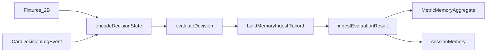

# IMPLEMENTATION_6_MEMORY_V0 — Prompt de implementação

**ID:** `IMPLEMENTATION_6_MEMORY_V0`  
**Plano pai:** [IMPLEMENTATION_PLAN_AI.md](../IMPLEMENTATION_PLAN_AI.md) §Impl 6  
**Design base:** [FASE_6_MEMORIA_APRENDIZAGEM_DESIGN.md](../FASE_6_MEMORIA_APRENDIZAGEM_DESIGN.md) · [FASE_5_AVALIADOR_DESIGN.md](../FASE_5_AVALIADOR_DESIGN.md) · [FASE_4_ENCODER_DESIGN.md](../FASE_4_ENCODER_DESIGN.md) · [FASE_2A_PRIORIDADES_METRICAS.md](../FASE_2A_PRIORIDADES_METRICAS.md)  
**Pré-requisitos:** [IMPLEMENTATION_5_EVALUATOR_V0_REPORT.md](../implementation-reports/IMPLEMENTATION_5_EVALUATOR_V0_REPORT.md) — **código concluído** (evaluator 5.0.0, 37 testes evaluator, CI verde)  
**Data:** 2026-05-31  
**Scope desta prompt:** guia **executável** para Memory v0 — **não implementar neste passo documental**.

**Bloqueio implementação:** **Não iniciar código Memory sem H5 aprovado** (Impl 5 estável — ver [IMPLEMENTATION_PLAN_AI.md](../IMPLEMENTATION_PLAN_AI.md) §8). Redigir/ler esta prompt **não** exige H5; **implementar** `cardIntelligence/memory/` **exige** OK explícito de Francisco após H5.

**Princípio:** Implementation 6 cria o **primeiro histórico/padrões** local a partir de decisões **já julgadas**. Metáfora fechada:

| Camada | Metáfora | Impl |
|--------|----------|------|
| Logger | Gravador | 1 + 1.1 + 2 |
| Encoder | Tradutor | 3 |
| Fixtures 2B | Golden cases | 4 |
| Avaliador | Juiz | 5 |
| **Memória** | **Histórico/padrões** | **6 (esta prompt)** |

**Checkpoint humano H6** ([IMPLEMENTATION_PLAN_AI.md](../IMPLEMENTATION_PLAN_AI.md) §8): agregados intuitivos — **não** reproduzir fixtures no jogo; memória = estatística, **não** decisão (ver §13).

**Supersede FASE_6 §3.1 (classification):** enum ingest inclui **`partial`** — alinhado [IMPLEMENTATION_5 §5.2 D1](./IMPLEMENTATION_5_EVALUATOR_V0_PROMPT.md) e Tier B ([relatório Impl 5](../implementation-reports/IMPLEMENTATION_5_EVALUATOR_V0_REPORT.md)).

**Supersede Impl 5 (storage):** Impl 5 **não persiste** evaluations; **Impl 6** é o **primeiro store** de resultados julgados (`cardIntelligenceMemory`), separado de logs F3.

**Supersede encoder stub:** [`encodeDecisionState`](../../frontend/src/cardIntelligence/encoder/encodeDecisionState.ts) mantém `memoryContext: { schemaVersion: '6.0.0-stub', aggregates: [] }` — **não ligar v0**; memory é módulo independente.

---

## Instruções para o agente implementador

1. Confirmar **H5 aprovado** antes de editar código; ler esta prompt **completa** + FASE_6 §3–9 + relatório Impl 5.
2. Implementar **apenas** o escopo §2; recusar scope creep (§2.2).
3. Código novo em `frontend/src/cardIntelligence/memory/` + testes; alteração mínima em [`index.ts`](../../frontend/src/cardIntelligence/index.ts) (exports dev/test).
4. **Zero** alteração de regras, scoring, bots, gameplay, LLM, UI export, avaliador.
5. **Não** hookar `ingestEvaluationResult` em `playWithLogging`, `GameBoard`, ou hot path.
6. Input = `MemoryIngestRecord` (schema **6.0.0**) construído a partir de `DecisionEvaluationResult` + metadados log/encoder.
7. Memória **não reclassifica** — só agrega contagens/trends; **não muta** `DecisionEvaluationResult`.
8. Player View por defeito; Engine View no ingest → metadata `viewTypeUsed: engine`; mixed → warning.
9. Pipeline testes: fixture → encode → evaluate → `buildMemoryIngestRecord` → ingest → query (§7).
10. Contagem §4.1 **obrigatória** — ordem: `classification` primeiro; depois `partialEvaluation`.
11. Agregação por métrica §4.4 **obrigatória** — `metricResults` primário; sem `metricId: '_all'`.
12. Reutilizar padrão storage logger: [`logStore.ts`](../../frontend/src/cardIntelligence/shared/storage/logStore.ts), [`indexedDb.ts`](../../frontend/src/cardIntelligence/shared/storage/indexedDb.ts); testes **in-memory only** (`setMemoryStoreForTests`).
13. Ordem sugerida de commits: tipos → `aggregateMemory` → store in-memory → `ingestEvaluation` → queries → golden pipeline → sintéticos contagem/trend.
14. No fim, entregar **relatório final** conforme §15.
15. Antes de push/deploy: `CI=true npm run build` (CRA trata ESLint warnings como erros).

---

# 1. Objectivo

Implementation 6 cria **memória local v0** — agregados simples offline/dev/test:

- Ingere decisões **já avaliadas** (`DecisionEvaluationResult` + metadados).
- Agrega por jogador/bot, jogo (`variant`), métrica, dificuldade, classificação.
- Calcula contagens, `badRate`, `partialRate`, trend simples, `firstSeenAt` / `lastSeenAt`.
- Persiste local-first (IndexedDB `cardIntelligenceMemory` + adapter in-memory para testes).
- **Não** decide cartas; **não** altera gameplay; **não** corre automaticamente em live.



---

# 2. Escopo exacto

## 2.1 Dentro do escopo (implementação futura)

| Área | Detalhe |
|------|---------|
| **Módulo** | `frontend/src/cardIntelligence/memory/` |
| **Função central** | `ingestEvaluationResult(record: MemoryIngestRecord): Promise<void>` |
| **Agregação** | `aggregateMemory.ts` — §4 contagem + §5 trend + `badRate` |
| **Queries** | `memoryQueries.ts` — `queryMemory`, `listAggregates`, filtros §8 |
| **Storage** | `memoryStore.ts` + IDB adapter; `setMemoryStoreForTests` |
| **Helper** | `buildMemoryIngestRecord({ event, encoded, evaluation })` — dev/test |
| **Scopes v0** | Bot (`subjectType: bot`), variant, métrica P0; **`sessionMemory` MVP** |
| **Testes** | Pipeline fixtures + sintéticos §12; **sem** live gameplay |
| **Exports** | `ingestEvaluationResult`, tipos — dev/test em `index.ts` |
| **Relatório + H6** | §15 |

## 2.2 Fora do escopo (recusar)

| Item | Impl futura |
|------|-------------|
| Dashboard / UI debug | Impl 7 |
| Export JSONL | Impl 7 |
| Mini-LLM / ML / clustering | Impl 8+ |
| Recomendações para bots / alterar AI | Proibido v0 |
| Persistência cloud / sync backend | Proibido v0 |
| `ingestQueue` (eventos sem F5) | v1+ |
| **Table Memory** persistente (`subjectType: table`) | v1+ |
| Hook live em partida | Proibido v0 |
| Reclassificar / corrigir veredicto F5 | Proibido |
| Wire `memoryContext` no encoder | v1+ |
| Job recalc agregados em bump major evaluator | v1+ (documentar §9) |
| Alterar bots / `*Game.ts` / `GameBoard` | Proibido |

## 2.3 Separação de responsabilidades

| Camada | Produz | Não produz |
|--------|--------|------------|
| Logger | evento bruto | veredicto |
| Encoder | `EncodedDecisionState` | classificação |
| Avaliador | `DecisionEvaluationResult` | persistência agregados |
| **Memória** | **`MetricMemoryAggregate`**, session rollup | cartas jogadas, reclassificação |
| Gameplay / bots | jogadas legais | estatísticas Card Intelligence |

**Importante:** memória consome output do juiz; **nunca** sobrescreve `classification` do avaliador.

---

# 3. Tipos e schemas (6.0.0)

## 3.1 `MemorySubjectType`

```typescript
type MemorySubjectType =
  | 'human'
  | 'bot'
  | 'remote'
  | 'global'
  | 'ai';   // origem externa/genérica — raro v0; preferir 'bot' para AI local
```

**v0:** excluir `table` (Table Memory persistente = futuro).

## 3.2 `MemoryIngestRecord`

Pacote mínimo para incrementar agregados — alinhado FASE_6 §3.1 + Impl 5:

```typescript
interface MemoryIngestRecord {
  schemaVersion: '6.0.0';

  // Identidade decisão
  sourceEventId: string;
  gameId: string;
  sessionId: string;
  timestamp: string;              // ISO — ordem cronológica trend §5

  // Jogo e actores
  variant: 'sueca' | 'spades' | 'hearts' | 'king';
  playerIndex: number;
  subjectType: MemorySubjectType;
  subjectId: string;              // §8 canónico
  playerType: 'human' | 'ai' | 'remote';
  difficulty: 'easy' | 'medium' | 'hard' | null;

  // Avaliação (Fase 5) — classification inclui partial (D1)
  classification: 'good' | 'medium' | 'bad' | 'partial' | 'unknown';
  partialEvaluation: boolean;
  confidence: 'high' | 'medium' | 'low';
  reasonShort: string;
  activatedMetricIds: string[];
  failedMetricIds: string[];
  metricResults?: MetricEvaluationResult[];

  // Contexto resumido (opcional v0)
  roundIndex?: number;
  trickIndex?: number;
  contractId?: string | null;
  viewTypeUsed: 'player' | 'engine';

  // Versões pipeline (D10)
  loggerVersion: string;          // '3.0.0'
  encoderVersion: string;         // '4.0.0'
  evaluatorVersion: string;       // '5.0.0'
  metricCatalogVersion: string;   // '1.1'

  rawLogEventId?: string;
}
```

**Regra ingest:** registos **sem** avaliação F5 válida (`evaluatorVersion` ausente / evaluation null) → **rejeitar** ou no-op documentado — **não** inventar classificação.

## 3.3 `MetricMemoryAggregate`

```typescript
interface MetricMemoryAggregate {
  schemaVersion: '6.0.0';
  memoryId: string;               // §8

  subjectType: MemorySubjectType;
  subjectId: string;
  variant: 'sueca' | 'spades' | 'hearts' | 'king' | 'all';
  metricId: string;
  metricNameHuman: string;
  difficulty: 'easy' | 'medium' | 'hard' | 'all' | null;

  totalCount: number;
  evaluatedCount: number;         // totalCount - unknownCount
  goodCount: number;
  mediumCount: number;
  badCount: number;
  partialCount: number;
  unknownCount: number;

  badRate: number;                // derivado §4.2
  partialRate: number;            // derivado §4.2

  firstSeenAt: string;
  lastSeenAt: string;

  trend: 'improving' | 'worsening' | 'stable' | 'unknown';

  commonMistakes: string[];       // reasonShort frequentes em bad
  commonGoodPatterns: string[];   // reasonShort frequentes em good
  exampleEventIds: string[];      // cap 10

  confidence: 'high' | 'medium' | 'low';  // função evaluatedCount §5

  loggerVersion: string;
  encoderVersion: string;
  evaluatorVersion: string;
  metricCatalogVersion: string;
  viewTypeUsed: 'player' | 'engine' | 'mixed';

  /** Interno v0 — não serializar export se preferir */
  recentOutcomes?: boolean[];     // FIFO bad flags, cap 40 §5
}
```

## 3.4 `MemoryStore` e `MemoryQuery`

```typescript
interface MemoryQuery {
  subjectType?: MemorySubjectType;
  subjectId?: string;
  variant?: MetricMemoryAggregate['variant'];
  metricId?: string;
  difficulty?: MetricMemoryAggregate['difficulty'];
  evaluatorVersion?: string;
}

interface MemoryStore {
  upsertAggregate(aggregate: MetricMemoryAggregate): Promise<void>;
  getAggregate(memoryId: string): Promise<MetricMemoryAggregate | null>;
  listAggregates(query: MemoryQuery): Promise<MetricMemoryAggregate[]>;
  appendSessionRollup(sessionId: string, patch: SessionMemoryPatch): Promise<void>;
  getSessionMemory(sessionId: string): Promise<SessionMemoryState | null>;
  clearForTests?(): Promise<void>;
}
```

`SessionMemoryState` v0: contagens rolling por `(variant, metricId)` na sessão — estrutura mínima documentada no código; **não** duplicar toda a lógica de `memoryAggregates`.

## 3.5 `buildMemoryIngestRecord`

Helper dev/test (export opcional):

```typescript
function buildMemoryIngestRecord(input: {
  event: CardDecisionLogEvent;
  encoded: EncodedDecisionState;
  evaluation: DecisionEvaluationResult;
  subjectType?: MemorySubjectType;
  subjectId?: string;
}): MemoryIngestRecord;
```

Derivar defaults §8 a partir de `event.playerType`, `event.difficulty`, `event.playerIndex` — **explícito em testes**, não inferir de `GameBoard`.

---

# 4. Regras de contagem e agregação por métrica

## 4.1 Algoritmo de contagem (ordem obrigatória)

Aplicar **por agregado actualizado** (cada upsert de métrica):

1. **`totalCount++`** sempre.
2. Se `classification === 'unknown'` → **`unknownCount++` only**; **stop** (sem good/medium/bad/partial de classificação).
3. Se `classification === 'partial'` → **`partialCount++` only**; **não** incrementar good/medium/bad (Tier B Impl 5 — H10, S25, SP14, K10).
4. Se `classification ∈ { good, medium, bad }` → incrementar contador respectivo.
5. Se `partialEvaluation === true` **e** passo 3 **não** aplicou → **`partialCount++` adicional** (veredicto global good/medium/bad com contexto estratégico incompleto — FASE_6 §9.2, Impl 5 L3).

Depois de passos 1–5: recalcular `evaluatedCount`, `badRate`, `partialRate`, actualizar `firstSeenAt`/`lastSeenAt`, `recentOutcomes` (§5), `trend`, `confidence`.

## 4.2 Fórmulas derivadas

| Campo | Fórmula |
|-------|---------|
| `evaluatedCount` | `totalCount - unknownCount` |
| `badRate` | `evaluatedCount > 0 ? badCount / evaluatedCount : 0` |
| `partialRate` | `totalCount > 0 ? partialCount / totalCount : 0` |

## 4.3 Cinco exemplos numéricos (referência implementador + H6)

Contadores **após um único ingest** no agregado da métrica relevante:

| Caso | classification | partialEvaluation | good | medium | bad | partial | unknown | evaluated | badRate |
|------|----------------|-------------------|------|--------|-----|---------|---------|-----------|---------|
| **A** — SP09 fixture good | good | false | 1 | 0 | 0 | 0 | 0 | 1 | 0 |
| **B** — H10 Tier B | partial | true | 0 | 0 | 0 | 1 | 0 | 1 | 0 |
| **C** — bad + contexto incompleto | bad | true | 0 | 0 | 1 | 1 | 0 | 1 | 1 |
| **D** — unknown strict | unknown | false | 0 | 0 | 0 | 0 | 1 | 0 | 0 |
| **E** — S08 medium sintético | medium | false | 0 | 1 | 0 | 0 | 0 | 1 | 0 |

**Notas:**

- **B:** classificação global `partial` (Tier B) — **só** `partialCount`, mesmo que H01 interno seja `bad` no evaluator.
- **C:** `partialEvaluation: true` com global `bad` — **bad + partial** (passos 4 + 5).
- **A:** métrica SP09 `good` em `metricResults` — ver §4.4.

Referência: [IMPLEMENTATION_5_EVALUATOR_V0_REPORT.md](../implementation-reports/IMPLEMENTATION_5_EVALUATOR_V0_REPORT.md) exemplos H10 e sintéticos.

## 4.4 Agregação por métrica — regra v0 fechada

**Sem** agregado `metricId: '_all'` em `memoryAggregates`.

```text
Para cada MemoryIngestRecord:
  1. Se metricResults?.length > 0:
       Para cada entry em metricResults onde entry.classification != 'not_applicable':
         memoryId = buildMemoryId(subjectType, subjectId, variant, entry.metricId, difficulty, evaluatorVersion)
         upsert agregado — aplicar §4.1 com entry.classification
         Se entry.classification === 'bad': append reasonShort a commonMistakes (dedupe cap)
         Se entry.classification === 'good': append reasonShort a commonGoodPatterns (dedupe cap)
         Push sourceEventId a exampleEventIds se bad (cap 10)
         recentOutcomes: push (entry.classification === 'bad')
  2. Senão (fallback):
       Para cada metricId em activatedMetricIds:
         upsert agregado — aplicar §4.1 com classification GLOBAL do record
  3. failedMetricIds: garantir reasonShort de métrica bad em commonMistakes quando disponível em metricResults
  4. viewTypeUsed no agregado: se mistura engine+player no mesmo memoryId → 'mixed' + metadata warning
```

**sessionMemory:** incremento leve por `sessionId` (opcional v0 mínimo) — contagens `(variant, metricId)`; **não** substituir passos 1–3.

## 4.5 `partial` vs `unknown` vs `partialEvaluation`

| Sinal F5 | Contagem memória |
|----------|------------------|
| `classification: unknown` | só `unknownCount` |
| `classification: partial` | só `partialCount` (Tier B) |
| `classification: good/medium/bad` + `partialEvaluation: false` | contador respectivo only |
| `classification: good/medium/bad` + `partialEvaluation: true` | contador + `partialCount` |

**Nunca** colapsar `partialCount` e `unknownCount`.

---

# 5. Trend e confidence

## 5.1 Trend v0 (FIFO cronológico)

Por agregado:

- Manter `recentOutcomes: boolean[]` — `true` = classificação **bad** na métrica (ou global no fallback).
- Cap **40**; ordem **cronológica** — `timestamp` monótono crescente ou ordem de ingest em testes.
- Se `totalCount < 40` → `trend: 'unknown'`.
- Senão:
  - `badRate_prev20` = bads em índices `[0..19] / 20`
  - `badRate_last20` = bads em índices `[20..39] / 20`
  - `delta = badRate_last20 - badRate_prev20`
  - `delta > 0.05` → **`worsening`**
  - `delta < -0.05` → **`improving`**
  - else → **`stable`**

## 5.2 Teste trend (obrigatório, não-flaky)

40 ingests no **mesmo** agregado, timestamps crescentes:

- Ingests 1–20: classificação **good** (ou métrica good)
- Ingests 21–40: classificação **bad**

Expect: `trend === 'worsening'`.

**Proibido** testar com apenas 20 eventos ou ordem não cronológica.

## 5.3 Confidence do agregado

| `evaluatedCount` | `confidence` |
|------------------|--------------|
| &lt; 10 | `low` |
| 10–49 | `medium` |
| ≥ 50 | `high` |

---

# 6. Storage e ficheiros

## 6.1 IndexedDB (runtime dev)

| Aspecto | Decisão |
|---------|---------|
| DB name | `cardIntelligenceMemory` (**separada** de `cardIntelligenceLogs`) |
| Stores v0 | `memoryAggregates` (key: `memoryId`), `sessionMemory` (key: `sessionId`) |
| Fallback | in-memory `Map` quando IDB indisponível (espelhar logger) |
| Testes Jest | **in-memory only** — `setMemoryStoreForTests`; **sem** fake-indexeddb no repo v0 |

Reutilizar padrão: [`getLogStore`](../../frontend/src/cardIntelligence/shared/storage/logStore.ts) / `setLogStoreForTests` como modelo para `getMemoryStore` / `setMemoryStoreForTests`.

## 6.2 Ficheiros a criar

| Ficheiro | Função |
|----------|--------|
| `memory/types.ts` | Schemas §3, constantes `MEMORY_SCHEMA_VERSION = '6.0.0'` |
| `memory/aggregateMemory.ts` | §4.1 contagem, §5 trend, derivados, `buildMemoryId` |
| `memory/ingestEvaluation.ts` | `ingestEvaluationResult`, orquestra §4.4 |
| `memory/memoryStore.ts` | Interface + in-memory impl + `getMemoryStore` |
| `memory/memoryStore.indexedDb.ts` | IDB adapter (opcional mesmo PR se trivial) |
| `memory/memoryQueries.ts` | `queryMemory`, helpers list/filter |
| `memory/buildMemoryIngestRecord.ts` | Helper pipeline testes |
| `memory/index.ts` | Exports |
| `memory/ingestEvaluation.test.ts` | Contagens §4.3 |
| `memory/aggregateMemory.test.ts` | Trend §5.2, badRate |
| `memory/memoryGolden.test.ts` | Pipeline fixture §7 |

## 6.3 Ficheiros a alterar (mínimo)

| Ficheiro | Alteração |
|----------|-----------|
| [`cardIntelligence/index.ts`](../../frontend/src/cardIntelligence/index.ts) | Export `ingestEvaluationResult`, tipos memory — dev/test |

**Não alterar:** `playWithLogging.ts`, `GameBoard.tsx`, bots, `*Game.ts`, evaluator, encoder stub.

---

# 7. Pipeline de testes (sem live)

## 7.1 Golden — SP09 good

```typescript
const fixture = getFixtureById('SP09')!;
const encoded = encodeDecisionState({ event: fixture.event });
const evaluation = evaluateDecision({
  schemaVersion: '5.0.0',
  encodedState: encoded,
  chosenCard: fixture.event.chosenCard,
  legalMoves: fixture.event.legalMoves,
  fixtureId: 'SP09',
  evaluatorMode: 'strict',
  evaluationScope: 'p0',
  viewType: 'player',
});
const record = buildMemoryIngestRecord({
  event: fixture.event,
  encoded,
  evaluation,
  subjectType: 'bot',
  subjectId: 'bot:medium:seat-0',
});
await ingestEvaluationResult(record);
const agg = await queryMemory({
  subjectType: 'bot',
  subjectId: 'bot:medium:seat-0',
  variant: 'spades',
  metricId: 'SP09',
  difficulty: 'medium',
});
expect(agg!.goodCount).toBe(1);
expect(agg!.badRate).toBe(0);
```

## 7.2 Cenários sintéticos obrigatórios

| Teste | Setup | Assert |
|-------|-------|--------|
| 3× SP09 bad | clone SP09, chosen sA ×3 ingest | `badCount === 3`, `badRate === 1` |
| H10 Tier B | fixture H10 evaluate + ingest | `partialCount === 1`, good/medium/bad === 0 |
| unknown | evaluation `classification: unknown` | `unknownCount === 1`, `evaluatedCount === 0` |
| isolamento subject | mesmo metricId, dois subjectId | agregados distintos |
| isolamento variant | mesmo subject, variants diferentes | agregados distintos |
| trend worsening | §5.2 20 good + 20 bad | `trend === 'worsening'` |
| imutabilidade | ingest copy of evaluation | objecto evaluation inalterado |
| partial ≠ unknown | 1 partial + 1 unknown | contadores separados |

## 7.3 Batch fixtures (opcional v0)

Ingerir subset P0 (ex.: SP09, K02, S16) a partir de `ALL_FIXTURES` Tier A — smoke que pipeline não crasha; **não** exigir H6 humano fixture-a-fixture.

---

# 8. subjectId e memoryId canónicos

## 8.1 Formato v0 (único — sem alternativas)

| Actor | `subjectType` | `subjectId` |
|-------|---------------|-------------|
| Bot local | `bot` | `bot:{difficulty}:seat-{playerIndex}` — ex. `bot:medium:seat-0` |
| Humano local | `human` | `human:local:seat-{playerIndex}` |
| Remoto | `remote` | `remote:seat-{playerIndex}` |
| Global variant | `global` | `global:{variant}` — ex. `global:spades` |
| AI externa | `ai` | `ai:generic:seat-{playerIndex}` — raro v0 |

**`variant`** é campo **separado** no agregado — **não** embutir em `subjectId` bot.

## 8.2 `memoryId`

String estável v0 (legível, sem hash opaco):

```text
{subjectType}|{subjectId}|{variant}|{metricId}|{difficulty}|{evaluatorVersion}
```

Exemplo:

```text
bot|bot:medium:seat-0|spades|SP09|medium|5.0.0
```

Função exportável: `buildMemoryId(...)` em `aggregateMemory.ts`.

## 8.3 `metricNameHuman`

Copiar de `encoded.metricContext` ou catálogo F1 quando disponível; fallback `metricId`.

---

# 9. Versões pipeline e recalc futuro

| Campo | Fonte típica |
|-------|--------------|
| `loggerVersion` | `CardDecisionLogEvent.schemaVersion` ou `'3.0.0'` |
| `encoderVersion` | `EncodedDecisionState.schemaVersion` ou `'4.0.0'` |
| `evaluatorVersion` | `DecisionEvaluationResult.evaluatorVersion` ou `'5.0.0'` |
| `metricCatalogVersion` | `'1.1'` (FASE_1) |

**Política v0 (D11):** bump **major** de `evaluatorVersion` → **novo** `memoryId` (suffix version); **não** misturar contagens de versões diferentes no mesmo agregado.

**Recalc job:** mudança major pode exigir re-ingest a partir de logs + re-avaliar F5 — **documentar como gap v1+**; **sem** job na Impl 6.

---

# 10. Decisões fechadas (D1–D15)

| # | Decisão |
|---|---------|
| **D1** | `classification` ingest inclui **`partial`** — supersede FASE_6 enum; alinhado Impl 5 D1 |
| **D2** | `partialCount` e `unknownCount` **sempre separados** — §4.1, §4.5 |
| **D3** | Agregação por métrica via **`metricResults` primário** — §4.4; **sem** `_all` |
| **D4** | Memória **não reclassifica** — só conta output F5 |
| **D5** | Memória **não decide cartas** — proibido hook bots / GameBoard |
| **D6** | **Sem** `ingestQueue` v0 — só decisões já avaliadas |
| **D7** | **Sem** Table Memory persistente — `sessionMemory` MVP only |
| **D8** | Player View default; engine marcado; `mixed` → warning |
| **D9** | IDB `cardIntelligenceMemory` separada; testes **in-memory only** |
| **D10** | Guardar `loggerVersion`, `encoderVersion`, `evaluatorVersion`, `metricCatalogVersion` |
| **D11** | Major `evaluatorVersion` → novo `memoryId`; recalc = futuro §9 |
| **D12** | `ingestEvaluationResult` **não muta** `DecisionEvaluationResult` |
| **D13** | **Sem** hook live — grep CI `playWithLogging` / `GameBoard` |
| **D14** | H6: relatório 3–5 agregados JSON; **não** replay jogo |
| **D15** | Encoder `memoryContext` stub **não ligado** v0 |

---

# 11. Riscos

| # | Risco | Mitigação v0 |
|---|-------|--------------|
| R1 | Amostra pequena → conclusões falsas | `confidence: low`; mínimo N para trend |
| R2 | Agregação por métrica inconsistente | §4.4 fechado; testes golden SP09 |
| R3 | partial vs unknown misturados | §4.3 exemplos + testes dedicados |
| R4 | Mix `evaluatorVersion` | `memoryId` inclui version; D11 |
| R5 | Engine View indevida | `viewTypeUsed`; não comparar humano «justo» sem aviso |
| R6 | IDB quota / performance | cap `exampleEventIds` 10; batch offline |
| R7 | Hook live acidental | grep CI; code review |
| R8 | Memória influencia bots | proibido v0; F7 contexto only |

---

# 12. Testes mínimos e CI

## 12.1 Checklist implementador

- [ ] ingest good/medium/bad/partial/unknown actualiza contadores §4.3
- [ ] `badRate` correcto; `evaluatedCount` exclui unknown
- [ ] `partialCount` separado de `unknownCount`
- [ ] agregados separados por variant / metricId / subjectId
- [ ] trend §5.2 (20+20) `worsening`
- [ ] ingest não altera `DecisionEvaluationResult`
- [ ] zero import memory em `playWithLogging` / `GameBoard`

## 12.2 Comandos CI

```bash
cd frontend
CI=true npm test -- --testPathPattern=memory --watchAll=false
CI=true npm test -- --testPathPattern=cardIntelligence --watchAll=false
CI=true npm run build
grep -r "ingestEvaluationResult" frontend/src --include="*playWithLogging*" --include="*GameBoard*"
# expect: no matches
```

---

# 13. Checkpoint H6 (humano)

**Não exigir** (herança H4/H5):

- Reproduzir fixtures no jogo
- Validar TypeScript campo a campo no IDE
- Confirmar memória «acertou» jogadas — memória **não é juiz**

**H6 útil:**

1. [ ] CI/local: testes memory + cardIntelligence + `CI=true` build verdes
2. [ ] Relatório Impl 6 com **3–5 exemplos** `MetricMemoryAggregate` (JSON) — Francisco valida que são **estatística/padrão**, não decisão
3. [ ] Confirmar memory **não** corre no gameplay (`grep` §12.2)
4. [ ] Confirmar evaluator/logger **inalterados** pelo diff Memory
5. [ ] OK explícito para Impl 7 (Debug/Export)

---

# 14. Critérios de sucesso

| Critério | Verificação |
|----------|-------------|
| Build passa | `CI=true npm run build` |
| Testes passam | memory + cardIntelligence |
| Zero gameplay | diff sem GameBoard, bots, *Game.ts |
| Offline | sem hook live |
| Contagem §4.3 | 5 casos numéricos cobertos em testes |
| Agregação §4.4 | SP09 golden `goodCount === 1` |
| Trend §5.2 | 20+20 worsening |
| Imutabilidade | evaluation object unchanged |
| Relatório | §15 entregue |

---

# 15. Relatório final esperado (pós-código)

Criar [`docs/ai/implementation-reports/IMPLEMENTATION_6_MEMORY_V0_REPORT.md`](../implementation-reports/IMPLEMENTATION_6_MEMORY_V0_REPORT.md):

```markdown
# IMPLEMENTATION_6_MEMORY_V0 — Relatório final

## Ficheiros criados / alterados
## Resumo técnico (ingest, agregação, storage)
## Testes executados + contagens
## Exemplos MetricMemoryAggregate (3–5, JSON, para H6)
## Confirmação zero gameplay + grep hot path
## Gaps deferidos v1+
## Próximos passos Impl 7 Debug/Export
## Como validar H6 (checklist §13)
```

---

# 16. Gaps deferidos (v1+)

| Gap | Impl |
|-----|------|
| Export JSONL agregados + exemplos | 7 |
| Dashboard / debug UI | 7 |
| `memoryExamples` store IDB completo | 7 |
| Table Memory persistente | v1+ |
| `ingestQueue` logger → eval async | v1+ |
| Recalc agregados em bump major evaluator | v1+ |
| Wire `memoryContext` no encoder (read aggregates) | v1+ |
| Ponderação/ranking avançado | v1+ |
| Mini-LLM consome memória | 8 |

---

# 17. Referências e histórico

## Referências

- [IMPLEMENTATION_PLAN_AI.md](../IMPLEMENTATION_PLAN_AI.md)
- [FASE_6_MEMORIA_APRENDIZAGEM_DESIGN.md](../FASE_6_MEMORIA_APRENDIZAGEM_DESIGN.md)
- [FASE_5_AVALIADOR_DESIGN.md](../FASE_5_AVALIADOR_DESIGN.md)
- [IMPLEMENTATION_5_EVALUATOR_V0_PROMPT.md](./IMPLEMENTATION_5_EVALUATOR_V0_PROMPT.md)
- [IMPLEMENTATION_5_EVALUATOR_V0_REPORT.md](../implementation-reports/IMPLEMENTATION_5_EVALUATOR_V0_REPORT.md)
- [FASE_2A_PRIORIDADES_METRICAS.md](../FASE_2A_PRIORIDADES_METRICAS.md)
- [FASE_2B_FIXTURES_METRICAS.md](../FASE_2B_FIXTURES_METRICAS.md)
- Código: [`evaluator/`](../../frontend/src/cardIntelligence/evaluator/), [`shared/storage/`](../../frontend/src/cardIntelligence/shared/storage/)

## Histórico

| Versão | Data | Nota |
|--------|------|------|
| 1.0 | 2026-05-31 | Prompt inicial Impl 6 — Memory v0 offline; §4/§4.4/§8 fechados pós-revisão plano |
