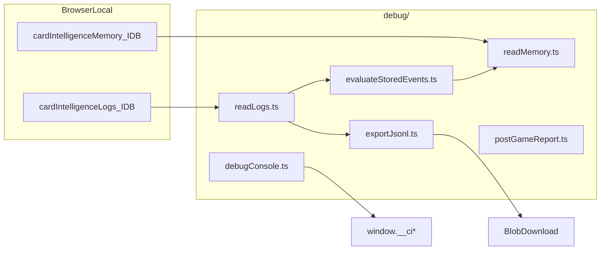

# IMPLEMENTATION_7_DEBUG_EXPORT — Prompt de implementação

**ID:** `IMPLEMENTATION_7_DEBUG_EXPORT`  
**Plano pai:** [IMPLEMENTATION_PLAN_AI.md](../IMPLEMENTATION_PLAN_AI.md) §Impl 7  
**Design base:** [FASE_3_LOGGER_DESIGN.md](../FASE_3_LOGGER_DESIGN.md) · [FASE_4_ENCODER_DESIGN.md](../FASE_4_ENCODER_DESIGN.md) · [FASE_5_AVALIADOR_DESIGN.md](../FASE_5_AVALIADOR_DESIGN.md) · [FASE_6_MEMORIA_APRENDIZAGEM_DESIGN.md](../FASE_6_MEMORIA_APRENDIZAGEM_DESIGN.md)  
**Pré-requisitos:** relatórios Impl 1–6 concluídos — especialmente [IMPLEMENTATION_5_EVALUATOR_V0_REPORT.md](../implementation-reports/IMPLEMENTATION_5_EVALUATOR_V0_REPORT.md) e [IMPLEMENTATION_6_MEMORY_V0_REPORT.md](../implementation-reports/IMPLEMENTATION_6_MEMORY_V0_REPORT.md)  
**Código base:** [`frontend/src/cardIntelligence/`](../../frontend/src/cardIntelligence/) — logger, encoder, evaluator, memory, **`debugConsole.ts` (H3 parcial)**  
**Data:** 2026-05-31  
**Scope desta prompt:** guia **executável** para Debug/Export v0 — **não implementar neste passo documental**.

**Princípio:** Implementation 7 cria o **laboratório local** para inspeccionar Card Intelligence sem alterar gameplay. Metáfora fechada:

| Camada | Metáfora | Impl |
|--------|----------|------|
| Logger | Gravador | 1 + 2 |
| Encoder | Tradutor | 3 |
| Fixtures 2B | Golden cases | 4 |
| Avaliador | Juiz | 5 |
| Memória | Histórico/padrões | 6 |
| **Debug/Export** | **Laboratório / arquivo** | **7 (esta prompt)** |

**Checkpoint humano H7** ([IMPLEMENTATION_PLAN_AI.md](../IMPLEMENTATION_PLAN_AI.md) §8): pipeline **log → encode → eval → export** funcional em dev; **não** é pré-requisito para escrever código — é validação **pós**-Impl 7, antes de Impl 8 (mini-LLM advisory).

**Gates (D8 — linguagem inequívoca):**

| Fase | Bloqueio |
|------|----------|
| Redigir/ler esta prompt | **Nenhum** |
| Implementar código Impl 7 | **H6 OK recomendado** (evaluator + memory estáveis) |
| Checkpoint H7 humano | **Depois** de CI verde + relatório Impl 7 |

**Supersede plano-mãe (pasta):** [IMPLEMENTATION_PLAN_AI.md](../IMPLEMENTATION_PLAN_AI.md) §Impl 7 menciona `cardIntelligence/export/*`. **Esta prompt prevalece:** módulo canónico **`cardIntelligence/debug/`**; `exportJsonl.ts` e `postGameReport.ts` vivem em `debug/`, não em `export/`.

**Supersede FASE_3 §8.4 (formato JSONL):** F3 descreve uma linha JSON por evento bruto (`schemaVersion: 3.0.0`). **Export analítico unificado Impl 7** usa **envelope 7.0.0** por defeito com `payload` intacto — ver §6. Modo **`raw` opt-in** preserva compatibilidade F3 para logs/trick_end apenas.

**Supersede Impl 5 (persistência evaluations):** evaluator **não persiste** veredictos; Impl 7 **calcula on-demand** em helpers dev/export — **sem** novo IDB store de evaluations v0.

**Supersede Impl 6 (live ingest):** memory IDB só recebe dados via **`__ciIngestEvaluations`** (acção explícita dev) — **nunca** automático em partida.

**Estado repo ao redigir esta prompt:**

| Artefacto | Estado |
|-----------|--------|
| `cardIntelligence/debug/` | **Não existe** |
| `cardIntelligence/export/` | **Não existe** |
| `cardIntelligence/debugConsole.ts` | **Existe** (H3) + testes + dynamic import em `index.tsx` |
| Impl 1–6 | Código + relatórios existem |

---

## Instruções para o agente implementador

1. Confirmar **H6 OK recomendado** antes de editar código; ler esta prompt **completa** + FASE_3 §8.4 + relatórios Impl 1–6.
2. Implementar **apenas** escopo §2.1; recusar scope creep (§2.2).
3. Código novo em `frontend/src/cardIntelligence/debug/` + testes; alteração mínima em [`index.tsx`](../../frontend/src/index.tsx), [`cardIntelligence/index.ts`](../../frontend/src/cardIntelligence/index.ts), re-export [`debugConsole.ts`](../../frontend/src/cardIntelligence/debugConsole.ts).
4. **Mover** (não copiar) funções H3 de `debugConsole.ts` → `debug/readLogs.ts` — evitar drift.
5. **Zero** alteração de regras, scoring, bots, gameplay, LLM, avaliador live, memory live.
6. **Não** hookar export/eval/ingest em `playWithLogging`, `GameBoard`, ou hot path.
7. Export **read-only** — nunca mutar logs IDB durante export.
8. Avaliação offline: `evaluateDecision` só via helpers dev ou `includeEvaluations` no export — **não** automático em live.
9. Memória offline: `ingestEvaluationResult` só via `__ciIngestEvaluations` — **não** automático em live.
10. Player View **por defeito** em encode/eval/export (D12); Engine View só opt explícito `{ engineView: true }`.
11. Protecção dev-only: tudo atrás de `CARD_INTELLIGENCE_DEBUG`; dynamic import mantido (D14).
12. Fail-silent na consola: export não bloqueia UI; retorno `ExportResult` testável (§8).
13. Ordem commits sugerida: `readLogs` (migração) → `exportJsonl` → `evaluateStoredEvents` → `readMemory` → `postGameReport` → `debugConsole` install → testes → relatório §16.
14. No fim, entregar **relatório final** conforme §16.
15. Antes de push/deploy: `CI=true npm run build` (CRA trata ESLint warnings como erros).

---

# 1. Objectivo

Implementation 7 fecha o **gap de validação humana**: sem ferramentas legíveis, Francisco não consegue inspeccionar logs, states encoded, avaliações e agregados de memória após jogar cartas reais.

**Entregáveis v0:**

- Export JSONL local (browser download) dos dados Card Intelligence.
- Helpers dev (`window.__ci*`) para listar, encode, evaluate, export, memory — evolução do H3 existente.
- Avaliação e ingest de memória **offline explícita** — nunca no hot path.
- Opcional: painel debug mínimo — **default skip v0** (D6).
- Tudo protegido por flag dev-only; **nunca** por defeito em produção.



Pipeline analítico (offline, explícito):

```
IDB logs → readLogs → exportJsonl / evaluateStoredEvents
                              ↓
                    evaluate (não persiste F5)
                              ↓
              __ciIngestEvaluations (explícito) → memory IDB
```

---

# 2. Escopo exacto

## 2.1 Dentro do escopo (implementação futura)

| Área | Detalhe |
|------|---------|
| **Módulo** | `frontend/src/cardIntelligence/debug/` |
| **Migração H3** | Mover `loadAllLogEvents`, `splitLogEvents`, `sortEventsByTimestamp`, `summarizeLogEvents`, `ciEncode` helpers para sub-módulos; re-export fino na raiz |
| **Export JSONL** | `exportJsonl.ts` — envelope 7.0.0 default; raw opt-in; download Blob |
| **Read logs** | `readLogs.ts` — IDB + filtros `gameId`, `eventId`, `playerType` |
| **Evaluate offline** | `evaluateStoredEvents.ts` — pairing trickEnd + encode + evaluate |
| **Read memory** | `readMemory.ts` — wrap `listAggregates`, `queryMemory`; batch ingest offline |
| **Relatório texto** | `postGameReport.ts` — «N× metricId classification nesta partida» |
| **Console API** | `debugConsole.ts` — `installCardIntelligenceDebugConsole()` + `window.__ci*` |
| **Flag** | Reutilizar `CARD_INTELLIGENCE_DEBUG` — **não** inventar segunda flag |
| **Testes** | JSONL, export vazio, pairing, imutabilidade, flag off |
| **Relatório + H7** | §16 |

## 2.2 Fora do escopo (recusar)

| Item | Impl futura |
|------|-------------|
| Mini-LLM / advisory | Impl 8 |
| Dashboard bonito / gráficos avançados | v1+ |
| Backend / cloud sync | Proibido v0 |
| Análise automática profunda | v1+ |
| Alteração de AI / bots / gameplay | Proibido |
| Avaliação live obrigatória em partida | Proibido v0 |
| Memory live hook em partida | Proibido v0 |
| Replay visual completo | v1+ |
| Persistência IDB de `DecisionEvaluationResult` | v1+ (D3) |
| Corrigir dedupe SP09/T06 no evaluator | v1+ (D15) |
| `DebugPanel.tsx` UI | Opcional; **skip v0 default** |

## 2.3 Separação de responsabilidades

| Camada | Produz | Não produz |
|--------|--------|------------|
| Logger | eventos IDB | export, eval |
| Encoder / Evaluator / Memory | derivados offline | alteração gameplay |
| **Debug/Export** | **JSONL, helpers, relatório texto** | cartas jogadas, hooks live |
| Gameplay | jogadas | estatísticas automáticas |

**Importante:** debug **lê** stores existentes; export **nunca** muta logs; evaluate helper **nunca** altera `CardDecisionLogEvent` original.

---

# 3. Código existente (H3) — migrar, não duplicar

Ficheiro actual [`debugConsole.ts`](../../frontend/src/cardIntelligence/debugConsole.ts) contém:

| Função | Destino pós-migração |
|--------|----------------------|
| `loadAllLogEvents` | `debug/readLogs.ts` |
| `splitLogEvents` | `debug/readLogs.ts` |
| `sortEventsByTimestamp` | `debug/readLogs.ts` |
| `summarizeLogEvents` | `debug/readLogs.ts` |
| `ciEncode` | `debug/evaluateStoredEvents.ts` ou `debug/encodeHelpers.ts` (re-export) |
| `installCardIntelligenceDebugConsole` | `debug/debugConsole.ts` |

Raiz [`debugConsole.ts`](../../frontend/src/cardIntelligence/debugConsole.ts) após migração:

```typescript
// Re-export fino — não duplicar implementação
export {
  loadAllLogEvents,
  splitLogEvents,
  summarizeLogEvents,
  ciEncode,
  installCardIntelligenceDebugConsole,
} from './debug/debugConsole';
// ou re-export granular conforme estrutura final
```

[`index.tsx`](../../frontend/src/index.tsx) mantém dynamic import — actualizar path se `install` mudar de pasta:

```typescript
if (CARD_INTELLIGENCE_DEBUG) {
  void import('./cardIntelligence/debug/debugConsole').then(({ installCardIntelligenceDebugConsole }) => {
    installCardIntelligenceDebugConsole();
  });
}
```

Testes [`debugConsole.test.ts`](../../frontend/src/cardIntelligence/debugConsole.test.ts) → migrar para `debug/*.test.ts` ou importar de `debug/`.

---

# 4. Feature flags

Fonte: [`frontend/src/config/features.ts`](../../frontend/src/config/features.ts)

```typescript
/** Logger — default ON; independente do debug */
export const CARD_INTELLIGENCE_LOGGER_ENABLED =
  process.env.REACT_APP_CARD_INTELLIGENCE_LOGGER !== 'false';

/** Debug helpers — dev-only */
export const CARD_INTELLIGENCE_DEBUG =
  process.env.NODE_ENV === 'development' ||
  process.env.REACT_APP_CARD_INTELLIGENCE_DEBUG === 'true';
```

| Flag | Efeito | Default dev | Default prod |
|------|--------|-------------|--------------|
| `CARD_INTELLIGENCE_LOGGER_ENABLED` | Grava `CardDecisionLogEvent` + `TrickEndEvent` em IDB | ON | ON (unless `=false`) |
| `CARD_INTELLIGENCE_DEBUG` | Regista `window.__ci*`; permite export/eval helpers | ON (`npm start`) | OFF |

**Nota H7:** Francisco pode ter **logs no IDB sem `__ci*`** se logger ON mas debug OFF. Documentar no relatório.

**Activar debug em build de teste prod-like:**

```bash
REACT_APP_CARD_INTELLIGENCE_DEBUG=true CI=true npm run build
```

**Desactivar logger (opcional, independente):**

```bash
REACT_APP_CARD_INTELLIGENCE_LOGGER=false npm start
```

---

# 5. Tipos export (schema 7.0.0)

## 5.1 `ExportRecordType`

```typescript
type ExportRecordType =
  | 'card_decision_log'
  | 'trick_end'
  | 'encoded_state'
  | 'evaluation'
  | 'memory_aggregate'
  | 'export_meta';
```

## 5.2 Envelope canónico (default)

```typescript
interface CardIntelligenceExportEnvelope {
  exportRecordType: ExportRecordType;
  schemaVersion: '7.0.0';
  exportedAt: string;       // ISO — momento do export
  source: string;           // ex.: 'cardIntelligence/debug/exportJsonl'
  payload: unknown;         // evento/derivado intacto — preserva schema interno 3/4/5/6
}
```

## 5.3 `ExportOptions`

```typescript
interface ExportOptions {
  format?: 'envelope' | 'raw';     // default 'envelope'
  gameId?: string;
  variant?: GameVariant;
  playerType?: PlayerType;
  includeEncoded?: boolean;        // default false
  includeEvaluations?: boolean;    // default false — compute on-demand
  includeMemory?: boolean;         // default false — lê IDB memory
  engineView?: boolean;            // default false — D12
}
```

## 5.4 `ExportResult`

```typescript
interface ExportResult {
  lineCount: number;
  warnings: string[];
  filename: string;
}
```

## 5.5 `EvaluateStoredResult`

```typescript
interface EvaluateStoredResult {
  play: CardDecisionLogEvent;
  trickEnd: TrickEndEvent | null;
  encoded?: EncodedDecisionState;
  evaluation?: DecisionEvaluationResult;
  warnings: string[];
}
```

---

# 6. Formato JSONL (§ prioridade redacção)

## 6.1 Modos

| Modo | Default | Linhas |
|------|---------|--------|
| **`envelope`** | **Sim** | Wrapper 7.0.0 + `payload` intacto |
| **`raw`** | Não (`format: 'raw'`) | Evento F3 bruto; **só** play + trick_end |

## 6.2 Regras gerais

- Uma linha JSON por registo (`JSON.stringify` + `\n`).
- Ordem cronológica por `timestamp` dentro de cada `gameId` (plays, trick_ends, derivados associados ao mesmo `eventId` logo após o play quando `includeEncoded`/`includeEvaluations`).
- Download: `Blob` + `URL.createObjectURL` + `<a download>` — sem backend.
- Filename (D9): `ci-export-{gameIdOrAll}-{ISO}.jsonl` — sanitizar `gameId` para filesystem.
- **Export vazio (D2):** exactamente **1 linha** `export_meta` com `payload: { lineCount: 0, warnings: [], options: {...} }`.
- Memory no export (D11): só linhas `memory_aggregate` se IDB memory tiver dados (após ingest dev explícito).

## 6.3 Exemplos JSONL (envelope — uma linha cada)

**`card_decision_log`:**

```json
{"exportRecordType":"card_decision_log","schemaVersion":"7.0.0","exportedAt":"2026-05-31T14:00:00.000Z","source":"cardIntelligence/debug/exportJsonl","payload":{"eventId":"evt-001","gameId":"game-abc","schemaVersion":"3.0.0","variant":"spades","playerType":"human","chosenCard":{"rank":"A","suit":"spades"},"classification":"unknown","reason":null}}
```

**`trick_end`:**

```json
{"exportRecordType":"trick_end","schemaVersion":"7.0.0","exportedAt":"2026-05-31T14:00:00.000Z","source":"cardIntelligence/debug/exportJsonl","payload":{"eventType":"trick_end","gameId":"game-abc","schemaVersion":"3.0.0","trickIndex":2,"winnerIndex":1,"pointsInTrick":13}}
```

**`encoded_state`:**

```json
{"exportRecordType":"encoded_state","schemaVersion":"7.0.0","exportedAt":"2026-05-31T14:00:00.000Z","source":"cardIntelligence/debug/exportJsonl","payload":{"schemaVersion":"4.0.0","sourceEventId":"evt-001","encodeMode":"post_decision","viewType":"player","variant":"spades"}}
```

**`evaluation`:**

```json
{"exportRecordType":"evaluation","schemaVersion":"7.0.0","exportedAt":"2026-05-31T14:00:00.000Z","source":"cardIntelligence/debug/exportJsonl","payload":{"schemaVersion":"5.0.0","evaluatorVersion":"5.0.0","classification":"good","reasonShort":"Boa descarte — não entrega trunfo desnecessário.","viewTypeUsed":"player","partialEvaluation":false}}
```

**`memory_aggregate`:**

```json
{"exportRecordType":"memory_aggregate","schemaVersion":"7.0.0","exportedAt":"2026-05-31T14:00:00.000Z","source":"cardIntelligence/debug/exportJsonl","payload":{"schemaVersion":"6.0.0","memoryId":"bot|bot:medium:seat-0|spades|SP09|null|5.0.0","metricId":"SP09","goodCount":2,"badCount":0,"evaluatedCount":2,"badRate":0}}
```

**`export_meta` (início ou fim do ficheiro — v0: **única linha se vazio**):**

```json
{"exportRecordType":"export_meta","schemaVersion":"7.0.0","exportedAt":"2026-05-31T14:00:00.000Z","source":"cardIntelligence/debug/exportJsonl","payload":{"lineCount":5,"warnings":[],"options":{"format":"envelope","includeEvaluations":false}}}
```

## 6.4 Modo `raw` (opt-in)

Cada linha = evento IDB tal como F3 — sem wrapper 7.0.0. **Proibido** incluir encoded/evaluation/memory em modo raw (ignorar flags ou warn).

## 6.5 Round-trip

- Envelope: importador futuro lê `exportRecordType` + `payload.schemaVersion` interno.
- Raw: compatível com pipeline «Replay JSONL» FASE_5 §13 futuro — só logs.

---

# 7. `readLogs.ts`

## 7.1 API

```typescript
export async function loadAllLogEvents(): Promise<LogEvent[]>;
export function sortEventsByTimestamp(events: LogEvent[]): LogEvent[];
export function splitLogEvents(events: LogEvent[]): {
  plays: CardDecisionLogEvent[];
  trickEnds: TrickEndEvent[];
};

export function filterLogEvents(
  events: LogEvent[],
  opts?: { gameId?: string; eventId?: string; playerType?: PlayerType; variant?: GameVariant }
): LogEvent[];

export function summarizeLogEvents(events: LogEvent[]): Record<string, unknown>;

export async function findPlayByEventId(eventId: string): Promise<CardDecisionLogEvent | null>;
export async function listGameIds(): Promise<string[]>;
```

## 7.2 Implementação

- Reutilizar [`openLogDatabase`](../../frontend/src/cardIntelligence/shared/storage/indexedDb.ts) — mesma store `events` que logger.
- Fail-silent: IDB indisponível → `[]` + warning em `summarize`/`ExportResult.warnings`.
- Testes: mock/in-memory pattern de [`logStore.test.ts`](../../frontend/src/cardIntelligence/shared/storage/logStore.test.ts) — **não** depender de browser real.

---

# 8. `exportJsonl.ts`

## 8.1 API

```typescript
export const EXPORT_SCHEMA_VERSION = '7.0.0' as const;
export const EXPORT_SOURCE = 'cardIntelligence/debug/exportJsonl';

export function buildJsonlLines(
  events: LogEvent[],
  memoryAggregates: MetricMemoryAggregate[],
  options?: ExportOptions
): { lines: string[]; warnings: string[] };

export function downloadJsonl(content: string, filename: string): void;

export async function exportCardIntelligenceJsonl(
  options?: ExportOptions
): Promise<ExportResult>;
```

## 8.2 Algoritmo `buildJsonlLines`

1. Filtrar events por `options`.
2. Se `format === 'raw'`: serializar plays + trick_ends ordenados; return.
3. Se events.length === 0 && !includeMemory: return **1 linha** `export_meta` (`lineCount: 0`).
4. Para cada play (ordem cronológica):
   - Linha envelope `card_decision_log`.
   - Se `includeEncoded`: encode offline (§9) → linha `encoded_state`.
   - Se `includeEvaluations`: evaluate offline → linha `evaluation`.
5. Para cada trick_end no scope: linha `trick_end` (D13 — sempre se presente IDB).
6. Se `includeMemory`: uma linha `memory_aggregate` por aggregate de `listAggregates(filter)`.
7. Se lineCount > 0: opcional linha `export_meta` final com totais (v0: meta no fim **ou** só no vazio — **testes exigem meta no vazio**).

## 8.3 Fail-silent + testabilidade

- Erros parciais (encode fail num evento): `warnings.push(...)`, continuar resto.
- **Não throw** em `exportCardIntelligenceJsonl` — UI nunca bloqueia.
- Testes assertam `ExportResult.lineCount` e `warnings`, não `console.warn`.

---

# 9. `evaluateStoredEvents.ts` (§ prioridade redacção)

## 9.1 Pairing `findTrickEndForPlay` (D7)

Não existe helper centralizado hoje — implementar conforme pseudocódigo:

```
function findTrickEndForPlay(
  play: CardDecisionLogEvent,
  trickEnds: TrickEndEvent[],
): TrickEndEvent | null {
  const candidates = trickEnds.filter(
    (t) => t.gameId === play.gameId && t.trickIndex === play.trickIndex
  );
  if (candidates.length === 1) return candidates[0];
  if (candidates.length > 1) {
    const after = candidates
      .filter((t) => t.timestamp >= play.timestamp)
      .sort((a, b) => a.timestamp.localeCompare(b.timestamp));
    if (after.length > 0) return after[0];
    return candidates.sort((a, b) => a.timestamp.localeCompare(b.timestamp))[0];
  }
  // zero candidates — última vaza em curso / TrickEnd ainda não gravado
  return null;
}
```

**Edge cases (testes obrigatórios):**

| Caso | Esperado |
|------|----------|
| 1 candidato | usar |
| N candidatos | menor timestamp ≥ play.timestamp |
| 0 candidatos | `null` + warning «trick_end missing for trickIndex N» |
| Última vaza incompleta | encode com warnings encoder; eval se possível |

## 9.2 Pipeline offline

```typescript
export function evaluateStoredPlay(
  play: CardDecisionLogEvent,
  trickEnds: TrickEndEvent[],
  opts?: { engineView?: boolean }
): EvaluateStoredResult;

export async function evaluateStoredPlayByEventId(
  eventId: string,
  opts?: { engineView?: boolean }
): Promise<EvaluateStoredResult | null>;

export async function evaluateStoredGame(
  gameId: string,
  opts?: { engineView?: boolean }
): Promise<EvaluateStoredResult[]>;
```

Passos:

1. Snapshot/play object **não mutado** (teste: `JSON.stringify` antes/depois igual).
2. `trickEnd = findTrickEndForPlay(play, trickEnds)`.
3. `encoded = encodeDecisionState({
     event: play,
     trickEndEvent: trickEnd ?? undefined,
     encodeMode: 'post_decision',
     viewType: opts?.engineView ? 'engine' : 'player',
   }, { allowEngineView: opts?.engineView ?? false })`.
4. `evaluation = evaluateDecision({
     encodedState: encoded,
     chosenCard: play.chosenCard,
     legalMoves: play.legalMoves,
     rawLogEvent: play,
     viewType: opts?.engineView ? 'engine' : 'player',
     evaluatorMode: opts?.engineView ? 'debug' : 'strict',
   })`.
5. **Não persistir** evaluation em IDB (D3).

## 9.3 `ciEncode` (compat H3)

Manter assinatura existente; default `allowEngineView: true` **só** quando caller passa explicitamente — alinhar com D12: helpers públicos default player.

---

# 10. `readMemory.ts`

## 10.1 API

```typescript
export async function listMemoryAggregates(
  query?: MemoryQuery
): Promise<MetricMemoryAggregate[]>;

export async function ingestEvaluationsOffline(
  results: Array<{
    play: CardDecisionLogEvent;
    encoded: EncodedDecisionState;
    evaluation: DecisionEvaluationResult;
  }>
): Promise<{ ingested: number; warnings: string[] }>;
```

## 10.2 Implementação

- Wrap [`listAggregates`](../../frontend/src/cardIntelligence/memory/memoryQueries.ts), [`queryMemory`](../../frontend/src/cardIntelligence/memory/memoryQueries.ts).
- `ingestEvaluationsOffline`: para cada item → `buildMemoryIngestRecord` → `ingestEvaluationResult`.
- **Sem idempotência v0 (D15):** re-ingest mesmo `sourceEventId` incrementa contagens — documentar gap; batch `__ciEvaluateGame` + ingest pode inflar `goodCount` (ex.: SP09+T06 duplicado no evaluator — ver [Impl 6 report §gaps](../implementation-reports/IMPLEMENTATION_6_MEMORY_V0_REPORT.md)).

---

# 11. `postGameReport.ts`

Texto simples plano-mãe — input: `EvaluateStoredResult[]` ou aggregates memory.

```typescript
export function buildPostGameReport(input: {
  evaluations?: DecisionEvaluationResult[];
  plays?: CardDecisionLogEvent[];
  aggregates?: MetricMemoryAggregate[];
}): string;
```

**Formato v0 (exemplo):**

```
Card Intelligence — resumo offline
Game: game-abc | variant: spades | decisões: 12
  2× SP09 bad (medium confidence)
  1× SP06 good
  3× partial (global)
Memory aggregates: 4 entradas
```

Sem gráficos; string para consola ou copy-paste relatório H7.

---

# 12. `debugConsole.ts` — API `window.__ci*`

## 12.1 Instalação

```typescript
export function installCardIntelligenceDebugConsole(): void;
```

Só chamar de [`index.tsx`](../../frontend/src/index.tsx) quando `CARD_INTELLIGENCE_DEBUG === true`.

## 12.2 Helpers

| Global | Função | Estado |
|--------|--------|--------|
| `window.__ci` | namespace object | existente — expandir |
| `__ciLoadEvents()` | `loadAllLogEvents()` | existente |
| `__ciSummarize(events?)` | `summarizeLogEvents` | existente |
| `__ciEncode(play, opts?)` | `ciEncode` | existente — D12 defaults |
| `__ciExportLogsJsonl(opts?)` | `exportCardIntelligenceJsonl` | **novo** |
| `__ciEncodeEvent(eventId)` | resolve play + trickEnd + encode | **novo** |
| `__ciEvaluateEvent(eventId, opts?)` | encode + evaluate offline | **novo** |
| `__ciEvaluateGame(gameId?, opts?)` | batch evaluate | **novo** |
| `__ciListMemory(query?)` | `listMemoryAggregates` | **novo** |
| `__ciIngestEvaluations(results)` | `ingestEvaluationsOffline` | **novo** |
| `__ciPostGameReport(gameId?)` | texto §11 | **novo** |
| `__ciClearAllCardIntelligenceData(opts?)` | clear IDB logs and/or memory | **opcional D4** |

## 12.3 `__ciClearAllCardIntelligenceData` (D4)

```typescript
interface ClearDebugDataOptions {
  logs?: boolean;    // default true se ambos omitidos — exigir escolha explícita
  memory?: boolean;
}
```

- Nome longo intencional; **double `confirm()`** com texto: «Apaga dados locais Card Intelligence (logs H1–H6 / memória). Irreversível.»
- Separar logs vs memory — permitir limpar só um.
- Só disponível com flag debug activa.

## 12.4 Mensagem consola

Actualizar log startup (H3 → H7):

```
[CardIntelligence] Debug console ready (Impl 7):
  await __ciLoadEvents()
  __ciSummarize(await __ciLoadEvents())
  await __ciEvaluateEvent('<eventId>')
  await __ciExportLogsJsonl({ includeEvaluations: true })
  __ciListMemory()
  __ci / __ciEncode / ...
```

---

# 13. UI opcional (D6 — skip v0 default)

Se implementar [`DebugPanel.tsx`](../../frontend/src/cardIntelligence/debug/DebugPanel.tsx):

- Montar **só** com `CARD_INTELLIGENCE_DEBUG`.
- Botões mínimos: Export JSONL, Summary, List Memory.
- **Não** montar em `App.tsx` por defeito — lazy + flag check.
- **Recomendação v0:** skip UI; consola suficiente para H7.

---

# 14. Ficheiros — criar vs alterar

## 14.1 Criar

| Ficheiro | Função |
|----------|--------|
| `debug/readLogs.ts` | IDB read + filtros + summarize |
| `debug/exportJsonl.ts` | JSONL envelope + download |
| `debug/evaluateStoredEvents.ts` | pairing + encode + evaluate offline |
| `debug/readMemory.ts` | queries + ingest offline batch |
| `debug/postGameReport.ts` | relatório texto |
| `debug/debugConsole.ts` | install + window API |
| `debug/index.ts` | exports módulo |
| `debug/readLogs.test.ts` | filtros, summarize |
| `debug/exportJsonl.test.ts` | envelope, vazio, parse |
| `debug/evaluateStoredEvents.test.ts` | pairing 0/1/N, imutabilidade |
| `debug/debugConsole.test.ts` | migrar/expandir H3 |

## 14.2 Alterar (mínimo)

| Ficheiro | Alteração |
|----------|-----------|
| [`frontend/src/index.tsx`](../../frontend/src/index.tsx) | import path `debug/debugConsole` |
| [`frontend/src/cardIntelligence/index.ts`](../../frontend/src/cardIntelligence/index.ts) | re-exports dev/test opcionais |
| [`frontend/src/cardIntelligence/debugConsole.ts`](../../frontend/src/cardIntelligence/debugConsole.ts) | re-export fino pós-migração |

## 14.3 Não alterar

- `GameBoard.tsx`, `playWithLogging.ts`, bots, `*PlayStrategy`, `*Game.ts`, evaluator core, memory ingest hooks, encoder stub `memoryContext`.

---

# 15. Testes mínimos e CI

## 15.1 Checklist implementador

- [ ] JSONL envelope: cada linha `JSON.parse` válido; 6 tipos exemplo §6.3
- [ ] Export vazio → 1 linha `export_meta`, `lineCount: 0`
- [ ] Modo raw → só eventos 3.0.0 sem wrapper
- [ ] `findTrickEndForPlay`: 0 / 1 / N candidatos
- [ ] `evaluateStoredPlay` não muta play (snapshot)
- [ ] `exportCardIntelligenceJsonl` retorna `ExportResult` assertável
- [ ] `includeEvaluations` compute-on-demand — sem write IDB evaluation store
- [ ] `ingestEvaluationsOffline` só via helper — grep sem hook gameplay
- [ ] Flag off: `installCardIntelligenceDebugConsole` não corre em prod build path (testar funções puras)
- [ ] Migrar testes H3 — CI verde

## 15.2 Comandos CI

```bash
cd frontend
CI=true npm test -- --testPathPattern=debug --watchAll=false
CI=true npm test -- --testPathPattern=cardIntelligence --watchAll=false
CI=true npm run build
# prod-like debug off:
CI=true npm run build
# prod-like debug on (smoke):
REACT_APP_CARD_INTELLIGENCE_DEBUG=true CI=true npm run build

grep -r "exportCardIntelligenceJsonl\|ingestEvaluationsOffline\|evaluateStoredPlay" \
  frontend/src --include="*playWithLogging*" --include="*GameBoard*"
# expect: no matches
```

---

# 16. Relatório final esperado (pós-código)

Criar [`docs/ai/implementation-reports/IMPLEMENTATION_7_DEBUG_EXPORT_REPORT.md`](../implementation-reports/IMPLEMENTATION_7_DEBUG_EXPORT_REPORT.md):

```markdown
# IMPLEMENTATION_7_DEBUG_EXPORT — Relatório final

## Ficheiros criados / alterados
## Helpers disponíveis (__ci* lista)
## Como activar/desactivar (flags)
## Testes executados + contagens
## Exemplo export JSONL (5–10 linhas envelope)
## Exemplo postGameReport texto
## Confirmação zero gameplay + grep hot path
## Confirmação prod/flag off sem __ci*
## Riscos / gaps (D15, idempotência, SP09/T06)
## Próximos passos Impl 8 Mini-LLM advisory
## Como validar H7 (checklist §17)
```

---

# 17. Checkpoint H7 (humano — copy-paste)

**Pré-requisito:** relatório Impl 7 + CI verde.

1. [ ] `npm start` — consola mostra `[CardIntelligence] Debug console ready`
2. [ ] Alternativa prod-like: `REACT_APP_CARD_INTELLIGENCE_DEBUG=true CI=true npm run build` + servir build
3. [ ] Jogar algumas cartas (logger ON por defeito)
4. [ ] `const ev = await __ciLoadEvents()` — array legível; copiar um `eventId`
5. [ ] `__ciSummarize(ev)` — contagens plays/trickEnds coerentes
6. [ ] `await __ciEvaluateEvent('<eventId>')` — `evaluation.classification` + `reasonShort` PT legível; `viewTypeUsed: 'player'`
7. [ ] `await __ciExportLogsJsonl({ includeEvaluations: true })` — download JSONL; abrir ficheiro; linhas envelope parseáveis
8. [ ] Opcional: `await __ciEvaluateGame()` → `__ciIngestEvaluations(...)` → `__ciListMemory()` → re-export `{ includeMemory: true }`
9. [ ] `__ciPostGameReport()` — texto resumo legível
10. [ ] Build prod **sem** `REACT_APP_CARD_INTELLIGENCE_DEBUG`: `typeof window.__ci === 'undefined'`; sem painel debug
11. [ ] Confirmar gameplay inalterado (mesma experiência jogo com flag on/off)
12. [ ] OK explícito para Impl 8 (Mini-LLM advisory)

**Não exigir H7:**

- Dashboard bonito
- Cloud sync
- Replay visual completo
- Correcção dedupe evaluator

---

# 18. Critérios de sucesso

| Critério | Verificação |
|----------|-------------|
| Build passa | `CI=true npm run build` (flag off e on) |
| Testes passam | debug + cardIntelligence |
| Zero gameplay | diff sem GameBoard, bots, *Game.ts |
| Dev-only | dynamic import + flag; prod default sem `__ci*` |
| Export JSONL | envelope + exemplo no relatório |
| Pipeline offline | evaluate + export sem hook live |
| Imutabilidade logs | teste evaluateStoredEvents |
| Helper H7 | checklist §17 executável |
| Relatório | §16 entregue |

---

# 19. Decisões fechadas (D1–D15)

| ID | Tema | Decisão |
|----|------|---------|
| **D1** | `debug/` vs `export/` | `debug/` canónico; supersede plano-mãe; re-export H3 na raiz |
| **D2** | JSONL vazio | **1 linha `export_meta`** (`lineCount: 0`) — determinístico |
| **D3** | Persistir evaluations | **Não** v0; compute-on-export/helper; alinhado Impl 5 |
| **D4** | Clear data | Nome longo + double confirm; `{ logs?, memory? }`; apaga dados locais H1–H6 |
| **D5** | `postGameReport` | Incluir v0 |
| **D6** | DebugPanel UI | **Skip v0** default |
| **D7** | Pairing trickEnd | Pseudocódigo §9.1; edge → null + warnings |
| **D8** | Gates | Redigir prompt: livre; código: H6 OK recomendado; **H7 pós-Impl 7** |
| **D9** | Filename | `ci-export-{gameIdOrAll}-{ISO}.jsonl` |
| **D10** | Campo `source` | String fixa por módulo (`cardIntelligence/debug/exportJsonl`, etc.) |
| **D11** | Memory vazia export | OK — só logs/trick_end até ingest dev |
| **D12** | Engine View | **Player default** export/eval; engine só `{ engineView: true }` |
| **D13** | TrickEnd no export | Sempre incluir se presentes IDB |
| **D14** | Tree-shaking prod | Dynamic import; sem side-effects estáticos em gameplay |
| **D15** | Duplicate ingest | Gap v0: SP09+T06 → 2× `metricResults`; batch sem idempotência; **não** corrigir evaluator em Impl 7 |

---

# 20. Riscos

| # | Risco | Mitigação v0 |
|---|-------|--------------|
| R1 | UI debug em prod | Flag + dynamic import; grep build prod |
| R2 | Export bloqueia jogo | fail-silent; async; no throw |
| R3 | Mutar logs IDB | export read-only; testes imutabilidade |
| R4 | Eval live acidental | grep GameBoard/playWithLogging |
| R5 | Memory ingest live | grep + só `__ciIngestEvaluations` |
| R6 | Dados sensíveis no JSONL | local only; export opt-in dev |
| R7 | Engine View injusta H7 | player default D12 |
| R8 | Drift H3 pós-migração | mover não copiar; re-export raiz |
| R9 | Pairing trickEnd errado | testes 0/1/N + warnings |
| R10 | Contagens memory infladas | documentar D15; não «corrigir» silenciosamente |

---

# 21. Gaps deferidos e Impl 8

| Gap | Impl |
|-----|------|
| Persistência IDB evaluations | v1+ |
| Idempotência ingest / dedupe SP09-T06 | v1+ (evaluator) |
| DebugPanel UI | v1+ ou pedido explícito |
| Export filtrado avançado F3 §8.4 (métrica, fixture) | v1+ |
| Replay JSONL visual | v1+ |
| **Mini-LLM advisory** | **Impl 8** — requer H7 OK |

**Impl 8 preparação:** H7 confirma pipeline legível; LLM recebe encode pré-decisão + contexto avaliação — **não** substitui juiz F5.

---

# 22. Referências

- [IMPLEMENTATION_PLAN_AI.md](../IMPLEMENTATION_PLAN_AI.md) §Impl 7, §8 H7
- [FASE_3_LOGGER_DESIGN.md](../FASE_3_LOGGER_DESIGN.md) §8.4
- [FASE_4_ENCODER_DESIGN.md](../FASE_4_ENCODER_DESIGN.md)
- [FASE_5_AVALIADOR_DESIGN.md](../FASE_5_AVALIADOR_DESIGN.md) §13
- [FASE_6_MEMORIA_APRENDIZAGEM_DESIGN.md](../FASE_6_MEMORIA_APRENDIZAGEM_DESIGN.md) §7.3
- [IMPLEMENTATION_6_MEMORY_V0_PROMPT.md](./IMPLEMENTATION_6_MEMORY_V0_PROMPT.md)
- [IMPLEMENTATION_6_MEMORY_V0_REPORT.md](../implementation-reports/IMPLEMENTATION_6_MEMORY_V0_REPORT.md)
- Relatórios Impl 1–5 em [`implementation-reports/`](../implementation-reports/)
- Código: [`debugConsole.ts`](../../frontend/src/cardIntelligence/debugConsole.ts), [`features.ts`](../../frontend/src/config/features.ts), [`index.tsx`](../../frontend/src/index.tsx)

## Histórico

| Versão | Data | Nota |
|--------|------|------|
| 1.0 | 2026-05-31 | Prompt inicial Impl 7 — Debug/Export v0; envelope JSONL 7.0.0; migração H3; D1–D15 fechados |
