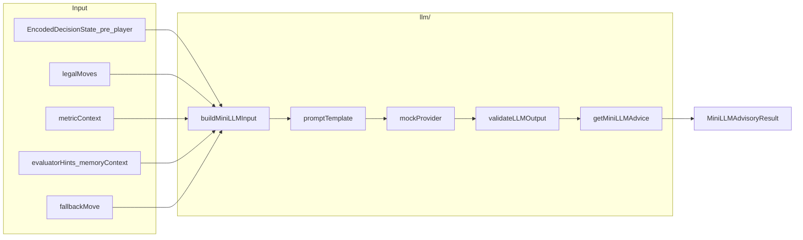

# IMPLEMENTATION_8_MINI_LLM_ADVISORY — Prompt de implementação

**ID:** `IMPLEMENTATION_8_MINI_LLM_ADVISORY`  
**Plano pai:** [IMPLEMENTATION_PLAN_AI.md](../IMPLEMENTATION_PLAN_AI.md) §Impl 8  
**Design base:** [FASE_7_MINI_LLM_DESIGN.md](../FASE_7_MINI_LLM_DESIGN.md) v1.1 · [FASE_4_ENCODER_DESIGN.md](../FASE_4_ENCODER_DESIGN.md) · [FASE_5_AVALIADOR_DESIGN.md](../FASE_5_AVALIADOR_DESIGN.md) · [FASE_6_MEMORIA_APRENDIZAGEM_DESIGN.md](../FASE_6_MEMORIA_APRENDIZAGEM_DESIGN.md)  
**Pré-requisitos:** [IMPLEMENTATION_7_DEBUG_EXPORT_REPORT.md](../implementation-reports/IMPLEMENTATION_7_DEBUG_EXPORT_REPORT.md) — pipeline debug offline (encode/eval/memory/export)  
**Código base:** [`frontend/src/cardIntelligence/`](../../frontend/src/cardIntelligence/) — logger, encoder (`pre_decision` suportado), evaluator, memory, **`debug/`** (Impl 7)  
**Data:** 2026-05-31  
**Scope desta prompt:** guia **executável** para Mini-LLM advisory v0.

**Nota scope:** «não implementar neste passo documental» refere-se à **redacção** desta prompt — **código Impl 8** (`cardIntelligence/llm/`) é o passo seguinte, recomendado após **H7 OK**.

**Princípio:** Implementation 8 cria o **primeiro conselheiro** provider-agnostic — sugere carta **entre legais**, nunca joga sozinha em v0. Metáfora fechada:

| Camada | Metáfora | Impl |
|--------|----------|------|
| Logger | Gravador | 1 + 2 |
| Encoder | Tradutor | 3 |
| Fixtures 2B | Golden cases | 4 |
| Avaliador | Juiz | 5 |
| Memória | Histórico/padrões | 6 |
| Debug/Export | Laboratório | 7 |
| **Mini-LLM** | **Conselheiro** | **8 (esta prompt)** |

**Regra central (F7 + S7):** a mini-LLM **nunca** pode escolher carta ilegal. Toda sugestão passa por validação runtime (§7) antes de aparecer como advisory.

**Checkpoint humano H8:** validação **pós**-Impl 8 — evento guardado → encode pre_decision → advisory → confirmar **zero cartas jogadas** e fallback funcional. **Não** é gate para redigir esta prompt; **H7 OK recomendado** antes de implementar código.

**Gates (D8):**

| Fase | Bloqueio |
|------|----------|
| Redigir/ler esta prompt | **Nenhum** |
| Implementar código Impl 8 | **H7 OK recomendado** (pipeline debug funcional) |
| Checkpoint H8 humano | **Depois** de CI verde + relatório Impl 8 |

**Supersede plano-mãe (pasta):** [IMPLEMENTATION_PLAN_AI.md](../IMPLEMENTATION_PLAN_AI.md) §Impl 8 menciona `cardIntelligence/miniLlm/*`. **Esta prompt prevalece:** módulo canónico **`frontend/src/cardIntelligence/llm/`**.

**Supersede plano-mãe (integração):** plano-mãe lista `GameBoard.tsx` hook advisory. **Esta prompt prevalece v0:** **sem** hook em gameplay; **apenas** helper dev explícito em `debug/` + flag dupla (§12). Decision assist = v1+.

**Supersede F7 §6 (rollout v0):** F7 descreve disabled → advisory → decision assist. **Impl 8 implementa só:** disabled (default) + **advisory offline/dev** via mock provider. Decision assist **proibido** v0.

**Supersede F7 §7 (provider):** nenhum provider real (Ollama, WebLLM, API). **Mock/stub local only** — zero rede.

**Estado repo ao redigir esta prompt:**

| Artefacto | Estado |
|-----------|--------|
| `cardIntelligence/llm/` | **Não existe** |
| `cardIntelligence/miniLlm/` | **Não existe** |
| `cardIntelligence/debug/` | **Existe** (Impl 7) |
| Flags LLM | **Não existem** — propor §12 |
| `encodeMode: pre_decision` | **Suportado** em [`encodeDecisionState.ts`](../../frontend/src/cardIntelligence/encoder/encodeDecisionState.ts) |

---

## Instruções para o agente implementador

1. Confirmar **H7 OK recomendado** antes de editar código; ler esta prompt + FASE_7 §3–11 + relatório Impl 7.
2. Implementar **apenas** escopo §2.1; recusar scope creep (§2.2).
3. Código novo em `frontend/src/cardIntelligence/llm/` + testes; alteração mínima em [`debug/debugConsole.ts`](../../frontend/src/cardIntelligence/debug/debugConsole.ts) (helper) e [`index.ts`](../../frontend/src/cardIntelligence/index.ts) (exports dev).
4. **Zero** alteração de gameplay, bots, `GameBoard`, `*PlayStrategy`, `aiClient`, motores `*Game.ts`.
5. **Não** chamar provider externo/local real — mock only.
6. **Não** activar mini-LLM por defeito — disabled + flag off em prod.
7. Input default: `EncodedDecisionState` **Player View**, `encodeMode: pre_decision`, `phase: play`.
8. `getMiniLLMAdvice` **nunca** chama `playCard` — devolve `MiniLLMAdvisoryResult` only.
9. Validar output com `validateLLMOutput` (§7) — illegal → fallback + reason.
10. `promptTemplate` gera texto — **não** enviar a API real v0; mock pode ignorar prompt ou ecoar fallback.
11. Reutilizar [`cardsMatch`](../../frontend/src/cardIntelligence/shared/clone.ts) para validação carta ∈ legalMoves.
12. Pipeline debug: reutilizar [`evaluateStoredEvents`](../../frontend/src/cardIntelligence/debug/evaluateStoredEvents.ts) pattern — pairing trickEnd, **mas** encode `pre_decision` para input LLM.
13. Ordem commits: types → validate → promptTemplate → mockProvider → buildMiniLLMInput → getMiniLLMAdvice → debug helper → testes → relatório §16.
14. No fim, entregar **relatório final** conforme §16; validação humana **§14** (H8).
15. Antes de push/deploy: `CI=true npm run build`.

---

# 1. Objectivo

Implementation 8 fecha o gap **«conselheiro»** da Card Intelligence:

- Recebe estado codificado honesto (Player View, pré-decisão).
- Recebe `legalMoves`, `metricContext`, hints opcionais (evaluator, memory), `fallbackMove`.
- Devolve sugestão **advisory** validada — carta sempre legal ou fallback explícito.
- **Não** altera jogadas, bots, nem AI existente.



**Modos v0:**

| Modo | Impl 8 |
|------|--------|
| Disabled / fallback | **Default** — flag off; provider mock não invocado em prod |
| Advisory | **Dev helper only** — sugere; humano/heurística decide |
| Decision assist | **Fora v0** |
| Decision-only | **Proibido** |

---

# 2. Escopo exacto

## 2.1 Dentro do escopo (implementação futura)

| Área | Detalhe |
|------|---------|
| **Módulo** | `frontend/src/cardIntelligence/llm/` |
| **Tipos** | `MiniLLMDecisionInput`, `MiniLLMDecisionOutput`, `MiniLLMProvider`, `MiniLLMAdvisoryResult`, `MiniLLMFallbackReason` |
| **Função central** | `getMiniLLMAdvice(input, options?)` |
| **Validação** | `validateLLMOutput(input, raw)` → carta legal ou fallback |
| **Prompt** | `buildPromptTemplate(input)` — texto interno; sem chamada modelo |
| **Provider** | `mockProvider.ts` — stub local; zero rede |
| **Rules** | `buildRulesContext(variant, encodedState)` — King contract-first; Hearts anti «cheap win» genérico |
| **Debug helper** | `__ciGetMiniLLMAdvice(eventId?, opts?)` — só com flags §12 |
| **Testes** | mock, illegal reject, empty legal, prompt Player View, variant rules |
| **Relatório + H8** | §16 + checklist §14 |

## 2.2 Fora do escopo (recusar)

| Item | Impl futura |
|------|-------------|
| Ollama / WebLLM / API externa | v1+ provider real |
| Decision assist / hook GameBoard | v1+ |
| Decision-only | **Proibido sempre** |
| Alterar bots / `*PlayStrategy` | Proibido v0 |
| UI coach / painel advisory | v1+ |
| Bids, pass, leilão King, festa | v1/v2 (F7 §4.2) |
| Treino / fine-tuning | v2+ |
| Memory-driven auto decisions | Proibido — memory = hints only |
| Persistência advisory IDB | v1+ |
| `decisionSource: mini_llm` no logger live | v1+ (decision assist) |
| Alterar encoder stub `memoryContext` wire | v1+ |

## 2.3 Separação de responsabilidades

| Camada | Faz | Não faz |
|--------|-----|---------|
| Encoder | `pre_decision` Player View | sugerir carta |
| Avaliador | classificar pós-jogada | escolher carta |
| Memória | agregados / hints | decidir jogada |
| **Mini-LLM** | **sugestão advisory validada** | jogar carta, illegal move |
| Gameplay / bots | jogadas reais | chamar LLM v0 |

---

# 3. Módulo `llm/` — ficheiros

| Ficheiro | Função |
|----------|--------|
| `types.ts` | Schemas 7.0.0 (F7); enums modo/fallback |
| `buildRulesContext.ts` | `RulesContext` por variant (§10) |
| `buildMiniLLMInput.ts` | Monta `MiniLLMDecisionInput` a partir de log/encode |
| `promptTemplate.ts` | `buildPromptTemplate(input): string` |
| `validateLLMOutput.ts` | Regras V1–V9 (F7 §11) |
| `mockProvider.ts` | `MockMiniLLMProvider` implements `MiniLLMProvider` |
| `getMiniLLMAdvice.ts` | Orquestrador: disabled check → provider → validate → result |
| `index.ts` | exports públicos |
| `*.test.ts` | cobertura §15 |

**Não criar** `provider/ollama.ts`, `webLlm.ts`, etc. v0.

---

# 4. Tipos (schema 7.0.0 — F7 §4–5)

## 4.1 Constantes

```typescript
export const MINI_LLM_SCHEMA_VERSION = '7.0.0' as const;
export const DEFAULT_MINI_LLM_TIMEOUT_MS = 1500;
export const DEFAULT_MAX_REASON_LENGTH = 120;
```

## 4.2 `MiniLLMFallbackReason`

```typescript
type MiniLLMFallbackReason =
  | 'disabled'              // modo disabled / flag off
  | 'empty_legal_moves'     // legalMoves.length === 0
  | 'phase_not_play'        // encodedState.phase !== 'play'
  | 'provider_unavailable'  // mock disabled path
  | 'provider_error'        // mock throw / parse fail
  | 'timeout'               // latencyMs >= timeoutMs
  | 'invalid_json'          // V4
  | 'invalid_index'         // V1
  | 'illegal_card'          // V2 / V3
  | 'fallback_recommended'  // V5 — LLM pediu fallback
  | 'low_confidence_policy' // V5/V6 combinado v0
  | 'mock_stub';            // mock devolve baseline explicitamente
```

## 4.3 `MiniLLMDecisionInput`

Alinhado [FASE_7 §4](../../docs/ai/FASE_7_MINI_LLM_DESIGN.md):

```typescript
interface MiniLLMDecisionInput {
  schemaVersion: '7.0.0';
  requestId: string;

  variant: GameVariant;
  playerIndex: number;
  difficulty: AIDifficulty | null;
  playerType: PlayerType;

  encodedState: EncodedDecisionState;  // pre_decision; chosenCard: null; viewType: player
  legalMoves: Card[];
  metricContext: MetricContextEntry[];

  evaluatorHints?: EvaluatorHint[];
  memoryContext?: MemoryHint[];
  rulesContext: RulesContext;

  fallbackMove: Card;
  fallbackMoveIndex: number;

  timeoutMs: number;
  maxReasonLength: number;

  viewType: 'player';
  hiddenInformationPolicy: HiddenInformationPolicy;

  encoderVersion: '4.0.0';
  metricCatalogVersion: '1.1';
  memorySchemaVersion?: '6.0.0';
}

interface EvaluatorHint {
  metricId: string;
  riskLevel: 'low' | 'medium' | 'high';
  reasonShort: string;
  source: 'heuristic' | 'prior_evaluation' | 'fixture';
}

interface MemoryHint {
  metricId: string;
  badRate?: number;
  trend?: 'improving' | 'worsening' | 'stable' | 'unknown';
  reasonShort: string;
  confidence: 'high' | 'medium' | 'low';
  subjectType: 'bot' | 'human' | 'global';
}

interface RulesContext {
  variant: string;
  objectiveShort: string;
  contractSummary?: string;
  mandatoryRules?: string[];
  phaseNotes?: string;
}
```

## 4.4 Pré-condições (obrigatórias)

| Campo | Regra |
|-------|-------|
| `encodedState.encodeMode` | **`pre_decision`** |
| `encodedState.chosenCard` | **`null`** |
| `encodedState.viewType` | **`player`** |
| `encodedState.phase` | **`play`** (v0) |
| `legalMoves` | length ≥ 1 para chamar provider; senão → fallback `empty_legal_moves` |
| `fallbackMove` | ∈ `legalMoves` (validar em `buildMiniLLMInput`) |
| `encodedState.hand` | contém `fallbackMove` |

## 4.5 `MiniLLMDecisionOutput` (raw provider)

```typescript
interface MiniLLMDecisionOutput {
  schemaVersion: '7.0.0';
  requestId: string;

  selectedCard: Card | null;
  selectedCardIndex: number | null;

  confidence: 'high' | 'medium' | 'low';
  reasonShort: string;
  consideredMetricIds: string[];
  rejectedAlternatives?: RejectedAlternative[];
  uncertaintyFlags?: string[];

  fallbackRecommended: boolean;
  modelId: string | null;
  latencyMs: number;

  /** Runtime — não preenchido pelo mock raw */
  validByEngine: boolean | null;
  appliedCard?: Card;
  appliedSource?: DecisionSource;
}

interface RejectedAlternative {
  card: Card;
  reasonShort: string;
}

type DecisionSource =
  | 'human' | 'bot' | 'ai_internal' | 'ai_external' | 'mini_llm' | 'fallback';
```

## 4.6 `MiniLLMProvider`

```typescript
interface MiniLLMProvider {
  readonly id: string;
  complete(
    prompt: string,
    input: MiniLLMDecisionInput
  ): Promise<MiniLLMDecisionOutput>;
}
```

**v0:** registar **apenas** `MockMiniLLMProvider`. Interface prepara v1+ providers sem alterar `getMiniLLMAdvice`.

## 4.7 `MiniLLMAdvisoryResult` (output público)

```typescript
interface MiniLLMAdvisoryResult {
  schemaVersion: '7.0.0';
  requestId: string;
  mode: 'disabled' | 'advisory';

  /** Carta sugerida para humano — SEMPRE ∈ legalMoves */
  advisoryCard: Card;
  advisoryCardIndex: number;

  confidence: 'high' | 'medium' | 'low';
  reasonShort: string;
  consideredMetricIds: string[];

  /** true se advisoryCard veio de fallback, não do mock «aceite» */
  usedFallback: boolean;
  fallbackReason: MiniLLMFallbackReason | null;

  rawOutput: MiniLLMDecisionOutput | null;
  validByEngine: boolean;

  /** Dev-only — omitir em prod se flag off */
  promptText?: string;

  warnings: string[];
}
```

**Regra:** `advisoryCard` **nunca** illegal. Se validação falhar → `advisoryCard = fallbackMove`, `usedFallback = true`.

---

# 5. `getMiniLLMAdvice`

## 5.1 Assinatura

```typescript
export interface GetMiniLLMAdviceOptions {
  provider?: MiniLLMProvider;
  includePromptText?: boolean;  // default false; true em debug helper
  forceAdvisory?: boolean;      // bypass disabled — **só testes + __ci* com flag**
}

export async function getMiniLLMAdvice(
  input: MiniLLMDecisionInput,
  options?: GetMiniLLMAdviceOptions
): Promise<MiniLLMAdvisoryResult>;
```

## 5.2 Algoritmo

```
function getMiniLLMAdvice(input, options):
  1. Validar pré-condições §4.4
     - phase !== 'play' → return disabled + fallbackMove + phase_not_play
     - legalMoves empty → return disabled + first legal from encoded or abort + empty_legal_moves
     - fallbackMove ∉ legalMoves → coerce fallbackMove = legalMoves[0] + warning

  2. Se CARD_INTELLIGENCE_LLM_ADVISORY === false AND NOT options.forceAdvisory:
     → mode disabled, advisoryCard = fallbackMove, fallbackReason = disabled

  3. provider = options.provider ?? getDefaultMockProvider()
  4. prompt = buildPromptTemplate(input)
  5. try:
       raw = await provider.complete(prompt, input)  // mock: sync OK v0
     catch:
       → usedFallback, provider_error

  6. validated = validateLLMOutput(input, raw)
  7. return MiniLLMAdvisoryResult:
       advisoryCard = validated.appliedCard
       usedFallback = validated.usedFallback
       fallbackReason = validated.fallbackReason
       validByEngine = validated.validByEngine
       promptText = options.includePromptText ? prompt : undefined
```

## 5.3 Fail-silent

- **Nunca throw** para caller UI/debug — devolver result com fallback + `warnings`.
- Testes assertam `MiniLLMAdvisoryResult`, não excepções.

---

# 6. `validateLLMOutput` (F7 §11)

```typescript
export interface ValidationResult {
  appliedCard: Card;
  appliedSource: DecisionSource;
  validByEngine: boolean;
  usedFallback: boolean;
  fallbackReason: MiniLLMFallbackReason | null;
  warnings: string[];
}

export function validateLLMOutput(
  input: MiniLLMDecisionInput,
  raw: MiniLLMDecisionOutput | null
): ValidationResult;
```

| # | Regra | Acção v0 |
|---|-------|----------|
| V1 | `selectedCardIndex` ∉ `[0, legalMoves.length)` | fallback |
| V2 | `selectedCard` ∉ `legalMoves` (cardsMatch) | fallback |
| V3 | `selectedCard` ∉ `encodedState.hand` | fallback |
| V4 | raw null / campos obrigatórios ausentes | fallback `invalid_json` |
| V5 | `fallbackRecommended === true` | fallback `fallback_recommended` |
| V6 | `confidence === 'low'` **e** V5 | fallback (v0: V5 prevalece) |
| V7 | `latencyMs >= input.timeoutMs` | fallback `timeout` |
| V8 | — | tratado em getMiniLLMAdvice catch |
| V9 | após rejeição | `appliedCard = input.fallbackMove` |

**Último recurso:** `legalMoves[0]` se `fallbackMove` inválido (não deve acontecer pós-buildInput).

**`validByEngine`:** `true` só se carta aplicada veio de raw **e** passou V1–V3; senão `false`.

**`appliedSource` v0 advisory:** `'mini_llm'` se validByEngine; senão `'fallback'`. **Não** escrever no logger v0.

---

# 7. `mockProvider.ts`

## 7.1 Comportamento v0

```typescript
export class MockMiniLLMProvider implements MiniLLMProvider {
  readonly id = 'mock:local-stub-v0';

  async complete(prompt: string, input: MiniLLMDecisionInput): Promise<MiniLLMDecisionOutput> {
    // ZERO fetch / WebSocket / Ollama
    return {
      schemaVersion: '7.0.0',
      requestId: input.requestId,
      selectedCard: input.fallbackMove,
      selectedCardIndex: input.fallbackMoveIndex,
      confidence: 'medium',
      reasonShort: 'Mock stub — baseline heuristic move.',
      consideredMetricIds: input.metricContext
        .filter((m) => m.applicable)
        .map((m) => m.metricId)
        .slice(0, 3),
      fallbackRecommended: false,
      modelId: 'mock:local-stub-v0',
      latencyMs: 0,
      validByEngine: null,
    };
  }
}
```

## 7.2 Variantes para testes

Exportar factory **`createMockProvider(behavior)`**:

| Behavior | Uso teste |
|----------|-----------|
| `'valid_fallback_index'` | default — devolve fallback legal |
| `'illegal_card'` | selectedCard fora de legalMoves → validate cai fallback |
| `'invalid_index'` | index 999 |
| `'fallback_recommended'` | `fallbackRecommended: true` |
| `'throw'` | provider_error path |

**Proibido** em v0: provider que chama rede ou WASM LLM.

---

# 8. `promptTemplate.ts`

## 8.1 API

```typescript
export function buildPromptTemplate(input: MiniLLMDecisionInput): string;
```

Base: [FASE_7 §10](../../docs/ai/FASE_7_MINI_LLM_DESIGN.md) — inglês técnico; substituir `{{placeholders}}` por valores reais.

## 8.2 Conteúdo obrigatório

- SYSTEM: escolher **só** de LEGAL MOVES; Player View; incerteza → low + fallbackRecommended
- GAME, OBJECTIVE, CONTRACT (`rulesContext`)
- MANDATORY RULES (lista)
- ENCODED STATE JSON — via **`sanitizeEncodedStateForPrompt(encodedState)`** (allowlist §8.5)
- LEGAL MOVES indexed
- METRICS applicable (metricContext)
- EVALUATOR HINTS (se presentes)
- MEMORY HINTS (se presentes)
- BASELINE MOVE index + carta
- STRICT JSON response schema (selectedCardIndex, selectedCard, confidence, reasonShort, consideredMetricIds, fallbackRecommended)

## 8.3 Testes prompt (§15)

| Variant | Assert template contém |
|---------|------------------------|
| All | **Não** contém `"opponentHands"`, `"deckRemaining"`, `"confirmedVoids"` |
| King | `contractSummary` / contract-first language (K00) |
| Hearts | objective evita «win cheaply» genérico Sueca; menciona points / Q♠ risk |
| Sueca | trunfo / manilhas contexto se metricContext S16 applicable |

## 8.4 `sanitizeEncodedStateForPrompt`

```typescript
export function sanitizeEncodedStateForPrompt(
  encodedState: EncodedDecisionState
): Record<string, unknown>;
```

**Allowlist v0** (top-level keys serializadas):

`schemaVersion`, `variant`, `phase`, `encodeMode`, `viewType`, `playerIndex`, `hand`, `legalMoves`, `currentTrick`, `trickPosition`, `ledSuit`, `trumpSuit`, `currentWinner`, `visiblePlayedCards`, `importantCardsSeen`, `scoreContext`, `riskContext`, `metricContext`, `variantEncoding`, `hiddenInformationPolicy`

**Excluir:** `opponentHands`, `deckRemaining`, `confirmedVoids`, qualquer campo `engine*`.

## 8.5 v0 runtime

- `buildPromptTemplate` **sempre** executável offline.
- Mock **pode** ignorar conteúdo do prompt — prompt existe para H8 inspecção e testes.
- **Nunca** enviar prompt a URL externa v0.

---

# 9. `buildRulesContext.ts` + `buildMiniLLMInput.ts`

## 9.1 `buildRulesContext(variant, encodedState)`

| Variant | `objectiveShort` (exemplo) |
|---------|---------------------------|
| sueca | Win tricks; protect trumps; partner awareness |
| spades | Meet bid; avoid bags; partner support |
| hearts | Avoid points; Q♠ danger; do not take unnecessary tricks |
| king | **Contract-first** — fulfill active contract before generic trick play |

**King mandatoryRules v0:** extrair de [`kingObligations.ts`](../../frontend/src/cardIntelligence/shared/kingObligations.ts) / `encodedState.variantEncoding` quando K02/K03 applicable — **read-only**, não duplicar regras motor.

**Hearts (D12):** objective **não** copiar Sueca «ganhar barato» — usar linguagem anti-pontos F7 §9.3.

## 9.2 `buildMiniLLMInput(params)`

```typescript
export function buildMiniLLMInput(params: {
  event: CardDecisionLogEvent;
  trickEndEvent?: TrickEndEvent;
  legalMoves: Card[];
  fallbackMove: Card;
  evaluatorHints?: EvaluatorHint[];
  memoryHints?: MemoryHint[];
  requestId?: string;
  timeoutMs?: number;
}): MiniLLMDecisionInput;
```

Passos:

1. `encodedState = encodeDecisionState({ event, trickEndEvent, encodeMode: 'pre_decision', viewType: 'player' })`.
2. Assert `encodedState.phase === 'play'` (ou derivar de event — play v0 only).
3. `fallbackMoveIndex = legalMoves.findIndex(c => cardsMatch(c, fallbackMove))` — se -1, usar `0` + warning.
4. `metricContext = encodedState.metricContext`.
5. `rulesContext = buildRulesContext(event.variant, encodedState)`.
6. Gerar `requestId` UUID curto se omitido.

## 9.3 `buildMiniLLMInputFromStoredEvent` (debug)

```typescript
export async function buildMiniLLMInputFromStoredEvent(
  eventId: string,
  opts?: { fallbackMoveIndex?: number; memoryQuery?: MemoryQuery }
): Promise<MiniLLMDecisionInput | null>;
```

Pipeline:

1. `findPlayByEventId` + `findTrickEndForPlay` (reutilizar [`debug/evaluateStoredEvents.ts`](../../frontend/src/cardIntelligence/debug/evaluateStoredEvents.ts)).
2. `legalMoves = play.legalMoves`.
3. `fallbackMove = legalMoves[opts?.fallbackMoveIndex ?? 0]`.
4. Opcional: `evaluateStoredPlay` → `mapMetricResultsToEvaluatorHints(evaluation)` — ver §9.4.
5. Opcional: `listMemoryAggregates(memoryQuery)` → top 3 → `memoryContext` (MemoryHint[]).
6. `buildMiniLLMInput(...)`.

**Não** usar `post_decision` encode para input LLM.

## 9.4 `mapMetricResultsToEvaluatorHints`

Mapeamento fechado a partir de `DecisionEvaluationResult.metricResults` (via `evaluateStoredPlay` **post_decision** — só hints, não encode LLM):

| `MetricEvaluationResult.classification` | `riskLevel` | `source` |
|----------------------------------------|-------------|----------|
| `bad` | `high` | `prior_evaluation` |
| `medium` | `medium` | `prior_evaluation` |
| `good` | `low` | `prior_evaluation` |
| `partial` | `medium` | `prior_evaluation` |
| `unknown` / `not_applicable` | — | **omitir** |

- `reasonShort` = truncar `metricResult.reasonShort` a `maxReasonLength` (120)
- Máximo **5** hints; ordenar: bad → medium → partial → good

```typescript
export function mapMetricResultsToEvaluatorHints(
  evaluation: DecisionEvaluationResult,
  maxReasonLength?: number
): EvaluatorHint[];
```

---

# 10. Feature flags (§12 — D2)

Adicionar em [`features.ts`](../../frontend/src/config/features.ts):

```typescript
/**
 * Mini-LLM advisory — default OFF everywhere (including npm start).
 * Requires CARD_INTELLIGENCE_DEBUG for __ci* helper.
 */
export const CARD_INTELLIGENCE_LLM_ADVISORY =
  process.env.REACT_APP_CARD_INTELLIGENCE_LLM_ADVISORY === 'true';
```

| Flag | Default | Efeito |
|------|---------|--------|
| `CARD_INTELLIGENCE_DEBUG` | ON em dev | Regista `__ci*` (Impl 7) |
| `CARD_INTELLIGENCE_LLM_ADVISORY` | **OFF sempre** | Permite `getMiniLLMAdvice` advisory path |
| Combinação | | `__ciGetMiniLLMAdvice` exige **ambas** true |

**Activar localmente:**

```bash
REACT_APP_CARD_INTELLIGENCE_DEBUG=true \
REACT_APP_CARD_INTELLIGENCE_LLM_ADVISORY=true \
npm start
```

**Prod default:** ambas false → zero chamadas mock, zero helpers LLM.

**Supersede F7 §8.2** nomes `MINI_LLM_ENABLED` — usar prefixo `CARD_INTELLIGENCE_*` consistente com logger/debug.

---

# 11. Integração debug (única integração v0)

## 11.1 Alterar [`debug/debugConsole.ts`](../../frontend/src/cardIntelligence/debug/debugConsole.ts)

```typescript
// Registar __ciGetMiniLLMAdvice iff CARD_INTELLIGENCE_DEBUG && CARD_INTELLIGENCE_LLM_ADVISORY
// Caso contrário: helper undefined (H8 passo 7 — prod sem flags)

window.__ciGetMiniLLMAdvice = async (eventId: string, opts?) => {
  const input = await buildMiniLLMInputFromStoredEvent(eventId, opts);
  if (!input) return null;
  return getMiniLLMAdvice(input, { includePromptText: true, forceAdvisory: true });
};
```

Expandir `window.__ci` namespace: `getMiniLLMAdvice`.

Mensagem consola Impl 8 (append):

```
  await __ciGetMiniLLMAdvice('<eventId>')  — advisory only; no play
```

## 11.2 O que NÃO fazer

- **Não** importar `llm/` em `GameBoard.tsx`, `playWithLogging.ts`, bots.
- **Não** dynamic import LLM em `index.tsx` separado — helper vive dentro de debug console install **condicional**.
- Tree-shaking: `cardIntelligence/index.ts` exports dev OK; gameplay não importa.

---

# 12. Ficheiros — criar vs alterar

## 12.1 Criar

- `llm/types.ts`
- `llm/buildRulesContext.ts`
- `llm/buildMiniLLMInput.ts`
- `llm/promptTemplate.ts`
- `llm/validateLLMOutput.ts`
- `llm/mockProvider.ts`
- `llm/getMiniLLMAdvice.ts`
- `llm/index.ts`
- `llm/validateLLMOutput.test.ts`
- `llm/mockProvider.test.ts`
- `llm/getMiniLLMAdvice.test.ts`
- `llm/promptTemplate.test.ts`
- `llm/buildMiniLLMInput.test.ts`

## 12.2 Alterar (mínimo)

| Ficheiro | Alteração |
|----------|-----------|
| [`features.ts`](../../frontend/src/config/features.ts) | `CARD_INTELLIGENCE_LLM_ADVISORY` |
| [`debug/debugConsole.ts`](../../frontend/src/cardIntelligence/debug/debugConsole.ts) | `__ciGetMiniLLMAdvice` condicional |
| [`cardIntelligence/index.ts`](../../frontend/src/cardIntelligence/index.ts) | exports dev: `getMiniLLMAdvice`, tipos |

## 12.3 Não alterar

- `GameBoard.tsx`, `playWithLogging.ts`, bots, `*PlayStrategy`, `aiClient.ts`, `*Game.ts`, evaluator, memory hot paths, logger classification.

---

# 13. Testes mínimos e CI

## 13.1 Checklist implementador

- [ ] Mock provider devolve carta ∈ legalMoves
- [ ] Illegal card output → fallback + `usedFallback: true`
- [ ] Invalid index → fallback
- [ ] `fallbackRecommended: true` → fallback
- [ ] `legalMoves: []` → `empty_legal_moves`; sem throw
- [ ] Prompt **não** contém opponent hands / engine fields
- [ ] King template menciona contract
- [ ] Hearts template **não** usa objective Sueca generic win-cheap
- [ ] `getMiniLLMAdvice` flag off → disabled + fallback, zero provider call (spy)
- [ ] `__ciGetMiniLLMAdvice` undefined quando flag off (install path)
- [ ] Imutabilidade: input event/log não mutado
- [ ] `cardsMatch` usado para V2/V3

## 13.2 Comandos CI

```bash
cd frontend
CI=true npm test -- --testPathPattern=llm --watchAll=false
CI=true npm test -- --testPathPattern=cardIntelligence --watchAll=false
CI=true npm run build
REACT_APP_CARD_INTELLIGENCE_LLM_ADVISORY=true CI=true npm run build

grep -r "getMiniLLMAdvice\|MockMiniLLMProvider" \
  frontend/src --include="*GameBoard*" --include="*playWithLogging*" \
  --include="*PlayStrategy*"
# expect: no matches
```

---

# 14. Checkpoint H8 (humano — copy-paste)

**Pré-requisito:** relatório Impl 8 + CI verde. **Não** exige jogar partida específica.

1. [ ] `REACT_APP_CARD_INTELLIGENCE_DEBUG=true REACT_APP_CARD_INTELLIGENCE_LLM_ADVISORY=true npm start`
2. [ ] Jogar ou usar evento IDB existente; copiar `eventId`
3. [ ] `await __ciEvaluateEvent(eventId)` — confirmar evaluation legível (contexto)
4. [ ] `await __ciGetMiniLLMAdvice(eventId)` — inspect result:
   - `advisoryCard` ∈ `legalMoves` do evento
   - `usedFallback` / `fallbackReason` compreensíveis
   - `promptText` presente; **sem** mãos adversárias
5. [ ] Confirmar **nenhuma carta jogada** pela LLM (gameplay inalterado)
6. [ ] Testar path illegal via mock test ou forced provider em dev — fallback activo
7. [ ] Build prod sem flags: `typeof window.__ciGetMiniLLMAdvice === 'undefined'`
8. [ ] OK explícito para v1 (provider real / decision assist)

**Não exigir H8:** provider Ollama; UI coach; decision assist live.

---

# 15. Critérios de sucesso

| Critério | Verificação |
|----------|-------------|
| Build passa | `CI=true npm run build` (flags off e on) |
| Testes passam | llm + cardIntelligence |
| Zero gameplay | grep GameBoard/bots/strategies |
| Zero provider real | grep fetch/ollama/webllm em `llm/` |
| Mini-LLM não live | flag off → disabled path |
| Advisory dev-only | `__ciGetMiniLLMAdvice` + flags duplas |
| Illegal never | testes validateLLMOutput |
| Fallback always | todo result tem `advisoryCard` legal |
| Relatório | §16 entregue |

---

# 16. Relatório final esperado (pós-código)

Criar [`docs/ai/implementation-reports/IMPLEMENTATION_8_MINI_LLM_ADVISORY_REPORT.md`](../implementation-reports/IMPLEMENTATION_8_MINI_LLM_ADVISORY_REPORT.md):

```markdown
# IMPLEMENTATION_8_MINI_LLM_ADVISORY — Relatório final

## Ficheiros criados / alterados
## Helpers disponíveis (__ciGetMiniLLMAdvice, flags)
## Exemplo MiniLLMAdvisoryResult (JSON)
## Exemplo promptText truncado
## Testes executados + contagens
## Confirmação zero gameplay + grep
## Confirmação zero chamadas provider real
## Gaps / riscos (decision assist, Ollama, logger decisionSource)
## Próximos passos v1
## Como validar H8 (checklist §14)
```

---

# 17. Decisões fechadas (D1–D15)

| ID | Tema | Decisão |
|----|------|---------|
| **D1** | `llm/` vs `miniLlm/` | **`llm/`** canónico; supersede plano-mãe |
| **D2** | Flag | `CARD_INTELLIGENCE_LLM_ADVISORY` default **false**; helper exige também `CARD_INTELLIGENCE_DEBUG` |
| **D3** | Schema version | **7.0.0** alinhado F7 (distinto de export envelope record types Impl 7) |
| **D4** | Provider v0 | **Mock only** — zero rede |
| **D5** | Decision assist | **Fora v0** — proibido hook GameBoard |
| **D6** | Nome função vs F7 `resolveMove` | Função pública **`getMiniLLMAdvice`**; **não** exportar `resolveMove` v0 — lógica em `validateLLMOutput` + `getMiniLLMAdvice` |
| **D7** | fallbackMove source v0 debug | `legalMoves[0]` ou index opt; v1: heurística bot |
| **D8** | Gates | Redigir: livre; código: H7 OK; **H8 pós-Impl 8** |
| **D9** | Evaluator hints | Opcional via offline eval do evento guardado |
| **D10** | Memory hints | Opcional top-K aggregates; **não** wire encoder stub |
| **D11** | promptText em prod | Omitir unless debug+advisory flags |
| **D12** | Hearts rules | Anti-pontos; não Sueca win-cheap |
| **D13** | King rules | Contract-first mandatory in template |
| **D14** | timeout v0 | Mock `latencyMs: 0`; validate V7 testável com raw fake |
| **D15** | Logger `decisionSource` | **Não** escrever v0; documentar v1 decision assist |
| **D16** | `llm/` importa `debug/` | **OK v0** — `buildMiniLLMInputFromStoredEvent` importa pairing de `debug/evaluateStoredEvents`; **proibido** import `llm/` em gameplay; v1: extrair pairing para `shared/` se bundle exigir |

---

# 18. Riscos

| # | Risco | Mitigação v0 |
|---|-------|--------------|
| R1 | Scope creep decision assist | grep GameBoard; prompt §2.2 |
| R2 | Illegal advisory | validateLLMOutput obrigatório + testes |
| R3 | Provider real acidental | mock only; code review |
| R4 | Flag on em prod | default false; env explicit |
| R5 | Prompt vaza engine view | sanitize JSON; testes |
| R6 | King rules wrong | buildRulesContext + kingObligations read-only |
| R7 | Confundir advisory com jogada | naming `advisoryCard`; H8 checklist |
| R8 | Duplicar evaluator | hints opcionais; LLM não é juiz |
| R9 | Bundle size | mock leve; no WASM v0 |

---

# 19. Gaps deferidos (v1+)

| Gap | Versão |
|-----|--------|
| Provider Ollama / WebLLM | v1 |
| Decision assist + GameBoard wrapper | v1 |
| Logger `decisionSource: mini_llm` | v1 |
| UI coach advisory | v1 |
| Bids / pass / King auction | v1/v2 F7 §4.2 |
| Heurística real como fallbackMove | v1 |
| Timeout async provider real | v1 |
| Persist advisory history | v1 |

---

# 20. Referências

- [IMPLEMENTATION_PLAN_AI.md](../IMPLEMENTATION_PLAN_AI.md) §Impl 8, §6 S4/S7/S12
- [FASE_7_MINI_LLM_DESIGN.md](../FASE_7_MINI_LLM_DESIGN.md) v1.1
- [FASE_4_ENCODER_DESIGN.md](../FASE_4_ENCODER_DESIGN.md) — pre_decision, Player View
- [FASE_5_AVALIADOR_DESIGN.md](../FASE_5_AVALIADOR_DESIGN.md) — juiz separado
- [FASE_6_MEMORIA_APRENDIZAGEM_DESIGN.md](../FASE_6_MEMORIA_APRENDIZAGEM_DESIGN.md) — hints only
- [IMPLEMENTATION_7_DEBUG_EXPORT_PROMPT.md](./IMPLEMENTATION_7_DEBUG_EXPORT_PROMPT.md)
- [IMPLEMENTATION_7_DEBUG_EXPORT_REPORT.md](../implementation-reports/IMPLEMENTATION_7_DEBUG_EXPORT_REPORT.md)
- Código: [`encoder/`](../../frontend/src/cardIntelligence/encoder/), [`debug/`](../../frontend/src/cardIntelligence/debug/), [`features.ts`](../../frontend/src/config/features.ts)

## Histórico

| Versão | Data | Nota |
|--------|------|------|
| 1.0 | 2026-05-31 | Prompt inicial Impl 8 — advisory mock-only; llm/; flags; H8; D1–D15 |
