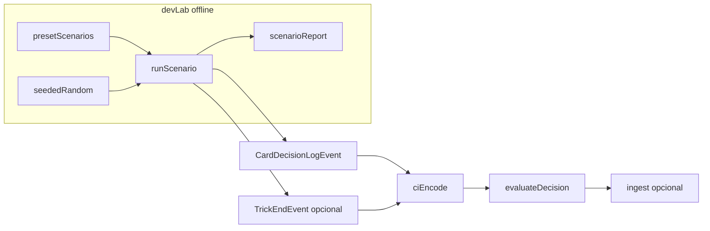

# IMPLEMENTATION_9_DEV_SEEDED_GAME_LAB — Prompt de implementação

**ID:** `IMPLEMENTATION_9_DEV_SEEDED_GAME_LAB`  
**Plano pai:** [IMPLEMENTATION_PLAN_AI.md](../IMPLEMENTATION_PLAN_AI.md) §Impl 9  
**Design base:** [FASE_2B_FIXTURES_METRICAS.md](../FASE_2B_FIXTURES_METRICAS.md) · [FASE_4_ENCODER_DESIGN.md](../FASE_4_ENCODER_DESIGN.md) · [FASE_5_AVALIADOR_DESIGN.md](../FASE_5_AVALIADOR_DESIGN.md) · [FASE_6_MEMORIA_APRENDIZAGEM_DESIGN.md](../FASE_6_MEMORIA_APRENDIZAGEM_DESIGN.md) · [FASE_7_MINI_LLM_DESIGN.md](../FASE_7_MINI_LLM_DESIGN.md)  
**Status report:** [CARD_INTELLIGENCE_STATUS_REPORT.md](../CARD_INTELLIGENCE_STATUS_REPORT.md) §Impl 9  
**Pré-requisitos:** relatórios Impl 1–8 concluídos — especialmente [IMPLEMENTATION_7_DEBUG_EXPORT_REPORT.md](../implementation-reports/IMPLEMENTATION_7_DEBUG_EXPORT_REPORT.md) e [IMPLEMENTATION_8_MINI_LLM_ADVISORY_REPORT.md](../implementation-reports/IMPLEMENTATION_8_MINI_LLM_ADVISORY_REPORT.md)  
**Código base:** [`frontend/src/cardIntelligence/`](../../frontend/src/cardIntelligence/) — logger, encoder, fixtures, evaluator, memory, debug, llm mock  
**Data:** 2026-06-04  
**Scope desta prompt:** guia **executável** para Dev Seeded Game Lab v0 — **não implementar neste passo documental**.

**Tipo de documento:** prompt de **implementação** (Agent mode) — **não** é relatório de estado ([`CARD_INTELLIGENCE_STATUS_REPORT.md`](../CARD_INTELLIGENCE_STATUS_REPORT.md)), **não** é relatório de CI (GitHub Actions), **não** é o relatório pós-código (§16). O agente implementador executa código; o agente redactor desta prompt só escreve documentação quando indicado.

**Posicionamento no roadmap (supersede recomendações antigas):** conforme [`CARD_INTELLIGENCE_STATUS_REPORT.md`](../CARD_INTELLIGENCE_STATUS_REPORT.md) v1.1 e [`ROADMAP_AI.md`](../ROADMAP_AI.md), **Impl 9 é o próximo passo de código** depois de Impl 1–8 — antes de provider LLM real, Evaluator v1 ou alteração de bots. Qualquer menção antiga a «Debug Report + Evaluator v1 primeiro» fica **supersedida** por esta sequência.

**Princípio:** Implementation 9 cria um **laboratório developer** para cenários controlados e jogos seeded — repetir situações métricas **sem** depender de shuffle aleatório nem de jogar manualmente até aparecer a mão certa. Metáfora fechada:

| Camada | Metáfora | Impl |
|--------|----------|------|
| Logger | Gravador | 1 + 2 |
| Encoder | Tradutor | 3 |
| Fixtures 2B | Golden cases | 4 |
| Avaliador | Juiz | 5 |
| Memória | Histórico/padrões | 6 |
| Debug/Export | Laboratório / arquivo | 7 |
| Mini-LLM | Conselheiro (mock) | 8 |
| **Dev Seeded Game Lab** | **Bancada de testes / mesa controlada** | **9 (esta prompt)** |

**Checkpoint humano H9:** validação **pós**-Impl 9 — listar cenários, correr 4 presets (1/jogo), ver report legível (log + encode + eval), seeded determinístico, prod sem helpers lab, jogo normal inalterado. **Não** é gate para redigir esta prompt; **H8 OK recomendado** antes de implementar código.

**Gates (D8):**

| Fase | Bloqueio |
|------|----------|
| Redigir/ler esta prompt | **Nenhum** |
| Implementar código Impl 9 | **H8 OK recomendado** (pipeline debug + LLM mock smoke) |
| Checkpoint H9 humano | **Depois** de CI verde + relatório Impl 9 |

**Supersede plano-mãe (pasta):** [IMPLEMENTATION_PLAN_AI.md](../IMPLEMENTATION_PLAN_AI.md) §Impl 9 menciona `lab/`. **Esta prompt prevalece:** módulo canónico **`frontend/src/cardIntelligence/devLab/`**.

**Supersede plano-mãe (modo preset v0):** qualquer menção a «simular via motor/adapters inject» fica **v1+**. **Impl 9 v0:** Preset Scenario Mode = **síntese offline** de eventos (padrão fixtures) — **sem** correr `*Game.ts`, **sem** `GameBoard`, **sem** `playWithLogging`.

**Supersede [`Deck.ts`](../../frontend/src/models/Deck.ts):** shuffle actual usa `Math.random()` — **sem seed** no repo. **Impl 9 v0:** PRNG determinístico **local ao devLab** (`seededRandom.ts`); **não** alterar `Deck` v0.

**Supersede Impl 7 (flag única):** Impl 7 usa só `CARD_INTELLIGENCE_DEBUG`. **Impl 9** adiciona flag dedicada **`CARD_INTELLIGENCE_DEV_LAB`** — helpers lab (§10.2) só com **dupla flag** (espelhar Impl 8 LLM).

**Supersede Impl 8 (LLM):** **não** chamar provider real; **não** activar decision assist. Opcional P1: helper `__ciLabGetMiniLLMAdvice(scenarioId)` reutilizando mock **só** se `CARD_INTELLIGENCE_LLM_ADVISORY` — **fora do escopo v0**.

**Estado repo ao redigir esta prompt:**

| Artefacto | Estado |
|-----------|--------|
| `cardIntelligence/devLab/` | **Não existe** |
| `cardIntelligence/fixtures/` | **Existe** — 23 fixtures `ALL_FIXTURES` |
| `cardIntelligence/debug/` | **Existe** — evaluate, export, postGameReport, `__ci*` |
| `CARD_INTELLIGENCE_DEV_LAB` | **Não existe** — propor §5 |
| [`Deck.ts`](../../frontend/src/models/Deck.ts) | Sem seed |

---

## Glossário de estados (usar estes termos — não inventar outros)

| Termo | Definição **neste projecto** |
|-------|------------------------------|
| **OK** | CI verde (`npm test` + `npm run build`) **e** gap funcional/H humano **fechado** no relatório da impl |
| **Parcial** | CI verde **mas** gap funcional, smoke manual ou checkpoint **H*** **pendente** — **não** significa CI vermelho |
| **Gap (planeado)** | Documentado no plano/roadmap; código **ainda não existe** (ex.: `devLab/` antes de Impl 9) |
| **H*N* OK** | Francisco executou checklist §17 desta prompt **sem erros**; assinatura explícita no relatório Impl 9: linha `**H9:** OK` na secção «Checkpoints humanos» |
| **Hot path** | Fluxo de jogada real: `GameBoard` → motor → `playWithLogging` → IDB logger |
| **Offline / dev-only** | Código só activo com flags; **nunca** executado em prod default |

**Regra anti-alucinação (obrigatória no relatório Impl 9):** nenhuma afirmação factual (contagens, nomes de ficheiros, classificações de preset) sem citação a **relatório Impl 1–8**, **FASE**, **teste Jest** ou **output de grep/comando** desta prompt.

---

## Ficheiros-fonte obrigatórios (ler antes de implementar)

| Ficheiro | O que verificar (não só citar) |
|----------|--------------------------------|
| [`fixtures/index.ts`](../../frontend/src/cardIntelligence/fixtures/index.ts) | `ALL_FIXTURES`, `getFixtureById`; IDs K02, SP09, S16, H13 existem |
| [`fixtures/types.ts`](../../frontend/src/cardIntelligence/fixtures/types.ts) | Shape `FixtureCase`; campos `event`, `expected` |
| [`debug/evaluateStoredEvents.ts`](../../frontend/src/cardIntelligence/debug/evaluateStoredEvents.ts) | `ciEncode`, `evaluateStoredPlay`, pairing `findTrickEndForPlay` — **reutilizar**, não copiar |
| [`debug/postGameReport.ts`](../../frontend/src/cardIntelligence/debug/postGameReport.ts) | Tom e secções do report texto |
| [`debug/debugConsole.ts`](../../frontend/src/cardIntelligence/debug/debugConsole.ts) | Padrão `installCardIntelligenceDebugConsole`, guards de flag, `window.__ci*` |
| [`config/features.ts`](../../frontend/src/config/features.ts) | `CARD_INTELLIGENCE_DEBUG`, `CARD_INTELLIGENCE_LLM_ADVISORY` — espelhar para `DEV_LAB` |
| [`index.tsx`](../../frontend/src/index.tsx) | Dynamic import condicional **só** se `CARD_INTELLIGENCE_DEBUG` |
| [`models/Deck.ts`](../../frontend/src/models/Deck.ts) | `Math.random()` no shuffle — **confirmar** que v0 **não** altera este ficheiro |
| [`logger/playWithLogging.ts`](../../frontend/src/cardIntelligence/logger/playWithLogging.ts) | **Confirmar** zero imports devLab após implementação |
| Relatórios [Impl 7](../implementation-reports/IMPLEMENTATION_7_DEBUG_EXPORT_REPORT.md) · [Impl 8](../implementation-reports/IMPLEMENTATION_8_MINI_LLM_ADVISORY_REPORT.md) | Flags duplas, padrão evaluate offline, H7/H8 scripts |

---

## Instruções para o agente implementador

1. Confirmar **H8 OK recomendado** antes de editar código; ler esta prompt **completa** + relatórios Impl 7–8.
2. Implementar **apenas** escopo §2.1; recusar scope creep (§2.2).
3. Código novo em `frontend/src/cardIntelligence/devLab/` + testes; alteração mínima em [`features.ts`](../../frontend/src/config/features.ts), [`debug/debugConsole.ts`](../../frontend/src/cardIntelligence/debug/debugConsole.ts) ou `debug/devLabConsole.ts`, [`index.tsx`](../../frontend/src/index.tsx), [`cardIntelligence/index.ts`](../../frontend/src/cardIntelligence/index.ts).
4. **Zero** alteração de gameplay, bots, `GameBoard`, `playWithLogging`, `*PlayStrategy`, `aiClient`, motores `*Game.ts` (salvo leitura futura v1 — **proibido v0**).
5. **Preset v0:** síntese offline de `CardDecisionLogEvent` / `TrickEndEvent` — reutilizar [`ALL_FIXTURES`](../../frontend/src/cardIntelligence/fixtures/index.ts) / [`buildFixtureEvent`](../../frontend/src/cardIntelligence/fixtures/buildFixtureEvent.ts).
6. **Não** chamar `logCardDecision`, `playWithLogging`, nem escrever IDB por defeito (D2).
7. Pipeline evaluate: reutilizar [`ciEncode`](../../frontend/src/cardIntelligence/debug/evaluateStoredEvents.ts) + [`evaluateDecision`](../../frontend/src/cardIntelligence/evaluator/evaluateDecision.ts) — **não** duplicar lógica de pairing trickEnd.
8. Player View **por defeito**; Engine View só opt `{ engineView: true }`.
9. Cenário ilegal → `DevLabScenarioError` com mensagem clara — **não** mascarar bugs reais.
10. Seeded random: mesma seed → mesmo `dealHash`; seeds diferentes → hash diferente.
11. Helpers lab (`__ciListScenarios`, `__ciRunScenario`, … — ver §10.2) instalados **só** com `CARD_INTELLIGENCE_DEBUG && CARD_INTELLIGENCE_DEV_LAB`.
12. Ordem commits sugerida: types → presetScenarios → seededRandom → runScenario → scenarioReport → devLabConsole → testes → relatório §16.
13. No fim, entregar **relatório final** conforme §16; validação humana **§17** (H9).
14. Antes de push/deploy: executar **todos** os comandos §12.2 + checklist §5.4 (grep com output esperado).
15. Grep hot path: zero `devLab` / `runScenario` em `GameBoard`, `playWithLogging`, `models/games`.
16. Relatório Impl 9: **cada** bullet factual com referência (relatório/FASE/teste/grep) — ver glossário.
17. **Não** pedir a Francisco para ler ficheiros do repo durante H9 — script §17.2 é autocontido.

---

# 1. Objectivo

## 1.1 Problema

O pipeline Card Intelligence está completo (Logger → … → Mini-LLM mock), mas validar **situações concretas** só com partidas reais é ineficiente:

- shuffle aleatório ([`Deck.ts`](../../frontend/src/models/Deck.ts));
- difícil reproduzir K♥ obrigatório (King), Q♠ (Hearts), bag (Spades), manilha antes do Ás (Sueca), duas últimas (King), cortes/trunfos específicos;
- smoke humano H1–H9 depende de sorte na mesa.

## 1.2 Solução

**Dev Seeded Game Lab** — área **dev-only** com dois modos:

| Modo | v0 |
|------|-----|
| **Preset Scenario Mode** | Cenários pré-construídos; síntese offline de eventos; pipeline encode → eval → memory opcional → report |
| **Seeded Random Mode** | Seed fixa → distribuição determinística; export metadata/hash; preparar extensão v1 motor |



**Regra central:** devLab **nunca** altera o fluxo normal de jogo. Produção **sem flags** → zero helpers lab.

---

# 2. Escopo exacto

## 2.1 Dentro do escopo (implementação futura)

| Área | Detalhe |
|------|---------|
| **Módulo** | `frontend/src/cardIntelligence/devLab/` |
| **Preset Scenario Mode** | ≥4 presets (1/jogo); mãos, legalMoves, métrica-alvo; eventos sintéticos compatíveis schema 3.0.0 |
| **Seeded Random Mode** | PRNG local; `generateSeededDeal(variant, seed)`; dealHash reproducível |
| **runScenario** | Orquestrador offline: validate → encode → evaluate → memory opcional → report |
| **scenarioReport** | Texto legível estilo `postGameReport` |
| **Console API** | Helpers §10.2 via `devLabConsole.ts` ou extensão `debugConsole.ts` |
| **Flag** | `REACT_APP_CARD_INTELLIGENCE_DEV_LAB` + exige `CARD_INTELLIGENCE_DEBUG` |
| **Testes** | Determinismo seed; 4 presets; flag off; hot path grep |
| **Relatório + H9** | §16–§17 |

### Preset Scenario Mode — campos por cenário

Cada `DevLabScenario` deve poder expressar (via evento sintético ou wrapper fixture):

| Campo | Descrição |
|-------|-----------|
| `id` | ex. `LAB_K02` |
| `variant` | sueca \| spades \| hearts \| king |
| `primaryMetricId` | ex. K02, SP09, S16, H13 |
| `humanNote` | frase de mesa (PT) |
| `playEvent` | `CardDecisionLogEvent` completo |
| `trickEndEvent` | opcional — se vaza de 4 cartas relevante |
| `chosenCard` | opcional — default do evento |
| `legalMoves` | obrigatório validar ⊆ hand |
| `expectedEvaluation` | opcional — assert em testes (classification, metricIds) |

### Exemplos de cenários-alvo (narrativa)

| Cenário | Jogo | Situação |
|---------|------|----------|
| K♥ obrigatório | King | `no_king_hearts` — 1.ª oportunidade legal |
| Q♠ perigo | Hearts | limpar / descartar perigo |
| Bag | Spades | bid cumprido — evitar overtrick |
| Manilha antes do Ás | Sueca | S16 — não abrir manilha cedo |
| Ganhar barato | Sueca | S08 — P1 extra |
| Duas últimas | King | K10 — P1 extra |
| Corte trunfo mínimo | Sueca | S12 — P1 extra |

**v0 mínimo:** 4 presets (`LAB_K02`, `LAB_SP09`, `LAB_S16`, `LAB_H13`).

### Seeded Random Mode — capacidades v0

| Capacidade | v0 |
|------------|-----|
| `seed` numérica ou string normalizada | Sim |
| Mesma seed → mesmo `dealHash` | Sim |
| Export `{ seed, variant, dealHash, cardOrder? }` | Sim |
| Simular vazas completas via motor | **Não** — v1 |
| Alterar `Deck.ts` | **Não** |

## 2.2 Fora do escopo (recusar)

| Item | Notas |
|------|-------|
| UI bonita / dashboard | v1+ |
| Replay visual completo | v1+ |
| Editor visual de cenários | v1+ |
| Engine inject / correr motor com estado injectado | **v1+** (decisão utilizador) |
| Alterar estratégia de bots | Proibido |
| Alterar regras / scoring | Proibido |
| Cloud sync | Proibido |
| Provider LLM real | Impl posterior |
| Decision assist / hook GameBoard | Proibido v0 |
| Multiplayer joiner | Proibido v0 |
| Persistência IDB lab runs por defeito | P1 (D2) |
| Poluir `cardIntelligenceLogs` em partida real | Proibido v0 |

## 2.3 Separação de responsabilidades

| Camada | Produz | Não produz |
|--------|--------|------------|
| Logger live | eventos IDB em jogo | cenários lab |
| Fixtures | eventos teste encode golden | UI lab |
| Debug/Export | ler IDB, evaluate stored | cenários seeded |
| **devLab** | **eventos sintéticos + pipeline offline + report** | jogadas, hooks live |
| Gameplay | jogadas reais | métricas automáticas lab |

---

# 3. Relação com fixtures existentes

## 3.1 Reutilizar, não duplicar

[`FixtureCase`](../../frontend/src/cardIntelligence/fixtures/types.ts) já inclui:

- `event: CardDecisionLogEvent`
- `expected` (metricContext, encodedFields)
- `humanNote`, `primaryMetricId`, `tier`

**Estratégia v0:** presets `LAB_*` são **wrappers finos** sobre fixtures existentes:

| Preset ID | Fixture base | Métrica |
|-----------|--------------|---------|
| `LAB_K02` | K02 | K♥ obrigatório |
| `LAB_SP09` | SP09 | Bid cumprido, evitar bag |
| `LAB_S16` | S16 | Manilha antes do Ás |
| `LAB_H13` | H13 | Q♠ perigo / limpar |

Implementação sugerida em `presetScenarios.ts`:

```typescript
import { getFixtureById } from '../fixtures';
import { DevLabScenario } from './types';

function labFromFixture(labId: string, fixtureId: string): DevLabScenario {
  const fixture = getFixtureById(fixtureId);
  if (!fixture) throw new DevLabScenarioError(`Fixture ${fixtureId} missing`);
  return {
    id: labId,
    variant: fixture.variant,
    primaryMetricId: fixture.primaryMetricId,
    humanNote: fixture.humanNote,
    playEvent: fixture.event,
    trickEndEvent: undefined, // preencher se preset incluir vaza fechada
    legalMoves: fixture.event.legalMoves,
    chosenCard: fixture.event.chosenCard,
    fixtureId,
  };
}
```

## 3.2 TrickEnd opcional

Se preset precisar de `trickEnd` para encode/eval (ex. H13 snapshot pré-jogada):

- Construir `TrickEndEvent` sintético alinhado a [`FASE_3_LOGGER_DESIGN.md`](../FASE_3_LOGGER_DESIGN.md)
- Reutilizar pairing de [`findTrickEndForPlay`](../../frontend/src/cardIntelligence/debug/evaluateStoredEvents.ts)

**Não** inventar schema trick_end divergente do logger Impl 2.

---

# 4. Tipos (`devLab/types.ts`)

Schema devLab metadata: **`9.0.0`** (apenas tipos do módulo lab — **não** alterar `LOG_SCHEMA_VERSION` 3.0.0 salvo extensão futura aprovada).

## 4.1 Constantes

```typescript
export const DEV_LAB_SCHEMA_VERSION = '9.0.0' as const;
```

## 4.2 `DevLabScenario`

```typescript
export interface DevLabScenario {
  id: string;
  variant: GameVariant;
  primaryMetricId: string;
  humanNote: string;
  playEvent: CardDecisionLogEvent;
  trickEndEvent?: TrickEndEvent;
  legalMoves: Card[];
  chosenCard?: Card | null;
  fixtureId?: string;
  tags?: string[];
}
```

## 4.3 `SeededGameOptions` / `SeededGameResult`

```typescript
export interface SeededGameOptions {
  variant: GameVariant;
  seed: number | string;
  roundIndex?: number;
  cutPoint?: number;
}

export interface SeededGameResult {
  schemaVersion: typeof DEV_LAB_SCHEMA_VERSION;
  variant: GameVariant;
  seed: string;
  dealHash: string;
  cardOrder: string[]; // ex. card codes estáveis
  generatedAt: string;
}
```

## 4.4 `ScenarioRunOptions` / `ScenarioRunResult`

```typescript
export interface ScenarioRunOptions {
  includeEvaluation?: boolean; // default true
  includeMemory?: boolean;   // default false
  includeEncoded?: boolean;  // default true
  engineView?: boolean;      // default false
  persistToIdb?: boolean;    // default false — P1
}

export interface ScenarioRunResult {
  schemaVersion: typeof DEV_LAB_SCHEMA_VERSION;
  scenarioId: string;
  play: CardDecisionLogEvent;
  trickEnd: TrickEndEvent | null;
  encoded?: EncodedDecisionState;
  evaluation?: DecisionEvaluationResult;
  memoryIngest?: { ingested: number; warnings: string[] };
  warnings: string[];
  reportText: string;
}
```

## 4.5 Erros

```typescript
export class DevLabScenarioError extends Error {
  constructor(message: string) {
    super(message);
    this.name = 'DevLabScenarioError';
  }
}
```

**Regras de validação (implementar em `validateScenario`):**

- `chosenCard` deve estar em `legalMoves` (se ambos presentes)
- `legalMoves` ⊆ `handBefore` (ou hand derivada do evento)
- variant coerente entre scenario e event
- campos P0 encoder presentes ou null documentado (Tier B aceite)

---

# 5. Feature flags

## 5.1 Nova flag (D1)

Em [`features.ts`](../../frontend/src/config/features.ts) (implementação futura):

```typescript
/**
 * Dev Seeded Game Lab — default OFF everywhere.
 * Requires CARD_INTELLIGENCE_DEBUG for __ciListScenarios / __ciRunScenario helpers.
 */
export const CARD_INTELLIGENCE_DEV_LAB =
  process.env.REACT_APP_CARD_INTELLIGENCE_DEV_LAB === 'true';
```

## 5.2 Matriz de activação

| Ambiente | DEBUG | DEV_LAB | Helpers lab |
|----------|-------|---------|-------------|
| `npm start` | on (dev) | off | **off** |
| `DEBUG=true DEV_LAB=true` | on | on | **on** |
| Prod build default | off | off | **off** |

## 5.3 Persistência (D2)

| Comportamento | Default v0 |
|---------------|--------------|
| Escrever em `cardIntelligenceLogs` IDB | **Não** |
| Memory ingest em runScenario | Opt-in `{ includeMemory: true }` — usar test store ou ingest explícito offline |
| `persistToIdb: true` | **P1** — documentar risco poluição |

## 5.4 Verificação runtime por ficheiro (operacional — não só listar paths)

Executar **antes** de declarar Impl 9 concluída. Cada linha: comando ou inspecção **+ resultado esperado**.

### [`features.ts`](../../frontend/src/config/features.ts)

| # | Verificação | Esperado |
|---|-------------|----------|
| F1 | `CARD_INTELLIGENCE_DEV_LAB` exportado | `=== (process.env.REACT_APP_... === 'true')` — default **false** |
| F2 | Comentário JSDoc | Indica que requer `CARD_INTELLIGENCE_DEBUG` para helpers |
| F3 | **Não** activar DEV_LAB em `NODE_ENV === 'development'` sozinho | Igual a LLM_ADVISORY — só env explícita |

### [`index.tsx`](../../frontend/src/index.tsx)

| # | Verificação | Esperado |
|---|-------------|----------|
| I1 | Bloco lab separado do bloco debug Impl 7 | `if (DEBUG && DEV_LAB) { import devLabConsole }` |
| I2 | Dynamic import | `void import(...).then(...)` — não bloqueia render |
| I3 | Build prod default | Chunk lab **não** instalado — ver I4 |

### [`debug/devLabConsole.ts`](../../frontend/src/cardIntelligence/debug/devLabConsole.ts) (ou extensão debugConsole)

| # | Verificação | Esperado |
|---|-------------|----------|
| D1 | Guard no topo de `install*` | `if (!CARD_INTELLIGENCE_DEBUG \|\| !CARD_INTELLIGENCE_DEV_LAB) return` |
| D2 | Helpers no `window` | Ver §10.2 — lista fechada |
| D3 | Log startup | Contém `Dev Lab ready (Impl 9)` |

### Hot path — **ausência** obrigatória

| # | Comando | Esperado |
|---|---------|----------|
| H1 | `grep -rE "devLab\|runScenario\|__ciRunScenario\|__ciListScenarios" frontend/src/components frontend/src/cardIntelligence/logger/playWithLogging.ts frontend/src/models/games` | **Zero** matches (comentários permitidos se prefixo `//`) |
| H2 | `grep -r "cardIntelligence/devLab" frontend/src/components frontend/src/models` | **Zero** matches |
| H3 | Abrir Sueca solo, jogar 1 carta | UX idêntica; logger live continua (se LOGGER on) |

### Prod-like (lab off)

| # | Verificação | Esperado |
|---|-------------|----------|
| P1 | `CI=true npm run build` (sem flags lab) | Build verde |
| P2 | Inspecção bundle / teste unitário install | `installCardIntelligenceDevLabConsole` no-op ou não importado |
| P3 | Documentar no relatório | `typeof window.__ciRunScenario === 'undefined'` **e** `typeof window.__ciListScenarios === 'undefined'` |

---

# 6. `presetScenarios.ts`

## 6.1 API

```typescript
export const ALL_DEV_LAB_SCENARIOS: DevLabScenario[];
export function listScenarios(): Array<{ id: string; variant: GameVariant; primaryMetricId: string; humanNote: string }>;
export function getScenarioById(id: string): DevLabScenario | undefined;
```

## 6.2 Registo v0 mínimo

```typescript
export const ALL_DEV_LAB_SCENARIOS: DevLabScenario[] = [
  labFromFixture('LAB_K02', 'K02'),
  labFromFixture('LAB_SP09', 'SP09'),
  labFromFixture('LAB_S16', 'S16'),
  labFromFixture('LAB_H13', 'H13'),
];
```

## 6.3 Extensões P1 (documentar, não bloquear v0)

- `LAB_S08` — ganhar barato Sueca
- `LAB_K10` — duas últimas King
- `LAB_S12` — corte trunfo mínimo

---

# 7. `seededRandom.ts`

## 7.1 PRNG determinístico

Implementar **mulberry32** ou equivalente — função pura, sem `Math.random()`:

```typescript
export function createSeededRng(seed: number): () => number;

export function normalizeSeed(seed: number | string): number;
```

## 7.2 `generateSeededDeal`

```typescript
export function generateSeededDeal(options: SeededGameOptions): SeededGameResult;
```

**Algoritmo v0:**

1. Normalizar seed → inteiro estável
2. Gerar baralho base por variant (`sueca40` vs `standard52`) — **copiar ranks/suits de [`Deck.ts`](../../frontend/src/models/Deck.ts) como constante local**, não instanciar `Deck`
3. Fisher-Yates shuffle com PRNG seeded
4. Opcional cut com `cutPoint` determinístico
5. Calcular `dealHash` (ex. SHA-like simples ou join card codes — estável entre runs)

**Export:** `cardOrder` como array de códigos estáveis (`sA`, `hK`, … — reutilizar [`fixtures/cards.ts`](../../frontend/src/cardIntelligence/fixtures/cards.ts) se útil).

## 7.3 Testes obrigatórios

- `seed=42, variant=sueca` → hash H1
- Repetir → hash H1 idêntico
- `seed=43` → hash H2 ≠ H1

---

# 8. `runScenario.ts`

## 8.1 API principal

```typescript
export function validateScenario(scenario: DevLabScenario): void;

export async function runScenario(
  scenarioId: string,
  options?: ScenarioRunOptions
): Promise<ScenarioRunResult>;

export async function runScenarioFromSeeded(
  options: SeededGameOptions & ScenarioRunOptions
): Promise<ScenarioRunResult | SeededGameResult>; // v0: pode devolver só SeededGameResult se sem play sintético
```

**Nota v0 seeded:** `runScenarioFromSeeded` pode limitar-se a `generateSeededDeal` + report metadata — **pipeline eval completo só em Preset Mode** v0. Documentar no relatório.

## 8.2 Pipeline Preset (copiar padrão Impl 7)

Ordem **obrigatória**:

1. `getScenarioById` → `validateScenario`
2. Normalizar `playEvent`:
   - `source: 'test'` (D3 — **não** `'live_game'`)
   - `classification: 'unknown'`, `reason: null` (alinhado logger)
   - `fixtureCandidateIds` opcional `[primaryMetricId]`
3. `trickEnd` = scenario.trickEndEvent ?? null
4. `encoded = ciEncode(play, { trickEndEvent, encodeMode: 'post_decision', viewType: 'player' })`
5. `evaluation = evaluateDecision({ encodedState: encoded, chosenCard, legalMoves, rawLogEvent: play, viewType: 'player', evaluatorMode: 'strict' })`
6. Se `includeMemory`: `buildMemoryIngestRecord` + `ingestEvaluationResult` (test store / offline — **não** hot path)
7. `reportText = buildScenarioReport({ scenario, encoded, evaluation, warnings })`
8. Return `ScenarioRunResult`

**Proibido neste pipeline:**

- `logCardDecision`, `playWithLogging`, `GameBoard`, `GameAdapter.playCard`

## 8.3 Warnings (não falhar silenciosamente)

- trick_end em falta quando `trickIndex !== null` → warning (padrão Impl 7)
- Tier B encoder gaps → warning informativo, não throw

---

# 9. `scenarioReport.ts`

## 9.1 API

```typescript
export function buildScenarioReport(input: {
  scenario: DevLabScenario;
  encoded?: EncodedDecisionState;
  evaluation?: DecisionEvaluationResult;
  seeded?: SeededGameResult;
  warnings?: string[];
}): string;
```

## 9.2 Formato texto (exemplo H9)

```
Card Intelligence — Dev Lab Report
Scenario: LAB_K02 (king)
Metric: K02 — K♥ obrigatório na 1.ª oportunidade legal (lead).
Fixture: K02

--- Encode (Player View) ---
contractId: no_king_hearts
mustPlayKingHeartsNow: true

--- Evaluation ---
classification: good
reasonShort: Cumpriu a obrigação do K♥.
metricResults: K02 good

Warnings: (none)
```

## 9.3 Export JSON (helper `__ciExportScenario`)

Envelope compatível Impl 7 (`exportRecordType: 'export_meta' | 'card_decision_log' | 'evaluation'`) — reutilizar [`buildJsonlLines`](../../frontend/src/cardIntelligence/debug/exportJsonl.ts) pattern ou gerar Blob inline.

---

# 10. Integração debug / console

## 10.1 Ficheiro sugerido

`frontend/src/cardIntelligence/debug/devLabConsole.ts` — instalado por `installCardIntelligenceDevLabConsole()` chamado de `debugConsole.ts` **somente** se ambas flags true.

## 10.2 Helpers `window` (naming fechado — D1)

**Decisão naming:** helpers lab usam prefixo `__ci` + nome descritivo (como Impl 7). Agrupamento opcional em `window.__ciLab`. **Não** colidir com `__ciEvaluateEvent`, `__ciLoadEvents`, etc.

| Helper | Assinatura | Comportamento |
|--------|------------|---------------|
| `__ciListScenarios` | `() => listScenarios()` | ids + humanNote |
| `__ciRunScenario` | `(id, opts?) => runScenario(id, opts)` | pipeline completo |
| `__ciRunSeededGame` | `(opts) => generateSeededDeal(opts)` | v0: deal + hash |
| `__ciScenarioReport` | `(id) => string` | só texto via `buildScenarioReport` |
| `__ciExportScenario` | `(id, opts?) => Blob download` | JSONL envelope |

Opcional namespace:

```typescript
window.__ciLab = {
  listScenarios,
  runScenario,
  runSeededGame,
  scenarioReport,
  exportScenario,
};
```

**Prod check (H9):** `typeof window.__ciRunScenario === 'undefined'` **e** ausência de `window.__ciLab`.

## 10.3 Dynamic import

Em [`index.tsx`](../../frontend/src/index.tsx) — **não** bloquear startup:

```typescript
if (CARD_INTELLIGENCE_DEBUG && CARD_INTELLIGENCE_DEV_LAB) {
  import('./cardIntelligence/debug/devLabConsole').then((m) =>
    m.installCardIntelligenceDevLabConsole()
  );
}
```

## 10.4 Mensagem consola startup

```
[CardIntelligence] Dev Lab ready (Impl 9)
  await __ciListScenarios()
  await __ciRunScenario('LAB_K02')
  await __ciRunSeededGame({ variant: 'sueca', seed: 42 })
```

---

# 11. Ficheiros — criar vs alterar vs não tocar

## 11.1 Criar

```
frontend/src/cardIntelligence/devLab/
├── types.ts
├── errors.ts
├── validateScenario.ts
├── presetScenarios.ts
├── seededRandom.ts
├── runScenario.ts
├── scenarioReport.ts
├── index.ts
├── presetScenarios.test.ts
├── seededRandom.test.ts
├── runScenario.test.ts
└── scenarioReport.test.ts
```

Opcional: `debug/devLabConsole.ts`

## 11.2 Alterar (mínimo)

| Ficheiro | Alteração |
|----------|-----------|
| [`features.ts`](../../frontend/src/config/features.ts) | `CARD_INTELLIGENCE_DEV_LAB` |
| [`cardIntelligence/index.ts`](../../frontend/src/cardIntelligence/index.ts) | exports dev opcionais |
| [`debug/debugConsole.ts`](../../frontend/src/cardIntelligence/debug/debugConsole.ts) | chamar install lab |
| [`index.tsx`](../../frontend/src/index.tsx) | dynamic import lab |

## 11.3 Não alterar

- [`GameBoard.tsx`](../../frontend/src/components/GameBoard.tsx)
- [`playWithLogging.ts`](../../frontend/src/cardIntelligence/logger/playWithLogging.ts)
- [`frontend/src/ai/*`](../../frontend/src/ai/)
- [`models/games/*Game.ts`](../../frontend/src/models/games/)
- [`Deck.ts`](../../frontend/src/models/Deck.ts) v0
- Regras scoring / UX normal

---

# 12. Testes mínimos

## 12.1 Checklist implementador

| # | Teste |
|---|-------|
| T1 | Mesma seed → mesmo `dealHash` |
| T2 | Seeds diferentes → hash diferente |
| T3 | `LAB_K02` → encode `contractId` / `mustPlayKingHeartsNow` coerente |
| T4 | `LAB_S16` → metricContext S16 aplicável |
| T5 | `LAB_SP09` → evaluation SP09 (good ou proxy documentado) |
| T6 | `LAB_H13` → danger context / trick snapshot |
| T7 | Cenário ilegal → `DevLabScenarioError` |
| T8 | `grep` — zero devLab em GameBoard/playWithLogging |
| T9 | Flag off → `installCardIntelligenceDevLabConsole` no-op; `__ciRunScenario` undefined | unit test + §5.4 P2 |
| T10 | Player View default — sem leak engine fields | assert encoded viewType |
| T11 | Relatório Impl 9 — afirmações com citação | revisão manual checklist §16 |

## 12.2 Comandos CI

```bash
cd frontend
CI=true npm test -- --testPathPattern=devLab --watchAll=false
CI=true npm test -- --testPathPattern=cardIntelligence --watchAll=false
CI=true npm run build

# Hot path grep (expect ZERO matches):
grep -rE "devLab|runScenario|__ciRunScenario|__ciListScenarios" \
  frontend/src/components \
  frontend/src/cardIntelligence/logger/playWithLogging.ts \
  frontend/src/models/games
# exit code 1 = good (no matches) OR empty output

# Prod-like lab off — build then manual or test:
CI=true npm run build
# DevTools after prod build / flag off test:
# typeof window.__ciRunScenario === 'undefined'
# typeof window.__ciListScenarios === 'undefined'

# Lab on smoke build:
REACT_APP_CARD_INTELLIGENCE_DEBUG=true \
REACT_APP_CARD_INTELLIGENCE_DEV_LAB=true \
CI=true npm run build
```

---

# 13. Critérios de sucesso

| Critério | Verificação |
|----------|-------------|
| Build passa | `CI=true npm run build` |
| Testes passam | devLab + cardIntelligence suites |
| Zero gameplay | §5.4 H1–H3 + jogo manual inalterado |
| Dev lab só com flag | §5.4 F1–F3, I1, P1–P3 |
| ≥4 presets (1/jogo) | LAB_K02, LAB_SP09, LAB_S16, LAB_H13 — citar `presetScenarios.test.ts` |
| Seeded determinístico | T1–T2 + output hash no relatório |
| Report legível | §9.2 exemplo colado **inteiro** no relatório Impl 9 |
| Relatório Impl 9 | §16 criado pós-código |
| Anti-alucinação | Cada secção factual do relatório cita fonte (glossário) |
| H9 preparado | Script §17.2 copy-paste **sem** pedir leitura de repo |

**Estado «Parcial» aceitável pós-código:** CI verde + relatório entregue + **H9 pendente** (Francisco ainda não assinou). **Não** usar «Parcial» para build ou testes falhados.

---

# 14. Riscos e mitigação

| ID | Risco | Mitigação |
|----|-------|-----------|
| R1 | Drift fixtures ↔ lab | Wrappers `labFromFixture`; testes importam mesmos fixtures |
| R2 | Poluição IDB | D2 default off |
| R3 | Confundir DEBUG vs DEV_LAB | Dupla flag; docs §5 |
| R4 | Duplicar evaluate pipeline | Reutilizar `ciEncode` + `evaluateDecision` |
| R5 | Scope creep engine inject | v1 explícito fora §2.1 |
| R6 | Lab aparece em prod | grep build prod; flag default false |
| R7 | Mascarar bugs encoder | warnings visíveis; Tier B partial aceite documentado |

---

# 15. Decisões fechadas (D1–D10)

| ID | Decisão |
|----|---------|
| D1 | Flag `REACT_APP_CARD_INTELLIGENCE_DEV_LAB`; helpers §10.2 só com DEBUG && DEV_LAB |
| D2 | IDB persist lab runs **off** por defeito |
| D3 | Eventos lab `source: 'test'` — nunca `'live_game'` |
| D4 | Pasta canónica **`devLab/`** (não `lab/`) |
| D5 | Preset v0 = **síntese offline** — sem motor (utilizador) |
| D6 | Seeded v0 = deal determinístico + hash — simulação motor v1 |
| D7 | Reutilizar fixtures ALL_FIXTURES para 4 presets mínimos |
| D8 | Gates H9 pós-CI; H8 recomendado pré-código |
| D9 | Zero LLM real; mock advisory opcional P1 only |
| D10 | UI panel skip v0 — consola sufficient |

---

# 16. Relatório final esperado (pós-código)

Criar [`docs/ai/implementation-reports/IMPLEMENTATION_9_DEV_SEEDED_GAME_LAB_REPORT.md`](../implementation-reports/IMPLEMENTATION_9_DEV_SEEDED_GAME_LAB_REPORT.md):

```markdown
# IMPLEMENTATION_9_DEV_SEEDED_GAME_LAB — Relatório final

## Ficheiros criados
## Ficheiros alterados
## Cenários preset criados (lista LAB_*)
## Helpers console (lista §10.2)
## Como activar/desactivar flags
## Testes executados + contagens
## Exemplo buildScenarioReport (texto completo 1 preset)
## Exemplo SeededGameResult (seed 42)
## Confirmação zero gameplay + grep hot path (colar output §5.4 H1)
## Confirmação prod/flags off (colar typeof checks §5.4 P3)
## Checkpoints humanos
**H9:** OK | Pendente — (data, observações Francisco)
## Gaps / deferidos (Q1–Q8, engine v1, persist IDB)
## Próximos passos (provider LLM real, Evaluator v1, bots)
## Como validar H9 (checklist §17)
```

---

# 17. Checkpoint H9 (humano — copy-paste)

**Pré-requisito:** relatório Impl 9 + CI verde.

## 17.1 Arranque

```bash
cd frontend
REACT_APP_CARD_INTELLIGENCE_DEBUG=true \
REACT_APP_CARD_INTELLIGENCE_DEV_LAB=true \
npm start
```

Abrir DevTools → Console. Esperar: `[CardIntelligence] Dev Lab ready`.

## 17.2 Script consola único

```javascript
(async () => {
  const list = await __ciListScenarios();
  console.log('scenarios:', list);

  for (const id of ['LAB_S16', 'LAB_SP09', 'LAB_H13', 'LAB_K02']) {
    const result = await __ciRunScenario(id, { includeEvaluation: true });
    console.log('---', id, '---');
    console.log(result.reportText);
    console.log('classification:', result.evaluation?.classification);
    console.log('warnings:', result.warnings);
  }

  const s1 = await __ciRunSeededGame({ variant: 'sueca', seed: 42 });
  const s2 = await __ciRunSeededGame({ variant: 'sueca', seed: 42 });
  console.log('seed hash match:', s1.dealHash === s2.dealHash, s1.dealHash);

  console.log('H9 preset+seed OK');
})();
```

## 17.3 Checklist H9

- [ ] `__ciListScenarios()` → ≥4 entradas (K02, SP09, S16, H13)
- [ ] Cada `__ciRunScenario` → report com encode + evaluation
- [ ] `classification` plausível (good / medium / partial documentado)
- [ ] Seeded mesma seed → mesmo hash
- [ ] Jogo normal Sueca inalterado (jogar carta manual — UX igual)
- [ ] Prod / flags off: `typeof window.__ciRunScenario === 'undefined'` **e** `typeof window.__ciListScenarios === 'undefined'`

**Passa H9:** todos checked + zero erros consola.

## 17.4 Assinatura H9 (protocolo — evitar ambiguidade)

Francisco **não** precisa de commit separado. Após checklist OK:

1. Abrir [`IMPLEMENTATION_9_DEV_SEEDED_GAME_LAB_REPORT.md`](../implementation-reports/IMPLEMENTATION_9_DEV_SEEDED_GAME_LAB_REPORT.md) (criado pelo agente).
2. Secção «Checkpoints humanos»: substituir `**H9:** Pendente` por `**H9:** OK — YYYY-MM-DD` + nota curta opcional.
3. Actualizar [`CARD_INTELLIGENCE_STATUS_REPORT.md`](../CARD_INTELLIGENCE_STATUS_REPORT.md) §6 linha Impl 9: H9 OK (opcional, doc-only).

**Verificar se H9 já foi assinado:** `grep -n "H9.*OK" docs/ai/implementation-reports/IMPLEMENTATION_9*.md` — ausência = pendente.

---

# 18. Dúvidas documentadas (não bloqueiam implementação)

| ID | Tema | Proposta v0 | Deferir |
|----|------|-------------|---------|
| Q1 | `source` em eventos lab | `'test'` | — |
| Q2 | Persist IDB lab runs | off default | P1 `persistToIdb` |
| Q3 | Seeded → simulação vazas via motor | deal hash only | v1 engine inject |
| Q4 | Schema 9.0.0 novos campos log | só tipos devLab | extensão log 3.x se necessário |
| Q5 | UI panel | skip | v1 DebugPanel |
| Q6 | `runScenarioFromSeeded` pipeline eval completo | preset only v0 | v1 |
| Q7 | Campo `labScenarioId` no log event | usar `fixtureCandidateIds` / tags | v1 schema |
| Q8 | Integração mini-LLM mock pós-run | helper opcional | P1 |

---

# 19. Metadados, referências e histórico

## 19.1 Metadados deste documento

| Campo | Valor |
|-------|-------|
| ID | `IMPLEMENTATION_9_DEV_SEEDED_GAME_LAB` |
| Data | 2026-06-04 |
| Autor / scope | Prompt executável — docs only neste passo |
| Próximo artefacto | Código `devLab/` + relatório §16 |
| Checkpoint humano | H9 (§17) — **depois** do código |

## 19.2 Referências cruzadas

- [IMPLEMENTATION_PLAN_AI.md](../IMPLEMENTATION_PLAN_AI.md) §Impl 9
- [CARD_INTELLIGENCE_STATUS_REPORT.md](../CARD_INTELLIGENCE_STATUS_REPORT.md) §Impl 9 + ordem recomendada
- [ROADMAP_AI.md](../ROADMAP_AI.md) — Intervenção Impl 9
- [FASE_2B_FIXTURES_METRICAS.md](../FASE_2B_FIXTURES_METRICAS.md)
- [IMPLEMENTATION_7_DEBUG_EXPORT_PROMPT.md](./IMPLEMENTATION_7_DEBUG_EXPORT_PROMPT.md) — flags, §16 relatório, H7
- [IMPLEMENTATION_8_MINI_LLM_ADVISORY_PROMPT.md](./IMPLEMENTATION_8_MINI_LLM_ADVISORY_PROMPT.md) — dupla flag, mock only
- Código: [`evaluateStoredEvents.ts`](../../frontend/src/cardIntelligence/debug/evaluateStoredEvents.ts), [`features.ts`](../../frontend/src/config/features.ts), [`ALL_FIXTURES`](../../frontend/src/cardIntelligence/fixtures/index.ts)

## 19.3 Histórico

| Data | Nota |
|------|------|
| 2026-06-04 | Prompt executável Impl 9 — preset síntese offline; seeded PRNG local; glossário; §5.4 verificação runtime; H9; §19 metadados |
