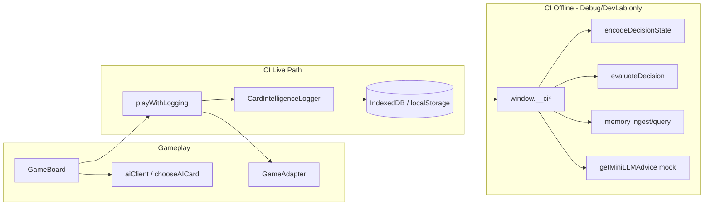

# Technical Integrity Review — Card Intelligence

**Data:** 2026-06-06  
**Âmbito:** `frontend/src/cardIntelligence/` e integrações listadas  
**Método:** Análise estática de código + verificação automatizada (tsc, test, build)  
**Restrições:** Sem alterações de código; sem correcções; sem prompts; sem gameplay.

---

## 1. Comandos executados

| Comando | Exit code | Resultado |
|---------|-----------|-----------|
| `cd frontend && npx tsc --noEmit` | 0 | ✅ Sem erros TypeScript |
| `cd frontend && CI=true npm test -- --watchAll=false` | 0 | ✅ 76 suites, 390 testes passaram |
| `cd frontend && npm run build` | 0 | ✅ Build production compilou com sucesso |
| `cd backend && node --check src/server.js` | 0 | ✅ Sintaxe válida |
| `cd backend && npm test` | 0 | ✅ 1 teste passou (health endpoint) |

### Detalhe — frontend tests

```
Test Suites: 76 passed, 76 total
Tests:       390 passed, 390 total
Time:        ~5.3 s
```

Inclui 41 suites de teste em `cardIntelligence/` (logger, encoder, evaluator, memory, llm, debug, devLab).

### Detalhe — frontend build

```
Compiled successfully.
main.js (gzip): 196.8 kB
BUILD_VERSION: a4e7b16
```

---

## 2. Resumo executivo

A implementação Card Intelligence está **tecnicamente coerente** com a separação pretendida entre gameplay e observabilidade/análise offline. O único ponto de contacto com o gameplay é `playCardAndLogDecision` / `playFirstLegalAndLogDecision`, que **jogam primeiro** via `GameAdapter` e **registam depois** de forma assíncrona.

**Recomendação: Avançar** — com ressalvas menores documentadas abaixo. Não há evidência de bloqueio arquitectural.

---

## 3. Verificação dos 14 critérios

### 3.1 Logger só grava e não avalia — ✅ PASS

**Evidência:**
- `buildCardDecisionEvent` define `classification: 'unknown'`, `reason: null`, `aiSource: null` (campos estáticos).
- `validateCardDecisionEvent` rejeita qualquer classificação diferente de `'unknown'`:

```typescript
// frontend/src/cardIntelligence/logger/validateCardDecisionEvent.ts
if (event.classification !== 'unknown') {
  throw new Error('Logger v0 must use classification "unknown"');
}
if (event.reason !== null) {
  throw new Error('Logger v0 must use reason null');
}
if (event.aiSource !== null) {
  throw new Error('Logger v0 must use aiSource null');
}
```

- `suggestMetricCandidates` apenas devolve IDs heurísticos por variante — não chama o evaluator.
- Nenhuma importação de `evaluateDecision` em `logger/`.

**Ressalva (INFO):** O logger mantém estado in-memory (`roundHistoryEngine`, `trickIndexTracker`) para correlacionar trick-end events — é metadata de logging, não gameplay.

---

### 3.2 Encoder não altera estado nem classifica — ✅ PASS

**Evidência:**
- `encodeDecisionState` é função pura: recebe `EncoderInput`, devolve `EncodedDecisionState`, sem mutação de `GameAdapter` ou `GameState`.
- `memoryContext` é sempre stub vazio:

```typescript
// frontend/src/cardIntelligence/encoder/encodeDecisionState.ts
memoryContext: {
  schemaVersion: '6.0.0-stub',
  aggregates: [],
},
```

- Teste explícito: output do encoder não contém campos de classificação (`encodeDecisionState.test.ts` — `"classification"`, `"good"`, `"bad"` ausentes).

**Ressalva (INFO):** `buildMetricContext` calcula *applicability* e *confidence* de métricas — é contexto estrutural para o evaluator offline, não classificação good/bad da jogada.

---

### 3.3 Evaluator não corre live — ✅ PASS

**Evidência:** `evaluateDecision` só é invocado em:
- `debug/evaluateStoredEvents.ts` (offline sobre logs guardados)
- `devLab/runScenario.ts` (cenários de laboratório)
- `debug/readMemory.ts` (`ingestEvaluationsOffline`)
- Testes (`*.test.ts`)

Zero referências em `GameBoard.tsx`, `ai/`, `playWithLogging.ts`, ou `CardIntelligenceLogger.ts`.

---

### 3.4 Memory não influencia decisões — ✅ PASS

**Evidência:**
- `queryMemory` / `ingestEvaluationResult` só em debug, devLab e testes.
- Nenhum import de memory/evaluator/LLM fora de `cardIntelligence/` no gameplay.
- Memory hints só entram em `buildMiniLLMInputFromStoredEvent` quando `includeMemoryHints: true` — caminho exclusivo da consola debug.

---

### 3.5 Mini-LLM não joga cartas — ✅ PASS

**Evidência:**
- `getMiniLLMAdvice` devolve `MiniLLMAdvisoryResult` com `mode: 'disabled' | 'advisory'` — nunca chama `adapter.playCard`.
- Desactivado por defeito (`CARD_INTELLIGENCE_LLM_ADVISORY` default `false`).
- Só exposto via `window.__ciGetMiniLLMAdvice` quando `CARD_INTELLIGENCE_DEBUG && CARD_INTELLIGENCE_LLM_ADVISORY`.
- Provider default: `mock:local-stub-v0` (`mockProvider.ts`).

---

### 3.6 Dev Lab é dev-only — ✅ PASS

**Evidência:**
- Flag `CARD_INTELLIGENCE_DEV_LAB` default `false` (`features.ts`).
- `index.tsx` instala devLab só com ambas as flags (`CARD_INTELLIGENCE_DEBUG && CARD_INTELLIGENCE_DEV_LAB`).
- `installCardIntelligenceDevLabConsole` faz early-return se flags off.
- Teste: `devLabConsole.test.ts` — helpers `undefined` sem flags.

---

### 3.7 Debug helpers só existem com flags — ✅ PASS

**Evidência:**
- `CARD_INTELLIGENCE_DEBUG = NODE_ENV === 'development' || REACT_APP_CARD_INTELLIGENCE_DEBUG === 'true'`
- Instalação condicional em `index.tsx` com dynamic import.
- LLM advisory e scenario report têm gates adicionais dentro de `debugConsole.ts`.

---

### 3.8 Produção não expõe helpers indevidos — ✅ PASS (com ressalva)

**Evidência:**
- Build production (`NODE_ENV=production`) → `CARD_INTELLIGENCE_DEBUG=false` unless `REACT_APP_CARD_INTELLIGENCE_DEBUG=true` at build time.
- Sem `installCardIntelligenceDebugConsole()` no bundle de produção standard.

**Ressalva (BAIXA):** Build intencional com `REACT_APP_CARD_INTELLIGENCE_DEBUG=true` expõe `window.__ci*`. É feature flag documentada, não leak acidental.

---

### 3.9 Sem imports indevidos em GameBoard/playWithLogging — ✅ PASS

**Evidência:**
- `GameBoard.tsx` importa apenas:

```typescript
import { playCardAndLogDecision, playFirstLegalAndLogDecision } from '../cardIntelligence';
```

- Único consumidor externo de `cardIntelligence` em `frontend/src` (fora do próprio módulo).
- `playWithLogging.ts` importa só logger, features, clone, `playFirstLegal` (fallback AI existente).

**Fluxo gameplay:**
1. `adapter.playCard()` / `playFirstLegal()` — decisão de jogo
2. Se sucesso + logger enabled → `logCardDecision` async (fire-and-forget)

---

### 3.10 Sem Engine View por defeito — ✅ PASS

**Evidência:**
- Default `viewType ?? 'player'` em `encodeDecisionState`.
- Engine view lança `EngineViewNotSupportedError` sem `allowEngineView: true`.
- Live path (`ciEncode` default, `buildMiniLLMInput`) usa sempre `'player'`.
- Engine view só em `evaluateStoredPlay` / devLab com `engineView: true` explícito.

---

### 3.11 Player View sem mãos adversárias — ✅ PASS

**Evidência:**
- `PLAYER_VIEW_EXCLUDED` inclui `'opponentHands'`, `'deckRemaining'`, `'confirmedVoids'`.
- Teste: JSON serializado não contém `"opponentHands": [`.
- Encoder usa `event.handBefore` (mão do jogador que jogou), não mãos adversárias.

---

### 3.12 Sem provider LLM real — ✅ PASS

**Evidência:**
- Zero matches para `openai`, `anthropic`, `fetch(.*llm` em `frontend/src`.
- Interface `MiniLLMProvider` injectável; implementação única: `createMockProvider` / `mock:local-stub-v0`.
- `getDefaultMockProvider()` é o default em `getMiniLLMAdvice`.

---

### 3.13 Sem backend/sync — ✅ PASS

**Evidência:**
- `grep cardIntelligence` em `backend/`: 0 matches.
- Storage local: IndexedDB (`cardIntelligenceLogs`, `cardIntelligenceMemory`) + localStorage fallback.
- Sem endpoints, sync, ou upload de logs CI.

---

### 3.14 Testes e build passam — ✅ PASS

Todos os comandos de verificação executados com exit code 0 (ver secção 1).

---

## 4. Achados por severidade

### 🔴 Crítico — 0

Nenhum.

### 🟠 Alto — 0

Nenhum.

### 🟡 Médio — 0

Nenhum bloqueante identificado.

### 🔵 Baixo / Informativo — 4

| ID | Descrição | Ficheiro(s) | Risco |
|----|-----------|-------------|-------|
| L1 | Logger **activo por defeito** em produção (`CARD_INTELLIGENCE_LOGGER !== 'false'`) — grava em IDB/localStorage | `config/features.ts`, `playWithLogging.ts` | Privacidade/storage; não afecta decisões |
| L2 | Multiplayer **joiner** usa `submitAction` sem logging (`handleCardClick` isJoiner branch) | `GameBoard.tsx` ~669-673 | Gap de dados, não gameplay |
| L3 | Campo `classification: 'unknown'` no schema de log pode confundir com output do evaluator | `buildCardDecisionEvent.ts` | Semântico; validator impede valores do evaluator |
| L4 | Sem teste de integração que `index.tsx` **não** instala debug em `NODE_ENV=production` | — | Cobertura de regressão; lógica actual parece correcta |

---

## 5. Ficheiros suspeitos (fronteira gameplay ↔ CI)

| Ficheiro | Papel | Veredicto |
|----------|-------|-----------|
| `frontend/src/components/GameBoard.tsx` | Único ponto de integração gameplay | ✅ Limpo |
| `frontend/src/cardIntelligence/logger/playWithLogging.ts` | Play + log assíncrono | ✅ Correcto |
| `frontend/src/cardIntelligence/logger/CardIntelligenceLogger.ts` | Persistência eventos | ✅ Só grava |
| `frontend/src/config/features.ts` | Feature flags | ✅ Gates claros |
| `frontend/src/index.tsx` | Bootstrap debug/devLab | ✅ Condicional |
| `frontend/src/cardIntelligence/index.ts` | Barrel export (API completa) | ✅ Não importado pelo gameplay excepto play helpers |

---

## 6. Diagrama de fronteiras



---

## 7. Riscos remanescentes

1. **Logger ON por defeito** — dados de jogo persistem localmente; utilizadores não informados explicitamente na UI.
2. **Feature flags em build** — `REACT_APP_CARD_INTELLIGENCE_DEBUG=true` num build de produção expõe consola completa.
3. **Barrel export** — `cardIntelligence/index.ts` exporta evaluator/memory/llm; tree-shaking depende do bundler, mas hoje só GameBoard importa do barrel.
4. **Futuro provider LLM real** — interface `MiniLLMProvider` está pronta; integração real exigiria nova revisão de integridade.
5. **Multiplayer joiner** — jogadas remotas não são registadas pelo logger local.

---

## 8. Recomendação final

| Opção | Justificação |
|-------|--------------|
| ~~Bloquear~~ | Não aplicável |
| ~~Corrigir antes~~ | Não aplicável para bloqueio |
| **✅ Avançar** | Separação gameplay/análise respeitada; gates de flags correctos; sem evaluator/memory/LLM no path live; tsc/test/build passam |

**Condições sugeridas antes de merge/release:**
1. Confirmar que builds de produção **não** incluem `REACT_APP_CARD_INTELLIGENCE_DEBUG=true` nem `REACT_APP_CARD_INTELLIGENCE_DEV_LAB=true`.
2. (Opcional) Documentar opt-out do logger para utilizadores sensíveis a storage local (`REACT_APP_CARD_INTELLIGENCE_LOGGER=false`).

---

## 9. Ficheiros analisados

- `frontend/src/cardIntelligence/` (139 ficheiros)
- `frontend/src/config/features.ts`
- `frontend/src/index.tsx`
- `frontend/src/components/GameBoard.tsx`
- `frontend/src/cardIntelligence/logger/`
- `frontend/src/cardIntelligence/debug/`
- `frontend/src/cardIntelligence/devLab/`
- `frontend/src/cardIntelligence/llm/`
- 41 ficheiros `*.test.ts` em `cardIntelligence/`

---

## 10. Cobertura de testes Card Intelligence (inventário)

- Gating devLab: `debug/devLabConsole.test.ts`
- Player view / engine guard: `encoder/encodeDecisionState.test.ts`
- Play+logging isolation: `logger/playWithLogging.test.ts`
- LLM disabled/advisory: `llm/getMiniLLMAdvice.test.ts`
- Evaluator golden/synthetic: `evaluator/evaluatorGolden.test.ts`, `evaluatorSynthetic.test.ts`
- Memory ingest: `memory/ingestEvaluation.test.ts`, `memoryGolden.test.ts`
- Debug report flow: `debug/reportFlow/*.test.ts`
- DevLab scenarios: `devLab/runScenario.test.ts`, `devLab/scenarioReport.test.ts`
